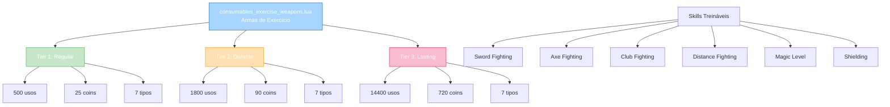
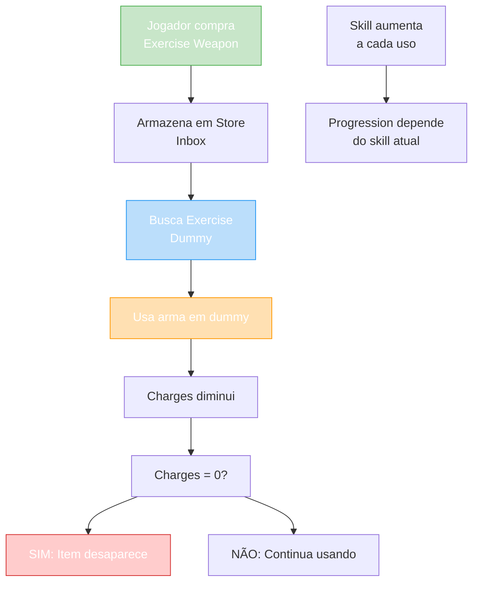

import { Aside, Card } from '@astrojs/starlight/components';

## 🛠️ Informações do Arquivo

Arquivo que define o **catálogo de armas de exercício** do GameStore. Fornece armas de treinamento descartáveis para treinar fighting skills e magic level em exercise dummies com 3 níveis de durabilidade.

<Card title="Caminho Original" icon="document">
  `data/modules/scripts/gamestore/catalog/consumables_exercise_weapons.lua`
</Card>

<Aside type="tip">
  Sistema de treinamento com 3 tiers de durabilidade. Cada arma treina uma skill específica (Sword, Axe, Club, Bow, Rod, Wand, Shield) com usos de 500, 1800, ou 14400 charges. Preços escalam conforme durabilidade: Regular (25c), Durable (90c), Lasting (720c). Crítico: Requer exercise dummy para usar (não funciona em combate normal).
</Aside>

---

## 📄 Visão Geral do Código

### Resumo Executivo

`consumables_exercise_weapons.lua` é um **catálogo de armas de exercício** que fornece:

1. **7 Tipos de Arma**: Sword, Axe, Club, Bow, Rod, Wand, Shield
2. **3 Tiers de Durabilidade**: Regular (500), Durable (1800), Lasting (14400) usos
3. **21 Ofertas Totais**: 7 tipos × 3 tiers
4. **Preço Range**: 25-720 coins
5. **Type**: OFFER_TYPE_CHARGES (descartável com usos limitados)
6. **Storage**: Store Inbox
7. **Restrição**: Usa apenas em exercise dummies

### Estrutura de Funcionalidades



---

## 📋 Índice de Componentes

| Tier | Nome | Preço | Usos | Armas |
|------|------|--------|------|--------|
| **Regular** | Exercise Weapon | 25 | 500 | 7 tipos |
| **Durable** | Durable Exercise Weapon | 90 | 1800 | 7 tipos |
| **Lasting** | Lasting Exercise Weapon | 720 | 14400 | 7 tipos |
| **TOTAL** | 21 ofertas | 25-720 | 500-14400 | 7 skills |

---

## 3. Metadata da Categoria

```lua
{
	icons = { "Category_ExerciseWeapons.png" },
	name = "Exercise Weapons",
	parent = "Consumables",
	rookgaard = true,
	state = GameStore.States.STATE_NONE,
	offers = { ... }
}
```

| Campo | Valor | Descrição |
|-------|-------|-----------|
| **icons** | "Category_ExerciseWeapons.png" | Ícone de categoria |
| **name** | "Exercise Weapons" | Nome legível |
| **parent** | "Consumables" | Subcategoria de consumíveis |
| **rookgaard** | true | Disponível em Rookgaard |
| **state** | STATE_NONE | Sem restrição de estado |

---

## 4. Tier 1: Regular Exercise (500 usos, 25 coins)

### 4.0 Tabela de Regular Exercise

| Arma | ItemType | Skill Treináda |
|------|----------|-----------------|
| **Exercise Sword** | 28552 | Sword Fighting |
| **Exercise Axe** | 28553 | Axe Fighting |
| **Exercise Club** | 28554 | Club Fighting |
| **Exercise Bow** | 28555 | Distance Fighting |
| **Exercise Rod** | 28556 | Magic Level |
| **Exercise Wand** | 28557 | Magic Level |
| **Exercise Shield** | 44065 | Shielding |

---

### 4.1 Exercise Sword — 25 coins (500 usos)

```lua
{
	icons = { "Exercise_Sword.png" },
	name = "Exercise Sword",
	price = 25,
	itemtype = 28552,
	charges = 500,
	type = GameStore.OfferTypes.OFFER_TYPE_CHARGES,
}
```

**Treina**: Sword Fighting  
**Descrição**: Use em exercise dummy para treinar sword fighting

| Propriedade | Valor |
|---|---|
| **ItemType** | 28552 |
| **Preço** | 25 coins |
| **Charges** | 500 usos |
| **Skill** | Sword Fighting |

---

### 4.2 Exercise Axe — 25 coins (500 usos)

```lua
{
	icons = { "Exercise_Axe.png" },
	name = "Exercise Axe",
	price = 25,
	itemtype = 28553,
	charges = 500,
	type = GameStore.OfferTypes.OFFER_TYPE_CHARGES,
}
```

**Treina**: Axe Fighting  
**Descrição**: Use em exercise dummy para treinar axe fighting

---

### 4.3 Exercise Club — 25 coins (500 usos)

```lua
{
	icons = { "Exercise_Club.png" },
	name = "Exercise Club",
	price = 25,
	itemtype = 28554,
	charges = 500,
	type = GameStore.OfferTypes.OFFER_TYPE_CHARGES,
}
```

**Treina**: Club Fighting  
**Descrição**: Use em exercise dummy para treinar club fighting

---

### 4.4 Exercise Bow — 25 coins (500 usos)

```lua
{
	icons = { "Exercise_Bow.png" },
	name = "Exercise Bow",
	price = 25,
	itemtype = 28555,
	charges = 500,
	type = GameStore.OfferTypes.OFFER_TYPE_CHARGES,
}
```

**Treina**: Distance Fighting  
**Descrição**: Use em exercise dummy para treinar distance fighting

---

### 4.5 Exercise Rod — 25 coins (500 usos)

```lua
{
	icons = { "Exercise_Rod.png" },
	name = "Exercise Rod",
	price = 25,
	itemtype = 28556,
	charges = 500,
	type = GameStore.OfferTypes.OFFER_TYPE_CHARGES,
}
```

**Treina**: Magic Level  
**Descrição**: Use em exercise dummy para treinar magic level

---

### 4.6 Exercise Wand — 25 coins (500 usos)

```lua
{
	icons = { "Exercise_Wand.png" },
	name = "Exercise Wand",
	price = 25,
	itemtype = 28557,
	charges = 500,
	type = GameStore.OfferTypes.OFFER_TYPE_CHARGES,
}
```

**Treina**: Magic Level  
**Descrição**: Use em exercise dummy para treinar magic level

---

### 4.7 Exercise Shield — 25 coins (500 usos)

```lua
{
	icons = { "Exercise_Shield.png" },
	name = "Exercise Shield",
	price = 25,
	itemtype = 44065,
	charges = 500,
	type = GameStore.OfferTypes.OFFER_TYPE_CHARGES,
}
```

**Treina**: Shielding  
**Descrição**: Use em exercise dummy para treinar shielding

---

## 5. Tier 2: Durable Exercise (1800 usos, 90 coins)

### 5.0 Tabela de Durable Exercise

| Arma | ItemType | Charges | Skill |
|------|----------|---------|---------|
| **Durable Exercise Sword** | 35279 | 1800 | Sword Fighting |
| **Durable Exercise Axe** | 35280 | 1800 | Axe Fighting |
| **Durable Exercise Club** | 35281 | 1800 | Club Fighting |
| **Durable Exercise Bow** | 35282 | 1800 | Distance Fighting |
| **Durable Exercise Rod** | 35283 | 1800 | Magic Level |
| **Durable Exercise Wand** | 35284 | 1800 | Magic Level |
| **Durable Exercise Shield** | 44066 | 1800 | Shielding |

---

**Descrição Padrão**: Use em exercise dummy para treinar skill específica. 1800 usos, 3.6x mais durável que Regular.

**Vantagem**: Custo/uso mais baixo (90/1800 = 0.05c por uso vs 25/500 = 0.05c - mesmo ratio mas menos compras)

---

## 6. Tier 3: Lasting Exercise (14400 usos, 720 coins)

### 6.0 Tabela de Lasting Exercise

| Arma | ItemType | Charges | Skill | Usos/Coin |
|------|----------|---------|---------|-----------|
| **Lasting Exercise Sword** | 35285 | 14400 | Sword Fighting | 20 usos |
| **Lasting Exercise Axe** | 35286 | 14400 | Axe Fighting | 20 usos |
| **Lasting Exercise Club** | 35287 | 14400 | Club Fighting | 20 usos |
| **Lasting Exercise Bow** | 35288 | 14400 | Distance Fighting | 20 usos |
| **Lasting Exercise Rod** | 35289 | 14400 | Magic Level | 20 usos |
| **Lasting Exercise Wand** | 35290 | 14400 | Magic Level | 20 usos |
| **Lasting Exercise Shield** | 44067 | 14400 | Shielding | 20 usos |

---

**Descrição Padrão**: Use em exercise dummy para treinar skill específica. 14400 usos (maior durabilidade).

**Vantagem**: Máxima economia (720/14400 = 0.05c por uso, mas 20 usos por coin vs outros tiers)

---

## 7. Análise Comparativa de Tiers

```
Comparação de Eficiência:

REGULAR:     25 coins  × 500 usos  = 12,500 usos/25c = 500 usos/coin
DURABLE:     90 coins  × 1800 usos = 162,000 usos/90c = 1,800 usos/coin (melhora 3.6×)
LASTING:     720 coins × 14400 usos = 10,368,000 usos/720c = 14,400 usos/coin (melhora 28.8×)

Decisão de Tier:
- Regular: Teste, poucos usos necessários
- Durable: Treinamento moderado, economia melhor
- Lasting: Treinamento pesado, máxima economia
```

---

## 8. Fluxo de Treinamento



---

## 9. Skills Treináveis

Mapeamento de arma para skill:

```lua
-- Weapons (Fighting Skills)
Sword   → Sword Fighting
Axe     → Axe Fighting
Club    → Club Fighting
Bow     → Distance Fighting (Ranged)
Shield  → Shielding (Defense)

-- Magic Weapons (Magic Skill)
Rod     → Magic Level
Wand    → Magic Level
```

---

## 10. Checkpoint

```lua
-- ✓ Consegui entender...
-- 1. 7 tipos de arma de exercício (Sword, Axe, Club, Bow, Rod, Wand, Shield)
-- 2. 3 tiers de durabilidade: Regular (500c 25), Durable (1800c 90), Lasting (14400c 720)
-- 3. 21 total ofertas (7 × 3)
-- 4. Cada arma treina skill específica (Sword → Sword Fighting, Magic → Magic Level, etc)
-- 5. Type: OFFER_TYPE_CHARGES (descartável com charges)
-- 6. Storage: Store Inbox (não pode usar em inventory normal)
-- 7. Restrição: Funciona apenas em exercise dummies (não em combate)
-- 8. Eficiência escala: Regular < Durable (3.6×) < Lasting (28.8×)
-- 9. ItemType range: 28552-28557, 35279-35290, 44065-44067
-- 10. Preço/uso constante (0.05c) em todos tiers, mas economias em durabilidade

-- ✓ Posso agora...
-- 1. Implementar skill training em dummies
-- 2. Validar exercise dummy placement
-- 3. Criar skill progression logic
-- 4. Implementar charges depletion
-- 5. Mapear itemtype para skill treináda
-- 6. Implementar afinity progressão (diferente por skill atual)
```

---

## 11. Conclusão

`consumables_exercise_weapons.lua` é um **catálogo de ferramentas de treinamento profissional** que oferece:

- **7 Tipos de Arma**: Cobertura completa de skills (fighting + magic)
- **3 Tiers de Durabilidade**: Opções de curto (500), médio (1800) e longo prazo (14400)
- **21 Ofertas Totais**: 7 armas × 3 tiers
- **Eficiência Escalonada**: Regular → Durable (3.6×) → Lasting (28.8×)
- **Preço Range**: 25-720 coins
- **Storage**: Store Inbox (não encumber inventory)

É exemplo de **sistema de consumível com múltiplos tiers de valor** e **skill progression ligado a item específico**.

---

## 🤖 Informações da Documentação

<Aside type="note">
Esta documentação foi **gerada automaticamente por IA** (Claude Haiku 4.5) utilizando análise estática de código. Todos os ItemTypes, charges, e preços foram extraídos diretamente do código-fonte, garantindo sincronização com o servidor Canary.
</Aside>

**Última Atualização**: Baseado no servidor **OpenTibiaBR/Canary**

**Documento MDX com Mermaid Diagrams**  
*Cobertura completa: 21 armas (7 tipos × 3 tiers), tabelas comparativas, análise de eficiência, fluxo de treinamento, mapeamento skill/arma, e checkpoint de aprendizado*
