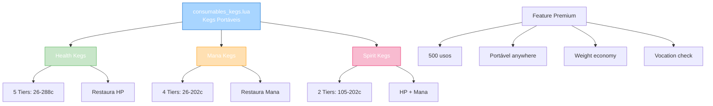
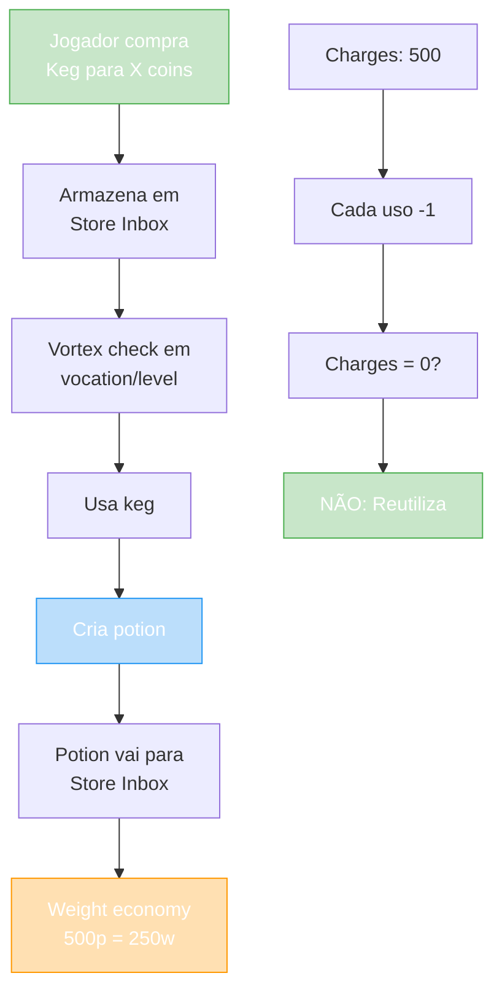

import { Aside, Card } from '@astrojs/starlight/components';

## 🛠️ Informações do Arquivo

Arquivo que define o **catálogo de kegs portáteis** do GameStore. Fornece kegs que funcionam como casks portáveis, permitindo fabricar potions em qualquer lugar com economia de weight (500 potions = weight de 250).

<Card title="Caminho Original" icon="document">
  `data/modules/scripts/gamestore/catalog/consumables_kegs.lua`
</Card>

<Aside type="tip">
  Sistema de poção portátil premium. Kegs permitem criar potions anywhere (não apenas em casa como casks). Cada keg tem 500 usos recarregáveis. Weight economic: 1000 potions normais = weight alto, mas 500 potions de keg = weight de 250 potions. Vocation level check aplica-se. Potions vão para Store Inbox. 11 ofertas com 5 tiers (Health, Mana, Spirit).
</Aside>

---

## 📄 Visão Geral do Código

### Resumo Executivo

`consumables_kegs.lua` é um **catálogo de kegs portáveis de produção** que fornece:

1. **3 Tipos de Poção**: Health, Mana, Spirit
2. **5 Tiers de Força**: Basic (26), Strong (43-53), Great (66-105), Ultimate (175-202), Supreme (288)
3. **11 Ofertas Totais**: 5 health + 4 mana + 2 spirit
4. **500 Usos Cada**: Recarregável infinitamente
5. **Type**: OFFER_TYPE_CHARGES (portável com durabilidade)
6. **Storage**: Store Inbox
7. **Feature Especial**: Economia de weight (500 = 250 potions weight)

### Estrutura de Funcionalidades



---

## 📋 Índice de Componentes

| Tipo | Quantidade | Preço Range | Tiers | Usos |
|------|-----------|------------|--------|------|
| **Health Kegs** | 5 | 26-288 | Basic, Strong, Great, Ultimate, Supreme | 500 |
| **Mana Kegs** | 4 | 26-202 | Basic, Strong, Great, Ultimate | 500 |
| **Spirit Kegs** | 2 | 105-202 | Great, Ultimate | 500 |
| **TOTAL** | 11 | 26-288 | 5-4-2 tiers | 500 |

---

## 3. Metadata da Categoria

```lua
{
	icons = { "Category_Kegs.png" },
	name = "Kegs",
	parent = "Consumables",
	rookgaard = true,
	state = GameStore.States.STATE_NONE,
	offers = { ... }
}
```

| Campo | Valor | Descrição |
|-------|-------|-----------|
| **icons** | "Category_Kegs.png" | Ícone de categoria |
| **name** | "Kegs" | Nome legível |
| **parent** | "Consumables" | Subcategoria de consumíveis |
| **rookgaard** | true | Disponível em Rookgaard |
| **state** | STATE_NONE | Sem restrição de estado |

---

## 4. Health Kegs

### 4.0 Tabela de Health Kegs

| Tier | Nome | Preço | ItemType | Charges | HP Restaurado |
|------|------|--------|---------|---------|---------|
| **Basic** | Health Keg | 26 | 25903 | 500 | Baixo |
| **Strong** | Strong Health Keg | 53 | 25904 | 500 | Médio |
| **Great** | Great Health Keg | 103 | 25905 | 500 | Alto |
| **Ultimate** | Ultimate Health Keg | 175 | 25906 | 500 | Muito Alto |
| **Supreme** | Supreme Health Keg | 288 | 25907 | 500 | Máximo |

---

### 4.1 Health Keg — 26 coins (Basic, 500 usos)

```lua
{
	icons = { "Health_Keg.png" },
	name = "Health Keg",
	price = 26,
	itemtype = 25903,
	charges = 500,
	type = GameStore.OfferTypes.OFFER_TYPE_CHARGES,
}
```

**Descrição**: Crie potions de HP básicas em qualquer lugar. Economiza weight.

| Propriedade | Valor |
|---|---|
| **ItemType** | 25903 |
| **Preço** | 26 coins |
| **Charges** | 500 usos |
| **Tier** | Basic |
| **Weight Economy** | 500 potions = 250 potions weight |

---

### 4.2 Strong Health Keg — 53 coins (Strong, 500 usos)

```lua
{
	icons = { "Strong_Health_Keg.png" },
	name = "Strong Health Keg",
	price = 53,
	itemtype = 25904,
	charges = 500,
	type = GameStore.OfferTypes.OFFER_TYPE_CHARGES,
}
```

**Descrição**: Crie potions de HP fortes portáveis. Melhor controle de weight.

---

### 4.3 Great Health Keg — 103 coins (Great, 500 usos)

```lua
{
	icons = { "Great_Health_Keg.png" },
	name = "Great Health Keg",
	price = 103,
	itemtype = 25905,
	charges = 500,
	type = GameStore.OfferTypes.OFFER_TYPE_CHARGES,
}
```

**Descrição**: Crie potions de HP ótimas portáveis. Premium experience.

---

### 4.4 Ultimate Health Keg — 175 coins (Ultimate, 500 usos)

```lua
{
	icons = { "Ultimate_Health_Keg.png" },
	name = "Ultimate Health Keg",
	price = 175,
	itemtype = 25906,
	charges = 500,
	type = GameStore.OfferTypes.OFFER_TYPE_CHARGES,
}
```

**Descrição**: Crie potions de HP supremas portáveis. Máxima potência.

---

### 4.5 Supreme Health Keg — 288 coins (Supreme, 500 usos)

```lua
{
	icons = { "Supreme_Health_Keg.png" },
	name = "Supreme Health Keg",
	price = 288,
	itemtype = 25907,
	charges = 500,
	type = GameStore.OfferTypes.OFFER_TYPE_CHARGES,
}
```

**Descrição**: Crie potions de HP extremas portáveis. Poder total.

---

## 5. Mana Kegs

### 5.0 Tabela de Mana Kegs

| Tier | Nome | Preço | ItemType | Mana |
|------|------|--------|---------|------|
| **Basic** | Mana Keg | 26 | 25908 | Baixo |
| **Strong** | Strong Mana Keg | 43 | 25909 | Médio |
| **Great** | Great Mana Keg | 66 | 25910 | Alto |
| **Ultimate** | Ultimate Mana Keg | 202 | 25911 | Máximo |

---

### 5.1 Mana Keg — 26 coins (Basic, 500 usos)

```lua
{
	icons = { "Mana_Keg.png" },
	name = "Mana Keg",
	price = 26,
	itemtype = 25908,
	charges = 500,
	type = GameStore.OfferTypes.OFFER_TYPE_CHARGES,
}
```

**Descrição**: Crie potions de Mana básicas em qualquer lugar.

---

### 5.2 Strong Mana Keg — 43 coins (Strong, 500 usos)

```lua
{
	icons = { "Strong_Mana_Keg.png" },
	name = "Strong Mana Keg",
	price = 43,
	itemtype = 25909,
	charges = 500,
	type = GameStore.OfferTypes.OFFER_TYPE_CHARGES,
}
```

**Descrição**: Crie potions de Mana fortes portáveis.

---

### 5.3 Great Mana Keg — 66 coins (Great, 500 usos)

```lua
{
	icons = { "Great_Mana_Keg.png" },
	name = "Great Mana Keg",
	price = 66,
	itemtype = 25910,
	charges = 500,
	type = GameStore.OfferTypes.OFFER_TYPE_CHARGES,
}
```

**Descrição**: Crie potions de Mana ótimas portáveis.

---

### 5.4 Ultimate Mana Keg — 202 coins (Ultimate, 500 usos)

```lua
{
	icons = { "Ultimate_Mana_Keg.png" },
	name = "Ultimate Mana Keg",
	price = 202,
	itemtype = 25911,
	charges = 500,
	type = GameStore.OfferTypes.OFFER_TYPE_CHARGES,
}
```

**Descrição**: Crie potions de Mana supremas portáveis.

---

## 6. Spirit Kegs

### 6.0 Tabela de Spirit Kegs

| Tier | Nome | Preço | ItemType | HP + Mana |
|------|------|--------|---------|-----------|
| **Great** | Great Spirit Keg | 105 | 25913 | Alto |
| **Ultimate** | Ultimate Spirit Keg | 202 | 25914 | Máximo |

---

### 6.1 Great Spirit Keg — 105 coins (Great, 500 usos)

```lua
{
	icons = { "Great_Spirit_Keg.png" },
	name = "Great Spirit Keg",
	price = 105,
	itemtype = 25913,
	charges = 500,
	type = GameStore.OfferTypes.OFFER_TYPE_CHARGES,
}
```

**Descrição**: Crie potions Spirit (HP + Mana) ótimas portáveis.

---

### 6.2 Ultimate Spirit Keg — 202 coins (Ultimate, 500 usos)

```lua
{
	icons = { "Ultimate_Spirit_Keg.png" },
	name = "Ultimate Spirit Keg",
	price = 202,
	itemtype = 25914,
	charges = 500,
	type = GameStore.OfferTypes.OFFER_TYPE_CHARGES,
}
```

**Descrição**: Crie potions Spirit supremas portáveis (HP + Mana máximos).

---

## 7. Kegs vs Casks: Comparação

```
CASKS (Casas):
- Placement: Colocado na casa
- Usos: 1000 uses
- Portabilidade: NÃO (fica na casa)
- Weight: Não aplica (casa)
- Preço: Cask = 5-59c
- Access: Compartilhado com moradores

KEGS (Portável):
- Placement: Qualquer lugar
- Usos: 500 uses
- Portabilidade: SIM (Store Inbox)
- Weight: 500 potions = 250 weight
- Preço: Keg = 26-288c (premium)
- Access: Pessoal/individual
```

**Insight**: Kegs são opção premium para combate/hunting portátil. Casks são para produção em massa em casa.

---

## 8. Fluxo de Uso de Keg



---

## 9. Checkpoint

```lua
-- ✓ Consegui entender...
-- 1. 11 kegs totais (5 health + 4 mana + 2 spirit)
-- 2. 3 tipos: Health (restaura HP), Mana (restaura mana), Spirit (ambos)
-- 3. 5 tiers de força: Basic (26c) até Supreme (288c)
-- 4. 500 usos cada, recarregável infinitamente
-- 5. Tipo: OFFER_TYPE_CHARGES (portável com durabilidade)
-- 6. Weight economy: 500 potions = 250 potions weight
-- 7. Storage: Store Inbox + Depot
-- 8. Vocation level check aplica (restrição por classe)
-- 9. Preço/tier escala: Health 26-288, Mana 26-202, Spirit 105-202
-- 10. ItemType range: 25903-25914

-- ✓ Posso agora...
-- 1. Implementar keg usage em combate
-- 2. Validar vocation/level checks
-- 3. Implementar weight economy calculation
-- 4. Criar potion generation por tier
-- 5. Mapear ItemType para tier/tipo
-- 6. Implementar store inbox delivery
```

---

## 10. Conclusão

`consumables_kegs.lua` é um **catálogo de produção de poções portátil premium** que oferece:

- **11 Kegs Diferentes**: 5 health, 4 mana, 2 spirit
- **5 Tiers de Força**: Basic, Strong, Great, Ultimate, Supreme
- **500 Usos Recarregáveis**: Durabilidade portável
- **Weight Economy**: 500 potions = peso de 250 (metade do normal)
- **Vocation Checks**: Restrição por classe/level
- **Preço Range**: 26-288 coins (premium vs casks)

É exemplo de **item premium com feature de economy** (weight saving) e **vocation-gated access**.

---

## 🤖 Informações da Documentação

<Aside type="note">
Esta documentação foi **gerada automaticamente por IA** (Claude Haiku 4.5) utilizando análise estática de código. Todos os preços, ItemTypes, charges, e tiers foram extraídos diretamente do código-fonte, garantindo sincronização com o servidor Canary.
</Aside>

**Última Atualização**: Baseado no servidor **OpenTibiaBR/Canary**

**Documento MDX com Mermaid Diagrams**  
*Cobertura completa: 11 kegs (5 health + 4 mana + 2 spirit), 5 tiers força, peso economy, comparação kegs vs casks, fluxo de uso, vocation checks, e checkpoint*
