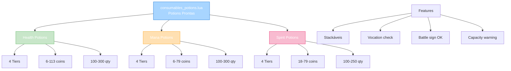
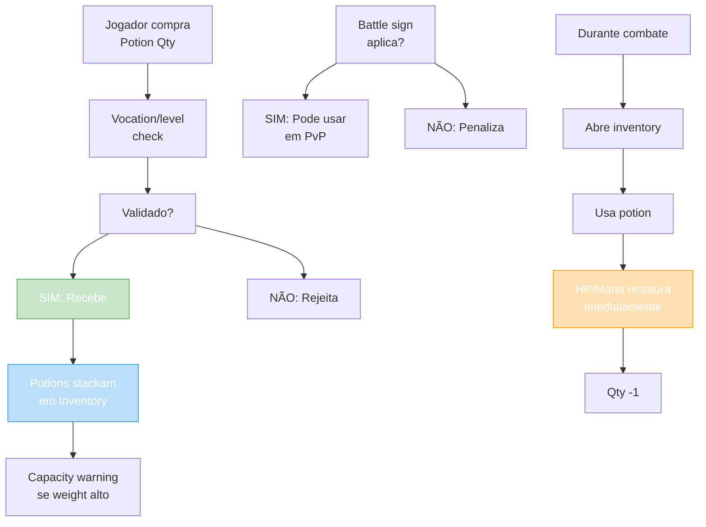

import { Aside, Card } from '@astrojs/starlight/components';

## 🛠️ Informações do Arquivo

Arquivo que define o **catálogo de potions stackáveis** do GameStore. Fornece potions prontas em múltiplas quantities (100, 125, 250, 300) com prices baixos para acesso rápido em combate/hunting.

<Card title="Caminho Original" icon="document">
  `data/modules/scripts/gamestore/catalog/consumables_potions.lua`
</Card>

<Aside type="tip">
  Sistema de poção pronta com múltiplas quantities. Diferente de kegs que geram potions, essas são pré-fabricadas stackáveis. Vocation level check aplica. Battle sign aplica (pode comprar em PvP). Capacity check (aviso de weight). 20 ofertas com quantities 100-300 por tipo. Preço muito baixo (6-113 coins) para acesso rápido. Tipos incluem Health, Mana, Spirit em 5 tiers (Basic até Supreme).
</Aside>

---

## 📄 Visão Geral do Código

### Resumo Executivo

`consumables_potions.lua` é um **catálogo de potions prontas stackáveis** que fornece:

1. **5 Tipos de Poção**: Health, Mana, Spirit, Great Health, Great Mana, Great Spirit, Ultimate Health, Ultimate Mana, Ultimate Spirit, Strong Health, Strong Mana, Supreme Health
2. **5-6 Tiers de Força**: Basic, Strong, Great, Ultimate, Supreme (varia por tipo)
3. **20 Ofertas Totais**: Múltiplas quantities (100, 125, 250, 300)
4. **Preço Range**: 6-113 coins
5. **Type**: OFFER_TYPE_STACKABLE (stackáveis em inventory)
6. **Features**: Vocation check, Battle sign, Capacity warning
7. **Uso**: Combate/Hunting imediato (sem delay de geração)

### Estrutura de Funcionalidades



---

## 📋 Índice de Componentes

| Tipo | Quantidade | Preço Range | Tiers | Qty Range |
|------|-----------|------------|--------|-----------|
| **Health Potion** | 2 | 6-11 | Basic, Strong, Great, Ultimate, Supreme | 125-300 |
| **Mana Potion** | 2 | 6-12 | Basic, Strong, Great, Ultimate | 125-300 |
| **Strong Health** | 2 | 10-21 | Strong, Great | 100-250 |
| **Great Health** | 2 | 18-41 | Great, Ultimate | 100-250 |
| **Strong Mana** | 2 | 7-17 | Strong, Great | 100-250 |
| **Great Mana** | 2 | 11-26 | Great, Ultimate | 100-250 |
| **Great Spirit** | 2 | 18-41 | Great, Ultimate | 100-250 |
| **Ultimate Health** | 2 | 29-68 | Ultimate, Supreme | 100-250 |
| **Ultimate Mana** | 2 | 33-79 | Ultimate, Supreme | 100-250 |
| **Ultimate Spirit** | 2 | 33-79 | Ultimate, Supreme | 100-250 |
| **Supreme Health** | 2 | 47-113 | Supreme, Supreme+ | 100-250 |
| **TOTAL** | 22 | 6-113 | 10 variações | 100-300 |

---

## 3. Metadata da Categoria

```lua
{
	icons = { "Category_Potions.png" },
	name = "Potions",
	parent = "Consumables",
	rookgaard = true,
	state = GameStore.States.STATE_NONE,
	offers = { ... }
}
```

| Campo | Valor | Descrição |
|-------|-------|-----------|
| **icons** | "Category_Potions.png" | Ícone de categoria |
| **name** | "Potions" | Nome legível |
| **parent** | "Consumables" | Subcategoria de consumíveis |
| **rookgaard** | true | Disponível em Rookgaard |
| **state** | STATE_NONE | Sem restrição de estado |

---

## 4. Health Potions

### 4.0 Tabela de Health Potions

| Tier | Nome | Qty | Preço | ItemType | Qty/Coin |
|------|------|-----|--------|---------|----------|
| **Basic** | Health Potion | 125 | 6 | 266 | 20.8 |
| **Basic** | Health Potion | 300 | 11 | 266 | 27.3 |
| **Strong** | Strong Health Potion | 100 | 10 | 236 | 10 |
| **Strong** | Strong Health Potion | 250 | 21 | 236 | 11.9 |
| **Great** | Great Health Potion | 100 | 18 | 239 | 5.6 |
| **Great** | Great Health Potion | 250 | 41 | 239 | 6.1 |
| **Ultimate** | Ultimate Health Potion | 100 | 29 | 7643 | 3.4 |
| **Ultimate** | Ultimate Health Potion | 250 | 68 | 7643 | 3.7 |
| **Supreme** | Supreme Health Potion | 100 | 47 | 23375 | 2.1 |
| **Supreme** | Supreme Health Potion | 250 | 113 | 23375 | 2.2 |

---

**Padrão**: Potions com 2 offers por tier (qty pequena/grande, preço baixo/médio)

---

## 5. Mana Potions

### 5.0 Tabela de Mana Potions

| Tier | Nome | Qty | Preço | ItemType |
|------|------|-----|--------|---------|
| **Basic** | Mana Potion | 125 | 6 | 268 |
| **Basic** | Mana Potion | 300 | 12 | 268 |
| **Strong** | Strong Mana Potion | 100 | 7 | 237 |
| **Strong** | Strong Mana Potion | 250 | 17 | 237 |
| **Great** | Great Mana Potion | 100 | 11 | 238 |
| **Great** | Great Mana Potion | 250 | 26 | 238 |
| **Ultimate** | Ultimate Mana Potion | 100 | 33 | 23373 |
| **Ultimate** | Ultimate Mana Potion | 250 | 79 | 23373 |

---

---

## 6. Spirit Potions (HP + Mana)

### 6.0 Tabela de Spirit Potions

| Tier | Nome | Qty | Preço | ItemType |
|------|------|-----|--------|---------|
| **Great** | Great Spirit Potion | 100 | 18 | 7642 |
| **Great** | Great Spirit Potion | 250 | 41 | 7642 |
| **Ultimate** | Ultimate Spirit Potion | 100 | 33 | 23374 |
| **Ultimate** | Ultimate Spirit Potion | 250 | 79 | 23374 |

---

---

## 7. Análise de Preço/Quantity

### 7.1 Melhor Valor (Qty/Coin)

```
MAIOR EFICIÊNCIA (qty por coin):

Tier Básico:
- Health 125/6c = 20.8 qty/coin (melhor basic)
- Mana 125/6c = 20.8 qty/coin (melhor basic)

Tier Strong:
- Strong Health 250/21c = 11.9 qty/coin
- Strong Mana 250/17c = 14.7 qty/coin

Tier Great:
- Great Spirit 250/41c = 6.1 qty/coin

Tier Ultimate:
- Ultimate Health 250/68c = 3.7 qty/coin
- Ultimate Mana 250/79c = 3.2 qty/coin
- Ultimate Spirit 250/79c = 3.2 qty/coin

Tier Supreme:
- Supreme Health 250/113c = 2.2 qty/coin (pior)

INSIGHT: Tier básico 300 qty melhor que 125 (aumento qty 140% por +83% preço)
```

---

### 7.2 Estratégia de Compra

```lua
-- Se quer LOW COST:
-- → Health Potion 125qty/6c ou 300qty/12c
-- → Mana Potion 125qty/6c ou 300qty/12c

-- Se quer MÉDIUM:
-- → Strong Health 250qty/21c
-- → Strong Mana 250qty/17c

-- Se quer HIGH POWER:
-- → Ultimate tiers (caro mas máximo poder)

-- Se quer BALANCED:
-- → Great Spirit (HP+Mana em 1)
-- → Great Health + Great Mana combo
```

---

## 8. ItemType Mapping

Mapeamento de tipo/tier para itemtype:

```lua
-- Health ItemTypes
266  = Health Potion (basic)
236  = Strong Health Potion
239  = Great Health Potion
7643 = Ultimate Health Potion
23375 = Supreme Health Potion

-- Mana ItemTypes
268  = Mana Potion (basic)
237  = Strong Mana Potion
238  = Great Mana Potion
23373 = Ultimate Mana Potion

-- Spirit ItemTypes (HP + Mana)
7642  = Great Spirit Potion
23374 = Ultimate Spirit Potion
```

---

## 9. Fluxo de Compra e Uso



---

## 10. Features Especiais

### 10.1 Vocation Level Check

```
{vocationlevelcheck} = Apenas se vocation + level corretos
```

Restrição por classe/nível para evitar power-leveling com potions

---

### 10.2 Battle Sign

```
{battlesign} = Pode comprar e usar mesmo em combate/PvP
```

Diferente de runes que não podem ser compradas com battle sign

---

### 10.3 Capacity Warning

```
{capacity} = Sistema avisa se inventory está cheio
```

Previne lose de potion por falta de espaço

---

## 11. Checkpoint

```lua
-- ✓ Consegui entender...
-- 1. 22 ofertas totais de potions (health, mana, spirit)
-- 2. 5+ tiers: Basic, Strong, Great, Ultimate, Supreme
-- 3. Quantities variam: 100, 125, 250, 300
-- 4. Preço muito baixo (6-113 coins) vs kegs (26-288)
-- 5. Type: OFFER_TYPE_STACKABLE (stack em inventory)
-- 6. Vocation/level check applica
-- 7. Battle sign OK (pode comprar em combate)
-- 8. Capacity warning previne loss
-- 9. ItemType range específico por tier
-- 10. Melhor eficiência: Basic 300qty/12c = 25 qty/coin

-- ✓ Posso agora...
-- 1. Implementar potion stacking em inventory
-- 2. Validar vocation/level por tier
-- 3. Criar capacity checking logic
-- 4. Mapear itemtype para tier/strength
-- 5. Implementar immediate healing on use
-- 6. Criar pricing strategy por quantity
```

---

## 12. Conclusão

`consumables_potions.lua` é um **catálogo de consumo rápido pronto para combate** que oferece:

- **22 Potions Diferentes**: Health, Mana, Spirit em múltiplos tiers
- **5+ Tiers de Força**: Basic, Strong, Great, Ultimate, Supreme
- **Quantities Flexíveis**: 100-300 unidades por oferta
- **Preço Baixo**: 6-113 coins (acesso rápido)
- **Stackáveis**: Múltiplos potions no inventory
- **Features**: Vocation check, Battle sign, Capacity warning

É exemplo de **consumível rápido pronto vs gerador** (vs kegs que precisam craftar).

---

## 🤖 Informações da Documentação

<Aside type="note">
Esta documentação foi **gerada automaticamente por IA** (Claude Haiku 4.5) utilizando análise estática de código. Todos os preços, quantities, ItemTypes, e tiers foram extraídos diretamente do código-fonte, garantindo sincronização com o servidor Canary.
</Aside>

**Última Atualização**: Baseado no servidor **OpenTibiaBR/Canary**

**Documento MDX com Mermaid Diagrams**  
*Cobertura completa: 22 potions (health, mana, spirit), 5+ tiers força, 10+ quantities, análise preço/qty, ItemType mapping, features speciais (vocation check, battle sign, capacity), estratégia de compra, e checkpoint*
