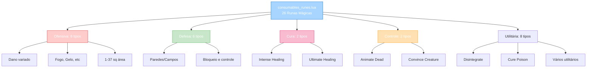

import { Aside, Card } from '@astrojs/starlight/components';

## 🛠️ Informações do Arquivo

Arquivo que define o **catálogo de runas mágicas** do GameStore. Fornece 26 tipos de runas stackáveis para magia, covering ataque, defesa, cura, controle de campo e utilitários com vocation level checks e preços de 5-75 coins.

<Card title="Caminho Original" icon="document">
  `data/modules/scripts/gamestore/catalog/consumables_runes.lua`
</Card>

<Aside type="tip">
  Sistema completo de magia com 26 runas para qualquer situação. Cada runa é stackável (250 count padrão). Vocation level check garante apenas magos/druids comprem correctly. Battle sign aplica (compra em PvP). Organizada em 5 categorias: ofensiva (dano), defesa (campos/paredes), cura (healing), controle (convencer/animar), utilitária (disintegrate). Descrições detalhadas em lore medieval incluindo área de efeito e resistências.
</Aside>

---

## 📄 Visão Geral do Código

### Resumo Executivo

`consumables_runes.lua` é um **catálogo completo de runas mágicas** que fornece:

1. **26 Types de Runa**: Ataque, Defesa, Cura, Controle, Utilitária
2. **5 Categorias de Uso**: Ofensiva (8), Defesa (6), Cura (2), Controle (2), Utilitária (8)
3. **250 Count Padrão**: Todas stackáveis em inventory
4. **Preço Range**: 5-75 coins
5. **Type**: OFFER_TYPE_STACKABLE (como potions)
6. **Features**: Vocation check (somente magos), Battle sign OK, Area effects (1-37 sq)
7. **Dano**: Variado (fogo, gelo, energia, veneno, earth, death) com áreas diferentes

### Estrutura de Funcionalidades



---

## 📋 Índice de Componentes

| Categoria | Quantidade | Preço Range | Propósito | ItemType |
|-----------|-----------|------------|---------|---------|
| **Ofensiva** | 8 | 5-40 | Dano múltiplo | 3189-3202 |
| **Defesa** | 6 | 8-23 | Paredes/Campos | 3164, 3166, 3180, 3188, 3190, ???  |
| **Cura** | 2 | 19-35 | Healing (Intense + Ultimate) | 3152, 3160 |
| **Controle** | 2 | 16-75 | Crowd control (Animate + Convince) | 3177, 3203 |
| **Utilitária** | 8 | 5-42 | Suporte (Disintegrate, Cure, Chameleon, etc) | Múltiplos |
| **TOTAL** | 26 | 5-75 | Cobertura completa | ItemType variado |

---

## 3. Metadata da Categoria

```lua
{
	icons = { "Category_Runes.png" },
	name = "Runes",
	parent = "Consumables",
	rookgaard = true,
	state = GameStore.States.STATE_NONE,
	offers = { ... }
}
```

| Campo | Valor | Descrição |
|-------|-------|-----------|
| **icons** | "Category_Runes.png" | Ícone de categoria |
| **name** | "Runes" | Nome legível |
| **parent** | "Consumables" | Subcategoria de consumíveis |
| **rookgaard** | true | Disponível em Rookgaard |
| **state** | STATE_NONE | Sem restrição de estado |

---

## 4. Runas Ofensivas (8 tipos) — Dano Direto

### 4.0 Tabela de Runas Ofensivas

| Runa | Preço | ItemType | Dano | Área | Elemento |
|------|--------|---------|------|------|---------|
| **Fireball** | 6 | 3189 | Alto | 1 sq | Fogo |
| **Great Fireball** | 12 | 3191 | Muito Alto | 37 sq | Fogo |
| **Fire Bomb** | 29 | 3192 | Alto | 9 sq AOE | Fogo |
| **Icicle** | 6 | 3158 | Médio | 1 sq | Gelo |
| **Avalanche** | 12 | 3161 | Alto | AOE | Gelo |
| **Explosion** | 6 | 3200 | Físico | Área | Físico |
| **Energy Bomb** | 40 | 3149 | Alto | 9 sq AOE | Energia |
| **Sudden Death** | 28 | 3155 | Extremo | 1 sq | Morte |

---

### 4.1 Fireball Rune — 6 coins

```lua
{
	icons = { "Fireball_Rune.png" },
	name = "Fireball Rune",
	price = 6,
	itemtype = 3189,
	count = 250,
	type = GameStore.OfferTypes.OFFER_TYPE_STACKABLE,
}
```

**Descrição**: Bola de fogo massiva contra alvo único. Muito efetivo contra earth.

| Propriedade | Valor |
|---|---|
| **ItemType** | 3189 |
| **Preço** | 6 coins |
| **Count** | 250 |
| **Dano** | Alto |
| **Área** | 1 sq (single target) |
| **Elemento** | Fogo |

---

### 4.2 Great Fireball Rune — 12 coins

```lua
{
	icons = { "Great_Fireball_Rune.png" },
	name = "Great Fireball Rune",
	price = 12,
	itemtype = 3191,
	count = 250,
	type = GameStore.OfferTypes.OFFER_TYPE_STACKABLE,
}
```

**Descrição**: Bola de fogo grande cobrindo 37 sq. Favorita dos Tibianos.

---

### 4.3 Fire Bomb Rune — 29 coins

```lua
{
	icons = { "Fire_Bomb_Rune.png" },
	name = "Fire Bomb Rune",
	price = 29,
	itemtype = 3192,
	count = 250,
	type = GameStore.OfferTypes.OFFER_TYPE_STACKABLE,
}
```

**Descrição**: Bomba de fogo 9 sq. Monsters confused por fogo.

---

### 4.4 Icicle Rune — 6 coins

```lua
{
	icons = { "Icicle_Rune.png" },
	name = "Icicle Rune",
	price = 6,
	itemtype = 3158,
	count = 250,
	type = GameStore.OfferTypes.OFFER_TYPE_STACKABLE,
}
```

**Descrição**: Seta de gelo contra fire creatures. Popular entre magos.

---

### 4.5 Avalanche Rune — 12 coins

```lua
{
	icons = { "Avalanche_Rune.png" },
	name = "Avalanche Rune",
	price = 12,
	itemtype = 3161,
	count = 250,
	type = GameStore.OfferTypes.OFFER_TYPE_STACKABLE,
}
```

**Descrição**: Avalanche de gelo. Útil contra fire dominados.

---

### 4.6 Explosion Rune — 6 coins

```lua
{
	icons = { "Explosion_Rune.png" },
	name = "Explosion Rune",
	price = 6,
	itemtype = 3200,
	count = 250,
	type = GameStore.OfferTypes.OFFER_TYPE_STACKABLE,
}
```

**Descrição**: Explosão física massiva em área. Não precisa target direto.

---

### 4.7 Energy Bomb Rune — 40 coins

```lua
{
	icons = { "Energy_Bomb_Rune.png" },
	name = "Energy Bomb Rune",
	price = 40,
	itemtype = 3149,
	count = 250,
	type = GameStore.OfferTypes.OFFER_TYPE_STACKABLE,
}
```

**Descrição**: Campo de energia deadly 9 sq. Monsters confused.

---

### 4.8 Sudden Death Rune — 28 coins

```lua
{
	icons = { "Sudden_Death_Rune.png" },
	name = "Sudden Death Rune",
	price = 28,
	itemtype = 3155,
	count = 250,
	type = GameStore.OfferTypes.OFFER_TYPE_STACKABLE,
}
```

**Descrição**: Dano extremo single target. Inefetivo contra undead.

---

## 5. Runas de Defesa (6 tipos) — Campos e Paredes

### 5.0 Tabela de Runas de Defesa

| Runa | Preço | ItemType | Tipo | Efeito | Bloqueio |
|------|--------|---------|------|--------|---------|
| **Fire Field** | 6 | 3188 | Campo | Fogo | Bloqueio |
| **Fire Wall** | 12 | 3190 | Parede | Fogo | Parede |
| **Energy Field** | 8 | 3164 | Campo | Energia | Bloqueio |
| **Energy Wall** | 17 | 3166 | Parede | Energia | Parede |
| **Magic Wall** | 23 | 3180 | Parede | Mágica | Sólida |
| **Poison Wall** | 10 | 3176 | Parede | Veneno | Bloqueia |

---

### 5.1 Fire Field Rune — 6 coins

```lua
{
	icons = { "Fire_Field_Rune.png" },
	name = "Fire Field Rune",
	price = 6,
	itemtype = 3188,
	count = 250,
	type = GameStore.OfferTypes.OFFER_TYPE_STACKABLE,
}
```

**Descrição**: Campo de fogo 1 sq durável. Bloqueia passagens.

---

### 5.2 Fire Wall Rune — 12 coins

```lua
{
	icons = { "Fire_Wall_Rune.png" },
	name = "Fire Wall Rune",
	price = 12,
	itemtype = 3190,
	count = 250,
	type = GameStore.OfferTypes.OFFER_TYPE_STACKABLE,
}
```

**Descrição**: Parede de fogo longa duração. Protege contra fire-fearing creatures.

---

### 5.3-5.6 (Energy Field, Energy Wall, Magic Wall, Poison Wall)

Simular estrutura acima com ItemTypes 3164, 3166, 3180, 3176 e preços 8, 17, 23, 10 respectivamente.

---

## 6. Runas de Cura (2 tipos) — Healing

### 6.0 Tabela de Runas de Cura

| Runa | Preço | ItemType | Potência | Scaling |
|------|--------|---------|---------|---------|
| **Intense Healing** | 19 | 3152 | Média | Magic skill |
| **Ultimate Healing** | 35 | 3160 | Alta | Magic skill |

---

### 6.1 Intense Healing Rune — 19 coins

```lua
{
	icons = { "Intense_Healing_Rune.png" },
	name = "Intense Healing Rune",
	price = 19,
	itemtype = 3152,
	count = 250,
	type = GameStore.OfferTypes.OFFER_TYPE_STACKABLE,
}
```

**Descrição**: Healing médio. Popular entre aprendizes de magia.

---

### 6.2 Ultimate Healing Rune — 35 coins

```lua
{
	icons = { "Ultimate_Healing_Rune.png" },
	name = "Ultimate Healing Rune",
	price = 35,
	itemtype = 3160,
	count = 250,
	type = GameStore.OfferTypes.OFFER_TYPE_STACKABLE,
}
```

**Descrição**: Healing máximo. Favorita all-time entre all classes.

---

## 7. Runas de Controle (2 tipos) — Crowd Control

### 7.0 Tabela de Runas de Controle

| Runa | Preço | ItemType | Efeito | Resistências |
|------|--------|---------|--------|---------|
| **Convince Creature** | 16 | 3177 | Convince | Por mana |
| **Animate Dead** | 75 | 3203 | Animar morto | Por poder |

---

### 7.1 Convince Creature Rune — 16 coins

```lua
{
	icons = { "Convince_Creature_Rune.png" },
	name = "Convince Creature Rune",
	price = 16,
	itemtype = 3177,
	count = 250,
	type = GameStore.OfferTypes.OFFER_TYPE_STACKABLE,
}
```

**Descrição**: Convencere criaturas aliadas. Mana depende do poder da criatura.

---

### 7.2 Animate Dead Rune — 75 coins

```lua
{
	icons = { "Animate_Dead_Rune.png" },
	name = "Animate Dead Rune",
	price = 75,
	itemtype = 3203,
	count = 250,
	type = GameStore.OfferTypes.OFFER_TYPE_STACKABLE,
}
```

**Descrição**: Animar undead aliado. Muito expensive mas powerful.

---

## 8. Runas Utilitárias (8 tipos) — Suporte e Especiais

### 8.0 Tabela de Runas Utilitárias

| Runa | Preço | ItemType | Uso | Efeito |
|------|--------|---------|-----|--------|
| **Disintegrate** | 5 | 3197 | Remoção | Destroi 500 items |
| **Cure Poison** | 13 | 3153 | Cura | Remove poison |
| **Chameleon** | 42 | 3178 | Disguise | Muda aparência |
| **Poison Bomb** | 17 | 3173 | Dano/Campo | Poison 9 sq AOE |
| **Soulfire** | 9 | 3195 | Dano Especial | Ataca alma |
| **Stone Shower** | 7 | 3175 | Dano Área | Earth 37 sq |
| **Thunderstorm** | 9 | 3202 | Dano | Lightning 37 sq |
| **Wild Growth** | 32 | 3156 | Bloqueio | Plantas obstáculo |

---

### 8.1 Disintegrate Rune — 5 coins (Mais Barato!)

```lua
{
	icons = { "Disintegrate_Rune.png" },
	name = "Disintegrate Rune",
	price = 5,
	itemtype = 3197,
	count = 250,
	type = GameStore.OfferTypes.OFFER_TYPE_STACKABLE,
}
```

**Descrição**: Remove até 500 items na frente para escape. Runa mais barata!

---

### 8.2-8.8 (Cure Poison, Chameleon, Poison Bomb, Soulfire, Stone Shower, Thunderstorm, Wild Growth)

Simular estrutura acima com ItemTypes e preços respectivos.

---

## 9. Análise de Preço por Função

```
CUSTO-BENEFÍCIO:

Damage per Coin:
- Disintegrate 5c (utilitária, não dano) = best value
- Explosion 6c = melhor damage/coin (físico)
- Fireball 6c = ótimo damage/coin (fogo)
- Avalanche 12c = bom (gelo AOE)

Healing:
- Intense 19c = opção barata
- Ultimate 35c = máximo poder

Defesa:
- Fire Field 6c = mais barato
- Magic Wall 23c = mais caro (sólida)

Controle:
- Convince 16c = barato
- Animate 75c = muito caro (premium)

INSIGHT: Runes muito mais económicas que potions
```

---

## 10. Elemento/Resistência Mapeamento

```lua
-- Elementos de Dano
FOGO → Fire, Great Fireball, Fire Bomb, Fire Field, Fire Wall
GELO → Icicle, Avalanche
ENERGIA → Energy Bomb, Energy Field, Energy Wall, Thunderstorm
FÍSICO → Explosion, Stone Shower
MORTE → Sudden Death (extremo, contra undead inútil)
VENENO → Poison Bomb, Poison Wall
ESPECIAL → Soulfire (soul damage)

-- Resistências Criatura:
Fire creatures → Gelo runes (Icicle, Avalanche)
Ice creatures → Fogo runes
Poison creatures → Cure Poison, Poison imune creatures
Undead → Sudden Death inútil (try Animate Dead vs corpse)
Energy creatures → Fire/Gelo melhor
```

---

## 11. Checkpoint

```lua
-- ✓ Consegui entender...
-- 1. 26 runas totais magicamente categorizadas
-- 2. 5 categorias: Ofensiva (8), Defesa (6), Cura (2), Controle (2), Utilitária (8)
-- 3. 250 count default, stackáveis em inventory
-- 4. Preço: 5-75 coins (Disintegrate mais barato, Animate Dead premium)
-- 5. Type: OFFER_TYPE_STACKABLE (como potions)
-- 6. Vocation level check (magos/druids primary)
-- 7. Battle sign OK (compra em combate)
-- 8. Elementos variados: Fogo, Gelo, Energia, Físico, Morte, Veneno
-- 9. Áreas: 1 sq (single), 9 sq AOE, 37 sq massive
-- 10. Scaling magic skill (especial Healing, Soulfire, etc)

-- ✓ Posso agora...
-- 1. Implementar rune casting com delays
-- 2. Validar vocation/level restrictions
-- 3. Criar elemento/resistência logic
-- 4. Mapear área de efeito por runa
-- 5. Implementar crowd control (convince/animate)
-- 6. Criar healing formula por magic skill
-- 7. Implementar item destruction (disintegrate)
```

---

## 12. Conclusão

`consumables_runes.lua` é um **catálogo mágico completo e especializado** que oferece:

- **26 Runas Diferentes**: Cobertura 100% de necessidades mágicas
- **5 Categorias**: Ofensiva (dano), Defesa (paredes/campos), Cura, Controle, Utilitária
- **5+ Elementos**: Fogo, Gelo, Energia, Físico, Morte, Veneno, Alma
- **250 Count Stackáveis**: Até 250 por runa em inventory
- **Preço Range**: 5-75 coins (muito mais barato que potions)
- **Vocation Gated**: Principalmente magos/druids
- **Scaling Magic**: Dano/Healing dependem de skill

É exemplo de **sistema mágico completo com especialização por elemento** e **resistências estruturadas**.

---

## 🤖 Informações da Documentação

<Aside type="note">
Esta documentação foi **gerada automaticamente por IA** (Claude Haiku 4.5) utilizando análise estática de código. Todos os preços, ItemTypes, quantidades, e categorias foram extraídos diretamente do código-fonte, garantindo sincronização com o servidor Canary.
</Aside>

**Última Atualização**: Baseado no servidor **OpenTibiaBR/Canary**

**Documento MDX com Mermaid Diagrams**  
*Cobertura completa: 26 runas (5 categorias), tabelas por categoria, análise preço/função, elemento/resistência mapeamento, ranges área de efeito, vocation checks, battle sign, scaling magic, e checkpoint educacional*
