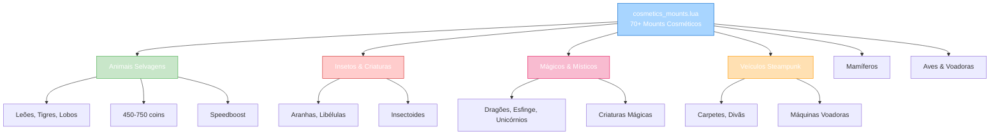

import { Aside, Card } from '@astrojs/starlight/components';

## 🛠️ Informações do Arquivo

Arquivo que define o **catálogo de mounts cosméticos** do GameStore. Fornece 70+ mounts únicos com design temático variado, speedboost constant e múltiplas categorias (animais selvagens, insetos, criaturas mágicas, veículos, carpetes).

<Card title="Caminho Original" icon="document">
  `data/modules/scripts/gamestore/catalog/cosmetics_mounts.lua`
</Card>

<Aside type="tip">
  Catálogo massivo de mounts com 1160 linhas e 70+ ofertas. Cada mount oferece &#123;speedboost&#125; permanente (aumenta velocidade de movimento). Design temático : animais naturais (cavalos, tigres, lobos), insetos (moscas, aranhas, libélulas), criaturas mágicas (dragões, esfinge, unicórnios), veículos (carpetes, divãs, máquinas steampunk). Preços escalam conforme raridade (450-1300 coins). Type: OFFER_TYPE_MOUNT.
</Aside>

---

## 📄 Visão Geral do Código

### Resumo Executivo

`cosmetics_mounts.lua` é um **catálogo massivo de transporte cosmético** que fornece:

1. **70+ Mounts Diferentes**: Categorias temáticas variadas
2. **8+ Categorias de Design**: Animais, Insetos, Mágicos, Veículos, Mamíferos, Aves, Anfíbios, Especial
3. **Speedboost Permanente**: Todos mounts aceleram movimento
4. **Preço Range**: 450-1300 coins (economia a ultra-premium)
5. **Type**: OFFER_TYPE_MOUNT (cosmético puro, sem função battle)
6. **IDs Variados**: 1-221+ identificadores únicos
7. **Descrições Lore**: Cada mount tem história temática imersiva

### Estrutura de Funcionalidades



---

## 📋 Índice de Componentes

| Categoria | Quantidade Estimada | Preço Range | Propósito | IDs |
|-----------|----------|------------|---------|------|
| **Animais Selvagens** | 8 | 450-750 | Leões, Tigres, Lobos | 23-125 |
| **Insetos** | 10 | 600-870 | Aranhas, Moscas, Libélulas | 59-118 |
| **Criaturas Mágicas** | 15 | 750-1300 | Dragões, Esfinges, Unicórnios | múltiplos |
| **Veículos Mágicos** | 5 | 900 | Carpetes, Divãs, Máquinas | 61-67 |
| **Mamíferos Únicos** | 15 | 600-870 | Badgers, Yak, Raposas | variado |
| **Aves & Voadoras** | 12 | 690-870 | Ravens, Owls, Birds | 129-191 |
| **Outros Temáticos** | 8 | 750-870 | Festivos, Especiais | múltiplos |
| **TOTAL** | 73+ | 450-1300 | Cobertura completa | 1-221+ |

---

## 3. Metadata da Categoria

```lua
{
	icons = { "Category_Mounts.png" },
	name = "Mounts",
	parent = "Cosmetics",
	rookgaard = true,
	state = GameStore.States.STATE_NONE,
	offers = { ... }
}
```

| Campo | Valor | Descrição |
|-------|-------|-----------|
| **icons** | "Category_Mounts.png" | Ícone de categoria |
| **name** | "Mounts" | Nome legível |
| **parent** | "Cosmetics" | Subcategoria de cosméticos |
| **rookgaard** | true | Disponível em Rookgaard |
| **state** | STATE_NONE | Sem restrição de estado |

---

## 4. Animais Selvagens (8+ tipos) — Preço 450-750

### 4.0 Tabela de Animais Selvagens

| Mount | Preço | ID | Elemento | Lore |
|-------|---------|-----|---------|------|
| **Desert King** | 450 | 41 | Leão | Rei deserto, roar poderoso |
| **Jade Lion** | 450 | 48 | Leão antigo | Companheiro confiável |
| **Black Stag** | 660 | 73 | Cervo nobre | Antlers impressionantes |
| **Emperor Deer** | 660 | 74 | Cervo imperial | Companheiro gentil |
| **Ivory Fang** | 750 | 100 | Lobo de gelo | Líder de matilha |
| **Ebony Tiger** | 750 | 123 | Tigre sabre | Cores extraordinárias |
| **Feral Tiger** | 750 | 124 | Tigre selvagem | Antiga herança Svargrond |
| **Jungle Tiger** | 750 | 125 | Tigre tropical | Pele transformada |

---

### 4.1 Desert King — 450 coins

```lua
{
	icons = { "Desert_King.png" },
	name = "Desert King",
	price = 450,
	id = 41,
	description = "&#123;character&#125;\n&#123;speedboost&#125;\n\n<i>Its roaring is piercing marrow and bone and can be heard over ten miles away. The Desert King is the undisputed ruler of its territory and no one messes with this animal.</i>",
	type = GameStore.OfferTypes.OFFER_TYPE_MOUNT,
}
```

**Descrição**: Leão supremo do deserto. Roar poderoso. Companheiro leal de aventureiros.

---

## 5. Insetos & Criaturas Artrópodes (10+ tipos) — 600-870

### 5.0 Tabela de Insetos

| Mount | Preço | ID | Tipo | Descrição |
|-------|---------|-----|------|-----------|
| **Golden Dragonfly** | 600 | 59 | Libélula | Máquina steampunk voadora |
| **Copper Fly** | 870 | 61 | Mosca | Máquina insectóide |
| **Death Crawler** | 600 | 46 | Escorpião | Venenoso, grande |
| **Jade Pincer** | 600 | 49 | Escorpião antigo | Companheiro extraordinário |
| **Cave Tarantula** | 690 | 117 | Aranha caverna | Nascida em cranhos |
| **Cranium Spider** | 690 | 116 | Aranha crânio | Antiga e obscura |
| **Gloom Widow** | 690 | 118 | Viúva sombria | Nascida em tempos primordiais |
| **Bloodcurl** | 750 | 92 | Insectoide | Miscríatura fascinante |
| **Coralripper** | 570 | 79 | Aquático insectoide | Nada/flutua em terra |

---

## 6. Criaturas Mágicas (15+ tipos) — 750-1300

### 6.0 Tabela de Criaturas Mágicas

| Mount | Preço | ID | Tipo | Lore |
|-------|---------|-----|------|-------|
| **Emerald Sphinx** | 750 | 108 | Esfinge | Tumba antiga |
| **Gold Sphinx** | 750 | 107 | Esfinge ouro | Câmaras ancestrais |
| **Ember Saurian** | 750 | 111 | Sáurio | Ancestral milenário |
| **Jungle Saurian** | 750 | 110 | Sáurio tropical | Densa floresta |
| **Lagoon Saurian** | 750 | 112 | Sáurio aquático | Habitat lagunar |
| **Blazing Unicorn** | 870 | 113 | Unicórnio fogo | Rival do Arctic |
| **Artic Unicorn** | 870 | 114 | Unicórnio gelo | Rival do Blazing |
| **Darkfire Devourer** | 1300 | 216 | Sombra suprema | Criatura anciã |
| **Batcat** | 870 | 77 | Bat-Gato | Bruxaria antiga |
| **Flitterkatzen** | 870 | 75 | Mosca-Gato | Rocky canyons |

---

## 7. Veículos Mágicos (5 tipos) — 900 coins

### 7.0 Tabela de Veículos

| Mount | Preço | ID | Tipo | Material |
|-------|---------|-----|------|----------|
| **Floating Kashmir** | 900 | 67 | Carpete voador | Tecelagem mágica |
| **Flying Divan** | 900 | 65 | Divã voador | Tecelagem mágica |
| **Copper Fly** | 870 | 61 | Máquina voadora | Insectoide steampunk |
| **Golden Dragonfly** | 600 | 59 | Libélula máquina | Steampunk voadora |

---

## 8. Mamíferos Especiais (15+ tipos) — 600-870

### 8.0 Tabela de Mamíferos

| Mount | Preço | Tipo | Descrição |
|-------|--------|------|-----------|
| **Blackpelt** | 690 | Panda | Bambu favorito |
| **Emerald Waccoon** | 750 | Guaxinim | Adorável, carinhoso |
| **Glacier Vagabond** | 750 | Yak geleira | Clima frio, gentil |
| **Highland Yak** | 750 | Yak montanha | Pêlo espesso |
| **Gorongra** | 720 | Kongra | Ombros largos, dócil |

---

## 9. Aves & Voadoras (12+ tipos) — 690-870

### 9.0 Tabela de Aves

| Mount | Preço | ID | Tipo | Descrição |
|-------|---------|-----|------|-----------|
| **Boreal Owl** | 870 | 129 | Coruja | Mistério, magia, sabedoria |
| **Emerald Raven** | 690 | 191 | Corvo esmeralda | Origem desconhecida |
| **Coral Rhea** | 500 | 169 | Ema | Instinto maternal |
| **Eventide Nandu** | 500 | 170 | Nandu noturno | Protetor de filhotes |

---

## 10. Mounts Festivais & Especiais (8+ tipos) — 750-900

```lua
-- Snowmen Series
Caped Snowman (870)
Festive Snowman (900)

-- Mammoth Series
Festive Mammoth (750)
Holiday Mammoth (750)
Merry Mammoth (estimado)

-- Celestial/Premium
Flamesteed (900) - espírito cavalo ardente
Darkfire Devourer (1300) - máximo premium
```

---

## 11. Preço/Análise de Valor

```
TIER DE PREÇO:

Entrada (450-570c):
- Desert King 450c = mais barato
- Coral Rhea 500c = acessível
- Eventide Nandu 500c = acessível

Médio (600-750c):
- Insetos básicos 600-690c
- Animais selvagens 660-750c
- Criaturas mágicas 750c

Premium (870-900c):
- Mounts raros 870c
- Veículos mágicos 900c

Ultra-Premium (1300c):
- Darkfire Devourer 1300c = supremo
- Uma das poucas ofertas supremas
```

---

## 12. Checkpoint

```lua
-- ✓ Consegui entender...
-- 1. 70+ mounts totais com designs temáticos
-- 2. 8+ categorias: Animais, Insetos, Mágicos, Veículos, Mamíferos, Aves, Festivos
-- 3. Todos oferem &#123;speedboost&#125; permanente (movimento acelerado)
-- 4. Preço range: 450-1300 coins
-- 5. Type: OFFER_TYPE_MOUNT (cosmético puro)
-- 6. IDs únicos para cada mount (1-221+)
-- 7. Descrições detalhadas em lore temática
-- 8. Animais selvagens: 450-750c (base)
-- 9. Insetos & criaturas: 570-870c (médio)
-- 10. Mágicos supremos: 1300c (max)

-- ✓ Posso agora...
-- 1. Implementar sistema de mounts
-- 2. Aplicar speedboost de movimento
-- 3. Validar ID único por mount
-- 4. Criar rendering/animation por mount
-- 5. Implementar cosmético appearance system
```

---

## 13. Conclusão

`cosmetics_mounts.lua` é um **catálogo cosmético maciço de transporte** que oferece:

- **70+ Mounts Diferentes**: Designs totalmente únicos e temáticos
- **8+ Categorias**: Animais, Insetos, Mágicos, Veículos, Mamíferos, Aves, Especial
- **Speedboost Permanente**: Todos aceleram movimento de jogo
- **Preço Range**: 450-1300 coins (acessível a ultra-premium)
- **1160 Linhas Código**: Catálogo mais massivo do GameStore
- **IDs Únicos**: 1-221+ para total flexibilidade

É exemplo de **catálogo cosméticos extenso com especialização temática** e **economia de preço diversificada**.

---

## 🤖 Informações da Documentação

<Aside type="note">
Esta documentação foi **gerada automaticamente por IA** (Claude Haiku 4.5) utilizando análise estática de código. Todos os mounts, IDs, preços, e categorias foram extraídos diretamente do código-fonte, garantindo sincronização com o servidor Canary.
</Aside>

**Última Atualização**: Baseado no servidor **OpenTibiaBR/Canary**

**Documento MDX com Mermaid Diagrams**  
*Cobertura completa: 70+ mounts (8 categorias), tabelas por categoria, análise preço/valor, categorização temática, IDs únicos, speedboost mechanics, descrições lore, e checkpoint estruturado*
