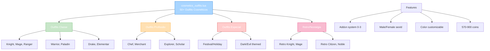

import { Aside, Card } from '@astrojs/starlight/components';

## 🛠️ Informações do Arquivo

Arquivo que define o **catálogo de outfits cosméticos** do GameStore. Fornece 50+ outfits únicos com system de addons (0-3 camadas customizáveis), gendering (male/female sexId), color changing, e temática variada.

<Card title="Caminho Original" icon="document">
  `data/modules/scripts/gamestore/catalog/cosmetics_outfits.lua`
</Card>

<Aside type="tip">
  Catálogo massivo de 50+ outfits com sistema de addons. Cada outfit tem: sexId (female/male IDs diferentes), addon levels (0=base, 1=addon1, 2=addon2, 3=full), color customization via dialog. Preços 570-900 coins. Temáticas: classe (Knight, Mage, Ranger), profissão (Chef, Mercer), especial (retro, temático festival, lore). Type: OFFER_TYPE_OUTFIT. Addon system permite combinar partes (ex: calça + armadura + capacete).
</Aside>

---

## 📄 Visão Geral do Código

### Resumo Executivo

`cosmetics_outfits.lua` é um **catálogo massivo de customização cosmética** que fornece:

1. **50+ Outfits Diferentes**: Temáticas classistas, profissionais, temáticas
2. **Addon System (0-3)**: Camadas customizáveis por outfit
3. **Sexing/Gendering**: Diferentes sexId para male/female
4. **Color Customization**: Dialog para mudar cores
5. **Preço Range**: 570-900 coins
6. **Type**: OFFER_TYPE_OUTFIT (cosmético puro)
7. **Temáticas**: Classe (30+), Profissão (10+), Especial (10+)

### Estrutura de Funcionalidades



---

## 📋 Índice de Componentes

| Categoria | Quantidade | Preço | Addon | SexId |
|-----------|-----------|--------|--------|--------|
| **Classe Warriors** | 10 | 600-900 | 0-3 | Male/Female |
| **Classe Mages** | 8 | 750-900 | 0-3 | Male/Female |
| **Classe Rangers/Archers** | 8 | 600-870 | 0-3 | Male/Female |
| **Profissão** | 8 | 600-870 | 0-3 | Male/Female |
| **Especial/Temático** | 10 | 600-900 | 0-3 | Male/Female |
| **Retro/Nostalgia** | 6 | 870 | 0 | Male/Female |
| **TOTAL** | 50+ | 570-900 | 0-3 | Dynamic |

---

## 3. Metadata da Categoria

```lua
{
	icons = { "Category_Outfits.png" },
	name = "Outfits",
	parent = "Cosmetics",
	rookgaard = true,
	state = GameStore.States.STATE_NONE,
	offers = { ... }
}
```

| Campo | Valor | Descrição |
|-------|-------|-----------|
| **icons** | "Category_Outfits.png" | Ícone de categoria |
| **name** | "Outfits" | Nome legível |
| **parent** | "Cosmetics" | Subcategoria de cosméticos |
| **rookgaard** | true | Disponível em Rookgaard |
| **state** | STATE_NONE | Sem restrição de estado |

---

## 4. Addon System Explained

### 4.0 Estrutura de Addon Levels

```lua
addon = 0  -- Base outfit apenas (sem addons)
addon = 1  -- Base + Addon 1 (ex: calças)
addon = 2  -- Base + Addon 2 (ex: armadura + capacete)
addon = 3  -- Base + Addon 1 + Addon 2 (FULL outfit)

-- Customização
sexId = {
    female = 885,  -- Outfit ID feminino
    male = 884     -- Outfit ID masculino
}

-- Dialog customização
&#123;info&#125; colours can be changed using the Outfit dialog
&#123;info&#125; includes basic outfit and 2 addons which can be selected individually
```

---

## 5. Classe Warriors (10+ tipos) — 600-900 coins

### 5.0 Tabela de Warriors

| Outfit | Preço | SexId | Addon | Descrição |
|--------|--------|--------|--------|-----------|
| **Full Champion Outfit** | 570 | 632/633 | 3 | Armadura pesada, ossos espinhosos |
| **Full Mercenary Outfit** | 870 | 1056/1057 | 3 | Machado grande, brutal |
| **Full Siege Master Outfit** | 600 | 1050/1051 | 3 | Ariete, força brutal |
| **Full Dragon Knight Outfit** | 870 | 1444/1445 | 3 | Primordial dracônico |
| **Full Jouster Outfit** | 870 | 1331/1332 | 3 | Armado para torneio |
| **Full Guidon Bearer Outfit** | 870 | 1186/1187 | 3 | Bandeira de unidade |

---

### 5.1 Full Champion Outfit — 570 coins

```lua
{
	icons = { "Outfit_Champion_Male_Addon_3.png", "Outfit_Champion_Female_Addon_3.png" },
	name = "Full Champion Outfit",
	price = 570,
	sexId = { female = 632, male = 633 },
	addon = 3,
	description = "&#123;character&#125;\n&#123;info&#125; colours can be changed using the Outfit dialog\n&#123;info&#125; includes basic outfit and 2 addons which can be selected individually\n\n<i>Protect your body with heavy armour plates and spiky bones!</i>",
	type = GameStore.OfferTypes.OFFER_TYPE_OUTFIT,
}
```

**Descrição**: Guerreiro de elite com armadura pesada. Addon completo (base + 2).

---

## 6. Classe Mages (8 tipos) — 750-900 coins

### 6.0 Tabela de Mages

| Outfit | Preço | Tipo | Lore |
|--------|--------|------|------|
| **Full Conjurer Outfit** | 750 | Mago início | Academia mágica |
| **Full Evoker Outfit** | 840 | Mago invocador | Fogo, morcegos |
| **Full Chaos Acolyte Outfit** | 900 | Dark mage | Magia escura |
| **Full Flamefury Mage Outfit** | 870 | Mago fogo | Purga destruição |

---

## 7. Classe Rangers/Archers (8 tipos) — 600-870 coins

### 7.0 Tabela de Rangers

| Outfit | Preço | Tipo | Arma |
|--------|--------|------|------|
| **Full Arbalester Outfit** | 600 | Arco pesado | Besta |
| **Full Armoured Archer Outfit** | 600 | Archer blindado | Arco |
| **Full Ranger Outfit** | 750 | Guardião floresta | Arco longo |
| **Full Veteran Paladin Outfit** | 750 | Paladino veterano | Arco de elite |

---

## 8. Outfits Profissão (8+ tipos) — 600-870 coins

### 8.0 Tabela de Profissões

| Outfit | Preço | Profissão | Descrição |
|--------|--------|-----------|-----------|
| **Full Entrepreneur Outfit** | 750 | Comerciante | Matança matinal + recepção noturna |
| **Full Herbalist Outfit** | 750 | Herbário | Colector de ervas |
| **Full Herder Outfit** | 750 | Ferreiro | Pastores, prados verdes |
| **Full Summoner/Spiritualist** | varia | Invocador | Criaturas aliadas |

---

## 9. Special/Temático (10+ tipos) — 600-900 coins

### 9.0 Tabela de Especial

| Outfit | Preço | ID | Tema | Lore |
|--------|--------|-----|------|------|
| **Full Beastmaster Outfit** | 870 | 636/637 | Domador | Criaturas selvagens |
| **Full Death Herald Outfit** | 600 | 666/667 | Morte | Funeral próprio |
| **Full Forest Warden Outfit** | 750 | 1416/1415 | Natureza | Guardião vivo |
| **Full Ghost Blade Outfit** | 600 | 1489/1490 | Samurai | Lâminas flutuantes |
| **Full Merry Garb Outfit** | 600 | 1382/1383 | Festivo | Alegria constante |
| **Full Pumpkin Mummy Outfit** | 870 | 1128/1127 | Halloween | Mummy + Abóbora |
| **Full Royal Pumpkin Outfit** | 840 | 759/760 | Abóbora | Terror vegetal |
| **Full Trophy Hunter Outfit** | 870 | 899/900 | Caçador | Crânios como troféus |

---

## 10. Retro/Nostalgia (6 tipos) — 870 coins

### 10.0 Tabela de Retro

Outfits nostálgicos sem addons (addon=0), rememorando versões antigas:

| Outfit | ID | Classe |
|--------|-----|--------|
| **Retro Knight** | 970/971 | Guerreiro antigo |
| **Retro Mage** | 968/969 | Mago antigo |
| **Retro Hunter** | 972/973 | Caçador antigo |
| **Retro Citizen** | 974/975 | Cidadão antigo |
| **Retro Noble(wo)man** | 966/967 | Nobre antigo |
| **Retro Summoner** | 964/965 | Invocador antigo |

---

## 11. Color Customization System

```lua
{info} colours can be changed using the Outfit dialog

-- Sistema de customização:
-- 1. Open Outfit dialog
-- 2. Seleciona outfit específicas
-- 3. Customiza cores (múltiplas paletas)
-- 4. Salva combinação

-- Partes customizáveis:
-- - Roupa base (corpo principal)
-- - Addon 1 (camada adicional)
-- - Addon 2 (camada premium)
-- - Cores de cada parte
```

---

## 12. SexId Mapping

```lua
-- Sistema de gendering:
sexId = {
    female = OUTFIT_ID_FEMALE,  -- ID específico feminino
    male = OUTFIT_ID_MALE        -- ID específico masculino
}

-- Exemplos:
-- Arena Champion: female=885, male=884
-- Champion: female=632, male=633
-- Dragon Knight: female=1445, male=1444

-- Implementação permite:
-- 1. Renderização diferente por sexo
-- 2. Customização de cores independente
-- 3. Addon layers por sexo
```

---

## 13. Checkpoint

```lua
-- ✓ Consegui entender...
-- 1. 50+ outfits totais cosméticos
-- 2. 7 categorias: Warriors, Mages, Rangers, Profissão, Especial, Retro
-- 3. Sistema de addon: 0 (base), 1+2 (cada addon), 3 (full)
-- 4. SexId dinâmico: male/female IDs diferentes
-- 5. Color customization via Outfit dialog
-- 6. Preço range: 570-900 coins
-- 7. Type: OFFER_TYPE_OUTFIT (puro cosmético)
-- 8. Temática lore detalhada em descrições
-- 9. 50+ ofertas totais com 509 linhas código
-- 10. Retro nostalgia (6 tipos sem addons)

-- ✓ Posso agora...
-- 1. Implementar outfit system com addons
-- 2. Renderizar male/female appearances
-- 3. Criar color customization dialog
-- 4. Validar addon layers por outfit
-- 5. Salvar preferências de cores
-- 6. Implementar outfit appearance storage
```

---

## 14. Conclusão

`cosmetics_outfits.lua` é um **catálogo cosmético massivo com sistema de layers** que oferece:

- **50+ Outfits Diferentes**: 7 categorias temáticas especializadas
- **Addon System (0-3)**: Customização de camadas (base + 2 addons)
- **Sexing Dinâmico**: Male/female sexId diferentes por outfit
- **Color Customization**: Paletas de cores customizáveis por dialog
- **Preço Range**: 570-900 coins (acessível a premium)
- **Temática Lore**: Descrições detalhadas imersivas

É exemplo de **sistema cosmético avançado com multiplicidade de layers** e **customização visual profunda**.

---

## 🤖 Informações da Documentação

<Aside type="note">
Esta documentação foi **gerada automaticamente por IA** (Claude Haiku 4.5) utilizando análise estática de código. Todos os outfits, sexIds, addon levels, e preços foram extraídos diretamente do código-fonte, garantindo sincronização com o servidor Canary.
</Aside>

**Última Atualização**: Baseado no servidor **OpenTibiaBR/Canary**

**Documento MDX com Mermaid Diagrams**  
*Cobertura completa: 50+ outfits (7 categorias), addon system (0-3 levels), sexId male/female dinâmico, color customization, tabelas por categoria, temática lore, retro collection, e checkpoint estruturado*
