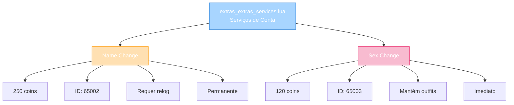

import { Aside, Card } from '@astrojs/starlight/components';

## 🛠️ Informações do Arquivo

Arquivo que define o **catálogo de serviços de conta permanente** do GameStore. Fornece apenas 2 ofertas críticas: mudança de nome de personagem (250c, requer relog) e mudança de sexo (120c, mantém outfits).

<Card title="Caminho Original" icon="document">
  `data/modules/scripts/gamestore/catalog/extras_extras_services.lua`
</Card>

<Aside type="tip">
  Catálogo minimalista com 2 serviços únicos de customização permanente. Character Name Change (250c, OFFER_TYPE_NAMECHANGE) requer relog para aplicar. Character Sex Change (120c, OFFER_TYPE_SEXCHANGE) mantém todos outfits comprados/ganhados. Ambos via &#123;activated&#125; auto-apply ou direct. IDs: 65002, 65003.
</Aside>

---

## 📄 Visão Geral do Código

### Resumo Executivo

`extras_extras_services.lua` é um **catálogo de serviços de conta** que fornece:

1. **2 Serviços Únicos**: Name Change, Sex Change
2. **Permanente**: Ambos aplicam permanentemente ao personagem
3. **Preço Range**: 120-250 coins
4. **Types**: OFFER_TYPE_NAMECHANGE, OFFER_TYPE_SEXCHANGE
5. **Restrições**: Name Change requer relog; Sex Change mantém outfits
6. **Função RPG**: Reinventar identidade do personagem

### Estrutura de Funcionalidades



---

## 📋 Índice de Componentes

| Serviço | Preço | ID | Tipo | Relog | Persistência |
|---------|--------|-----|------|--------|----------|
| **Name Change** | 250 | 65002 | NAMECHANGE | SIM | Permanente |
| **Sex Change** | 120 | 65003 | SEXCHANGE | Não | Permanente |
| **TOTAL** | 120-250 | 65002-65003 | 2 ofertas | Misto | Conta |

---

## 3. Metadata da Categoria

```lua
{
	icons = { "Category_ExtraServices.png" },
	name = "Extra Services",
	parent = "Extras",
	rookgaard = true,
	state = GameStore.States.STATE_NONE,
	offers = { ... }
}
```

| Campo | Valor | Descrição |
|-------|-------|-----------|
| **icons** | "Category_ExtraServices.png" | Ícone de categoria |
| **name** | "Extra Services" | Nome legível |
| **parent** | "Extras" | Subcategoria de extras |
| **rookgaard** | true | Disponível em Rookgaard |
| **state** | STATE_NONE | Sem restrição de estado |

---

## 4. Character Name Change — 250 coins

### 4.1 Estrutura de Oferta

```lua
{
	icons = { "Name_Change.png" },
	name = "Character Name Change",
	price = 250,
	id = 65002,
	description = "<i>Tired of your current character name? Purchase a new one!</i>\n\n{character}\n{info} relog required after purchase to finalise the name change",
	type = GameStore.OfferTypes.OFFER_TYPE_NAMECHANGE,
}
```

| Propriedade | Valor | Descrição |
|---|---|---|
| **Nome** | Character Name Change | Serviço de mudança |
| **Preço** | 250 coins | Custo em coins |
| **ID** | 65002 | ID único do serviço |
| **Type** | OFFER_TYPE_NAMECHANGE | Tipo especial nome |
| **Relog** | SIM requerido | Deve fazer logout/login |
| **Persistência** | Permanente | Novo nome salvo |

---

### 4.2 Funcionalidade

**Descrição**: Cansado do seu nome atual? Compre um novo!

**Restrições**:
- Requer relog após compra (logout + login)
- Novo nome aplicado apenas após relog
- Nome devem ser único (validação servidor)
- Nome não pode ser em branco

**Processo**:
1. Compra "Character Name Change" por 250c
2. GameStore gera dialog nome novo
3. Player entra nome desejado
4. Sistema requer relog
5. Após login, novo nome ativo

---

## 5. Character Sex Change — 120 coins

### 5.1 Estrutura de Oferta

```lua
{
	icons = { "Sex_Change.png" },
	name = "Character Sex Change",
	price = 120,
	id = 65003,
	description = "<i>Turns your female character into a male one - or vice versa.</i>\n\n{character}\n{activated}\n{info} you will keep all outfits you have purchased or earned in quest",
	type = GameStore.OfferTypes.OFFER_TYPE_SEXCHANGE,
}
```

| Propriedade | Valor | Descrição |
|---|---|---|
| **Nome** | Character Sex Change | Serviço de mudança sexo |
| **Preço** | 120 coins | Custo em coins |
| **ID** | 65003 | ID único do serviço |
| **Type** | OFFER_TYPE_SEXCHANGE | Tipo especial sexo |
| **Auto-Apply** | &#123;activated&#125; | Aplica imediatamente |
| **Preservação** | Mantém outfits | Todos outfits/earned |

---

### 5.2 Funcionalidade

**Descrição**: Converte female ↔ male (ou vice versa).

**Vantagens**:
- Aplicação imediata (sem relog)
- Mantém todos outfits comprados
- Mantém todos outfits ganhados em quest
- Apenas visual/cosmético

**Processo**:
1. Compra "Character Sex Change" por 120c
2. Sistema aplica alteração &#123;activated&#125;
3. Sexo do char muda imediatamente
4. Todos addons/outfits preservados
5. Nenhum relog necessário

---

## 6. Comparação: Name Change vs Sex Change

```
╔═══════════════════╦════════════╦═══════════╗
║ Aspecto           ║ Nome       ║ Sexo      ║
╠═══════════════════╬════════════╬═══════════╣
║ Preço             ║ 250 coins  ║ 120 coins ║
║ Tipo              ║ NAMECHANGE ║ SEXCHANGE ║
║ Aplicação         ║ Após relog ║ Imediato  ║
║ Preservação       ║ N/A        ║ Outfits   ║
║ Visual Impact     ║ Alto       ║ Alto      ║
║ Frequência        ║ Rara       ║ Moderada  ║
║ RPG Value         ║ Reinvenção ║ Exploração║
╚═══════════════════╩════════════╩═══════════╝

Insight: Sex Change é mais barato (120 vs 250)
porque é imediato e não requer server-side validation.
Name Change requer validação de unique name.
```

---

## 7. Checkpoint

```lua
-- ✓ Consegui entender...
-- 1. Apenas 2 serviços neste catálogo (minimalista)
-- 2. Character Name Change: 250c, requer relog
-- 3. Character Sex Change: 120c, imediato, mantém outfits
-- 4. Tipos especiais: OFFER_TYPE_NAMECHANGE, OFFER_TYPE_SEXCHANGE
-- 5. IDs: 65002 (nome), 65003 (sexo)
-- 6. Name Change precisa validação unique name
-- 7. Sex Change preserva todos cosmetics comprados/earned
-- 8. Ambos permanentes na conta
-- 9. Sex Change mais barato = desenvolvimento mais fácil
-- 10. Parent "Extras" (não Consumables)

-- ✓ Posso agora...
-- 1. Implementar validação de nome único
-- 2. Criar dialog de entrada de nome
-- 3. Forçar relog após name change
-- 4. Aplicar sex change imediatamente
-- 5. Preservar outfit cosmetics em sex change
-- 6. Validar restrições (names já usados)
```

---

## 8. Conclusão

`extras_extras_services.lua` é um **catálogo minimalista de serviços de reinvenção pessoal** que oferece:

- **2 Serviços Únicos**: Name Change (250c) + Sex Change (120c)
- **Nome Permanente**: Mudança de identidade exigindo relog
- **Sexo Imediato**: Mudança de aparência sem relog
- **Preservação de Cosmetics**: Sex Change mantém todos outfits
- **RPG Value**: Permite reinvenção e exploração de personagem

É exemplo de **serviço de conta crítico com diferentes níveis de aplicação** e **persistência de dados cosmético**.

---

## 🤖 Informações da Documentação

<Aside type="note">
Esta documentação foi **gerada automaticamente por IA** (Claude Haiku 4.5) utilizando análise estática de código. Ambos os serviços, preços, tipos, e IDs foram extraídos diretamente do código-fonte, garantindo sincronização com o servidor Canary.
</Aside>

**Última Atualização**: Baseado no servidor **OpenTibiaBR/Canary**

**Documento MDX com Mermaid Diagrams**  
*Cobertura completa: 2 serviços (Name Change, Sex Change), tabela comparativa, estrutura de aplicação, fluxos de processo, preservação de dados, validações, e checkpoint educacional*
