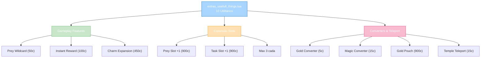

import { Aside, Card } from '@astrojs/starlight/components';

## 🛠️ Informações do Arquivo

Arquivo que define o **catálogo de utilitários de gameplay** do GameStore. Fornece 10 ofertas que aumentam qualidade de vida, acesso a features premium (Prey, Reward, Charms), slots adicionais, conversão de moeda, e teleporte.

<Card title="Caminho Original" icon="document">
  `data/modules/scripts/gamestore\catalog\extras_usefull_things.lua`
</Card>

<Aside type="tip">
  Catálogo de QoL (Quality of Life) com 10 ofertas, divididas em 3 categorias: Gameplay Features (Prey Wildcard, Instant Reward, Charms), Expansão de Slots (Prey Slot +1, Hunting Task Slot +1, máx 3), Utilitários (Gold Converter, Magic Gold Converter, Gold Pouch, Temple Teleport). Tipos variados: PREYBONUS, INSTANT_REWARD_ACCESS, CHARMS, PREYSLOT, HUNTINGSLOT, CHARGES, ITEM_UNIQUE, TEMPLE. Preços 5-900c.
</Aside>

---

## 📄 Visão Geral do Código

### Resumo Executivo

`extras_usefull_things.lua` é um **catálogo de utilitários gameplay** que fornece:

1. **10 Ofertas Únicas**: Gaming features, slots, moeda, teleporte
2. **3 Categorias**: Gameplay, Slots/Expansão, Utilitários
3. **Preço Range**: 5-900 coins
4. **Types**: 7 tipos diferentes (PREYBONUS, CHARMS, SLOTS, CHARGES, etc)
5. **Features**: Prey system, Rewards, Charms, Moeda conversão
6. **Cap/Max**: Alguns com limite máximo por character (Prey 50, Task 3)

### Estrutura de Funcionalidades



---

## 📋 Índice de Componentes

| Categoria | Oferta | Preço | Tipo | Cap | Função |
|-----------|--------|--------|------|-----|--------|
| **Gameplay** | Prey Wildcard | 50c | PREYBONUS | 50 | Reroll bonuses |
| **Gameplay** | Instant Reward | 100c | INSTANT_REWARD | 90 | Claim daily reward |
| **Gameplay** | Charm Expansion | 450c | CHARMS | once | +25% charm discount |
| **Slots** | Prey Slot +1 | 900c | PREYSLOT | 3 | +1 prey active |
| **Slots** | Task Slot +1 | 900c | HUNTINGSLOT | 3 | +1 task active |
| **Converters** | Gold Converter | 5c | CHARGES | 500 | 100 gold → 1 plat |
| **Converters** | Magic Converter | 15c | CHARGES | 500 | Auto-convert moeda |
| **Converters** | Gold Pouch | 900c | ITEM_UNIQUE | once | Bolsa infinita moeda |
| **Special** | Prey Wildcard (x20) | 50c | PREYBONUS | 50 | Bundle 20x |
| **Special** | Temple Teleport | 15c | TEMPLE | unlimited | Teleport ao temple |
| **TOTAL** | 10 ofertas | 5-900 | 7 tipos | Variado | Completo |

---

## 3. Metadata da Categoria

```lua
{
	icons = { "Category_UsefulThings.png" },
	name = "Useful Things",
	parent = "Extras",
	rookgaard = true,
	state = GameStore.States.STATE_NONE,
	offers = { ... }
}
```

| Campo | Valor | Descrição |
|-------|-------|-----------|
| **icons** | "Category_UsefulThings.png" | Ícone de categoria |
| **name** | "Useful Things" | Nome legível |
| **parent** | "Extras" | Subcategoria de extras |
| **rookgaard** | true | Disponível em Rookgaard |
| **state** | STATE_NONE | Sem restrição de estado |

---

## 4. Gameplay Features (3 tipos)

### 4.1 Prey Wildcard — 50 coins (x5 e x20)

```lua
{
	icons = { "Prey_Bonus_Reroll.png" },
	name = "Prey Wildcard",
	price = 50,
	id = GameStore.SubActions.PREY_WILDCARD,
	count = 5,  -- ou 20 para bundle
	description = "<i>Use Prey Wildcards to reroll the bonus of an active prey, to lock your active prey or to select a prey of your choice.</i>\n\n&#123;character&#125;\n&#123;info&#125; added directly to Prey dialog\n&#123;info&#125; maximum amount that can be owned by character: 50",
	type = GameStore.OfferTypes.OFFER_TYPE_PREYBONUS,
}
```

| Propriedade | Valor |
|---|---|
| **Preço** | 50 coins |
| **Count** | 5 (ou 20 bundle) |
| **ID** | PREY_WILDCARD |
| **Max** | 50 wildcards por char |
| **Função** | Reroll bonus, lock, select |
| **Aplicação** | Prey dialog direct |

**Descrição**: Utilidade para sistema de Prey. Pode:
- Reroll bonus ativo
- Lock prey selecionado
- Escolher prey específico

---

### 4.2 Instant Reward Access — 100 coins

```lua
{
	icons = { "Instant_Reward_Access.png" },
	name = "Instant Reward Access",
	price = 100,
	id = GameStore.SubActions.INSTANT_REWARD,
	count = 1,
	description = "<i>No matter where you are in Tibia, claim your daily reward on the spot!</i>\n\n&#123;character&#125;\n&#123;info&#125; added to your reward wall\n&#123;info&#125; maximum amount that can be owned by character: 90",
	type = GameStore.OfferTypes.OFFER_TYPE_INSTANT_REWARD_ACCESS,
}
```

| Propriedade | Valor |
|---|---|
| **Preço** | 100 coins |
| **ID** | INSTANT_REWARD |
| **Max** | 90 por character |
| **Função** | Claim daily reward |
| **Localização** | Anywhere (sem ir ao reward wall) |
| **Aplicação** | Reward wall system |

**Descrição**: Acesso instantâneo ao daily reward sem precisar ir ao local físico.

---

### 4.3 Charm Expansion — 450 coins (ONE TIME)

```lua
{
	icons = { "Charm_Expansion_Offer.png" },
	name = "Charm Expansion",
	price = 450,
	id = GameStore.SubActions.CHARM_EXPANSION,
	description = "<i>Assign as many of your unlocked Charms as you like and get a 25% discount whenever you are removing a Charm from a creature!</i>\n\n&#123;character&#125;\n&#123;once&#125;",
	type = GameStore.OfferTypes.OFFER_TYPE_CHARMS,
}
```

| Propriedade | Valor |
|---|---|
| **Preço** | 450 coins |
| **ID** | CHARM_EXPANSION |
| **Once** | SIM - apenas 1x por account |
| **Função** | Expandir charm slots |
| **Bônus** | 25% discount on removal |
| **Aplicação** | Charm system direct |

**Descrição**: Expande sistema de charms (unlocked charms podem ser equipados).
Bonus: 25% discount na remoção de charms.

---

## 5. Expansão de Slots (2 tipos, 900c cada)

### 5.1 Permanent Prey Slot — 900 coins

```lua
{
	icons = { "Permanent_Prey_Slot.png" },
	name = "Permanent Prey Slot",
	price = 900,
	id = GameStore.SubActions.PREY_THIRDSLOT_REDIRECT,
	description = "<i>Get an additional prey slot to activate additional prey!</i>\n\n&#123;character&#125;\n&#123;info&#125; maximum amount that can be owned by character: 3\n&#123;info&#125; added directly to Prey dialog",
	type = GameStore.OfferTypes.OFFER_TYPE_PREYSLOT,
}
```

| Propriedade | Valor |
|---|---|
| **Preço** | 900 coins |
| **Função** | +1 Prey slot ativo |
| **Max** | 3 slots total |
| **Aplicação** | Prey dialog |
| **Permanente** | SIM |

---

### 5.2 Permanent Hunting Task Slot — 900 coins

```lua
{
	icons = { "Permanent_Hunting_Task_Slot.png" },
	name = "Permanent Hunting Task Slot",
	price = 900,
	id = GameStore.SubActions.TASKHUNTING_THIRDSLOT,
	description = "<i>Get an additional hunting tasks slot to activate additional hunting task!</i>\n\n&#123;character&#125;\n&#123;info&#125; maximum amount that can be owned by character: 3\n&#123;info&#125; added directly to Hunting Task dialog"
	type = GameStore.OfferTypes.OFFER_TYPE_HUNTINGSLOT,
}
```

| Propriedade | Valor |
|---|---|
| **Preço** | 900 coins |
| **Função** | +1 Hunting task ativo |
| **Max** | 3 slots total |
| **Aplicação** | Hunting Task dialog |
| **Permanente** | SIM |

---

## 6. Converters & Teleport (4 tipos)

### 6.1 Gold Converter — 5 coins (CHARGES 500)

```lua
{
	icons = { "Gold_Converter.png" },
	name = "Gold Converter",
	price = 5,
	itemtype = 23722,
	charges = 500,
	description = "<i>Changes either a stack of 100 gold pieces into 1 platinum coin, or a stack of 100 platinum coins into 1 crystal coin!</i>\n\n&#123;character&#125;\n&#123;storeinbox&#125;\n&#123;useicon&#125; use it on a stack of 100 to change it to the superior currency\n&#123;info&#125; usable 500 times a piece",
	type = GameStore.OfferTypes.OFFER_TYPE_CHARGES,
}
```

| Propriedade | Valor |
|---|---|
| **Preço** | 5 coins (SUPER BARATO) |
| **ItemType** | 23722 |
| **Charges** | 500 usos |
| **Função** | 100 gold → 1 platinum |
| **Conversão** | 100 platinum → 1 crystal |
| **Aplicação** | Use em stack |

**Descrição**: Manual gold converter. Precisa usar item em stack de 100.

---

### 6.2 Magic Gold Converter — 15 coins (CHARGES 500, AUTO)

```lua
{
	icons = { "Magic_Gold_Converter.png" },
	name = "Magic Gold Converter",
	price = 15,
	itemtype = 28525,
	charges = 500,
	description = "<i>Changes automatically either a stack of 100 gold pieces into 1 platinum coin, or a stack of 100 platinum coins into 1 crystal coin!</i>\n\n&#123;character&#125;\n&#123;storeinbox&#125;\n&#123;useicon&#125; use it to activate or deactivate the automatic conversion\n&#123;info&#125; converts all stacks of 100 gold or platinum in the inventory whenever it is activated\n&#123;info&#125; deactivated upon purchase\n&#123;info&#125; usable for 500 conversions a piece",
	type = GameStore.OfferTypes.OFFER_TYPE_CHARGES,
}
```

| Propriedade | Valor |
|---|---|
| **Preço** | 15 coins |
| **ItemType** | 28525 |
| **Charges** | 500 usos |
| **Função** | Auto-converter moeda |
| **Automático** | SIM (deactivated on purchase) |
| **Aplicação** | Activate/deactivate toggle |

**Descrição**: Converter automático. Quando ativado, converte automaticamente stacks de 100.

---

### 6.3 Gold Pouch — 900 coins (ITEM_UNIQUE, ONCE)

```lua
{
	icons = { "Gold_Pouch.png" },
	name = "Gold Pouch",
	price = 900,
	itemtype = 23721,
	count = 1,
	description = "<i>Carries as many gold, platinum or crystal coins as your capacity allows, however, no other items.</i>\n\n&#123;character&#125;\n&#123;storeinbox&#125;\n&#123;once&#125;\n&#123;useicon&#125; use it to open it\n&#123;info&#125; always placed on the first position of your Store inbox",
	type = GameStore.OfferTypes.OFFER_TYPE_ITEM_UNIQUE,
}
```

| Propriedade | Valor |
|---|---|
| **Preço** | 900 coins |
| **ItemType** | 23721 |
| **Once** | SIM - 1x por account |
| **Função** | Bolsa moeda infinita |
| **Capacidade** | Capacity total de chars |
| **Restrição** | Only moeda (não outros items) |

**Descrição**: Container único para moeda. Armazena apenas gold/platinum/crystal.

---

### 6.4 Temple Teleport — 15 coins (SPELL)

```lua
{
	icons = { "Temple_Teleport.png" },
	name = "Temple Teleport",
	price = 15,
	description = "<i>Teleports you instantly to your home temple.</i>\n\n&#123;character&#125;\n&#123;useicon&#125; use it to teleport you to your home temple</i>\n&#123;battlesign&#125;\n&#123;info&#125; does not work in no-logout zones or close to a character's home temple",
	type = GameStore.OfferTypes.OFFER_TYPE_TEMPLE,
}
```

| Propriedade | Valor |
|---|---|
| **Preço** | 15 coins |
| **Tipo** | TEMPLE (spell-like) |
| **Função** | Teleport ao home temple |
| **Battle Sign** | SIM (pode usar em PvP) |
| **Restrição** | Não (no-logout zones, perto de temple) |
| **Aplicação** | &#123;useicon&#125; direct use |

**Descrição**: Teleporte direto ao home temple do character.

---

## 7. Análise Econômica

```
Conversão Moeda:
- Gold Converter: 5c para 500 usos = 0.01c por uso
- Magic Converter: 15c para 500 auto-conversions = 0.03c por uso

Premium Slots:
- Prey Slot: 900c para +1 slot permanente
- Task Slot: 900c para +1 slot permanente
- Ambos: Max 3 slots (900 × 2 adicional = 1800c para 3 total)

QoL Items:
- Prey Wildcard: 50c × 50 max = 2500c total
- Temple Teleport: 15c per use (consumable)
- Instant Reward: 100c × 90 max = 9000c total

One-Time:
- Gold Pouch: 900c (único item permanente de moeda)
- Charm Expansion: 450c (único, bônus 25% discount)
```

---

## 8. Checkpoint

```lua
-- ✓ Consegui entender...
-- 1. 10 ofertas totais em utilitários
-- 2. 3 categorias: Gameplay, Slots, Converters/Teleport
-- 3. Prey Wildcard: 50c, max 50, reroll/lock/select
-- 4. Instant Reward: 100c, max 90, claim anywhere
-- 5. Charm Expansion: 450c one-time, +25% discount
-- 6. Prey Slot: 900c, +1 slot, max 3 total
-- 7. Task Slot: 900c, +1 slot, max 3 total
-- 8. Gold Converter: 5c, manual 500 uses
-- 9. Magic Converter: 15c, auto 500 uses
-- 10. Gold Pouch: 900c one-time, Container infinito

-- ✓ Posso agora...
-- 1. Implementar Prey wildcard reroll logic
-- 2. Criar Instant Reward dialog
-- 3. Expandir charm slots
-- 4. Persistir prey/task slots permanentemente
-- 5. Implementar gold converter logic
-- 6. Criar auto-converter toggle
-- 7. Implementar gold pouch container
-- 8. Criar temple teleport command
```

---

## 9. Conclusão

`extras_usefull_things.lua` é um **catálogo de Quality of Life gameplay** que oferece:

- **10 Ofertas Estratégicas**: Gameplay features, expansão de slots, converção de moeda
- **Gameplay Features**: Prey Wildcard (50c), Instant Reward (100c), Charm Expansion (450c)
- **Expansão Permanente**: Prey Slot +1 (900c), Task Slot +1 (900c), max 3 cada
- **Converters**: Gold (5c manual, 500 usos), Magic (15c auto, 500 usos)
- **Utilitário Premium**: Gold Pouch (900c unique), Temple Teleport (15c spell)
- **Preço Range**: 5-900 coins (ultra-acessível a premium)

É exemplo de **sistema de QoL com múltiplos níveis de investimento** e **monetização de convenience features**.

---

## 🤖 Informações da Documentação

<Aside type="note">
Esta documentação foi **gerada automaticamente por IA** (Claude Haiku 4.5) utilizando análise estática de código. Todas as 10 ofertas, preços, IDs, tipos, e limites foram extraídos diretamente do código-fonte, garantindo sincronização com o servidor Canary.
</Aside>

**Última Atualização**: Baseado no servidor **OpenTibiaBR/Canary**

**Documento MDX com Mermaid Diagrams**  
*Cobertura completa: 10 utilitários (3 categorias), tabela de preços/caps, Prey Wildcard specs, Instant Reward, Charm Expansion, Prey/Task Slots, Gold Converters (manual + auto), Gold Pouch, Temple Teleport, análise econômica, e checkpoint estruturado*
