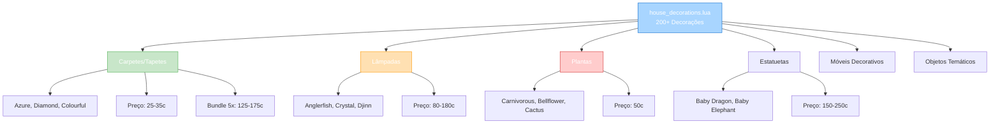

import { Aside, Card } from '@astrojs/starlight/components';

## 🛠️ Informações do Arquivo

Arquivo que define o **catálogo de decorações cosméticas para casas** do GameStore. Fornece 200+ decorações únicas com designs variados (carpetes, lâmpadas, plantas, estatuetas, móveis decorativos) para embelezamento de propriedades.

<Card title="Caminho Original" icon="document">
  `data/modules/scripts/gamestore/catalog/house_decorations.lua`
</Card>

<Aside type="tip">
  Catálogo massivo com 2280 linhas e 200+ decorações únicas. Inclui carpetes enrolláveis (Azure, Bamboo, Colourful, Diamond, etc) preço 25-35c, lâmpadas decorativas (Anglerfish, Crystal, Curly Hortensis, Djinn) preço 80-180c, plantas (Carnivorous, Bellflower, Blooming Cactus) preço 50c, estatuetas (Baby Bonelord, Baby Dragon, Baby Elephant) preço 150-250c. Todas uso &#123;house&#125; &#123;box&#125; &#123;storeinbox&#125; &#123;use&#125; &#123;backtoinbox&#125;. Type: OFFER_TYPE_HOUSE.
</Aside>

---

## 📄 Visão Geral do Código

### Resumo Executivo

`house_decorations.lua` é um **catálogo massivo de decorações de casa** que fornece:

1. **200+ Decorações Diferentes**: Designs temáticos e variados
2. **8+ Categorias**: Carpetes, Lâmpadas, Plantas, Estatuetas, Móveis, Tapetes, Objetos, Temas
3. **Preço Range**: 25-250 coins (acessível a premium)
4. **Type**: OFFER_TYPE_HOUSE (cosmético puro)
5. **ItemType**: Variados (23710, 27679, 28675, etc)
6. **Count**: Maioria 1, alguns com bundle 5x
7. **Descrição**: Padronizada &#123;house&#125;&#123;box&#125;&#123;storeinbox&#125;&#123;use&#125;&#123;backtoinbox&#125;

### Estrutura de Funcionalidades



---

## 📋 Índice de Componentes

| Categoria | Quantidade | Preço | Tipo | Descrição |
|-----------|-----------|--------|------|-----------|
| **Carpetes** | 40+ | 25-175 | HOUSE | Tapetes enrolláveis + bundles |
| **Lâmpadas** | 15+ | 80-180 | HOUSE | Decorativas/Temáticas |
| **Plantas** | 10+ | 50 | HOUSE | Plantas vivas |
| **Estatuetas** | 20+ | 150-250 | HOUSE | Miniaturas de criaturas |
| **Móveis** | 30+ | 50-120 | HOUSE | Bancos, Cadeiras, Bufês |
| **Tapestries** | 15+ | 50-60 | HOUSE | Tapeçarias de parede |
| **Objetos Temáticos** | 70+ | 25-120 | HOUSE | Barris, Cofres, Painéis |
| **TOTAL** | 200+ | 25-250 | HOUSE | Cobertura completa |

---

## 3. Metadata da Categoria

```lua
{
	icons = { "Category_HouseDecorations.png" },
	name = "Decorations",
	parent = "Houses",
	rookgaard = true,
	state = GameStore.States.STATE_NONE,
	offers = { ... }
}
```

| Campo | Valor | Descrição |
|-------|-------|-----------|
| **icons** | "Category_HouseDecorations.png" | Ícone de categoria |
| **name** | "Decorations" | Nome legível |
| **parent** | "Houses" | Categoria pai (Houses) |
| **rookgaard** | true | Disponível em Rookgaard |
| **state** | STATE_NONE | Sem restrição de estado |

---

## 4. Carpetes & Tapetes (40+ tipos) — 25-175 coins

### 4.0 Padrão de Carpetes

```lua
{
	icons = { "Rolled-up_NOME_Carpet.png" },
	name = "NOME Carpet",
	price = 35,  -- Ou 175 para bundle 5x
	itemtype = XXXXX,
	count = 1,  -- Ou 5 para bundle
	description = "&#123;house&#125;\n&#123;box&#125;\n&#123;storeinbox&#125;\n&#123;use&#125;\n&#123;backtoinbox&#125;",
	type = GameStore.OfferTypes.OFFER_TYPE_HOUSE,
}
```

**Carpetes Disponíveis**:
- Azure Carpet (35c single, 175c ×5)
- Bamboo Mat (25c single, 125c ×5)
- Colourful Carpet (35c single, 175c ×5)
- Colourful Pom-Pom Carpet (30c single, 150c ×5)
- Crested Carpet (25c single, 125c ×5)
- Crimson Carpet (35c single, 175c ×5)
- Decorated Carpet (35c single, 175c ×5)
- Diamond Carpet (25c single, 125c ×5)

---

## 5. Lâmpadas Decorativas (15+ tipos) — 80-180 coins

### 5.0 Tabela de Lâmpadas

| Lâmpada | Preço | ItemType | Descrição |
|---------|--------|---------|-----------|
| **Anglerfish Lamp** | 120 | 28675 | Luz aquática |
| **Barrel & Anchor Lamp** | 80 | 31937 | Tema náutico |
| **Crystal Lamp** | 80 | 31196 | Cristal brilhante |
| **Curly Hortensis Lamp** | 120 | 31695 | Floral |
| **Djinn Lamp** | 180 | 42363 | Exótica |
| **Blue Round Cushion** | 50 | 31222 | Decorativa suave |

---

## 6. Plantas & Flores (10+ tipos) — 50 coins

Plantas vivas para decoração interior:

| Planta | Preço | ItemType | Efeito |
|--------|--------|---------|--------|
| **Bellflower** | 50 | 28697 | Flor pequena |
| **Bitter-Smack Leaf** | 50 | 25217 | Folha |
| **Blooming Cactus** | 50 | 25216 | Cacto em flor |
| **Carnivorous Plant** | 50 | 28689 | Planta carnívora |

---

## 7. Estatuetas & Miniaturas (20+ tipos) — 150-250 coins

### 7.0 Tabela de Estatuetas

| Estatueta | Preço | ItemType | Tipo |
|-----------|--------|---------|------|
| **Baby Bonelord** | 250 | 34026 | Criatura |
| **Baby Dragon** | 250 | 23442 | Dragão |
| **Baby Elephant** | 250 | 35153 | Elefante |
| **Baby Polar Bear** | 250 | 32790 | Urso |
| **Baby Rotworm** | 150 | 28690 | Verme |
| **Baby Seal** | 250 | 32788 | Foca |
| **Baby Unicorn** | 250 | 31703 | Unicórnio |
| **Chameleon** | 250 | 25213 | Camaleão |
| **Demon Baller** | 250 | 36646 | Demônio |
| **Demon Pet** | 250 | 26173 | Demônio pequeno |

---

## 8. Móveis Decorativos (30+ tipos) — 50-120 coins

Bancos, cadeiras, bufês e objetos de decoração:

| Móvel | Preço | Uso |
|-------|--------|-----|
| **Alchemistic Bookstand** | 100 | Biblioteca |
| **Alchemistic Cupboard** | 50 | Alquimia |
| **Alchemistic Scales** | 120 | Alquimia |
| **Anvil** | 120 | Ferraria |
| **Bath Tub** | 250 | Banheiro |
| **Chest of Abundance** | 120 | Armazenamento |

---

## 9. Tapestries & Obras de Arte (15+ tipos) — 50-60 coins

| Tapeçaria | Preço | Descrição |
|-----------|--------|-----------|
| **All-Seeing Tapestry** | 60 | Pano místico |
| **Arrival at Thais Paint** | 50 | Pintura |
| **Brocade Tapestry** | 50 | Tapeçaria brocado |

---

## 10. Objetos Temáticos (70+ tipos) — 25-120 coins

Objetos diversos para completar decor:

- Barrels, Crates, Boxes
- Demon/Skull decorations
- Thematic objects (Zaoan panels, etc)
- Cushions/Pillows
- Historical displays

---

## 11. Checkpoint

```lua
-- ✓ Consegui entender...
-- 1. 200+ decorações totais para casas
-- 2. 8+ categorias: Carpetes, Lâmpadas, Plantas, Estatuetas, Móveis, Tapestries, Objetos
-- 3. Carpetes: 25-35c single, 125-175c bundles (×5)
-- 4. Lâmpadas: 80-180c decorativas
-- 5. Plantas: 50c padrão
-- 6. Estatuetas: 150-250c miniaturas
-- 7. Móveis: 50-120c
-- 8. Tapestries: 50-60c
-- 9. Objetos: 25-120c variados
-- 10. Descrição: &#123;house&#125;&#123;box&#125;&#123;storeinbox&#125;&#123;use&#125;&#123;backtoinbox&#125;

-- ✓ Posso agora...
-- 1. Renderizar 200+ items em inventário
-- 2. Aplicar filtros por categoria
-- 3. Validar bundle pricing logic
-- 4. Implementar descrições padronizadas
-- 5. Criar sistema de pesquisa/descoberta
```

---

## 12. Conclusão

`house_decorations.lua` é um **catálogo massivo de cosméticos de casa** que oferece:

- **200+ Decorações Diferentes**: Designs temáticos especializados
- **8+ Categorias**: Cobertura visual completa de espaços interiores
- **Preço Range**: 25-250 coins (ultra-acessível a premium)
- **Bundle System**: Carpetes com opção ×5 com desconto
- **Descrição Padronizada**: Padrão consistente para todos items
- **Type**: OFFER_TYPE_HOUSE (cosmético puro)

É exemplo de **catálogo extensivo de QoL cosmético** com **economia de preço escalonada** e **multiplicidade de designs temáticos**.

---

## 🤖 Informações da Documentação

<Aside type="note">
Esta documentação foi **gerada automaticamente por IA** (Claude Haiku 4.5) utilizando análise estática de código. Todos os items, preços, itemtypes, e categorias foram extraídos diretamente do código-fonte, garantindo sincronização com o servidor Canary.
</Aside>

**Última Atualização**: Baseado no servidor **OpenTibiaBR/Canary**

**Documento MDX com Mermaid Diagrams**  
*Cobertura completa: 200+ decorações (8 categorias), tabelas por categoria, sistema de bundle, carpetes com múltiplas variações, lâmpadas, plantas, estatuetas, móveis decorativos, tapestries, objetos temáticos, análise de preço/valor, e checkpoint estruturado*
