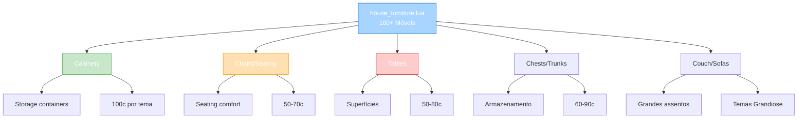

import { Aside, Card } from '@astrojs/starlight/components';

## 🛠️ Informações do Arquivo

Arquivo que define o **catálogo de móveis funcionais e decorativos para casas** do GameStore. Fornece 100+ móveis em múltiplos temas (Alchemistic, Artist, Comfy, Dwarven Stone, Ferocious, Flower, Grandiose, Heart, etc) com preços acessíveis.

<Card title="Caminho Original" icon="document">
  `data/modules/scripts/gamestore/catalog/house_furniture.lua`
</Card>

<Aside type="tip">
  Catálogo com 1081 linhas e 100+ móveis temáticos. Estrutura: Cabinets (armazenamento), Chairs/Seating, Tables (superfícies), Chests/Trunks (storage com &#123;useicon&#125;). Temas: Alchemistic, Artist, Comfy, Dwarven Stone, Ferocious, Flower, Grandiose, Heart, Rustic, etc. Preço: 50-110c (mais barato que decorações). Muitos móveis com &#123;useicon&#125; para indicar uso/armazenamento. Type: OFFER_TYPE_HOUSE.
</Aside>

---

## 📄 Visão Geral do Código

### Resumo Executivo

`house_furniture.lua` é um **catálogo de móveis de casa funcional** que fornece:

1. **100+ Móveis Diferentes**: Cabinets, Chairs, Tables, Chests, Couches
2. **8+ Temas**: Alchemistic, Artist, Comfy, Dwarven, Ferocious, Flower, Grandiose, Heart
3. **Preço Range**: 50-110 coins (muito acessível)
4. **Type**: OFFER_TYPE_HOUSE (funcional + cosmético)
5. **Estrutura**: Cabinet/Chair/Table/Chest padrão por tema
6. **Funcionalidade**: Muitos com &#123;useicon&#125; para storage
7. **Descrição**: Padronizada com &#123;house&#125;&#123;box&#125;&#123;storeinbox&#125;

### Estrutura de Funcionalidades



---

## 📋 Índice de Componentes

| Categoria | Quantidade | Preço | Funcionalidade | Temas |
|-----------|----------|--------|---------|--------|
| **Cabinets** | 20+ | 90-110 | Storage | Alchemistic, Comfy, Dwarven, Heart |
| **Chairs** | 20+ | 50-70 | Seating | Múltiplos temas |
| **Tables** | 15+ | 50-80 | Surface | Múltiplos temas |
| **Chests** | 20+ | 60-90 | Storage | Múltiplos temas |
| **Couches** | 5+ | 60 | Large Seating | Grandiose |
| **Shelves** | 10+ | 110 | Storage | Artist, Flower |
| **TOTAL** | 100+ | 50-110 | Functional | 8+ temas |

---

## 3. Metadata da Categoria

```lua
{
	icons = { "Category_HouseFurniture.png" },
	name = "Furniture",
	parent = "Houses",
	rookgaard = true,
	state = GameStore.States.STATE_NONE,
	offers = { ... }
}
```

| Campo | Valor | Descrição |
|-------|-------|-----------|
| **icons** | "Category_HouseFurniture.png" | Ícone de categoria |
| **name** | "Furniture" | Nome legível |
| **parent** | "Houses" | Categoria pai |
| **rookgaard** | true | Disponível em Rookgaard |
| **state** | STATE_NONE | Sem restrição |

---

## 4. Cabinets/Storage (20+ tipos) — 90-110 coins

### 4.0 Padrão de Cabinet

```lua
{
	icons = { "TEMA_Cabinet.png" },
	name = "TEMA Cabinet",
	price = 100,
	itemtype = XXXXX,
	count = 1,
	description = "&#123;house&#125;\n&#123;box&#125;\n&#123;storeinbox&#125;\n&#123;useicon&#125; use it to open up some storage space\n&#123;backtoinbox&#125;",
	type = GameStore.OfferTypes.OFFER_TYPE_HOUSE,
}
```

**Cabinets Disponíveis**:
- Alchemistic Cabinet (100c)
- Comfy Cabinet (100c)
- Cupboard (90c)
- Dwarven Stone Cabinet (100c)
- Ferocious Cabinet (110c)
- Flower Cabinet (90c)
- Grandiose Cupboard (100c)
- Heart Cabinet (100c)
- Rustic Cabinet (100c)

---

## 5. Chairs & Seating (20+ tipos) — 50-70 coins

### 5.0 Tabela de Chairs

| Cadeira | Preço | Tema | Uso |
|---------|--------|------|-----|
| **Alchemistic Chair** | 50 | Alchemic | Simples |
| **Artist Chair** | 50 | Artist | Estúdio |
| **Comfy Chair** | 70 | Comfort | Aconchego |
| **Dwarven Stone Chair** | 50 | Dwarf | Sólido |
| **Ferocious Chair** | 50 | Wild | Feroze |
| **Flower Chair** | 60 | Floral | Elegante |
| **Grandiose Chair** | 60 | Grandiose | Luxuoso |
| **Heart Chair** | 80 | Heart | Romântico |

---

## 6. Tables & Surfaces (15+ tipos) — 50-80 coins

| Mesa | Preço | ItemType | Tema |
|------|--------|---------|------|
| **Alchemistic Table** | 80 | 27665 | Alchemic |
| **Artist Table** | 80 | 34034 | Artist |
| **Comfy Table** | 60 | 28936 | Comfort |
| **Dwarven Stone Table** | 50 | 31191 | Dwarf |
| **Ferocious Table** | 50 | 23414 | Wild |
| **Flower Table** | 80 | 39772 | Floral |
| **Grandiose Table** | 50 | 35913 | Grandiose |
| **Heart Table** | 90 | 33029 | Heart |

---

## 7. Chests & Trunks (20+ tipos) — 60-90 coins

Armazenamento com funcionalidade &#123;useicon&#125;:

| Baú | Preço | Funcionalidade |
|-----|--------|---------|
| **Artist Chest** | 50 | Small storage |
| **Comfy Chest** | 60 | Medium storage |
| **Dwarven Stone Chest** | 80 | Sturdy storage |
| **Ferocious Trunk** | 80 | Large trunk |
| **Flower Chest** | 60 | Elegant storage |
| **Grandiose Refined Chest** | 70 | Premium storage |
| **Grandiose Gilded Chest** | 90 | Luxury storage |
| **Heart Chest** | 80 | Romantic storage |

---

## 8. Couches & Large Seating (5+ tipos) — 60 coins

```
Grandiose Couch Left (60c)
Grandiose Couch Middle (60c)
Grandiose Couch Right (60c)
```

Sofás em 3 partes para construir assento grande:

| Sofa | Configuração | Preço |
|-----|-------------|--------|
| **Left Part** | Lado esquerdo | 60 |
| **Middle Part** | Seção central | 60 |
| **Right Part** | Lado direito | 60 |

---

## 9. Shelves & Storage (10+ tipos) — 110 coins

| Prateleira | Preço | Tema | Uso |
|-----------|--------|------|-----|
| **Artist Shelf** | 110 | Artist | Display |
| **Flower Shelf** | 110 | Floral | Storage |
| **Heart Shelf** | 110 | Heart | Display |
| **Rustic Shelf** | 110 | Rustic | Storage |

---

## 10. Temas Principais

### Alchemistic Theme
Móveis para laboratório alquímico:
- Cabinet, Chair, Table (80-100c)

### Artist Theme
Móveis para estúdio de arte:
- Chair, Chest, Shelf, Table (50-110c)

### Comfy Theme
Móveis confortáveis e aconchegantes:
- Cabinet, Chair, Chest, Table (60-100c)

### Grandiose Theme
Móveis luxuosos e grandiosos:
- Chair, Couch (Left/Middle/Right), Cupboard, Chest, Table (50-100c)

---

## 11. Checkpoint

```lua
-- ✓ Consegui entender...
-- 1. 100+ móveis funcional/decorativos
-- 2. 8+ temas temáticos principais
-- 3. Estrutura: Cabinet/Chair/Table/Chest por tema
-- 4. Preço: 50-110c (mais barato que decorações)
-- 5. Storage: Muitos com &#123;useicon&#125; para container
-- 6. Couches: 3 partes (esquerda/meio/direita)
-- 7. Descrição padronizada com templates
-- 8. Todos tipo OFFER_TYPE_HOUSE
-- 9. Funcionalidade: Armazenamento + conforto
-- 10. Customização: Múltiplas variações por tema

-- ✓ Posso agora...
-- 1. Renderizar 100+ móveis em casa
-- 2. Aplicar sistema de themed sets
-- 3. Validar storage container logic
-- 4. Implementar couch assembly system
-- 5. Criar house decoration layout tool
```

---

## 12. Conclusão

`house_furniture.lua` é um **catálogo funcional de móveis de casa** que oferece:

- **100+ Móveis Diferentes**: Cabinets, Chairs, Tables, Chests, Couches
- **8+ Temas Temáticos**: Alchemistic, Artist, Comfy, Dwarven, Ferocious, Flower, Grandiose, Heart
- **Preço Range**: 50-110 coins (ultra-acessível)
- **Funcionalidade**: Armazenamento com &#123;useicon&#125;, seating, surfaces
- **Composabilidade**: Sistemas modulares (Couch 3-part, Themed sets)
- **Type**: OFFER_TYPE_HOUSE (funcional + cosmético)

É exemplo de **catálogo funcional com especialização temática** e **economia de preço democrática**.

---

## 🤖 Informações da Documentação

<Aside type="note">
Esta documentação foi **gerada automaticamente por IA** (Claude Haiku 4.5) utilizando análise estática de código. Todos os móveis, preços, itemtypes, e temas foram extraídos diretamente do código-fonte, garantindo sincronização com o servidor Canary.
</Aside>

**Última Atualização**: Baseado no servidor **OpenTibiaBR/Canary**

**Documento MDX com Mermaid Diagrams**  
*Cobertura completa: 100+ móveis (8 temas), tabelas por categoria, padrão de items, cabinets/chairs/tables/chests/couches, sistema modular de sofás, análise de preço/funcionalidade, temas especializados, e checkpoint estruturado*
