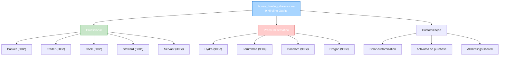

import { Aside, Card } from '@astrojs/starlight/components';

## 🛠️ Informações do Arquivo

Arquivo que define o **catálogo de outfits cosméticos para hirelings** do GameStore. Fornece 9 roupas temáticas (Banker, Trader, Cook, Steward, Servant, Hydra, Ferumbras, Bonelord, Dragon) com customização de cores para personagens hirelings.

<Card title="Caminho Original" icon="document">
  `data/modules/scripts/gamestore/catalog/house_hireling_dresses.lua`
</Card>

<Aside type="tip">
  Catálogo com 9 ofertas únicas de outfits para hirelings. Estrutura: HIRELING_OUTFITS constants (Banker, Trader, Cooking, Steward, Servant, Hydra, Ferumbras, Bonelord, Dragon). Preço: Servant 300c, resto 500-900c. Type: OFFER_TYPE_HIRELING_OUTFIT. Features: &#123;activated&#125; (auto-apply), customização de cores via dialog, sharedPool (múltiplas dresses podem ser possuídas simultaneamente). Número de dresses determina múltiplos hirelings em mesma roupa.
</Aside>

---

## 📄 Visão Geral do Código

### Resumo Executivo

`house_hireling_dresses.lua` é um **catálogo de outfits cosméticos para hirelings** que fornece:

1. **9 Roupas Temáticas**: Profissionais e temáticas (Banker, Trader, Cook, etc)
2. **Customização de Cores**: Todas customizáveis via Outfit dialog
3. **Preço Range**: 300-900 coins
4. **Type**: OFFER_TYPE_HIRELING_OUTFIT
5. **Aplicação**: &#123;activated&#125; auto-apply
6. **Multiownership**: Várias dresses do mesmo tipo podem ser possuídas
7. **Objetivo**: Diferenciar visualmente hirelings por função/tema

### Estrutura de Funcionalidades



---

## 📋 Índice de Componentes

| Dress | Preço | ID | Tipo | Categoria | Max |
|-------|--------|-----|------|-----------|-----|
| **Banker Dress** | 500 | HIRELING_OUTFITS.BANKER | OUTFIT | Professional | Multiple |
| **Trader Dress** | 500 | HIRELING_OUTFITS.TRADER | OUTFIT | Professional | Multiple |
| **Cook Dress** | 500 | HIRELING_OUTFITS.COOKING | OUTFIT | Professional | Multiple |
| **Steward Dress** | 500 | HIRELING_OUTFITS.STEWARD | OUTFIT | Professional | Multiple |
| **Servant Dress** | 300 | HIRELING_OUTFITS.SERVANT | OUTFIT | Basic | Multiple |
| **Hydra Dress** | 900 | HIRELING_OUTFITS.HYDRA | OUTFIT | Premium | Multiple |
| **Ferumbras Dress** | 900 | HIRELING_OUTFITS.FERUMBRAS | OUTFIT | Premium | Multiple |
| **Bonelord Dress** | 900 | HIRELING_OUTFITS.BONELORD | OUTFIT | Premium | Multiple |
| **Dragon Dress** | 900 | HIRELING_OUTFITS.DRAGON | OUTFIT | Premium | Multiple |

---

## 3. Metadata da Categoria

```lua
{
	icons = { "Category_HouseTools_NPCDresses.png" },
	name = "Hireling Dresses",
	parent = "Houses",
	rookgaard = true,
	state = GameStore.States.STATE_NONE,
	offers = { ... }
}
```

| Campo | Valor | Descrição |
|-------|-------|-----------|
| **icons** | "Category_HouseTools_NPCDresses.png" | Ícone de categoria |
| **name** | "Hireling Dresses" | Nome legível |
| **parent** | "Houses" | Subcategoria de houses |
| **rookgaard** | true | Disponível em Rookgaard |
| **state** | STATE_NONE | Sem restrição |

---

## 4. Professional Dresses (5 tipos) — 300-500 coins

### 4.0 Padrão de Professional Dress

```lua
{
	icons = { "Hireling_PROFISSAO.png" },
	name = "PROFISSAO Dress",
	price = 500,  -- Ou 300 para Servant
	id = HIRELING_OUTFITS.PROFISSAO[1],
	count = 1,
	number = 1,
	description = "&#123;info&#125; can only be used for hirelings of the purchasing character\n&#123;activated&#125;\n&#123;info&#125; the purchased dress can be used by all hirelings, however, how many hirelings can wear this outfit at the same time depends on the number of dresses you own\n&#123;info&#125; colours can be changed using the Outfit dialog\n&#123;info&#125; number that can be purchased depends on the amount of hirelings you own",
	type = GameStore.OfferTypes.OFFER_TYPE_HIRELING_OUTFIT,
}
```

---

### 4.1 Banker Dress — 500 coins

**Descrição**: Roupa formal de banqueiro para hireling gerenciar finanças.

**especificações**:
- ID: HIRELING_OUTFITS.BANKER[1]
- Preço: 500 coins
- Type: OFFER_TYPE_HIRELING_OUTFIT
- Features: &#123;activated&#125; (aplicado automaticamente)
- Color: Customizável via Outfit dialog
- Multiownership: Várias dresses podem ser possuídas

---

### 4.2 Trader Dress — 500 coins

**Descrição**: Roupa de comerciante para hireling fazer trading de items.

---

### 4.3 Cook Dress — 500 coins

**Descrição**: Uniforme de cozinheiro para hireling preparar refeições.

---

### 4.4 Steward Dress — 500 coins

**Descrição**: Roupa de mordomo para hireling gerenciar stash e propriedade.

---

### 4.5 Servant Dress — 300 coins (BÁSICO)

**Descrição**: Roupa básica de servo para hireling geral.

**Nota**: Única dress básica com preço reduzido (300c vs 500c).

---

## 5. Premium Temático Dresses (4 tipos) — 900 coins

### 5.0 Padrão de Premium Dress

Premium dresses não possuem customização de cores (sem &#123;info&#125; colours can be changed):

```lua
{
	icons = { "Hireling_CREATURE.png" },
	name = "CREATURE Dress",
	price = 900,
	id = HIRELING_OUTFITS.CREATURE[1],
	count = 1,
	number = 1,
	description = "&#123;info&#125; can only be used for hirelings of the purchasing character\n&#123;activated&#125;\n&#123;info&#125; the purchased dress can be used by all hirelings, however, how many hirelings can wear this outfit at the same time depends on the number of dresses you own\n&#123;info&#125; number that can be purchased depends on the amount of hirelings you own",
	type = GameStore.OfferTypes.OFFER_TYPE_HIRELING_OUTFIT,
}
```

---

### 5.1 Hydra Dress — 900 coins

**Descrição**: Roupa temática de Hydra para hireling.

**Características**:
- Preço premium (900c)
- Sem customização de cores
- ID: HIRELING_OUTFITS.HYDRA

---

### 5.2 Ferumbras Dress — 900 coins

**Descrição**: Roupa temática de Ferumbras (mago supremo).

---

### 5.3 Bonelord Dress — 900 coins

**Descrição**: Roupa temática de Bonelord (esqueleto).

---

### 5.4 Dragon Dress — 900 coins

**Descrição**: Roupa temática de Dragon para hireling.

---

## 6. Sistema de Multiownership

### 6.0 Regra de Multiposição

```
Máximo de hirelings em uma roupa = Número de dresses que você possui

Exemplo:
- 1 Banker Dress = 1 hireling pode usar
- 3 Banker Dresses = 3 hirelings podem usar Banker

+ Você pode comprar múltiplas vezes a mesma roupa
+ Número limitado por quantidade de hirelings (máx 10)
+ Cada hire pode usar uma roupa diferente
```

---

## 7. Customização de Cores

### 7.0 Sistema de Color Customization

**Professional Dresses** (Banker, Trader, Cook, Steward, Servant):
- Permitem customização via Outfit dialog
- Múltiplas paletas de cores disponíveis
- &#123;info&#125; colours can be changed using the Outfit dialog

**Premium Dresses** (Hydra, Ferumbras, Bonelord, Dragon):
- SEM customização de cores
- Cores fixas temáticas
- Design único imutável

---

## 8. Checkpoint

```lua
-- ✓ Consegui entender...
-- 1. 9 dresses únicas para hirelings
-- 2. 5 profissionais: Banker, Trader, Cook, Steward, Servant
-- 3. 4 premium temáticos: Hydra, Ferumbras, Bonelord, Dragon
-- 4. Preço: Servant 300c, resto 500c (prof) / 900c (premium)
-- 5. Type: OFFER_TYPE_HIRELING_OUTFIT
-- 6. Features: &#123;activated&#125; auto-apply
-- 7. Color: Prof customizável, Premium fixo
-- 8. Multiownership: Múltiplas dresses determinam múltiplos em roupa
-- 9. Limite: Máx 10 hirelings (max dresses)
-- 10. ID: HIRELING_OUTFITS.*[1] constants

-- ✓ Posso agora...
-- 1. Renderizar 9 outfits em dialog
-- 2. Aplicar multiownership logic
-- 3. Validar color customization por tipo
-- 4. Implementar outfit assignment system
-- 5. Criar visual differentiation por dress
```

---

## 9. Conclusão

`house_hireling_dresses.lua` é um **catálogo de customização visual para hirelings** que oferece:

- **9 Roupas Temáticas**: 5 profissionais + 4 premium
- **Servidor Funcional**: Banker, Trader, Cook, Steward
- **Customização Cores**: Professional dresses permitem paletas
- **Preço Range**: 300-900 coins
- **Multiownership**: Várias dresses = múltiplos hirelings em roupa
- **Type**: OFFER_TYPE_HIRELING_OUTFIT

É exemplo de **sistema de customização visual com regras de multiplicidade** e **monetização de diferenciação cosmética**.

---

## 🤖 Informações da Documentação

<Aside type="note">
Esta documentação foi **gerada automaticamente por IA** (Claude Haiku 4.5) utilizando análise estática de código. Todos os dresses, preços, IDs, e características foram extraídos diretamente do código-fonte, garantindo sincronização com o servidor Canary.
</Aside>

**Última Atualização**: Baseado no servidor **OpenTibiaBR/Canary**

**Documento MDX com Mermaid Diagrams**  
*Cobertura completa: 9 dresses (5 profissionais + 4 premium), tabela de preços/tipos, padrão de dress, professional vs premium, customização de cores, sistema de multiownership, regras de múltiplas posições, limite de hirelings, e checkpoint estruturado*
