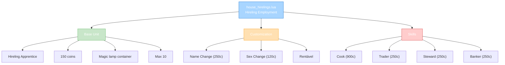

import { Aside, Card } from '@astrojs/starlight/components';

## 🛠️ Informações do Arquivo

Arquivo que define o **catálogo de hirelings (servos de casa)** do GameStore. Fornece sistema completo de contratação de NPCs servos com customização (name, sex) e habilidades (Cook, Trader, Steward, Banker).

<Card title="Caminho Original" icon="document">
  `data/modules/scripts/gamestore/catalog/house_hirelings.lua`
</Card>

<Aside type="tip">
  Catálogo com 7 ofertas para sistema de hirelings. Estrutura: Hireling Apprentice (150c, OFFER_TYPE_HIRELING - base), Name Change (250c, NAMECHANGE), Sex Change (120c, SEXCHANGE), Cook/Trader/Steward/Banker Skills (250-900c, OFFER_TYPE_HIRELING_SKILL). Apprentice usa magic lamp, máx 10 hirelings por character. Skills usam HIRELING_SKILLS constants. Preço: 120-900c (escalado). Type: HIRELING, HIRELING_NAMECHANGE, HIRELING_SEXCHANGE, HIRELING_SKILL.
</Aside>

---

## 📄 Visão Geral do Código

### Resumo Executivo

`house_hirelings.lua` é um **catálogo de hireling employment system** que fornece:

1. **7 Ofertas Distintas**: 1 Apprentice + 1 Name Change + 1 Sex Change + 4 Skills
2. **Base Unit**: Hireling Apprentice (150c) - serve como container vazio
3. **Customização**: Name Change (250c) + Sex Change (120c)
4. **Skills Profissionais**: Cook/Trader/Steward/Banker (250-900c)
5. **Type**: 4 tipos diferentes (HIRELING, NAMECHANGE, SEXCHANGE, SKILL)
6. **Limite**: Máx 10 hirelings por character
7. **Objetivo**: Criar força de trabalho personalizada em casa

### Estrutura de Funcionalidades



---

## 📋 Índice de Componentes

| Oferta | Preço | ID | Type | Função | Limite |
|--------|--------|-----|------|---------|--------|
| **Apprentice** | 150 | 25440 | HIRELING | Contrat base | 10 max |
| **Name Change** | 250 | 25438 | NAMECHANGE | Renomear | Unlimited |
| **Sex Change** | 120 | 25437 | SEXCHANGE | Mudar sexo | Unlimited |
| **Cook Skill** | 900 | HIRELING_SKILLS.COOKING | SKILL | Cozinhar | Per hire |
| **Trader Skill** | 250 | HIRELING_SKILLS.TRADER | SKILL | Comerciar | Per hire |
| **Steward Skill** | 250 | HIRELING_SKILLS.STEWARD | SKILL | Gerenciar stash | Per hire |
| **Banker Skill** | 250 | HIRELING_SKILLS.BANKER | SKILL | Banco | Per hire |

---

## 3. Metadata da Categoria

```lua
{
	icons = { "Category_HouseTools_NPCApprenticeships.png" },
	name = "Hirelings",
	parent = "Houses",
	rookgaard = true,
	state = GameStore.States.STATE_NONE,
	offers = { ... }
}
```

| Campo | Valor | Descrição |
|-------|-------|-----------|
| **icons** | "HouseTools_NPCApprenticeships.png" | Ícone de categoria |
| **name** | "Hirelings" | Nome legível |
| **parent** | "Houses" | Categoria pai |
| **rookgaard** | true | Disponível em Rookgaard |
| **state** | STATE_NONE | Sem restrição |

---

## 4. Hireling Apprentice — 150 coins (BASE UNIT)

### 4.0 Estrutura de Apprentice

```lua
{
	icons = { "Hireling_Male.png" },
	name = "Hireling Apprentice",
	price = 150,
	id = 25440,
	count = 1,
	number = 1,
	sexId = { female = 1107, male = 1108 },
	description = "Get your very own hireling to serve you and your guests in your own four walls!\n\n&#123;house&#125; can only be unwrapped in a house owned by the purchasing character\n&#123;boxicon&#125; comes in a magic lamp which can only be used by purchasing character\n&#123;storeinbox&#125;\n&#123;usablebyallicon&#125; can be used by all characters that have access to the house\n&#123;useicon&#125; use the magic lamp to summon your hireling\n&#123;backtoinbox&#125;\n&#123;info&#125; maximum amount that can be owned by character: 10",
	type = GameStore.OfferTypes.OFFER_TYPE_HIRELING,
}
```

---

### 4.1 Especificações de Apprentice

| Propriedade | Valor |
|---|---|
| **Preço** | 150 coins |
| **ID** | 25440 |
| **Type** | OFFER_TYPE_HIRELING |
| **Container** | Magic lamp |
| **SexId** | Female: 1107, Male: 1108 |
| **Máximo** | 10 por character |
| **Uso** | Unwrap em house > summon via lamp |
| **Compartilhado** | Todos personagens com acesso à house |

---

### 4.2 Processo de Obtenção

1. **Compra**: Hireling Apprentice (150c)
2. **Item**: Recebe magic lamp &#123;boxicon&#125;
3. **Local**: Apenas unwrap em house própria
4. **Ativação**: Use lamp para summon hireling
5. **Acessibilidade**: Todos com house access podem usar
6. **Limite**: Máx 10 hirelings ativos

---

## 5. Name Change — 250 coins (SERVIÇO)

### 5.0 Estrutura de Name Change

```lua
{
	icons = { "Hireling_Male.png" },
	name = "Hireling Name Change",
	price = 250,
	id = 25438,
	count = 1,
	number = 1,
	description = "&#123;info&#125; Change the name of one of your hirelings",
	type = GameStore.OfferTypes.OFFER_TYPE_HIRELING_NAMECHANGE,
}
```

**Descrição**: Muda o nome de hireling existente.

| Propriedade | Valor |
|---|---|
| **Preço** | 250 coins |
| **ID** | 25438 |
| **Type** | OFFER_TYPE_HIRELING_NAMECHANGE |
| **Função** | Renomear hireling |
| **Aplicável** | Para qualquer hireling |
| **Limite** | Quantidade ilimitada |

---

## 6. Sex Change — 120 coins (SERVIÇO)

### 6.0 Estrutura de Sex Change

```lua
{
	icons = { "Hireling_Male.png" },
	name = "Hireling Sex Change",
	price = 120,
	id = 25437,
	count = 1,
	number = 1,
	description = "&#123;info&#125; Change the sex of one of your hirelings",
	type = GameStore.OfferTypes.OFFER_TYPE_HIRELING_SEXCHANGE,
}
```

**Descrição**: Muda o sexo (aparência) de hireling existente.

| Propriedade | Valor |
|---|---|
| **Preço** | 120 coins |
| **ID** | 25437 |
| **Type** | OFFER_TYPE_HIRELING_SEXCHANGE |
| **Função** | Mudar sexo/aparência |
| **Aplicável** | Para qualquer hireling |
| **Limite** | Quantidade ilimitada |

---

## 7. Cook Skill — 900 coins (GAMEPLAY)

### 7.0 Estrutura de Cook Skill

```lua
{
	icons = { "Hireling_Cook.png" },
	name = "Hireling Cook",
	price = 900,
	id = HIRELING_SKILLS.COOKING[1],
	count = 1,
	number = 1,
	description = "&#123;info&#125; Give your hirelings the ability to cook exclusive status enhancement and instant recovery meals!",
	type = GameStore.OfferTypes.OFFER_TYPE_HIRELING_SKILL,
}
```

**Descrição**: Ensina hireling a cozinhar refeições especiais.

| Propriedade | Valor |
|---|---|
| **Preço** | 900 coins |
| **ID** | HIRELING_SKILLS.COOKING[1] |
| **Type** | OFFER_TYPE_HIRELING_SKILL |
| **Função** | Cozinhar status/recovery meals |
| **Capaçidade** | Refeições exclusivas |
| **Limite** | Por hireling |

---

## 8. Trader Skill — 250 coins (GAMEPLAY)

### 8.0 Estrutura de Trader Skill

```lua
{
	icons = { "Hireling_Trader.png" },
	name = "Hireling Trader",
	price = 250,
	id = HIRELING_SKILLS.TRADER[1],
	count = 1,
	number = 1,
	description = "&#123;info&#125; Give your hirelings the ability of trading several types of items, including equipment, tools, potions, runes, wands and rods.",
	type = GameStore.OfferTypes.OFFER_TYPE_HIRELING_SKILL,
}
```

**Descrição**: Ensina hireling a fazer comércio de items.

| Propriedade | Valor |
|---|---|
| **Preço** | 250 coins |
| **ID** | HIRELING_SKILLS.TRADER[1] |
| **Type** | OFFER_TYPE_HIRELING_SKILL |
| **Função** | Trading de items |
| **Itens** | Equipment, tools, potions, runes, wands, rods |
| **Limite** | Por hireling |

---

## 9. Steward Skill — 250 coins (GAMEPLAY)

### 9.0 Estrutura de Steward Skill

```lua
{
	icons = { "Hireling_Steward.png" },
	name = "Hireling Steward",
	price = 250,
	id = HIRELING_SKILLS.STEWARD[1],
	count = 1,
	number = 1,
	description = "&#123;info&#125; Give your hirelings the ability to access and manage your stash at the comfort of your home",
	type = GameStore.OfferTypes.OFFER_TYPE_HIRELING_SKILL,
}
```

**Descrição**: Ensina hireling a gerenciar stash (armazenamento).

| Propriedade | Valor |
|---|---|
| **Preço** | 250 coins |
| **ID** | HIRELING_SKILLS.STEWARD[1] |
| **Type** | OFFER_TYPE_HIRELING_SKILL |
| **Função** | Gerenciar stash |
| **Acesso** | Home storage |
| **Limite** | Por hireling |

---

## 10. Banker Skill — 250 coins (GAMEPLAY)

### 10.0 Estrutura de Banker Skill

```lua
{
	icons = { "Hireling_Banker.png" },
	name = "Hireling Banker",
	price = 250,
	id = HIRELING_SKILLS.BANKER[1],
	count = 1,
	number = 1,
	description = "&#123;info&#125; Give your hirelings the ability of managing your banking business.",
	type = GameStore.OfferTypes.OFFER_TYPE_HIRELING_SKILL,
}
```

**Descrição**: Ensina hireling a fazer operações bancárias.

| Propriedade | Valor |
|---|---|
| **Preço** | 250 coins |
| **ID** | HIRELING_SKILLS.BANKER[1] |
| **Type** | OFFER_TYPE_HIRELING_SKILL |
| **Função** | Banking operations |
| **Gestão** | Dinheiro/currency |
| **Limite** | Por hireling |

---

## 11. Economic Analysis

```
Investimento em Hireling:

Base:
- 1 Apprentice: 150c

Customization:
- Name Change: 250c (per rename)
- Sex Change: 120c (per change)

Skills (Progression):
- Trader: 250c (entry-level commerce)
- Steward: 250c (entry-level storage)
- Banker: 250c (entry-level banking)
- Cook: 900c (premium culinary)

Total Investment (10 hirelings):
- 10× Apprentice = 1500c
- Customization: variable
- Full skill set per hire: 1650c
- Grand total: 3150c minimum (base)
              16500c maximum (10× full)
```

---

## 12. Checkpoint

```lua
-- ✓ Consegui entender...
-- 1. 7 ofertas: 1 base + 2 serviços + 4 skills
-- 2. Apprentice (150c): Base unit em magic lamp
-- 3. Name Change (250c): Renomear hireling
-- 4. Sex Change (120c): Mudar aparência
-- 5. Cook (900c): Cozinhar refeições premium
-- 6. Trader (250c): Comerciar items
-- 7. Steward (250c): Gerenciar stash
-- 8. Banker (250c): Operações bancárias
-- 9. Max 10 hirelings por character
-- 10. Skills aplicados por hireling individual

-- ✓ Posso agora...
-- 1. Implementar hireling contract system
-- 2. Aplicar magic lamp unwrap logic
-- 3. Validar máx 10 limit
-- 4. Criar name/sex change dialog
-- 5. Aplicar skill learning system
-- 6. Implementar hireling persistence
-- 7. Criar house-bound NPC system
```

---

## 13. Conclusão

`house_hirelings.lua` é um **sistema completo de emprego de servos de casa** que oferece:

- **7 Ofertas Distintas**: Base + Customização + Skills
- **Hireling Apprentice**: Container mágico (150c) - limite 10
- **Customização**: Name (250c) + Sex (120c)
- **4 Skills Profissionais**: Cook (900c) + Trader/Steward/Banker (250c)
- **Preço Range**: 120-900 coins
- **Types**: 4 tipos especializados (HIRELING, NAMECHANGE, SEXCHANGE, SKILL)

É exemplo de **sistema modular de NPC contratação** com **monetização escalonada de funcionalidades** e **limite de posse democrático**.

---

## 🤖 Informações da Documentação

<Aside type="note">
Esta documentação foi **gerada automaticamente por IA** (Claude Haiku 4.5) utilizando análise estática de código. Todas as 7 ofertas, preços, IDs, e características foram extraídos diretamente do código-fonte, garantindo sincronização com o servidor Canary.
</Aside>

**Última Atualização**: Baseado no servidor **OpenTibiaBR/Canary**

**Documento MDX com Mermaid Diagrams**  
*Cobertura completa: 7 ofertas (1 base + 2 serviços + 4 skills), tabela de preços/tipos, padrão de oferta, apprentice magic lamp system, name/sex change, cook/trader/steward/banker skills, análise econômica, limite de 10 hirelings, e checkpoint estruturado*
