import { Aside, Card } from '@astrojs/starlight/components';

## 🛠️ Informações do Arquivo

Arquivo que define o **catálogo de melhorias funcionais para casas** do GameStore. Fornece 9 ofertas de estruturas interativas que adicionam funcionalidade às propriedades do jogador: santuários de recompensas diárias, shrines de imbuição, dummies de exercício especializados e caixas de correio.

<Card title="Caminho Original" icon="document">
  `data/modules/scripts/gamestore/catalog/house_upgrades.lua`
</Card>

<Aside type="tip">
  Arquivo de melhorias funcionais com 9 ofertas distintas. Inclui Daily Reward Shrine (150c), Exercise Dummies Expert (900c: Demon, Ferumbras, Monk), Imbuing Shrines (150-200c: padrão e dourada), Mailbox (150-200c: padrão e ornamentado). Todas as estruturas são OFFER_TYPE_HOUSE com suporte &#123;house&#125; &#123;box&#125; &#123;storeinbox&#125; &#123;usablebyall&#125; &#123;backtoinbox&#125;.
</Aside>

---

## 📄 Visão Geral do Código

### Resumo Executivo

`house_upgrades.lua` é um catálogo de **melhorias funcionais para casas** que fornece:

1. **9 Ofertas Funcionais**: Estruturas interativas para casas
2. **4 Categorias**: Santuários de Recompensas, Dummies de Exercício, Shrines de Imbuição, Caixas de Correio
3. **Preço Range**: 150-900 coins (escalado por funcionalidade)
4. **Type**: OFFER_TYPE_HOUSE (funcional, não cosmético)
5. **Funcionalidades**: Recompensas diárias, Treinamento de habilidade, Imbuição, Correio
6. **Descrição**: Padronizada com &#123;house&#125; &#123;box&#125; &#123;storeinbox&#125; &#123;usablebyall&#125; &#123;useicon&#125; &#123;backtoinbox&#125;

### Estrutura de Funcionalidades

```mermaid
graph TD
    A["house_upgrades.lua<br/>9 Melhorias Funcionais"] --> B["Santuários de Recompensas"]
    A --> C["Dummies de Exercício"]
    A --> D["Shrines de Imbuição"]
    A --> E["Caixas de Correio"]
    
    B --> B1["Daily Reward Shrine (150c)"]
    B --> B2["Shiny Reward Shrine (200c)"]
    B --> B3["Funcionalidade: Coletar recompensas diárias"]
    
    C --> C1["Demon Dummy (900c)"]
    C --> C2["Ferumbras Dummy (900c)"]
    C --> C3["Monk Dummy (900c)"]
    C --> C4["Funcionalidade: Treinar habilidades em casa"]
    C --> C5["Uso exclusivo: 1 personagem por vez"]
    
    D --> D1["Imbuing Shrine (150c)"]
    D --> D2["Gilded Imbuing Shrine (200c)"]
    D --> D3["Funcionalidade: Imbuir itens em casa"]
    
    E --> E1["Mailbox (150c)"]
    E --> E2["Ornate Mailbox (200c)"]
    E --> E3["Funcionalidade: Enviar cartas/pacotes"]
    
    style A fill:#a8d5ff,stroke:#0066cc,color:#fff
    style B fill:#fff9c4,stroke:#fbc02d,color:#000
    style C fill:#ffcccc,stroke:#d32f2f,color:#fff
    style D fill:#c8e6c9,stroke:#4caf50,color:#fff
    style E fill:#e1bee7,stroke:#9c27b0,color:#fff
```

---

## 📋 Índice de Componentes

| Nome | Categoria | Preço | ItemType | Funcionalidade |
|------|-----------|--------|----------|-----------------|
| **Daily Reward Shrine** | Santuários | 150c | 25721 | Coletar recompensa diária |
| **Shiny Daily Reward Shrine** | Santuários | 200c | 25723 | Coletar recompensa diária (Premium) |
| **Demon Exercise Dummy** | Dummies | 900c | 28561 | Treinar habilidades Expert |
| **Ferumbras Exercise Dummy** | Dummies | 900c | 28559 | Treinar habilidades Expert |
| **Monk Exercise Dummy** | Dummies | 900c | 28563 | Treinar habilidades Expert |
| **Imbuing Shrine** | Imbuição | 150c | 25175 | Imbuir itens |
| **Gilded Imbuing Shrine** | Imbuição | 200c | 25183 | Imbuir itens (Premium) |
| **Mailbox** | Correio | 150c | 23399 | Enviar cartas/pacotes |
| **Ornate Mailbox** | Correio | 200c | 23401 | Enviar cartas/pacotes (Premium) |

---

## 🌟 Categorias de Melhorias

### 1️⃣ Santuários de Recompensas Diárias

As estruturas de santuário permitem que o jogador colete suas recompensas diárias confortavelmente em sua casa, sem necessidade de ir a uma localização específica no mundo.

**Variações**:
- **Daily Reward Shrine** (150c, ItemType: 25721): Versão padrão, funcional
- **Shiny Daily Reward Shrine** (200c, ItemType: 25723): Versão premium com aparência dourada

**Especificações**:
- Type: OFFER_TYPE_HOUSE
- Count: 1 unidade
- Storage: Pode ser armazenado em caixa
- Uso: Não restrito (usablebyall)
- Interação: Use-icon para abrir a parede de recompensas

### 2️⃣ Exercise Dummies (Dummies de Treino)

Estruturas especializadas de treinamento que permitem ao jogador treinar suas habilidades (Magia, Espada, Lança, Distância) em casa, com eficiência equivalente ao treinamento em áreas públicas.

**Variações - Temas Especializados**:
- **Demon Exercise Dummy** (900c, ItemType: 28561): Tema demoníaco
- **Ferumbras Exercise Dummy** (900c, ItemType: 28559): Tema de Ferumbras (boss)
- **Monk Exercise Dummy** (900c, ItemType: 28563): Tema monge

**Especificações Técnicas**:
- Type: OFFER_TYPE_HOUSE
- Count: 1 unidade
- Restricão: Podem ser usados por apenas **um personagem por vez** (mecanismo de lock)
- Storage: Pode ser armazenado em caixa
- Uso: Use-icon com uma arma de exercício apropriada
- Eficiência: Treinamento expert-level (superior ao público)

### 3️⃣ Imbuing Shrines (Santuários de Imbuição)

Estruturas que permitem ao jogador imbuir itens em sua casa, removendo a necessidade de visitar um NPC ou localização específica para enhançar equipamentos.

**Variações**:
- **Imbuing Shrine** (150c, ItemType: 25175): Versão padrão
- **Gilded Imbuing Shrine** (200c, ItemType: 25183): Versão premium dourada

**Especificações**:
- Type: OFFER_TYPE_HOUSE
- Count: 1 unidade
- Storage: Pode ser armazenado em caixa
- Uso: Use-icon com item imbuível para abrir dialog de imbuição
- Funcionalidade: Interface completa de imbuição (potência, duração, remoção)

### 4️⃣ Mailboxes (Caixas de Correio)

Estruturas de correspondência que permitem ao jogador enviar cartas e pacotes diretamente de sua casa para outros jogadores, sem necessidade de visitar NPCs de correio na cidade.

**Variações**:
- **Mailbox** (150c, ItemType: 23399): Caixa de correio padrão
- **Ornate Mailbox** (200c, ItemType: 23401): Caixa ornamentada premium

**Especificações**:
- Type: OFFER_TYPE_HOUSE
- Count: 1 unidade
- Storage: Pode ser armazenado em caixa
- Uso: Use-icon para abrir interface de envio de correspondência
- Funcionalidade: Enviar cartas, parcelas e items para outros players

---

## 📊 Analise Econômica

### Catálogo de Preços

**Faixa Baixa (150-200c)**: Estruturas utilitárias essenciais
- Daily Reward Shrine: 150c (mais acessível)
- Shiny Daily Reward Shrine: 200c (+33% para aparência)
- Imbuing Shrine: 150c (essencial para crafting)
- Gilded Imbuing Shrine: 200c (+33% para aparência)
- Mailbox: 150c (comunicação)
- Ornate Mailbox: 200c (+33% para aparência)

**Faixa Alta (900c)**: Estruturas de treinamento avançado
- Demon Exercise Dummy: 900c
- Ferumbras Exercise Dummy: 900c
- Monk Exercise Dummy: 900c

### Padrão de Preço Premium

**Premium Cosmético**: +33% de preço (padrão → dourado/ornamentado)
- 150c → 200c (add gold appearance)
- Aplicável em: Shrines, Mailboxes

**Premium Temático**: Preço fixo 900c (tema diferente sem variação funcional)
- Dummies possuem mesma funcionalidade, apenas tema visual diferente
- Permite coleção completa de temas por 2700c

---

## 🔧 Variáveis e Função de Retorno

### Estrutura de Dados

A categoria retorna uma tabela Lua contendo:

- **icons**: Array com ícone PNG da categoria
- **name**: String "Upgrades" (exibido em UI)
- **parent**: String "Houses" (referência a categoria pai)
- **rookgaard**: Boolean true (disponível em Rookgaard)
- **state**: Constant GameStore.States.STATE_NONE (sem restrições)
- **offers**: Array com 9 ofertas (estruturas individuais de melhoria)

### Campos de Metadata

| Campo | Tipo | Valor | Descrição |
|-------|------|-------|-----------|
| icons | table | { "Category_HouseUpgrades.png" } | Ícone da categoria |
| name | string | "Upgrades" | Nome exibido em UI |
| parent | string | "Houses" | Categoria pai (parent_categories.lua) |
| rookgaard | boolean | true | Disponível em Rookgaard |
| state | constant | GameStore.States.STATE_NONE | Estado padrão (sem restrições) |
| offers | table | Array de ofertas (9) | Lista de melhorias disponíveis |

### Estrutura de Oferta (Offer)

Cada oferta (melhoria) contém:

- **icons**: Array com ícone PNG do item
- **name**: String com nome exibido
- **price**: Number com preço em coins
- **itemtype**: Number com ID do item Tibia
- **count**: Number com quantidade padrão (sempre 1)
- **description**: String HTML com descrição da melhoria
- **type**: Constant GameStore.OfferTypes.OFFER_TYPE_HOUSE

### Templates de Descrição

Todos os templates utilizados em descrição devem ser escapados fora de blocos lua:

| Template | Significado | HTML Escaping |
|----------|-----------|----------------|
| &#123;house&#125; | Utilizável em casa | ✅ Escapado |
| &#123;box&#125; | Armazenável em caixa | ✅ Escapado |
| &#123;storeinbox&#125; | Pode ser guardado | ✅ Escapado |
| &#123;usablebyall&#125; | Todos podem usar | ✅ Escapado |
| &#123;useicon&#125; | Use-icon necessário | ✅ Escapado |
| &#123;info&#125; | Informação adicional | ✅ Escapado |
| &#123;backtoinbox&#125; | Retorna à caixa | ✅ Escapado |

---

## ✅ Checkpoint de Aprendizagem

### Conceitos Principais

1. **OFFER_TYPE_HOUSE**: Tipo de oferta para estruturas de casas funcionais (diferente de decoração)
2. **Múltiplas Variações**: Exercise Dummies possuem 3 temas com mesmo preço (900c)
3. **Premium Cosmético**: AddOns dourados/ornamentados = +33% de preço
4. **Restricões de Uso**: Dummies só podem ser usados por 1 personagem por vez
5. **Templates em Descrições**: Necessário HTML escape (&#123;&#125;) para templates fora de lua blocks

### Padrões de Design

- **Santuários**: Conveniência (recompensas diárias, imbuição)
- **Dummies**: Treinamento avançado (habilidades 2x mais eficientes)
- **Mailbox**: Comunicação (cartas e parcelas)
- **Preço**: Utilitários (150-200c), Treinamento (900c)

---

## 📚 Conclusão

O arquivo `house_upgrades.lua` compõe um **catálogo estratégico de melhorias funcionais** para casas que equilibram:

- **Conveniência**: Acesso a sistemas principais (recompensas, imbuição, correio) dentro de casa
- **Treinamento**: Dummies expert-level para maximizar skill training em casa
- **Preço**: Faixa 150-900c, escalado por funcionalidade e tema
- **Acessibilidade**: Disponível desde Rookgaard

Complementa perfeitamente com `house_decorations.lua` (cosméticos) e `house_furniture.lua` (funcionais básicos) para oferecer sistema completo de customização residencial.

---

## 🤖 Informações da Documentação

<Card title="Metadata da Documentação" icon="star">
  - **Arquivo Original**: house_upgrades.lua
  - **Caminho**: data/modules/scripts/gamestore/catalog/
  - **Tipo**: Catalogação de ofertas (GameStore)
  - **Última Atualização**: 2026-02-19
  - **Status**: ✅ Completo
  - **Linhas de Código**: ~170 linhas
  - **Ofertas Documentadas**: 9 estruturas
  - **Categoria**: Houses / Upgrades
</Card>

<Aside type="note">
  **Nota de Manutenção**: Este arquivo é parte do módulo de catálogo do GameStore. Qualquer adição de novas estruturas de casa deve manter: (1) Estrutura de metadata idêntica, (2) Descrições com templates apropriados, (3) Validação de itemtypes em Tibia.xml, (4) Preço proporcional à funcionalidade oferecida.
</Aside>
