import { Aside, Card } from '@astrojs/starlight/components';

## 🛠️ Informações do Arquivo

Arquivo **orchestrador central** do sistema de catálogo do GameStore. Responsável por carregar e validar todos os módulos de ofertas disponíveis, integrando categorias principais e subcategorias através de um sistema modular dinâmico.

<Card title="Caminho Original" icon="document">
  `data/modules/scripts/gamestore/catalog/init.lua`
</Card>

<Aside type="tip">
  Módulo de inicialização que carrega 25 módulos de catálogo (consumables, cosmetics, houses, extras, tournament) com suporte a categorias inline e subcategorias. Valida estrutura de cada oferta, previne erros de carregamento, integra parent_categories.lua para organização hierárquica de categorias. Sistema robusto com error handling completo.
</Aside>

---

## 📄 Visão Geral do Código

### Resumo Executivo

`init.lua` é o **módulo orchestrador do catálogo GameStore** que:

1. **Carrega 25 Módulos**: Lista para dinâmica de extensibilidade
2. **Valida Estruturas**: Type-checking de `offers` e `subclasses` tables
3. **Sistema Modular**: Suporte a categorias inline (parent_categories.lua) e standalone
4. **Integração Hierárquica**: Mapeia categorias pais → subcategorias → ofertas
5. **Error Handling**: Validação rigorosa com mensagens de erro descritivas
6. **Retorno**: Array único de categorias unificadas

### Estrutura de Funcionalidades

```mermaid
graph TB
    A["init.lua<br/>Orchestrador Central"] --> B["Módulos do Catálogo"]
    A --> C["parent_categories.lua"]
    A --> D["Validação"]
    A --> E["Retorno Unificado"]
    
    B --> B1["Premium Time"]
    B --> B2["Consumables + 6 subcategorias"]
    B --> B3["Cosmetics + 2 subcategorias"]
    B --> B4["Houses + 5 subcategorias"]
    B --> B5["Extras + 2 subcategorias"]
    B --> B6["Tournament + 2 subcategorias"]
    
    C --> C1["Consumables (inline)"]
    C --> C2["Cosmetics (inline)"]
    C --> C3["Houses (inline)"]
    C --> C4["Extras (inline)"]
    C --> C5["Tournament (inline)"]
    
    D --> D1["Type Validation: offers"]
    D --> D2["Type Validation: subclasses"]
    D --> D3["Metadata Validation"]
    D --> D4["Error Messages"]
    
    E --> E1["catalog = Array"]
    E --> E2["Ordem de Carregamento"]
    E --> E3["Pronto para GameStore UI"]
    
    style A fill:#4285f4,stroke:#0066cc,color:#fff
    style B fill:#5f9ea0,stroke:#2b7a78,color:#fff
    style C fill:#a8e6cf,stroke:#4caf50,color:#fff
    style D fill:#ffb347,stroke:#ff9800,color:#fff
    style E fill:#c284e6,stroke:#9c27b0,color:#fff
```



---

## 📋 Índice de Componentes

| Seção | Elementos | Responsabilidade |
|-------|-----------|------------------|
| **Módulos de Catálogo** | 25 strings | Lista de módulos a carregar |
| **Carregamento Dinâmico** | dofile() loops | Integração de cada módulo |
| **Validação de Ofertas** | Type-checking | Previne erros em categories |
| **Validação de Subclasses** | Type-checking | Previne erros em hierarchies |
| **Validação de Metadata** | Required fields | Garante estrutura correta |
| **Construção de Catálogo** | table.insert() | Monta array final |
| **Retorno** | catalog array | Estrutura unificada |

---

## 🔄 Fluxo de Carregamento do Catálogo

### Fase 1: Definição de Módulos

A lista de módulos define os 25 arquivos de catálogo que serão carregados:

**Módulos Principais**:
- `premium_time` - Ofertas de Premium/VIP
- `consumables` - Categoria pai de consumíveis
- `cosmetics` - Categoria pai de cosméticos
- `house` - Categoria pai de residenciais
- `extras` - Categoria pai de extras
- `tournament` - Categoria pai de torneios

**Subcategorias Consumables** (6): blessings, casks, exercise_weapons, kegs, potions, runes

**Subcategorias Cosmetics** (2): mounts, outfits

**Subcategorias Houses** (5): decorations, furniture, upgrades, hirelings, hireling_dresses

**Subcategorias Extras** (2): extras_services, usefull_things

**Subcategorias Tournament** (2): tickets, exclusive_offers


**Lista Completa (25 módulos)**:
1. `premium_time` - Premium/VIP offerings
2. `consumables` - Subcategoria pai
3. `consumables_blessings` - Bênçãos
4. `consumables_casks` - Barris
5. `consumables_exercise_weapons` - Armas de exercício
6. `consumables_kegs` - Barris de cerveja
7. `consumables_potions` - Poções
8. `consumables_runes` - Runas mágicas
9. `cosmetics` - Subcategoria pai
10. `cosmetics_mounts` - Montarias
11. `cosmetics_outfits` - Roupas
12. `house` - Subcategoria pai
13. `house_decorations` - Decorações
14. `house_furniture` - Móveis
15. `beds` - Camas
16. `house_upgrades` - Melhorias
17. `house_hirelings` - Contratados
18. `house_hireling_dresses` - Roupas de contratados
19. `boost` - Boosts/buffs
20. `extras` - Subcategoria pai
21. `extras_extras_services` - Serviços extras
22. `extras_usefull_things` - Coisas úteis
23. `tournament` - Subcategoria pai
24. `tournament_tickets` - Ingressos
25. `tournament_exclusive_offers` - Ofertas exclusivas

### Fase 2: Carregamento de Categorias Inline

O arquivo `parent_categories.lua` contém 5 categorias definidas inline (sem arquivos separados):

**Categorias Inline Carregadas**:
- Consumables pai (com 6 subclasses)
- Cosmetics pai (com 2 subclasses)
- Houses pai (com 5 subclasses)
- Extras pai (com 2 subclasses)
- Tournament pai (com 2 subclasses)

Esta abordagem centraliza a hierarquia de categorias em um único arquivo.


### Fase 3: Iteração e Carregamento Dinâmico

Para cada módulo na lista:
1. Verifica se existe em categorias inline (parent_categories.lua)
2. Se não existir, carrega arquivo `.lua` correspondente via dofile()
3. Executa validações estruturais
4. Insere categoria no array de catálogo

Este padrão permite hierarquia flexível (inline + standalone files).


### Fase 4: Validações Estruturais

**Validação 1: Offers Table**
- Verifica se `category.offers` existe e é uma table válida
- Erro se: offers é string, number, ou outro tipo inválido

**Validação 2: Subclasses Table**
- Verifica se `category.subclasses` existe e é uma table válida
- Erro se: subclasses é string, number, ou outro tipo inválido

**Validação 3: Metadata Requirements**
- Requerido: `name` (non-empty string)
- Requerido: `rookgaard` (boolean: true/false)
- Requerido: EITHER `offers` OR `subclasses` (não ambos vazios)

Qualquer falha na validação gera erro fatal no startup.


### Fase 5: Retorno Unificado

O resultado final é um array de 25+ categorias unificadas, pronto para integração com UI do GameStore.

Cada elemento contém metadata e ofertas/subcategorias conforme seu tipo.


---

## 🛠️ Variáveis e Funções Principais

### Variáveis Globais

| Variável | Tipo | Descrição |
|----------|------|-----------|
| `modules` | table | Array de 25 strings com nomes de módulos |
| `basePath` | string | Caminho base: CORE_DIRECTORY .. "/modules/scripts/gamestore/catalog/" |
| `inlineCategories` | table | Categorias carregadas de parent_categories.lua |
| `catalog` | table | Array final de categorias unificadas |

### Variáveis de Loop

| Variável | Tipo | Escopo | Descrição |
|----------|------|--------|-----------|
| `moduleName` | string | for loop | Nome iterativo de cada módulo |
| `category` | table | for loop | Categoria sendo processada |

### Funções Utilizadas

| Função | Origem | Uso | Retorno |
|--------|--------|-----|---------|
| `dofile(path)` | Lua std | Carrega arquivo Lua | table / value |
| `type(value)` | Lua std | Verifica tipo | "table", "string", etc |
| `string.format()` | Lua std | Formata strings | string com variáveis |
| `table.insert()` | Lua std | Insere em array | nil (modifica in-place) |
| `ipairs()` | Lua std | Iteração ordenada | iterator function |

---

## 📊 Análise de Carregamento

### Estrutura de Categorias Carregadas

Após carregamento completo, `catalog` contains:

- **Índice 1**: Premium Time category (4 offerings)
- **Índices 2+**: Consumables e 6 subcategorias
- **Índices 8+**: Cosmetics e 2 subcategorias  
- **Índices 11+**: Houses e 5 subcategorias
- **Índices 17+**: Extras e 2 subcategorias
- **Índices 20+**: Tournament e 2 subcategorias

Total de 25+ entries no array final

### Performance & Ordem

- **Ordem Determinística**: Módulos carregados em ordem de lista preservada
- **Performance**: Carregamento único no startup do servidor
- **Memória**: ~25-30 categorias na memória simultaneamente
- **Acesso**: Array indexado por número (1-25+)

---

## ⚠️ Validação de Erros

### Erro 1: Invalid Offers Table

```
Error: Invalid offers table in Game Store category module: cosmetics
```

**Causa**: `category.offers` existe mas não é table
**Solução**: Verificar arquivo cosmetics.lua, garantir que `offers` é table `{ ... }`

### Erro 2: Invalid Subclasses Table

```
Error: Invalid subclasses table in Game Store category module: consumables
```

**Causa**: `category.subclasses` existe mas não é table
**Solução**: Verificar arquivo consumables.lua, garantir que `subclasses` é `{ "Blessings", ... }`

### Erro 3: Missing Metadata

```
Error: Invalid Game Store category module: house_decorations
```

**Causa**: Falta `name`, `rookgaard`, ou nem `offers` nem `subclasses`
**Solução**: Verificar que module tem campos obrigatórios:
- `name`: String não-vazia
- `rookgaard`: Boolean (true/false)
- `offers` OR `subclasses`: Pelo menos um deles preenchido como table

---

## 🔌 Integração com Sistema

### Uso em GameStore

O arquivo é chamado do módulo principal do GameStore:

1. Carrega todos os 25+ módulos
2. Valida estrutura de cada um
3. Retorna array unificado de categorias
4. GameStore UI itera sobre categorias para exibição

Cada categoria contém metadata (name, icons, rookgaard) e suas ofertas ou subcategorias.


### Dependências Externas

1. **CORE_DIRECTORY** (Global Var): Variável de path do servidor
2. **parent_categories.lua**: Deve existir e retornar table válida
3. **Todos os 25 módulos**: Devem existir ou estar em `inlineCategories`

### Arquivos Dependentes

- parent_categories.lua (categoria inline)
- premium_time.lua
- consumables.lua, consumables_blessings.lua, ... (25 arquivos totais)
- GameStore UI/Main module

---

## ✅ Checkpoint de Aprendizagem

### Conceitos Principais

1. **Carregamento Dinâmico**: Módulos definidos em lista, carregados via dofile()
2. **Categorias Inline**: parent_categories.lua contém definições de categorias pais
3. **Validação em Tempo Real**: Erros capturados no startup, não em runtime da UI
4. **Hierarquia**: Categorias pais com subclasses (consumables → blessings, casks, etc)
5. **Extensibilidade**: Adicionar novo módulo = adicionar string à lista + criar arquivo

### Design Patterns

- **Module Loading Pattern**: Carregamento centralizado de múltiplos módulos
- **Configuration as Code**: Estrutura definida em Lua, não em config files
- **Error-First Validation**: Falhas rápidas com mensagens claras
- **Single Responsibility**: init.lua = apenas orquestração de carregamento

---

## 📚 Conclusão

O arquivo `init.lua` é o **coração do sistema de catálogo do GameStore**, responsável por:

1. **Orquestração Central**: Coordena carregamento de 25+ módulos de ofertas
2. **Validação Robusta**: Previne erros estruturais antes da exibição na UI
3. **Flexibilidade**: Suporta categorias inline (parent_categories.lua) e standalone
4. **Extensibilidade**: Adicionar novos módulos é simples (lista + arquivo)
5. **Integração**: Retorna catálogo unificado pronto para GameStore UI

Mantém a integridade do sistema de vendas primário do servidor, garantindo que todas as categorias e ofertas sejam carregadas corretamente no startup.

---

## 🤖 Informações da Documentação

<Card title="Metadata da Documentação" icon="star">
  - **Arquivo Original**: init.lua
  - **Caminho**: data/modules/scripts/gamestore/catalog/
  - **Tipo**: Módulo de Orquestração
  - **Última Atualização**: 2026-02-19
  - **Status**: ✅ Completo
  - **Linhas de Código**: ~45 linhas
  - **Módulos Orquestrados**: 25 catálogos
  - **Função Principal**: Carregamento e Validação de Catálogos
</Card>

<Aside type="note">
  **Nota de Manutenção**: Este é um arquivo crítico do servidor. Modificações devem ser feitas com cuidado: (1) Novas módulos: adicionar string à lista `modules`, (2) Novo tipo de validação: adicionar if check antes de table.insert, (3) Testing: verificar que todos os 25 módulos carregam sem erro, (4) Backup: manter versão anterior durante testes.
</Aside>
