import { Aside, Card } from '@astrojs/starlight/components';

## 🛠️ Informações do Arquivo

Arquivo que define as **categorias pais (parent categories)** do GameStore de forma **inline**. Fornece estrutura hierárquica central que organiza 16 subcategorias em 5 categorias principais, eliminando necessidade de 5 arquivos `.lua` separados.

<Card title="Caminho Original" icon="document">
  `data/modules/scripts/gamestore/catalog/parent_categories.lua`
</Card>

<Aside type="tip">
  Arquivo de categoria inline (carregado em init.lua como `inlineCategories`). Define 5 categorias pais: Consumables (6 subclasses), Cosmetics (2 subclasses), Houses (5 subclasses), Extras (2 subclasses), Tournament (2 subclasses). Cada categoria possui icon, name, rookgaard flag, e array de subcategorias. Total de 16 subcategorias organizadas hierarquicamente.
</Aside>

---

## 📄 Visão Geral do Código

### Resumo Executivo

`parent_categories.lua` é o **arquivo de definição hierárquica** que fornece:

1. **5 Categorias Pais**: Consumables, Cosmetics, Houses, Extras, Tournament
2. **16 Subcategorias**: Organizadas sob categorias pais
3. **Carregamento Inline**: Integrado direto em `init.lua` como `inlineCategories`
4. **Metadata Completa**: Icons, nomes, flags Rookgaard, listagem de subclasses
5. **Estrutura Simples**: Sem `offers`, apenas `subclasses` (hierarquia pura)
6. **Format**: Lua table de categorias indexadas por moduleName

### Estrutura de Funcionalidades

```mermaid
graph TD
    A["parent_categories.lua<br/>5 Categorias Pais"] --> B["Consumables"]
    A --> C["Cosmetics"]
    A --> D["Houses"]
    A --> E["Extras"]
    A --> F["Tournament"]
    
    B --> B1["Blessings"]
    B --> B2["Casks"]
    B --> B3["Exercise Weapons"]
    B --> B4["Kegs"]
    B --> B5["Potions"]
    B --> B6["Runes"]
    
    C --> C1["Mounts"]
    C --> C2["Outfits"]
    
    D --> D1["Decorations"]
    D --> D2["Furniture"]
    D --> D3["Upgrades"]
    D --> D4["Hirelings"]
    D --> D5["Hirelings Dresses"]
    
    E --> E1["Extra Services"]
    E --> E2["Useful Things"]
    
    F --> F1["Tickets"]
    F --> F2["Exclusive Offers"]
    
    style A fill:#4285f4,stroke:#0066cc,color:#fff
    style B fill:#fff9c4,stroke:#fbc02d,color:#000
    style C fill:#ffcccc,stroke:#d32f2f,color:#fff
    style D fill:#c8e6c9,stroke:#4caf50,color:#fff
    style E fill:#e1bee7,stroke:#9c27b0,color:#fff
    style F fill:#b3e5fc,stroke:#03a9f4,color:#000
```



---

## 📋 Índice de Componentes

| Categoria Pai | Subclasses | Ícone | Rookgaard |
|---------------|-----------|-------|-----------|
| **Consumables** | 6 subclasses | Category_Consumables.png | ✅ true |
| **Cosmetics** | 2 subclasses | Category_Cosmetics.png | ✅ true |
| **Houses** | 5 subclasses | Category_HouseTools.png | ✅ true |
| **Extras** | 2 subclasses | Category_Extras.png | ✅ true |
| **Tournament** | 2 subclasses | Category_Tournament.png | ✅ true |
| **TOTAL** | **16 subclasses** | - | - |

---

## 🏗️ Estrutura Hierárquica Completa

### 1️⃣ Consumables (6 Subcategorias)

Categoria de **itens consumíveis** - bebidas, poções, runas, bênçãos, armas de exercício.

Estrutura (inline definition em parent_categories.lua):
- **icons**: Array com ícone de categoria
- **name**: "Consumables" (exibido em UI)
- **rookgaard**: true (disponível em Rookgaard)
- **subclasses**: Array com 6 subcategorias (strings)


**Subcategorias**:

| Nome | Módulo | Tipo | Preço | Quantidade |
|------|--------|------|--------|-----------|
| **Blessings** | consumables_blessings.lua | Bênçãos permanentes | 80-200c | 4 bênçãos |
| **Casks** | consumables_casks.lua | Barris de bebidas | 80-100c | 8+ tipos |
| **Exercise Weapons** | consumables_exercise_weapons.lua | Armas de treinamento | 25-35c | 6+ armas |
| **Kegs** | consumables_kegs.lua | Barris de cerveja | 50c | 3+ tipos |
| **Potions** | consumables_potions.lua | Poções diversas | 10-100c | 15+ poções |
| **Runes** | consumables_runes.lua | Runas mágicas | 100-500c | 6+ runas |

**Características**:
- Todos consumíveis (count: múltiplos)
- Armazenáveis em depósito
- Use-icon necessário para maioria
- Preço acessível (10-500c range)

---

### 2️⃣ Cosmetics (2 Subcategorias)

Categoria de **itens cosméticos** - aparências, montarias, outfits.

Estrutura (inline definition):
- **icons**: Array com ícone de categoria
- **name**: "Cosmetics"
- **rookgaard**: true (disponível em Rookgaard)
- **subclasses**: Array com 2 subcategorias ("Mounts", "Outfits")


**Subcategorias**:

| Nome | Módulo | Tipo | Preço | Quantidade |
|------|--------|------|--------|-----------|
| **Mounts** | cosmetics_mounts.lua | Montarias | 450-1300c | 70+ mounts |
| **Outfits** | cosmetics_outfits.lua | Roupas/Aparências | 570-900c | 50+ outfits |

**Características**:
- Puramente cosméticos (sem funcionalidade)
- Premium visual items
- Alto preço relativo (450-1300c)
- Ativação permanente (&#123;activated&#125;)

---

### 3️⃣ Houses (5 Subcategorias)

Categoria de **itens residenciais** - móveis, decorações, upgrades, hirelings, roupas.

Estrutura (inline definition):
- **icons**: Array com ícone de categoria
- **name**: "Houses"
- **rookgaard**: true
- **subclasses**: Array com 5 subcategorias (Decorations, Furniture, Upgrades, Hirelings, Hirelings Dresses)


**Subcategorias**:

| Nome | Módulo | Tipo | Preço | Quantidade |
|------|--------|------|--------|-----------|
| **Decorations** | house_decorations.lua | Cosméticas de casa | 25-250c | 200+ items |
| **Furniture** | house_furniture.lua | Móveis funcionais | 50-110c | 100+ items |
| **Upgrades** | house_upgrades.lua | Estruturas funcionais | 150-900c | 9 offerings |
| **Hirelings** | house_hirelings.lua | Contratados (NPC) | 120-900c | 7 offerings |
| **Hirelings Dresses** | house_hireling_dresses.lua | Roupas para contratados | 300-900c | 9 outfits |

**Características**:
- Residenciais (&#123;house&#125; tag)
- Mix de cosméticas e funcionais
- Preço escalado (25-900c)
- Suporta armazenamento em caixa

---

### 4️⃣ Extras (2 Subcategorias)

Categoria de **itens e serviços extras** - serviços especiais, utilidades várias.

Estrutura (inline definition):
- **icons**: Array com ícone de categoria
- **name**: "Extras"
- **rookgaard**: true
- **subclasses**: Array com 2 subcategorias ("Extra Services", "Useful Things")


**Subcategorias**:

| Nome | Módulo | Tipo | Preço | Quantidade |
|------|--------|------|--------|-----------|
| **Extra Services** | extras_extras_services.lua | Serviços especiais | 250c | 2 serviços |
| **Useful Things** | extras_usefull_things.lua | Utilidades | 100-500c | 10+ items |

**Características**:
- Serviços (Name Change, Sex Change)
- Utilidades (Prey, Instant Reward, Charms)
- Preço variável (100-500c)
- Não residencial

---

### 5️⃣ Tournament (2 Subcategorias)

Categoria de **itens competitivos** - ingressos de torneio, ofertas exclusivas.

Estrutura (inline definition):
- **icons**: Array com ícone de categoria
- **name**: "Tournament"
- **rookgaard**: true
- **subclasses**: Array com 2 subcategorias ("Tickets", "Exclusive Offers")


**Subcategorias**:

| Nome | Módulo | Tipo | Preço | Quantidade |
|------|--------|------|--------|-----------|
| **Tickets** | tournament_tickets.lua | Ingressos de torneio | TBD | TBD |
| **Exclusive Offers** | tournament_exclusive_offers.lua | Ofertas exclusivas | TBD | TBD |

**Características**:
- Sistema de competição em tempo limitado
- Ofertas sazonais/eventos
- Acesso a tournaments/battle arenas
- Preço TBD (não documentado ainda)

---

## 🔧 Estrutura Técnica

### Formato de Retorno

O arquivo retorna uma table Lua indexada por nomes de categoria:

**Chaves Principais**:
- `consumables`: Categoria pai de consumíveis (6 subclasses)
- `cosmetics`: Categoria pai de cosméticos (2 subclasses)
- `house`: Categoria pai de residenciais (5 subclasses)
- `extras`: Categoria pai de extras (2 subclasses)
- `tournament`: Categoria pai de torneios (2 subclasses)


### Campos de Cada Categoria Pai

| Campo | Tipo | Obrigatório | Descrição |
|-------|------|-----------|-----------|
| `icons` | table | ✅ Sim | Array com string de ícone PNG |
| `name` | string | ✅ Sim | Nome exibido em UI (português) |
| `rookgaard` | boolean | ✅ Sim | true = disponível em Rookgaard |
| `subclasses` | table | ✅ Sim | Array de nomes (strings) de subcategorias |

### Validação em init.lua

A integração com init.lua segue este padrão:

1. init.lua carrega parent_categories.lua via `dofile()`
2. Procura cada módulo em `inlineCategories` table
3. Se encontrado, usa definição inline
4. Se não encontrado, carrega arquivo `.lua` correspondente
5. Mantém compatibilidade entre ambos os formatos

Isso permite que categorias pais sejam definidas inline (centralizadas) enquanto módulos individuais podem ser standalone files.


---

## 📊 Análise de Distribuição

### Por Categoria

```
Consumables:  6 subcategorias (37.5%)
Houses:       5 subcategorias (31.25%)
Tournament:   2 subcategorias (12.5%)
Cosmetics:    2 subcategorias (12.5%)
Extras:       2 subcategorias (12.5%)
────────────────────────────
TOTAL:       16 subcategorias (100%)
```

### Por Tipo de Oferta

```
Consumíveis:       6 categorias (Consumables itens consumíveis)
Cosméticos:        7 categorias (Cosmetics + House decorations/dresses)
Funcionais/Game:   3 categorias (Houses upgrades/furniture, Hirelings)
Serviços:          2 categorias (Extras services, Tickets)
────────────────
Estimado:  200-400 ofertas totais no catálogo
```

### Icon Organization

Todos os ícones usam padrão:
- **Category_*.png**: Ícones de categoria pai
- Localização: `assets/images/gamestore/`
- Naming: Padrão `Category_<CategoryName>.png` em CamelCase (exemplo: `Category_Consumables.png`)

---

## 🔗 Relação com Outros Módulos

### init.lua (Carregador)

A integração com init.lua segue este padrão:

1. init.lua carrega parent_categories.lua via dofile()
2. Procura cada módulo em inlineCategories table  
3. Se encontrado usa definição inline
4. Se não encontrado carrega arquivo .lua correspondente

Uso: init.lua checa parent_categories primeiro para cada módulo

### Módulos Filhos (Subcategorias)

Cada subclasse em array subclasses corresponde a um arquivo:
- `consumables_blessings.lua` → name = "Blessings"
- `house_decorations.lua` → name = "Decorations"

- etc.

### Premium Time (Standalone)

`premium_time.lua` NÃO está em `parent_categories.lua`:
- Carregado como categoria standalone
- Sem categorização em categoria pai
- Exibido como oferecimento principal de primeira linha

---

## ✅ Checkpoint de Aprendizagem

### Conceitos Principais

1. **Categorias Inline**: Definições de categoria pai podem estar embarcadas em um arquivo
2. **Hierarquia**: Parent → Subclass mapeamento (1 pai para múltiplas subcategorias)
3. **Nomeação Bidirecional**: Arquivo `consumables_blessings.lua` mapeado por "Blessings" em subclasses
4. **Carregamento Seletivo**: init.lua prioriza inlineCategories, cai back para arquivo
5. **Escopo Modular**: Cada subcategoria pode ter seus próprios arquivos

### Design Patterns

- **Configuration as Data**: Estrutura hierárquica definida como Lua table
- **Inline Optional Loading**: Permite otimização (categorias inline não precisam arquivo separado)
- **Naming Convention**: "Blessings" em UI corresponde a `consumables_blessings.lua`

---

## 📚 Conclusão

O arquivo `parent_categories.lua` é a **espinha dorsal da hierarquia do GameStore**, fornecendo:

1. **Organização Centralizada**: 16 subcategorias agrupadas em 5 categorias pais
2. **Definição Inline**: Reduz 5 arquivos `.lua` para 1 inline definition
3. **Consistência**: Ícones, nomes e flags Rookgaard uniformes
4. **Extensibilidade**: Fácil adicionar novas subcategorias ou categorias
5. **Integração**: Totalmente integrado com `init.lua` como fallback de carregamento

Complementa `init.lua` (orquestrador) e todos os módulos individuais para criar sistema robusto e organizado de catálogo de ofertas.

---

## 🤖 Informações da Documentação

<Card title="Metadata da Documentação" icon="star">
  - **Arquivo Original**: parent_categories.lua
  - **Caminho**: data/modules/scripts/gamestore/catalog/
  - **Tipo**: Definição Hierárquica (Inline)
  - **Última Atualização**: 2026-02-19
  - **Status**: ✅ Completo
  - **Linhas de Código**: ~30 linhas
  - **Categorias Definidas**: 5 principais + 16 subcategorias
  - **Função Principal**: Estrutura Hierárquica de Catálogo
</Card>

<Aside type="note">
  **Nota de Manutenção**: Este arquivo define a hierarquia visual do GameStore. Modificações impactam UI diretamente: (1) Adicionar subcategoria: add string a `subclasses` array, (2) Criar arquivo correspondente: criar `consumables_newtype.lua` (exemplo), (3) Testar em init.lua: verificar carregamento, (4) UI: verificar que aparecem corretamente em NavigationMenu.
</Aside>
