import { Aside, Card } from '@astrojs/starlight/components';

## 🛠️ Informações do Arquivo

Arquivo que define o **sistema de Premium Time do servidor** com suporte alternativo a **VIP System** (baseado em configuração). Fornece 4 ofertas de duração de Premium (30, 90, 180, 360 dias) com descrição dinâmica que adapta-se baseada em config do servidor.

<Card title="Caminho Original" icon="document">
  `data/modules/scripts/gamestore/catalog/premium_time.lua`
</Card>

<Aside type="tip">
  Sistema dual Premium/VIP com suporte a configuração dinâmica. Oferece 4 durações: 30 dias (250c), 90 dias (750c), 180 dias (1500c), 360 dias (3000c). Descrição adapta-se automaticamente se VIP_SYSTEM_ENABLED=true: exibe bonificações EXP/Loot/Skill/StayOnline em percentual. Utiliza GameStore.OfferTypes.OFFER_TYPE_PREMIUM e GameStore.States.STATE_NONE.
</Aside>

---

## 📄 Visão Geral do Código

### Resumo Executivo

`premium_time.lua` é o **módulo do sistema de Premium/VIP** que fornece:

1. **4 Ofertas de Duração**: 30, 90, 180, 360 dias
2. **Preço Escalonado**: 250c → 750c → 1500c → 3000c (economia escalar)
3. **Sistema Dual**: Premium Time (padrão) ou VIP Shop (configurável)
4. **Descrição Dinâmica**: Varia baseado em `VIP_SYSTEM_ENABLED` e bonificações
5. **Type**: OFFER_TYPE_PREMIUM (tipo especial, não commodity)
6. **Benefícios**: Acesso a áreas, transportes, spells, houses, guilds, offline training, depots

### Estrutura de Funcionalidades

```mermaid
graph TD
    A["premium_time.lua<br/>Sistema Premium/VIP"] --> B["Config Manager"]
    A --> C["4 Ofertas de Duração"]
    A --> D["Descrição Dinâmica"]
    A --> E["Validação de Bonificações"]
    
    B --> B1["VIP_SYSTEM_ENABLED"]
    B --> B2["VIP_BONUS_EXP"]
    B --> B3["VIP_BONUS_LOOT"]
    B --> B4["VIP_BONUS_SKILL"]
    B --> B5["VIP_STAY_ONLINE"]
    
    C --> C1["30 Days (250c)"]
    C --> C2["90 Days (750c)"]
    C --> C3["180 Days (1500c)"]
    C --> C4["360 Days (3000c)"]
    
    D --> D1["Premium Mode: Lista benefícios"]
    D --> D2["VIP Mode: Lista bonificações %"]
    D --> D3["Template: usablebyallicon + activated"]
    
    E --> E1["Verifica cada bonus > 0"]
    E --> E2["Constrói string dinâmica"]
    E --> E3["Válido para todo account"]
    
    style A fill:#4285f4,stroke:#0066cc,color:#fff
    style B fill:#fff9c4,stroke:#fbc02d,color:#000
    style C fill:#c8e6c9,stroke:#4caf50,color:#fff
    style D fill:#ffcccc,stroke:#d32f2f,color:#fff
    style E fill:#e1bee7,stroke:#9c27b0,color:#fff
```



---

## 📋 Índice de Componentes

| Elemento | Tipo | Descrição |
|----------|------|-----------|
| **Variável: premiumCategoryName** | string | "Premium Time" ou "VIP Shop" (baseado em config) |
| **Variável: premiumOfferName** | string | "Premium Time" ou "VIP" (baseado em config) |
| **Variável: premiumDescription** | string | Descrição dinâmica (varia por modo) |
| **Ofertas** | array | 4 offerings com durações diferentes |
| **Icons** | table | { "Category_PremiumTime.png" } |
| **Type** | constant | GameStore.OfferTypes.OFFER_TYPE_PREMIUM |

---

## 🔄 Fluxo de Execução

### Fase 1: Inicialização de Config

```lua
local premiumCategoryName = "Premium Time"
local premiumOfferName = "Premium Time"

if configManager.getBoolean(configKeys.VIP_SYSTEM_ENABLED) then
    premiumCategoryName = "VIP Shop"
    premiumOfferName = "VIP"
end
```

**Lógica**:
1. Standard: `premiumCategoryName = "Premium Time"`
2. Se VIP habilitado em config: `premiumCategoryName = "VIP Shop"`
3. Similar para `premiumOfferName`

**Resultado**:
- Modo Premium: UI exibe "Premium Time" como categoria
- Modo VIP: UI exibe "VIP Shop" como categoria

### Fase 2: Descrição Padrão (Premium Mode)

Inicializa com descrição padrão contendo lista de benefícios Premium:

**Listagem de Benefícios Premium**:
- ✅ Acesso a áreas Premium
- ✅ Usar transportes (ships, carpet)
- ✅ Mais spells disponíveis
- ✅ Alugar casas
- ✅ Fundar guildas
- ✅ Treinamento offline
- ✅ Depósitos maiores
- ✅ E muitos mais

**Templates Utilizados em Descrição**:
- `usablebyallicon`: Ícone que indica válido para conta inteira
- `activated`: Indica activation status

### Fase 3: Validação e Construção de Descrição VIP

Se `VIP_SYSTEM_ENABLED` = true no config manager, a descrição é construída dinamicamente:

**Lógica de Construção**:
1. Inicializa string vazia
2. Para cada bonus, se > 0, adiciona à descrição
3. Para stay online, se boolean true, adiciona à descrição
4. Adiciona templates finais

**Resultado** (exemplo com todas bonificações):
- +50% experience rate
- +50% skill training speed 
- +25% loot
- stay online idle without getting disconnected
- valid for all characters on this account
- activated

### Fase 4: Retorno de Estrutura

```lua
return {
    icons = { "Category_PremiumTime.png" },
    name = premiumCategoryName,       -- "Premium Time" ou "VIP Shop"
    rookgaard = true,
    state = GameStore.States.STATE_NONE,
    offers = { ... }                 -- 4 offerings
}
```

---

## 💰 Ofertas de Premium Time

### Oferta 1: 30 Days

```lua
{
    icons = { "Premium_Time_30.png" },
    name = string.format("30 Days of %s", premiumOfferName),
    price = 250,
    id = 3030,
    validUntil = 30,
    description = premiumDescription,
    type = GameStore.OfferTypes.OFFER_TYPE_PREMIUM,
}
```

**Especificações**:
- **Duração**: 30 dias
- **Preço**: 250 coins
- **ID**: 3030
- **validUntil**: 30 dias de expiração
- **Nome Dinâmico**: "30 Days of Premium Time" ou "30 Days of VIP"

**Análise**:
- Entrada mais acessível
- ~8.33c por dia

---

### Oferta 2: 90 Days

```lua
{
    icons = { "Premium_Time_90.png" },
    name = string.format("90 Days of %s", premiumOfferName),
    price = 750,
    id = 3090,
    validUntil = 90,
    description = premiumDescription,
    type = GameStore.OfferTypes.OFFER_TYPE_PREMIUM,
}
```

**Especificações**:
- **Duração**: 90 dias
- **Preço**: 750 coins
- **ID**: 3090
- **validUntil**: 90 dias de expiração
- **Nome Dinâmico**: "90 Days of Premium Time" ou "90 Days of VIP"

**Análise**:
- Escalão médio
- ~8.33c por dia (mesma taxa que 30 dias)
- 3x duração = 3x preço (sem desconto)

---

### Oferta 3: 180 Days

```lua
{
    icons = { "Premium_Time_180.png" },
    name = string.format("180 Days of %s", premiumOfferName),
    price = 1500,
    id = 3180,
    validUntil = 180,
    description = premiumDescription,
    type = GameStore.OfferTypes.OFFER_TYPE_PREMIUM,
}
```

**Especificações**:
- **Duração**: 180 dias (½ ano)
- **Preço**: 1500 coins
- **ID**: 3180
- **validUntil**: 180 dias de expiração
- **Nome Dinâmico**: "180 Days of Premium Time" ou "180 Days of VIP"

**Análise**:
- Escalão anual
- ~8.33c por dia (mesma taxa linear)
- Compromisso longo prazo

---

### Oferta 4: 360 Days

```lua
{
    icons = { "Premium_Time_360.png" },
    name = string.format("360 Days of %s", premiumOfferName),
    price = 3000,
    id = 3360,
    validUntil = 360,
    description = premiumDescription,
    type = GameStore.OfferTypes.OFFER_TYPE_PREMIUM,
}
```

**Especificações**:
- **Duração**: 360 dias (1 ano completo)
- **Preço**: 3000 coins
- **ID**: 3360
- **validUntil**: 360 dias de expiração
- **Nome Dinâmico**: "360 Days of Premium Time" ou "360 Days of VIP"

**Análise**:
- Máximo comprometimento
- ~8.33c por dia (taxa linear)
- Assinatura anual

---

## 📊 Análise Econômica

### Estrutura de Preço (Linear)

```
30 dias:   250c  =  8.33c/dia
90 dias:   750c  =  8.33c/dia
180 dias: 1500c  =  8.33c/dia
360 dias: 3000c  =  8.33c/dia
```

**Pattern**: Preço linear sem desconto por volume
- Todos os níveis: 8.33c por dia
- Sem incentivo econômico para compras maiores
- Permite acesso entry-level com 30 dias

### Prevedibilidade de Receita

```
Premium Purchase Patterns:
- Casual players: 30 dias (250c)
- Regular players: 90 dias (750c)
- Dedicated players: 180-360 dias (1500-3000c)

Revenue = (Number of Players × Avg Subscription Price)
Example: 1000 players × avg 750c = 750,000c monthly
```

### ID Mapping

| ID | Duração | Preço | Utilidade |
|----|---------|-------|----------|
| 3030 | 30 days | 250c | Entry point |
| 3090 | 90 days | 750c | Quarterly |
| 3180 | 180 days | 1500c | Semi-annual |
| 3360 | 360 days | 3000c | Annual |

---

## 🎯 Modos de Operação

### Modo 1: Premium Time (Padrão)

**Ativado quando**: `VIP_SYSTEM_ENABLED = false`

**UI Display**:
```
Category: "Premium Time"
Offer Name: "30 Days of Premium Time"
Description: Lista de benefícios gerais
```

**Descrição (Fixa)**:
- Acesso a áreas Premium
- Transportes
- Mais spells
- Alugar casas
- Fundar guildas
- Treinamento offline
- Depósitos maiores
- E muito mais

**Use-case**: Servidores tradicionais style OT

---

### Modo 2: VIP Shop (Habilitado)

**Ativado quando**: `VIP_SYSTEM_ENABLED = true`

**UI Display**:
```
Category: "VIP Shop"
Offer Name: "30 Days of VIP"
Description: Bonificações dinâmicas baseado em config
```

**Descrição (Dinâmica)**:
- ±50% experience rate (se VIP_BONUS_EXP > 0)
- ±50% skill training speed (se VIP_BONUS_SKILL > 0)
- ±25% loot (se VIP_BONUS_LOOT > 0)
- Stay online idle (se VIP_STAY_ONLINE = true)

**Use-case**: Servidores com sistema VIP de bonificações

---

## 🔧 Variáveis e Configuração

### Variáveis Locais (Script-level)

| Variável | Tipo | Inicial | Descrição |
|----------|------|---------|-----------|
| `premiumCategoryName` | string | "Premium Time" | Nome da categoria (dinâmico) |
| `premiumOfferName` | string | "Premium Time" | Nome da oferta (dinâmico) |
| `premiumDescription` | string | (listagem) | Descrição das ofertas (dinâmico) |
| `vipBonusExp` | number | N/A | % EXP from config |
| `vipBonusLoot` | number | N/A | % Loot from config |
| `vipBonusSkill` | number | N/A | % Skill from config |
| `vipStayOnline` | boolean | N/A | Stay online from config |

### Constantes de Configuração

Lidas via `configManager`:

| Config Key | Tipo | Padrão | Descrição |
|-----------|------|--------|-----------|
| `VIP_SYSTEM_ENABLED` | boolean | false | Ativa modo VIP em lugar de Premium |
| `VIP_BONUS_EXP` | number | 0 | Percentual EXP (+X%) |
| `VIP_BONUS_LOOT` | number | 0 | Percentual Loot (+X%) |
| `VIP_BONUS_SKILL` | number | 0 | Percentual Skill (+X%) |
| `VIP_STAY_ONLINE` | boolean | false | Permite ficar online ocioso |

### Funções do configManager

```lua
configManager.getBoolean(configKeys.VIP_SYSTEM_ENABLED)  -- true/false
configManager.getNumber(configKeys.VIP_BONUS_EXP)        -- number (%)
```

---

## ✅ Checkpoint de Aprendizagem

### Conceitos Principais

1. **Dual Mode**: Mesmo arquivo suporta Premium Time ou VIP Shop baseado em config
2. **Descrição Dinâmica**: Construída em tempo de carregamento baseado em valores de config
3. **Linear Pricing**: Sem desconto por volume (8.33c/dia em todas as durações)
4. **Account-wide**: Premium/VIP válido para todo account (&#123;usablebyallicon&#125;)
5. **Conditional Logic**: Strings construídas dinamicamente baseado em if checks

### Design Patterns

- **Configuration Driven**: Comportamento baseado em config manager
- **Dynamic String Building**: Description construída programaticamente
- **Linear Pricing**: Mesmo custo por unidade tempo (preço simples)

---

## 📚 Conclusão

O arquivo `premium_time.lua` implementa o **sistema de monetização principal** do servidor com:

1. **Flexibilidade de Modo**: Suporta Premium Time clássico ou VIP com bonificações
2. **Configuração Dinâmica**: Descrição adapta-se automaticamente a settings
3. **4 Pontos de Preço**: 30/90/180/360 dias para diferentes perfis de jogador
4. **Transparência**: Benefícios explicitamente listados em descrição
5. **Preço Linear**: Sem penalidades ou descontos surpresa

É a oferecimento número 1 do GameStore, apresentado de forma proeminente e com descrição clara dos benefícios.

---

## 🤖 Informações da Documentação

<Card title="Metadata da Documentação" icon="star">
  - **Arquivo Original**: premium_time.lua
  - **Caminho**: data/modules/scripts/gamestore/catalog/
  - **Tipo**: Monetização Principal
  - **Última Atualização**: 2026-02-19
  - **Status**: ✅ Completo
  - **Linhas de Código**: ~60 linhas
  - **Ofertas**: 4 durações de Premium/VIP
  - **Função Principal**: Sistema de Premium Time com suporte VIP dinâmico
</Card>

<Aside type="note">
  **Nota de Manutenção**: Este é arquivo crítico de monetização. Modificações devem passar por teste completo: (1) Mudar preços: verificar impacto em receita/acessibilidade, (2) Adicionar benefício VIP: adicionar config key + if check + string append, (3) Mudar duração: cuidado com IDs (3030, 3090, 3180, 3360), (4) Testing: verificar que descrição renderiza corretamente em UI, ambos modos Premium e VIP.
</Aside>
