import { Aside, Card } from '@astrojs/starlight/components';

## 🛠️ Informações do Arquivo

Arquivo que define o **catálogo de ofertas exclusivas do torneio** do GameStore. Fornece 29 itens temáticos de torneio: miniaturas de criaturas lendárias (Baby Brain Squid, Baby Vulcongra, Cerberus Champion), móveis (Carved Table, Cozy Couch), outfits premium (Full Dragon Slayer, Full Lion of War), montes especializados (Jousting Eagle, Tempest Eagle) e decorações de status (Tournament Accolades, Tournament Carpets).

<Card title="Caminho Original" icon="document">
  `data/modules/scripts/gamestore/catalog/tournament_exclusive_offers.lua`
</Card>

<Aside type="tip">
  Catálogo de 29 ofertas temáticas de torneio. Contém miniaturas (800c: Baby creatures), móveis (70-1500c: Carved, Cozy, Gilded), montes (1250c: Cerberus Champion, Jousting Eagle, Tempest Eagle), outfits (1750-5000c: Dragon Slayer, Lion of War), e decorações (70-500c: Accolades, Carpets, Dolls). Tipos: OFFER_TYPE_HOUSE, OFFER_TYPE_MOUNT, OFFER_TYPE_OUTFIT. Estado: STATE_NEW para alguns itens Gilded. Flag rookgaard=true (acessível desde Rookgaard).
</Aside>

---

## 📄 Visão Geral do Código

### Resumo Executivo

`tournament_exclusive_offers.lua` é um catálogo de **ofertas exclusivas de torneio** que fornece:

1. **29 Ofertas Temáticas**: Itens decorativos e funcionais com tema de torneio
2. **5 Categorias de Tipos**: Houses (móveis/miniaturas), Mounts (montes), Outfits (roupas), Decorações
3. **Preço Range**: 70-5000 coins (escalado por raridade e tipo)
4. **Game Store States**: Inclui STATE_NEW para itens Gilded (destacados como novos)
5. **Funcionalidades**: Decoração residencial (house), montes montáveis, outfits customizáveis
6. **Descrição**: Padronizada com templates &#123;house&#125; &#123;box&#125; &#123;storeinbox&#125; &#123;backtoinbox&#125; para houses; lore detalhado para mounts e outfits

### Estrutura de Funcionalidades

```mermaid
graph TD
    A["tournament_exclusive_offers.lua<br/>29 Ofertas Exclusivas de Torneio"] --> B["Casas & Móveis<br/>OFFER_TYPE_HOUSE"]
    A --> C["Montes<br/>OFFER_TYPE_MOUNT"]
    A --> D["Outfits<br/>OFFER_TYPE_OUTFIT"]
    
    B --> B1["Miniaturas Lendárias"]
    B --> B2["Móveis Decorativos"]
    B --> B3["Decorações de Status"]
    
    B1 --> B1A["Baby Brain Squid 800c"]
    B1 --> B1B["Baby Vulcongra 800c"]
    B1 --> B1C["Cerberus Champion Puppy 800c"]
    B1 --> B1D["Jousting Eagle Baby 800c"]
    B1 --> B1E["Tempest Eagle Baby 800c"]
    
    B2 --> B2A["Carved Table 100c"]
    B2 --> B2B["Carved Table Centre 100c"]
    B2 --> B2C["Cozy Couch 100c"]
    B2 --> B2D["Gilded Items 1500c"]
    
    B3 --> B3A["Tournament Accolade 500c"]
    B3 --> B3B["Sublime Tournament Accolade 500c"]
    B3 --> B3C["Tournament Carpet 70c"]
    B3 --> B3D["Sublime Tournament Carpet 70c"]
    
    C --> C1["Cerberus Champion Mount"]
    C --> C2["Jousting Eagle Mount"]
    C --> C3["Tempest Eagle Mount"]
    
    C1 --> C1A["1250 coins<br/>Speed Boost<br/>Fierce Guardian"]
    C2 --> C2A["1250 coins<br/>Speed Boost<br/>Noble & Graceful"]
    C3 --> C3A["1250 coins<br/>Speed Boost<br/>Sky Storm"]
    
    D --> D1["Full Dragon Slayer"]
    D --> D2["Full Lion of War"]
    
    D1 --> D1A["5000c dual-gender<br/>3 Addons<br/>Colors customizable"]
    D2 --> D2A["1750c dual-gender<br/>3 Addons<br/>Colors customizable"]
    
    style A fill:#9c27b0,stroke:#7b1fa2,color:#fff
    style B fill:#e1bee7,stroke:#7b1fa2,color:#000
    style C fill:#ffcccc,stroke:#c62828,color:#fff
    style D fill:#c8e6c9,stroke:#388e3c,color:#fff
    style B1 fill:#fff9c4,stroke:#fbc02d,color:#000
    style C1 fill:#ffcccc,stroke:#d32f2f,color:#fff
    style D1 fill:#c8e6c9,stroke:#4caf50,color:#fff
```



---

## 📋 Índice de Componentes

| Nome | Tipo | Preço | Item/ID | Categoria |
|------|------|--------|---------|-----------|
| **Baby Brain Squid** | House | 800c | 32909 | Miniaturas |
| **Baby Vulcongra** | House | 800c | 32908 | Miniaturas |
| **Cerberus Champion Puppy** | House | 800c | 31464 | Miniaturas |
| **Jousting Eagle Baby** | House | 800c | 31462 | Miniaturas |
| **Tempest Eagle Baby** | House | 800c | 31463 | Miniaturas |
| **Carved Table** | House | 100c | 32972 | Móveis |
| **Carved Table Centre** | House | 100c | 32974 | Móveis |
| **Carved Table Corner** | House | 100c | 32969 | Móveis |
| **Cozy Couch** | House | 100c | 32948 | Móveis |
| **Cozy Couch Left End** | House | 100c | 32952 | Móveis |
| **Cozy Couch Right End** | House | 100c | 32956 | Móveis |
| **Cozy Couch Corner** | House | 100c | 32964 | Móveis |
| **Demon Doll** | House | 400c | 32918 | Decorações |
| **Ogre Rowdy Doll** | House | 400c | 32944 | Decorações |
| **Retching Horror Doll** | House | 400c | 32945 | Decorações |
| **Vexclaw Doll** | House | 400c | 32943 | Decorações |
| **Tournament Accolade** | House | 500c | 31470 | Status |
| **Sublime Tournament Accolade** | House | 500c | 31472 | Status |
| **Tournament Carpet** | House | 70c | 31466 | Status |
| **Sublime Tournament Carpet** | House | 70c | 31467 | Status |
| **Gilded Blessed Shield** | House | 1500c | 37165 | Premium (NEW) |
| **Gilded Crown** | House | 1500c | 34332 | Premium (NEW) |
| **Gilded Horned Helmet** | House | 1500c | 38640 | Premium (NEW) |
| **Gilded Magic Longsword** | House | 1500c | 36995 | Premium (NEW) |
| **Gilded Warlord Sword** | House | 1500c | 39767 | Premium (NEW) |
| **Guzzlemaw Grub** | House | 800c | 32907 | Miniaturas |
| **Cerberus Champion** | Mount | 1250c | ID: 146 | Mounts |
| **Jousting Eagle** | Mount | 1250c | ID: 145 | Mounts |
| **Full Dragon Slayer Outfit** | Outfit | 5000c | Sexed IDs | Premium |
| **Full Lion of War Outfit** | Outfit | 1750c | Sexed IDs | Premium |

---

## 🌟 Categorias Principais

### 1️⃣ Miniaturas Lendárias (Baby Creatures)

Versões em miniatura de criaturas lendárias e montes poderosos, perfeitas para decoração residencial temática de torneio.

**Ofertas**:
- **Baby Brain Squid** (800c, ItemType: 32909) - Criatura lendária miniaturizada
- **Baby Vulcongra** (800c, ItemType: 32908) - Criatura lendária miniaturizada
- **Guzzlemaw Grub** (800c, ItemType: 32907) - Criatura lendária miniaturizada
- **Cerberus Champion Puppy** (800c, ItemType: 31464) - Versão filhote do monte Cerberus
- **Jousting Eagle Baby** (800c, ItemType: 31462) - Versão jovem do monte Eagle
- **Tempest Eagle Baby** (800c, ItemType: 31463) - Versão filhote do mount Tempest Eagle

**Especificações Comuns**:
- Type: OFFER_TYPE_HOUSE
- Count: 1 unidade
- Box: Armazenável em caixa
- Back to Box: Retornável para caixa
- Display: Decoração residencial de criatura temática

### 2️⃣ Móveis Decorativos (Sets de Móveis)

Conjuntos de móveis decorativos temáticos com variações para composição de ambientes interiores.

#### Carved Table Set (100c cada)
- **Carved Table** (ItemType: 32972) - Peça central
- **Carved Table Centre** (ItemType: 32974) - Variação central
- **Carved Table Corner** (ItemType: 32969) - Canto/limite

**Especificações**: Type OFFER_TYPE_HOUSE, count 1, armazenável, preço unitário

#### Cozy Couch Set (100c cada)
- **Cozy Couch** (ItemType: 32948) - Sofá central
- **Cozy Couch Left End** (ItemType: 32952) - Extremidade esquerda
- **Cozy Couch Right End** (ItemType: 32956) - Extremidade direita
- **Cozy Couch Corner** (ItemType: 32964) - Peça de canto

**Especificações**: Type OFFER_TYPE_HOUSE, count 1, armazenável, preço unitário

#### Gilded Premium Furniture Set (1500c cada) - NEW
Móveis dourados de status premium com flags NEW e home=true

- **Gilded Blessed Shield** (ItemType: 37165) - Escudo decorativo
- **Gilded Crown** (ItemType: 34332) - Coroa de status
- **Gilded Horned Helmet** (ItemType: 38640) - Elmo ornamentado
- **Gilded Magic Longsword** (ItemType: 36995) - Espada mágica ícone
- **Gilded Warlord Sword** (ItemType: 39767) - Espada de líder de guerra

**Especificações**: 
- Type: OFFER_TYPE_HOUSE
- Price: 1500c cada
- State: STATE_NEW (marcada como novo)
- Flag: home=true (indicador de decoração residencial premium)

### 3️⃣ Decorações de Status (Accolades & Carpets)

Itens que demonstram status de sucesso em torneios.

#### Tournament Accolades
- **Tournament Accolade** (500c, ItemType: 31470) - Versão padrão
- **Sublime Tournament Accolade** (500c, ItemType: 31472) - Versão premium/elegant

**Especificações**: OFFER_TYPE_HOUSE, count 1, armazenável

#### Tournament Carpets (Rollable)
- **Tournament Carpet** (70c, ItemType: 31466) - Tapete padrão
- **Sublime Tournament Carpet** (70c, ItemType: 31467) - Tapete premium

**Especificações**: OFFER_TYPE_HOUSE, count 1, armazenável
**Descrição Especial**: &#123;useicon&#125; use an unwrapped carpet to roll it out or up&#123;backtoinbox&#125;

#### Creature Dolls (Decorações)
- **Demon Doll** (400c, ItemType: 32918)
- **Ogre Rowdy Doll** (400c, ItemType: 32944)
- **Retching Horror Doll** (400c, ItemType: 32945)
- **Vexclaw Doll** (400c, ItemType: 32943)

**Especificações**: OFFER_TYPE_HOUSE, count 1, armazenável, preço 400c cada

### 4️⃣ Montes Temáticos (OFFER_TYPE_MOUNT)

Montes poderosos e tematicamente visuais exclusivos do torneio.

#### Cerberus Champion Mount
- **Price**: 1250c
- **Mount ID**: 146
- **Speed Boost**: Sim
- **Descrição**: "A fierce and grim guardian of the underworld has risen to fight side by side with the bravest warriors in order to send evil creatures into the realm of the dead. The three headed Cerberus Champion is constantly baying for blood and using its sharp fangs it easily rips apart even the strongest armour and shield."
- **Usable by All**: Sim (todas accountas do mesmo character)

#### Jousting Eagle Mount
- **Price**: 1250c
- **Mount ID**: 145
- **Speed Boost**: Sim
- **Descrição**: "High above the clouds far away from dry land, the training of giant eagles takes place. Only the cream of the crop is able to survive in such harsh environment long enough to call themselves Jousting Eagles while the weaklings find themselves at the bottom of the sea. The tough ones become noble and graceful mounts that are well known for their agility and endurance."
- **Usable by All**: Sim

#### Tempest Eagle Mount
- **Mount ID**: 144
- **Price**: 1250c
- **Speed Boost**: Sim
- **Descrição**: "In the clash of thunder and lightning these majestic eagles have been tamed by the most legendary riders of the tournaments. Their tempestuous abilities and divine aura let them soar through the skies as if they were masters of storms themselves."
- **Usable by All**: Sim

**Especificações Comuns de Montes**:
- Type: OFFER_TYPE_MOUNT
- Usable by All Characters: true (transmissível entre chars)
- Speed Boost: Confirmado para todos

### 5️⃣ Outfits Premium (OFFER_TYPE_OUTFIT)

Outfits de alto status com múltiplos addons e cores customizáveis.

#### Full Dragon Slayer Outfit (PREMIUM)
- **Price**: 5000c (mais caro do catálogo)
- **Gendered IDs**: Male 1288, Female 1289
- **Addon Level**: 3 (inclui outfit base + 2 addons selecionáveis)
- **Customização**: Cores ajustáveis via dialog de outfit
- **Usable by All**: Sim
- **Descrição**: "The souls of countless slain dragons have been fused over the years with this armour, wrought from the impervious scales of the ancestors of those very same beings, wicked and wise, winged and wild. The Dragon Slayer Outfit has seen an unfathomable amount of bloodshed, but it pales in comparison to the untold lives lost in the strife over the armour itself. Only the mightiest warriors can even begin to dream of ever owning this exceedingly rare token of power."

**Features**:
- Aparência aterradora com escamas de dragão
- Tema de poder lendário
- Status visual de guerreiro supremo
- Cores customizáveis para personalização

#### Full Lion of War Outfit
- **Price**: 1750c
- **Gendered IDs**: Male 1206, Female 1207
- **Addon Level**: 3 (base + 2 addons)
- **Customização**: Cores ajustáveis
- **Usable by All**: Sim
- **Descrição**: "The Lion of War has fought on countless battlefields and never lost once. Enemies tremble with fear when he batters his sword against his almighty shield. Realising that a Lion of War knows no mercy, his opponents often surrender before the battle even begins."

**Features**:
- Tema de guerreiro invicto
- Armadura dourada e poderosa
- Status visual de líder militar
- Cores customizáveis

---

## 📊 Análise Comparativa

### Por Tipo de Oferta

| Tipo | Quantidade | Preço Min | Preço Max | Total Coins |
|------|-----------|-----------|-----------|------------|
| HOUSE | 24 | 70c | 1500c | Variável |
| MOUNT | 3 | 1250c | 1250c | 3750c |
| OUTFIT | 2 | 1750c | 5000c | 6750c |
| **TOTAL** | **29** | **70c** | **5000c** | **10,500c+** |

### Por Range de Preço

| Faixa | Quantidade | Exemplos |
|-------|-----------|----------|
| 70-100c | 5 | Carpets, Mobília Carved |
| 400-500c | 6 | Dolls, Accolades |
| 800c | 5 | Baby Creatures |
| 1250c | 3 | Montes |
| 1500c | 5 | Gilded Furniture |
| 1750c | 1 | Lion of War Outfit |
| 5000c | 1 | Dragon Slayer Outfit |

---

## 🎯 Padrões de Design

### Categorização Hierárquica
1. **Miniaturas de Criaturas**: Aspecto colecionável e decorativo
2. **Móveis Modulares**: Permitindo composição em ambientes interiores
3. **Decorações de Status**: Exibindo realizações de torneio
4. **Montes Especializados**: Oferecendo velocidade + lore épico
5. **Outfits Legendários**: Coroação visual máxima de poder

### Modelo de Preços
- **Mínimo (70c)**: Carpets decorativos simples
- **Baixo-Médio (100-500c)**: Móveis e deco-status
- **Médio (800c)**: Baby creatures colecionáveis
- **Alto (1250c)**: Montes monte-level
- **Premium (1500c+)**: Gilded furniture e outfits

### Estratégia de Renda
- **Entrada Baixa**: 70-100c atrai colecionadores casuais
- **Velocidade Média**: 400-1250c oferece valor funcional
- **Premium Luxury**: 1500-5000c para colecionadores sérios

---

## ✅ Checkpoint de Aprendizagem

### Conceitos Principais

1. **Hierarchy Temático**: Todas as 29 ofertas seguem tema "Tournament Exclusive"
2. **Multi-Type Catalog**: Combina Houses (móveis/decorações), Mounts (especiais), Outfits (legends)
3. **Baby Creatures**: Stratégia de "coleção miniatura" reduzindo preço de acesso
4. **Luxury Premium**: Gilded items e Dragon Slayer representam topo da hierarchy
5. **Modular Furniture**: Sets de móveis (Carved, Cozy) permitem customização ambiental
6. **Mount Usability**: Todos montes "usable by all" incentivam compra individual

### Design Patterns

- **Configuration as Data**: Estrutura Lua table define metadata + ofertas
- **Icon Mapping**: Ícones individuais por oferta (PNG files referenciados)
- **Sexed Outfits**: Outfits com diferentes IDs male/female mantendo preço único
- **Addon Levels**: Outfits com multiple addons = maior valor perceived
- **State Flags**: STATE_NEW marca items Gilded como "novidade" destacada

### Integração com GameStore

- **Parent Category**: "Tournament" (agrupa sob categoria pai)
- **Rookgaard Flag**: true (ofertas acessíveis desde Rookgaard)
- **State Management**: STATE_NEW para Gilded; STATE_NONE para others
- **Template Descriptions**: Padrão &#123;house&#125; &#123;box&#125; &#123;storeinbox&#125; com variações (&#123;useicon&#125;, &#123;info&#125;, lore)

---

## 📚 Conclusão

O arquivo `tournament_exclusive_offers.lua` é o **catálogo temático mais diverso do GameStore**, fornecendo:

1. **29 Ofertas Variadas**: Cobrindo todos os tipos (House, Mount, Outfit)
2. **Estratégia de Preços Inclusiva**: 70c (casuals) até 5000c (collectors sérios)
3. **Tema Coeso**: Todas itens relacionadas a torneios e exclusividade
4. **Modularidade de Design**: Móveis em sets, creatures em coleções, outfits em upgrades
5. **Lore Narrativo**: Descrições épicas para mounts e outfits reforçando valor
6. **Acessibilidade Rookgaard**: Ofertas desde nível 1, mas com escalação até P2P

Complementa perfeitamente os outros catálogos (consumables, cosmetics, houses, premium_time) para criar ecosystem completo de oferta GameStore, focando em **aspecto visual, status e storytelling temático**.

---

## 🤖 Informações da Documentação

<Card title="Metadata da Documentação" icon="star">
  - **Arquivo Original**: tournament_exclusive_offers.lua
  - **Caminho**: data/modules/scripts/gamestore/catalog/
  - **Tipo**: Catálogo de Ofertas (GameStore)
  - **Última Atualização**: 2026-02-19
  - **Status**: ✅ Completo
  - **Linhas de Código**: ~279 linhas
  - **Ofertas Documentadas**: 29 itens
  - **Tipos**: OFFER_TYPE_HOUSE (24), OFFER_TYPE_MOUNT (3), OFFER_TYPE_OUTFIT (2)
  - **Customização**: Sexed outfits, addon levels, cores customizáveis
</Card>

<Aside type="note">
  **Nota de Manutenção**: Este arquivo é parte do catálogo exclusivo de torneio. Modificações devem preservar: (1) Tema coeso de ofertas temáticas de torneio, (2) Estrutura de preços escalada (70c até 5000c), (3) Icons PNG referenciados existem em assets, (4) ItemTypes validados com tibia.xml, (5) Mount IDs únicos sem conflito com other catalogs, (6) Outfit sexed IDs diferenciados por gênero.
</Aside>

```