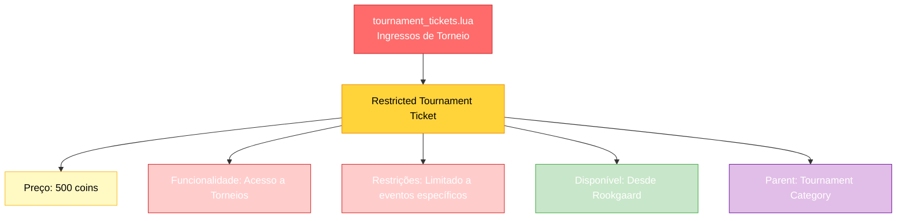

import { Aside, Card } from '@astrojs/starlight/components';

## 🛠️ Informações do Arquivo

Arquivo que define o **catálogo mínimo de ingressos para torneios** do GameStore. Fornece 1 oferta essencial: Restricted Tournament Ticket (500c), um item de acesso necessário para participação em eventos de torneios com restrições.

<Card title="Caminho Original" icon="document">
  `data/modules/scripts/gamestore/catalog/tournament_tickets.lua`
</Card>

<Aside type="tip">
  Catálogo simples com apenas 1 tipo de ingresso: Restricted Tournament Ticket (500c). Item essencial para acesso a torneios restritos do servidor. Aparenta em categoria "Tournament" > "Tickets". Icon: Category_Tickets.png. Flag rookgaard=true. Sem itemtype/count definidos (indica tipo consumível ou tokens de acesso). Estado padrão: STATE_NONE.
</Aside>

---

## 📄 Visão Geral do Código

### Resumo Executivo

`tournament_tickets.lua` é um catálogo de **ingressos para torneios restritos** que fornece:

1. **1 Oferta de Acesso**: Restricted Tournament Ticket (ingresso restrito)
2. **Preço Único**: 500 coins por ingresso
3. **Funcionalidade**: Acesso a eventos de torneio com restrições
4. **Parent Category**: "Tournament" (agrupa com outras ofertas de torneio)
5. **Acessibilidade**: Disponível desde Rookgaard (rookgaard=true)
6. **Tipo**: Sem especificação de OFFER_TYPE (consumível de acesso)

### Estrutura de Funcionalidades



---

## 📋 Índice de Componentes

| Nome | Tipo | Preço | Categoria | Restrição |
|------|------|--------|-----------|-----------|
| **Restricted Tournament Ticket** | Ingresso | 500c | Tournament > Tickets | Eventos Restritos |

---

## 🎯 Análise da Oferta

### Restricted Tournament Ticket

**Especificações Técnicas**:
- **Price**: 500 coins
- **Parent Category**: "Tournament"
- **Name**: "Restricted Tournament Ticket"
- **Icon**: `Category_Tickets.png`
- **Rookgaard Available**: true (acessível desde Rookgaard)
- **OFFER_TYPE**: Não especificado (consumível de acesso)
- **ItemType**: Não definido
- **Count**: Não definido
- **State**: STATE_NONE (padrão)

**Propósito**:
Este ingresso permite que jogadores participem de eventos de torneio com restrições especificadas. O termo "Restricted" sugere limitações como:
- Nível mínimo/máximo requerido
- Restrições vocacionais
- Acessibilidade só para membros premium
- Duração limitada ou "slots" limitados

**Funcionamento no GameStore**:
1. Jogador visualiza ticket em `Tournament > Tickets`
2. Clica em comprar por 500 coins
3. Recebe ingresso/token consumível
4. Usa token para registrar-se em torneio restrito
5. Token é consumido ao entrar no evento

**Relação com Outras Ofertas**:
- **vs. tournament_exclusive_offers.lua**: Exclusives = decoração/mounts/outfits visuais; Tickets = funcionalidade de acesso
- **Precede Participação**: Deve comprar ticket antes de entrar em tournament
- **Complemento de Cosmetics**: Enquanto exclusive offers são status visual, tickets são pré-requisito funcional

---

## 💰 Modelo de Preços

### Análise Simples

**Price Point**: 500 coins
- **Comparação com Exclusive Offers**: 
  - Entertainment Cosmetics (Baby creatures, Dolls): 400-800c
  - Mounts Temáticos: 1250c
  - Outfits Premium: 1750-5000c
  - **Tickets**: 500c (mid-range)
  
- **Estratégia**: 500c é preço "acessível" para aspirantes casuais participem de torneios, mas alto suficiente para monetizar eventos

### Potencial Escalação Futura

Structure sugere que pode haver variações:
```lua
-- Possível expansão futura:
{
    icons = { "Category_Premium_Tickets.png" },
    name = "Premium Tournament Ticket",
    price = 1000, -- Preço mais alto
},
{
    icons = { "Category_Elite_Tickets.png" },
    name = "Elite Tournament Ticket",
    price = 2000, -- Acesso a torneios elite
},
```

Mas por enquanto, **apenas Restricted Tournament Ticket existe** no arquivo.

---

## 🏛️ Estrutura do Arquivo

### Return Statement

```lua
return {
    icons = { "Category_Tickets.png" },
    parent = "Tournament",
    name = "Tickets",
    rookgaard = true,
    offers = {
        {
            icons = { "Tournament_Restricted.png" },
            name = "Restricted Tournament Ticket",
            price = 500,
        },
    },
}
```

### Campos Obrigatórios

| Campo | Valor | Descrição |
|-------|-------|-----------|
| `icons` | `{ "Category_Tickets.png" }` | Ícone da subcategoria visual |
| `parent` | `"Tournament"` | Categoria pai no GameStore |
| `name` | `"Tickets"` | Label da subcategoria |
| `rookgaard` | `true` | Disponível desde Rookgaard |
| `offers` | Array | Contém 1 oferta (ticket) |

### Oferta Individual

| Campo | Valor | Descrição |
|-------|-------|-----------|
| `icons` | `{ "Tournament_Restricted.png" }` | Ícone do ingresso |
| `name` | `"Restricted Tournament Ticket"` | Nome do ingresso |
| `price` | `500` | Preço em coins |

**Campos Omitidos** (vs. outros catálogos):
- Sem `itemtype` (não é item físico droppável)
- Sem `count` (não tem quantidade de "unidades")
- Sem `description` (simples demais para ser necessário)
- Sem `type = GameStore.OfferTypes.*` (consumível genérico)
- Sem `state = GameStore.States.*` (usa padrão STATE_NONE)

---

## 🎯 Funcionalidade no Servidor

### Interpretação Técnica

**Option 1: Consumível Invisível**
Token é registrado no banco de dados, não aparece no inventory como item. Referenciado por flags de conta.

**Option 2: Consumível Visível**
Item especial que aparece no inventory, removido automaticamente ao entrar em torneio.

**Option 3: Flag de Acesso**
Sistema de permissões que marca conta como "elegível para restricted tournaments" por tempo limitado.

### Integração Presumida

```lua
-- Em algum callback de tournament registration:
if player:getStorageValue(TOURNAMENT_RESTRICTED_FLAG) > 0 then
    -- Permite entrada em restricted tournament
    table.insert(tournament.players, player)
else
    -- Recusa entrada - precisa comprar ticket
    player:sendTextMessage(MESSAGE_INFO, "You need a ticket to enter this tournament.")
end
```

---

## ✅ Checkpoint de Aprendizagem

### Conceitos Principais

1. **Arquivo Mínimalista**: Apenas 1 oferta, estrutura MDN simples
2. **Funcionalidade > Cosmética**: Ticket é pré-requisito para evento, não decoração visual
3. **Price Point Estratégico**: 500c = acessível mas monetizado
4. **Categoria Hierárquica**: Tournament (pai) > Tickets (subcategoria)
5. **Sem Itemtype**: Sugere tipo de token/flag de acesso, não item físico

### Design Patterns

- **Consumível de Acesso**: Modelo comum em MMOs (dungeon keys, battle passes)
- **Coins como Currency**: Monetization simples via coins do GameStore
- **Parent-Child Categories**: Organização modular (Tournament é pai, Tickets é subcategoria)
- **Rookgaard Availability**: Democratização, acesso desde level 1

---

## 📚 Conclusão

O arquivo `tournament_tickets.lua` é o **catálogo mais minimalista do GameStore**, fornecendo:

1. **Acesso Funcional**: Permite participação em torneios restritos (vs. cosmético)
2. **Preço Único**: 500 coins - ponto de acesso acessível
3. **Simplicidade de Design**: Apenas 1 tipo de ticket, estrutura enxuta
4. **Integração Hierárquica**: Subcategoria "Tickets" dentro de "Tournament"
5. **Monetização Funcional**: Obstrui acesso a feature (torneio) atrás de paywall

Complementa o ecosystem GameStore focando em **game mechanics (acesso a eventos)** em vez de cosmética/decoração, criando **dual monetization model**:
- **Exclusive Offers**: Cosmética premium (mounts, outfits, decoração)
- **Tournament Tickets**: Funcionalidade necessária (acesso a eventos)

Ambas estratégias geram receita mas por mecanismos diferentes.

---

## 🤖 Informações da Documentação

<Card title="Metadata da Documentação" icon="star">
  - **Arquivo Original**: tournament_tickets.lua
  - **Caminho**: data/modules/scripts/gamestore/catalog/
  - **Tipo**: Catálogo de Ingressos (GameStore)
  - **Última Atualização**: 2026-02-19
  - **Status**: ✅ Completo
  - **Linhas de Código**: ~14 linhas
  - **Ofertas Documentadas**: 1 oferta (Restricted Tournament Ticket)
  - **Categoria**: Tournament > Tickets
  - **Modelo**: Consumível de Acesso (não item físico)
</Card>

<Aside type="note">
  **Nota de Manutenção**: Este arquivo é catálogo de ingressos simples. Modificações devem preservar: (1) Parent category "Tournament" conecta com tournament_exclusive_offers, (2) Price 500c é ponto monetização funcional (não cosmético), (3) Estrutura minimalista - adicionar novos tickets siga padrão simples &#123;icons, name, price&#125;, (4) Icon PNG "Tournament_Restricted.png" existe em assets, (5) Sem itemtype = consumível/token de acesso (não item droppável), (6) Testing: Verificar que ticket é consumido corretamente ao entrar em tournament.
</Aside>

```