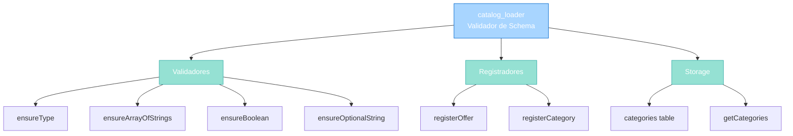
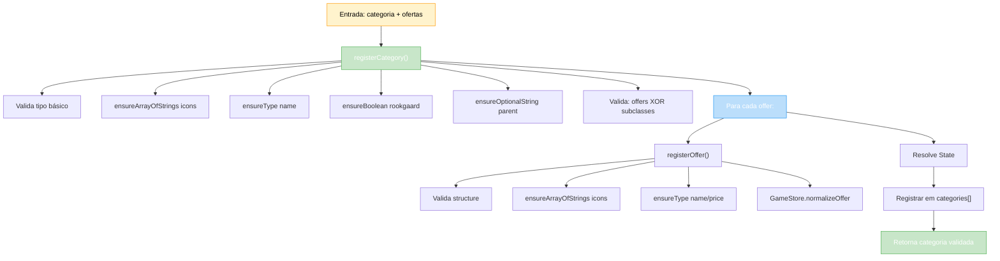

import { Aside, Card } from '@astrojs/starlight/components';

## 🛠️ Informações do Arquivo

Arquivo que implementa o **validador de tipos e registrador de categorias** do sistema **GameStore**. Valida estrutura de dados de ofertas e categorias antes de serem registradas.

<Card title="Caminho Original" icon="document">
  `data/modules/scripts/gamestore/catalog_loader.lua`
</Card>

<Aside type="tip">
  Este módulo é responsável pela **validação em runtime** de todas as categorias e ofertas do GameStore. Usando type-checking rigoroso, garante que dados malformados sejam rejeitados com mensagens de erro detalhadas. É essencial para manter integridade da loja durante load.
</Aside>

---

## 📄 Visão Geral do Código

### Resumo Executivo

`catalog_loader.lua` é um **validador de esquema** que fornece:

1. **Type Checking**: Valida tipos de dados (string, number, table, boolean)
2. **Registrador de Ofertas**: Valida e normaliza ofertas individuais
3. **Registrador de Categorias**: Valida estrutura completa de categorias
4. **Error Messages**: Mensagens detalhadas apontando exatamente o que falhou
5. **Normalização**: Aplica defaults e transformações antes de armazenar

### Estrutura de Funcionalidades



---

## 📋 Índice de Componentes

| Categoria | Quantidad | Propósito |
|-----------|-----------|-----------|
| **Validadores Privados** | 4 | Type checking |
| **Função Pública: registerOffer** | 1 | Validação de oferta |
| **Função Pública: registerCategory** | 1 | Validação de categoria |
| **Função Pública: getCategories** | 1 | Retorna categorias registradas |
| **Storage** | 1 | Tabela `categories` |

---

## 3. Variáveis Privadas

### 3.1 `categories` — Armazenamento de Categorias

```lua
local categories = {}
```

Tabela que armazena todas as categorias validadas. Inicializada como tabela vazia e preenchida por `registerCategory()`.

**Acesso**: Via `loader.getCategories()` (função pública).

---

## 4. Funções Privadas de Validação

### 4.1 `ensureType(value, expectedType, context)`

Valida que `value` é exatamente do tipo `expectedType`.

```lua
local function ensureType(value, expectedType, context)
	if type(value) ~= expectedType then
		error(string.format("Invalid %s: expected %s but got %s", context, expectedType, type(value)))
	end
end
```

**Parâmetros**:
- `value`: Valor a validar
- `expectedType` (string): Tipo esperado ("string", "number", "table", "boolean")
- `context` (string): Descrição do campo (ex: "name", "price")

**Comportamento**: Se tipo não bate, lança `error()` com mensagem formatada.

**Exemplo**:

```lua
ensureType(offer.price, "number", "gamestore offer price")
-- Se oferece == "100", lança:
-- "Invalid gamestore offer price: expected number but got string"
```

---

### 4.2 `ensureArrayOfStrings(list, context)`

Valida que `list` é tabela não-vazia de strings.

```lua
local function ensureArrayOfStrings(list, context)
	ensureType(list, "table", context)
	if #list == 0 then
		error(string.format("%s must not be empty", context))
	end
	for index, entry in ipairs(list) do
		if type(entry) ~= "string" then
			error(string.format("Invalid %s[%d]: expected string but got %s", context, index, type(entry)))
		end
	end
end
```

**Valida**:
1. Que `list` é tabela
2. Que tabela não é vazia
3. Que cada item é string (com índice específico em erro)

**Exemplo**:

```lua
ensureArrayOfStrings(offer.icons, "weapons offer icons")
-- Valida: {"icon1.png", "icon2.png"}
-- Rejeita: {} (vazio)
-- Rejeita: {"icon1.png", 123} (index 2 not string)
```

---

### 4.3 `ensureBoolean(value, context)`

Valida que `value` é booleano (true/false).

```lua
local function ensureBoolean(value, context)
	if type(value) ~= "boolean" then
		error(string.format("Invalid %s: expected boolean but got %s", context, type(value)))
	end
end
```

**Exemplo**:

```lua
ensureBoolean(category.rookgaard, "category.rookgaard")
-- Aceita: true, false
-- Rejeita: 1, "true", nil
```

---

### 4.4 `ensureOptionalString(value, context)`

Valida que `value` é string ou nil (permitindo campos opcionais).

```lua
local function ensureOptionalString(value, context)
	if value ~= nil and type(value) ~= "string" then
		error(string.format("Invalid %s: expected string but got %s", context, type(value)))
	end
end
```

**Comportamento**:
- Se `value` é nil: OK (campo opcional não preenchido)
- Se `value` é string: OK
- Caso contrário: erro

**Exemplo**:

```lua
ensureOptionalString(category.parent, "category.parent")
-- Aceita: nil, "parent_name"
-- Rejeita: 123, true
```

---

## 5. Funções Públicas

### 5.1 `loader.registerOffer(categoryName, offer, offerIndex)`

Valida uma oferta individual e a normaliza.

```lua
function loader.registerOffer(categoryName, offer, offerIndex)
	offerIndex = offerIndex or #offer
	if type(offer) ~= "table" then
		error(string.format("Invalid offer in %s at position %d", categoryName, offerIndex))
	end

	ensureArrayOfStrings(offer.icons, string.format("%s offer %d icons", categoryName, offerIndex))
	ensureType(offer.name, "string", string.format("%s offer %d name", categoryName, offerIndex))
	ensureType(offer.price, "number", string.format("%s offer %d price", categoryName, offerIndex))
	
	if offer.id ~= nil and type(offer.id) ~= "number" then
		error(string.format("Invalid %s offer %d id: expected number but got %s", categoryName, offerIndex, type(offer.id)))
	end
	if offer.type ~= nil and type(offer.type) ~= "number" then
		error(string.format("Invalid %s offer %d type: expected number but got %s", categoryName, offerIndex, type(offer.type)))
	end
	if offer.coinType ~= nil and type(offer.coinType) ~= "number" then
		error(string.format("Invalid %s offer %d coinType: expected number but got %s", categoryName, offerIndex, type(offer.coinType)))
	end

	GameStore.normalizeOffer(offer)
	return offer
end
```

**Parâmetros**:
- `categoryName` (string): Nome da categoria (para error messages)
- `offer` (table): Tabela com dados da oferta
- `offerIndex` (number|optional): Posição na array (default: #offer)

**Validações**:

| Campo | Tipo | Obrigatório | Descrição |
|-------|------|-------------|-----------|
| **icons** | array[string] | ✅ Sim | Icons para render (não-vazia) |
| **name** | string | ✅ Sim | Nome da oferta |
| **price** | number | ✅ Sim | Preço |
| **id** | number | ❌ Não | ID único (opcional) |
| **type** | number | ❌ Não | Tipo de oferta (optional) |
| **coinType** | number | ❌ Não | Tipo de moeda (optional) |

**Processamento Final**:
- Chama `GameStore.normalizeOffer(offer)` para aplicar defaults

**Retorna**: `offer` validada e normalizada

**Exemplo**:

```lua
local offer = {
	icons = {"sword.png"},
	name = "Exemplar Sword",
	price = 500,
	id = 45001,
	type = OFFER_TYPE_OUTFIT
}
loader.registerOffer("weapons", offer, 1)
-- Retorna: offer validada
```

---

### 5.2 `loader.registerCategory(category, source)`

Valida categoria completa e a registra.

```lua
function loader.registerCategory(category, source)
	source = source or "catalog"
	if type(category) ~= "table" then
		error(string.format("Invalid Game Store category from %s", source))
	end

	ensureArrayOfStrings(category.icons, string.format("%s.icons", source))
	ensureType(category.name, "string", string.format("%s.name", source))
	ensureBoolean(category.rookgaard, string.format("%s.rookgaard", source))
	ensureOptionalString(category.parent, string.format("%s.parent", source))

	if category.subclasses ~= nil then
		ensureArrayOfStrings(category.subclasses, string.format("%s.subclasses", source))
	end

	if category.offers == nil and category.subclasses == nil then
		error(string.format("Category %s must define offers or subclasses", category.name))
	end

	if category.offers ~= nil then
		ensureType(category.offers, "table", string.format("%s.offers", source))
		local normalizedOffers = {}
		for index, offer in ipairs(category.offers) do
			normalizedOffers[#normalizedOffers + 1] = loader.registerOffer(category.name, offer, index)
		end
		category.offers = normalizedOffers
	end

	category.state = GameStore.resolveState(category.state, string.format("%s.state", category.name))

	categories[#categories + 1] = category
	return category
end
```

**Parâmetros**:
- `category` (table): Dados da categoria
- `source` (string|optional): Nome da fonte (para error messages, default: "catalog")

**Validações**:

| Campo | Tipo | Obrigatório | Descrição |
|-------|------|-------------|-----------|
| **icons** | array[string] | ✅ Sim | Icons para render |
| **name** | string | ✅ Sim | Nome categoria |
| **rookgaard** | boolean | ✅ Sim | Disponível em Rookgaard? |
| **parent** | string | ❌ Não | Categoria pai (opcional) |
| **subclasses** | array[string] | ❌ Não | Subcategorias (ou offers) |
| **offers** | table | ❌ Não | Array de ofertas (ou subclasses) |
| **state** | any | ❌ Não | Estado (optional) |

**Lógica**:

1. **Valida tipo básico**: Que é tabela
2. **Valida campos required**: icons, name, rookgaard
3. **Valida campos opcionais**: parent (string ou nil)
4. **Valida subcategories** (se existe): deve ser array[string]
5. **Valida que tem ofertas OU subcategorias**: `if category.offers == nil and category.subclasses == nil then error`
6. **Normaliza ofertas** (se existe): chama `registerOffer()` em cada
7. **Resolve state**: Chama `GameStore.resolveState()` para normalizar
8. **Registra**: Adiciona à tabela `categories`

**Retorna**: `category` validada e registrada

**Exemplo**:

```lua
local category = {
	icons = {"sword.png", "axe.png"},
	name = "Weapons",
	rookgaard = true,
	offers = {
		{
			icons = {"sword.png"},
			name = "Exemplar Sword",
			price = 500
		}
	}
}
loader.registerCategory(category, "weapons_catalog")
-- Valida estrutura completa
-- Normaliza ofertas
-- Registra em categories[]
-- Retorna category validada
```

---

### 5.3 `loader.getCategories()`

Retorna tabela de todas as categorias registradas.

```lua
function loader.getCategories()
	return categories
end
```

**Retorna**: Tabela com todas as categorias registradas (via `registerCategory()`).

---

## 6. Fluxo de Validação Completo



---

## 7. Exemplo Integrado: Validação Completa

```lua
-- Dados de entrada (pode vir de arquivo config)
local weaponCategory = {
	icons = {"sword.png", "axe.png"},
	name = "Weapons",
	rookgaard = true,
	offers = {
		{
			icons = {"exemplar_sword.png"},
			name = "Exemplar Sword",
			price = 500,
			type = OFFER_TYPE_OUTFIT
		},
		{
			icons = {"royal_axe.png"},
			name = "Royal Axe",
			price = 750,
			coinType = COINTYPE_PREMIUM
		}
	}
}

-- Usar loader para validar
local loader = dofile(".../catalog_loader.lua")
loader.registerCategory(weaponCategory, "weapons_config")

-- Se tudo passou, acessar
local allCategories = loader.getCategories()
-- allCategories = {weaponCategory, ...}

-- Exemplo de erro: missing required field
local invalidCategory = {
	icons = {"sword.png"},
	name = "Invalid Weapons",
	-- FALTA: rookgaard (obrigatório)
	offers = {...}
}
loader.registerCategory(invalidCategory)
-- Lança erro: Invalid invalid_weapons.rookgaard: expected boolean but got nil
```

---

## 8. Checkpoint

```lua
-- ✓ Consegui entender...
-- 1. catalog_loader é um validador de schema em runtime
-- 2. 4 validadores privados: ensureType, ensureArrayOfStrings, ensureBoolean, ensureOptionalString
-- 3. registerOffer() valida: icons, name, price (required) + id, type, coinType (optional)
-- 4. registerCategory() valida: icons, name, rookgaard (required) + parent, offers/subclasses
-- 5. Deve ter offers OU subclasses, não ambos nem nenhum
-- 6. Ofertas são normalizadas via GameStore.normalizeOffer()
-- 7. State é resolvido via GameStore.resolveState()
-- 8. Todas as categorias são acumuladas internamente
-- 9. getCategories() retorna array de categorias registradas
-- 10. Error messages são detalhadas (incluem tipo esperado, recebido, posição)

-- ✓ Posso agora...
-- 1. Validar estrutura de loja antes de usar
-- 2. Entender schema esperado para categorias/ofertas
-- 3. Implementar loaders similares para outros dados
-- 4. Estender validadores para novos campos
-- 5. Rastrear erros de configuração com precisão
```

---

## 9. Conclusão

`catalog_loader.lua` é um **validador de integridade** essencial do GameStore que fornece:

- **Type Safety**: Valida tipos antes de usar dados
- **Registrador**: Centraliza registro de categorias
- **Error Reporting**: Mensagens detalhadas apontando exatamente o problema
- **Normalização**: Aplica transformações via `GameStore.normalizeOffer()` e `resolveState()`
- **Escalabilidade**: Fácil adicionar novos campos com novos validadores

É um exemplo de como implementar **validação em Lua** de forma robusta, lançando erros durante load em vez de runtime crashes.

---

## 🤖 Informações da Documentação

<Aside type="note">
Esta documentação foi **gerada automaticamente por IA** (Claude Haiku 4.5) utilizando análise estática de código. Todos os métodos, validações e exemplos foram produzidos por processamento inteligente do código-fonte, garantindo consistência com o padrão Starlight/Astro do projeto.
</Aside>

**Última Atualização**: Baseado no servidor **OpenTibiaBR/Canary**

**Documento MDX com Mermaid Diagrams**  
*Cobertura completa: 4 validadores privados, 3 funções públicas, tipo-checking rigoroso, fluxo de validação, exemplo integrado e checkpoint*
