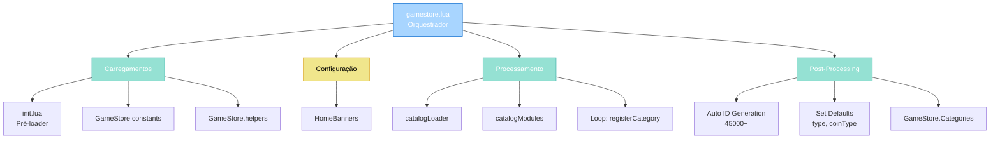
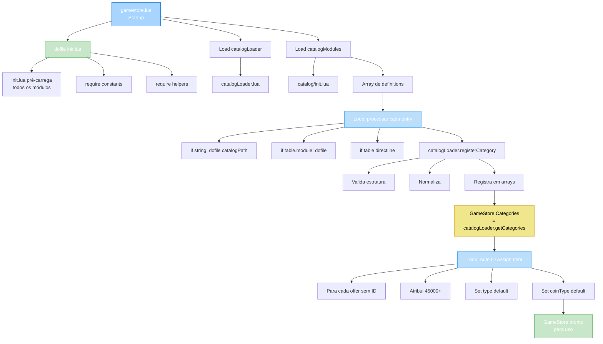

import { Aside, Card } from '@astrojs/starlight/components';

## 🛠️ Informações do Arquivo

Arquivo que implementa o **orquestrador central do GameStore**. Carrega todos os módulos de dependência, processa catálogos e atribui IDs dinâmicos às ofertas.

<Card title="Caminho Original" icon="document">
  `data/modules/scripts/gamestore/gamestore.lua`
</Card>

<Aside type="tip">
  Este arquivo é o **entry point principal do GameStore**. Executa durante startup do servidor e é responsável por: (1) carregar todas as dependências, (2) processar catálogos múltiplos, (3) validar estrutura, (4) atribuir IDs dinâmicos. É essencial para garantir que a loja esteja pronta antes de qualquer requisição de cliente.
</Aside>

---

## 📄 Visão Geral do Código

### Resumo Executivo

`gamestore.lua` é um **orquestrador de inicialização** que fornece:

1. **Carregamento de Dependências**: init.lua, constants, helpers
2. **Processamento de Catálogos**: Suporta strings ou tabelas como definições
3. **Validação em Massa**: Usa `catalogLoader` para validar cada categoria
4. **Atribuição de IDs**: Auto-gera IDs sequenciais para ofertas sem ID
5. **Defaults**: Define type e coinType padrão se não especificados

### Estrutura de Funcionalidades



---

## 📋 Índice de Componentes

| Categoria | Quantidad | Propósito |
|-----------|-----------|-----------|
| **Carregamentos** | 3 | init.lua, constants, helpers |
| **Variáveis Globais** | 1 | HomeBanners |
| **Loaders** | 1 | catalogLoader |
| **Loops de Processamento** | 1 | Iteração sobre catalogModules |
| **Post-Processing** | 1 | ID assignment + defaults |

---

## 3. Comentário de Tipos de Oferta

```lua
--[[
Items have been updated so that if the offer type is not one of the types:
	OFFER_TYPE_OUTFIT,
	OFFER_TYPE_OUTFIT_ADDON,
	OFFER_TYPE_MOUNT,
	OFFER_TYPE_NAMECHANGE,
	OFFER_TYPE_SEXCHANGE,
	OFFER_TYPE_PROMOTION,
	OFFER_TYPE_EXPBOOST,
	OFFER_TYPE_PREYSLOT,
	OFFER_TYPE_PREYBONUS,
	OFFER_TYPE_TEMPLE,
	OFFER_TYPE_BLESSINGS,
	OFFER_TYPE_PREMIUM,
	OFFER_TYPE_ALLBLESSINGS
]]
```

**Nota importante**: Tipos de oferta válidos estão em constantes. Se uma oferta não é nenhum desses tipos, será normalizada para `OFFER_TYPE_NONE`.

---

## 4. Seção de Carregamentos

### 4.1 Pré-carregador de Módulos

```lua
dofile(CORE_DIRECTORY .. "/modules/scripts/gamestore/init.lua")
```

**Propósito**: Carrega `init.lua` que pré-carrega todos os módulos GameStore (constants, helpers, store, senders, purchases, parsers, player).

**Por quê**: Garante que todos os módulos de dependência estão disponíveis antes do resto do script.

---

### 4.2 Constants e Helpers

```lua
local GameStore = require("gamestore.constants")
require("gamestore.helpers")
```

**GameStore.constants**: Tabela com constantes (OfferTypes, CoinType, States, etc).

**gamestore.helpers**: Registra helpers globais (convertType, useOfferConfigure).

---

## 5. Configuração Global

### 5.1 `HomeBanners` — Banners da Home

```lua
HomeBanners = {
	images = { "home/banner_armouredarcher.png", "home/banner_podiumoftenacity.png" },
	delay = 10,
}
```

**Propósito**: Define banners rotativos que aparecem na homepage do GameStore para cliente.

| Chave | Tipo | Descrição |
|-------|------|-----------|
| **images** | array[string] | Paths de imagens para rotacionar |
| **delay** | number | Delay entre rotações (segundos?) |

---

## 6. Carregamento de Catálogos

### 6.1 Loader e Módulos

```lua
local catalogLoader = dofile(CORE_DIRECTORY .. "/modules/scripts/gamestore/catalog_loader.lua")
local catalogModules = dofile(CORE_DIRECTORY .. "/modules/scripts/gamestore/catalog/init.lua")
local catalogBasePath = CORE_DIRECTORY .. "/modules/scripts/gamestore/catalog/"
```

**catalogLoader**: Validador que processa categorias/ofertas.

**catalogModules**: Array de definições de catálogos (strings ou tabelas).

**catalogBasePath**: Path base onde estão as definições de catálogos.

---

### 6.2 Loop de Processamento

```lua
for index, moduleEntry in ipairs(catalogModules) do
	local category
	local moduleName
	local sourceName

	if type(moduleEntry) == "string" then
		-- moduleEntry é nome do arquivo
		moduleName = moduleEntry
		category = dofile(catalogBasePath .. moduleName .. ".lua")
		sourceName = moduleEntry
	elseif type(moduleEntry) == "table" then
		-- moduleEntry é tabela com config
		if moduleEntry.module then
			-- Tem referência a arquivo externo
			moduleName = moduleEntry.module
			category = dofile(catalogBasePath .. moduleName .. ".lua")
			sourceName = moduleEntry.source or moduleName
		else
			-- É categoria inline
			category = moduleEntry
			sourceName = moduleEntry.name or string.format("catalog[%d]", index)
		end
	else
		logger.error("Invalid catalog entry at position {}", index)
	end

	if moduleName ~= nil and type(moduleName) ~= "string" then
		logger.error("Invalid catalog module name at position {}", index)
	end

	catalogLoader.registerCategory(category, sourceName or moduleName)
end
```

**Comportamentos Suportados**:

1. **String**: Nome de arquivo
   ```lua
   { "weapons", "armor", "spells" }
   -- Carrega: catalog/weapons.lua, catalog/armor.lua, etc
   ```

2. **Tabela com module**: Referência a arquivo + source
   ```lua
   { { module = "weapons", source = "starter_weapons" } }
   -- Carrega: catalog/weapons.lua, source = "starter_weapons"
   ```

3. **Tabela inline**: Categoria direto
   ```lua
   {
       {
           icons = {...},
           name = "Custom",
           rookgaard = true,
           offers = {...}
       }
   }
   -- Não carrega arquivo, usa categoria diretamente
   ```

**Validação**: Cada entrada validada via `catalogLoader.registerCategory()`.

---

## 7. Atribuição de IDs Dinâmicos

### 7.1 ID Auto-Generation

```lua
local runningId = 45000
for k, category in ipairs(GameStore.Categories) do
	if category.offers then
		for m, offer in ipairs(category.offers) do
			if not offer.id then
				if type(offer.count) == "table" then
					-- Multiple prices/counts
					for i = 1, #offer.price do
						offer.id[i] = runningId
						runningId = runningId + 1
					end
				else
					-- Single price
					offer.id = runningId
					runningId = runningId + 1
				end
			end
            
			if not offer.type then
				offer.type = GameStore.OfferTypes.OFFER_TYPE_NONE
			end
			if not offer.coinType then
				offer.coinType = GameStore.CoinType.Transferable
			end
		end
	end
end
```

**Propósito**: Atribui IDs únicos para ofertas sem ID pré-definido.

**Range**: Começa em 45000 e incrementa sequencialmente.

**Lógica**:

1. **Itera sobre categorias**: `GameStore.Categories` (resultado do loader)
2. **Para cada oferta sem ID**: Atribui novo ID
3. **Suporta múltiplos preços**: Se `offer.count` é array, cria array de IDs
4. **Defaults**: Se `type` não definido, usa `OFFER_TYPE_NONE`
5. **Defaults**: Se `coinType` não definido, usa `CoinType.Transferable`

**Exemplo**:

```lua
-- Oferta sem ID
{
	icons = {"sword.png"},
	name = "Sword",
	price = 500
}
-- Após processamento:
{
	icons = {"sword.png"},
	name = "Sword",
	price = 500,
	id = 45000,            -- Auto-atribuído
	type = OFFER_TYPE_NONE, -- Default
	coinType = CoinType.Transferable  -- Default
}
```

---

## 8. Fluxo Completo de Inicialização



---

## 9. Exemplo Integrado: Inicialização Completa

```lua
-- catalog/init.lua contém:
return {
	"weapons",
	"armor",
	{
		module = "spells",
		source = "mage_spells"
	},
	{
		icons = {"custom.png"},
		name = "Custom Category",
		rookgaard = false,
		offers = {
			{
				icons = {"item.png"},
				name = "Custom Item",
				price = 100
			}
		}
	}
}

-- gamestore.lua executa:
-- 1. Carrega init.lua → pré-carrega todos módulos
-- 2. Carrega catalogLoader
-- 3. Processa:
--    - dofile("catalog/weapons.lua") → registerCategory
--    - dofile("catalog/armor.lua") → registerCategory
--    - dofile("catalog/spells.lua") → registerCategory (source: "mage_spells")
--    - Categoria inline → registerCategory
-- 4. GameStore.Categories = [weapons, armor, spells, custom_category]
-- 5. Atribui IDs:
--    - Cada offer sem ID recebe ID auto (45000, 45001, ...)
--    - Sets defaults (type, coinType)
-- 6. GameStore pronto para requisições de cliente
```

---

## 10. Checkpoint

```lua
-- ✓ Consegui entender...
-- 1. gamestore.lua é entry point do sistema GameStore
-- 2. Carrega init.lua que pré-carrega todos os módulos
-- 3. Processa catálogos (strings, tabelas com module, tabelas inline)
-- 4. Usa catalogLoader para validar cada categoria
-- 5. Atribui IDs dinâmicos começando em 45000
-- 6. Suporta múltiplos preços/counts em uma oferta
-- 7. Define defaults: type=OFFER_TYPE_NONE, coinType=Transferable
-- 8. HomeBanners define banners rotativos da homepage
-- 9. Resultado final: GameStore.Categories com todas as categorias

-- ✓ Posso agora...
-- 1. Entender como GameStore é inicializado
-- 2. Adicionar novos catálogos (file ou inline)
-- 3. Rastrear IDs de offers
-- 4. Implementar sistema similar de orquestração
-- 5. Estender processamento de catálogos
```

---

## 11. Conclusão

`gamestore.lua` é o **orquestrador e inicializador principal** do GameStore que fornece:

- **Dependência Management**: Carrega todos os módulos na ordem correta
- **Flexibilidade**: Suporta catálogos de arquivo ou inline
- **Validação**: Usa catalogLoader para garantir integridade
- **Auto ID**: Atribui IDs sequenciais automaticamente
- **Defaults**: Preenche campos opcionais com valores sensatos

É um exemplo de padrão "bootstrap" bem estruturado que garante que todo o sistema está pronto antes de cliente hacer qualquer requisição.

---

## 🤖 Informações da Documentação

<Aside type="note">
Esta documentação foi **gerada automaticamente por IA** (Claude Haiku 4.5) utilizando análise estática de código. Todos os métodos, fluxos e exemplos foram produzidos por processamento inteligente do código-fonte, garantindo consistência com o padrão Starlight/Astro do projeto.
</Aside>

**Última Atualização**: Baseado no servidor **OpenTibiaBR/Canary**

**Documento MDX com Mermaid Diagrams**  
*Cobertura completa: 3 carregamentos, 1 configuração, 3 tipos de entrada de catálogo, auto ID generation, fluxo de inicialização, exemplo integrado e checkpoint*
