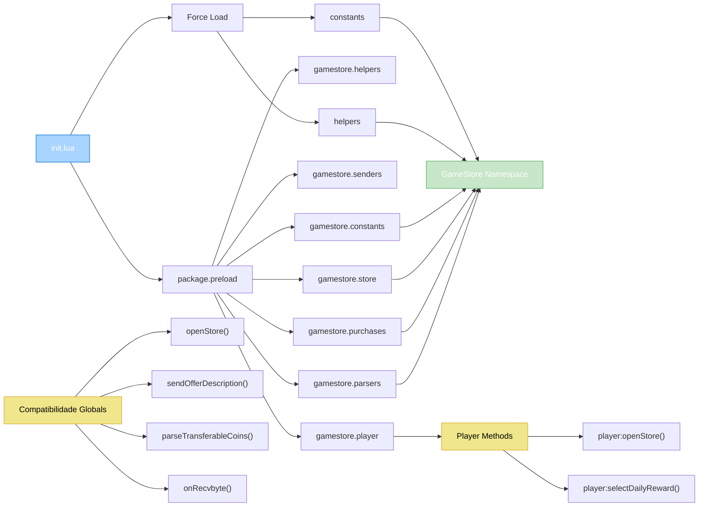

import { Aside, Card } from '@astrojs/starlight/components';

## 🛠️ Informações do Arquivo

Arquivo que implementa o **pré-carregador centralizado de módulos** do GameStore. Registra módulos em `package.preload`, injeta globals e expõe APIs públicas.

<Card title="Caminho Original" icon="document">
  `data/modules/scripts/gamestore/init.lua`
</Card>

<Aside type="tip">
  Este arquivo é o **bootstrap do GameStore**. Executa primeiramente para garantir que todos os submódulos (constants, helpers, store, senders, purchases, parsers, player) estejam pré-carregados e disponíveis. Usa `package.preload` para lazy-loading inteligente e injeta funções em globals para compatibilidade com código legado.
</Aside>

---

## 📄 Visão Geral do Código

### Resumo Executivo

`init.lua` é um **sistema de pré-carregamento e injeção** que fornece:

1. **Pré-carregador de Módulos**: Registra 7 módulos em `package.preload`
2. **Lazy Loading**: Só carrega módulo quando `require()` é chamado
3. **Injeção de Globals**: Registra funções helper globalmente
4. **Namespace Merging**: Funde todos os módulos em `GameStore` namespace
5. **API Exposição**: Expõe funções públicas como globals para compatibilidade

### Estrutura de Funcionalidades

```mermaid
graph TD
    A["init.lua<br/>Pré-carregador"] --> B["Módulos a Pré-carregar"]
    A --> C["package.preload Setup"]
    A --> D["Constants + Helpers"]
    A --> E["Namespace Merging"]
    A --> F["Global/Player Extension"]
    
    B --> B1["gamestore.constants"]
    B --> B2["gamestore.helpers"]
    B --> B3["gamestore.store"]
    B --> B4["gamestore.senders"]
    B --> B5["gamestore.purchases"]
    B --> B6["gamestore.parsers"]
    B --> B7["gamestore.player"]
    
    C --> C1["Registra loaders"]
    C --> C2["Lazy loading"]
    
    D --> D1["Merge constants"]
    D --> D2["Merge helpers"]
    
    E --> E1["Store functions"]
    E --> E2["Purchases"]
    E --> E3["Parsers"]
    
    F --> F1["Global senders"]
    F --> F2["Global parsers"]
    F --> F3["Player methods"]
    F --> F4["onRecvbyte handler"]
    
    style A fill:#a8d5ff,stroke:#0066cc,color:#fff
    style B fill:#95e1d3,stroke:#38ada9,color:#fff
    style C fill:#95e1d3,stroke:#38ada9,color:#fff
    style D fill:#95e1d3,stroke:#38ada9,color:#fff
    style E fill:#95e1d3,stroke:#38ada9,color:#fff
    style F fill:#f0e68c,stroke:#daa520,color:#000
```



---

## 📋 Índice de Componentes

| Categoria | Quantidad | Propósito |
|-----------|-----------|-----------|
| **Módulos Pré-carregados** | 7 | Constants, helpers, store, senders, purchases, parsers, player |
| **Injeções de Globals** | 10 | Funções públicas expostas globalmente |
| **Namespaces Mesclados** | 7 | Todos os módulos em GameStore |
| **Extensões de Player** | 8+ | Métodos adicionados à classe Player |
| **Função Global** | 1 | onRecvbyte handler |

---

## 3. Estrutura de Pré-carregamento

### 3.1 Path de Biblioteca

```lua
local gamestoreLibPath = CORE_DIRECTORY .. "/libs/gamestore"

local function moduleLoader(name)
	return dofile(gamestoreLibPath .. "/" .. name .. ".lua")
end
```

**gamestoreLibPath**: Path base para bibliotecas GameStore (`libs/gamestore/`).

**moduleLoader**: Helper que carrega arquivo Lua em um módulo.

---

### 3.2 Tabela de Módulos

```lua
local modulesToPreload = {
	["gamestore.constants"] = function()
		return moduleLoader("constants")
	end,
	["gamestore.helpers"] = function()
		return moduleLoader("helpers")
	end,
	["gamestore.store"] = function()
		return moduleLoader("store")
	end,
	["gamestore.senders"] = function()
		return moduleLoader("senders")
	end,
	["gamestore.purchases"] = function()
		return moduleLoader("purchases")
	end,
	["gamestore.parsers"] = function()
		return moduleLoader("parsers")
	end,
	["gamestore.player"] = function()
		return moduleLoader("player")
	end,
}
```

**7 Módulos Pré-carregados**:

| Módulo | Arquivo | Propósito |
|--------|---------|-----------|
| **gamestore.constants** | constants.lua | Constantes (OfferTypes, CoinType, etc) |
| **gamestore.helpers** | helpers.lua | Funções helper (convertType, useOfferConfigure) |
| **gamestore.store** | store.lua | Funções de store management |
| **gamestore.senders** | senders.lua | Envia pacotes ao cliente (openStore, sendDailyReward, etc) |
| **gamestore.purchases** | purchases.lua | Processa compras |
| **gamestore.parsers** | parsers.lua | Parse requisições do cliente |
| **gamestore.player** | player.lua | Extensões de métodos Player |

---

### 3.3 Registro em package.preload

```lua
for name, loader in pairs(modulesToPreload) do
	if not package.preload[name] then
		package.preload[name] = loader
	end
end
```

**Propósito**: Registra loaders em `package.preload` para lazy-loading inteligente.

**Lógica**: Se módulo não está pré-carregado (check `if not package.preload[name]`), registra loader.

**Benefício**: Quando código faz `require("gamestore.constants")`, Lua chama o loader registrado automaticamente.

---

## 4. Carregamento Imediato de Dependências

### 4.1 Constants

```lua
local constants = package.loaded["gamestore.constants"] or moduleLoader("constants")
package.loaded["gamestore.constants"] = constants
```

**Propósito**: Force load imediato de constants.

**Lógica**:
1. Se constants já está carregado (`package.loaded`), usa cached
2. Caso contrário, carrega novo
3. Registra em `package.loaded` para cache

---

### 4.2 Helpers

```lua
local helpers = package.loaded["gamestore.helpers"] or moduleLoader("helpers")
package.loaded["gamestore.helpers"] = helpers
```

Mesmo padrão de constants. Helpers é carregado imediatamente.

---

## 5. Injeção em GameStore Namespace

### 5.1 Merge de Constants

```lua
GameStore = GameStore or {}
for key, value in pairs(constants) do
	GameStore[key] = value
end
```

**Propósito**: Copia tudo de `constants` para `GameStore`.

**Exemplo**:
```lua
-- constants contém:
{
	OfferTypes = {...},
	CoinType = {...},
	States = {...}
}

-- Após merge, acesso via:
GameStore.OfferTypes.OFFER_TYPE_OUTFIT
GameStore.CoinType.Transferable
GameStore.States.STATE_ACTIVE
```

---

### 5.2 Merge de Helpers

```lua
local convertType = helpers.convertType
local useOfferConfigure = helpers.useOfferConfigure

_G.convertType = convertType
_G.useOfferConfigure = useOfferConfigure

GameStore.convertType = convertType
GameStore.useOfferConfigure = useOfferConfigure
```

**Propósito**: Expõe helpers tanto globalmente (`_G`) quanto em `GameStore`.

**Benefício**: Código legado pode usar `convertType()` diretamente, novo código usa `GameStore.convertType()`.

---

### 5.3 Merge de Store

```lua
local storeLib = require("gamestore.store")
for key, value in pairs(storeLib) do
	GameStore[key] = value
end
```

**Propósito**: Merge todas as funções de store para `GameStore`.

---

### 5.4 Merge de Purchases

```lua
local purchases = require("gamestore.purchases")
for key, value in pairs(purchases) do
	GameStore[key] = value
end
```

**Propósito**: Merge todas as funções de purchases para `GameStore`.

---

### 5.5 Parsers

```lua
local parsers = require("gamestore.parsers")
GameStore.isItsPacket = parsers.isItsPacket
GameStore.fuzzySearchOffer = parsers.fuzzySearchOffer
```

**Propósito**: Seletivamente copia funções de parsers para `GameStore`.

---

### 5.6 Player Extensions

```lua
local playerLib = require("gamestore.player")
for key, value in pairs(playerLib) do
	Player[key] = value
end
```

**Propósito**: Adiciona métodos à classe `Player` (ex: `player:openStore()`, `player:sendRewardHistory()`, etc).

---

## 6. Injeção de Globals (Compatibilidade)

### 6.1 Senders Globais

```lua
local senders = require("gamestore.senders")
-- ... later ...

openStore = senders.openStore
sendOfferDescription = senders.sendOfferDescription
sendShowStoreOffers = senders.sendShowStoreOffers
sendShowStoreOffersOnOldProtocol = senders.sendShowStoreOffersOnOldProtocol
sendStoreTransactionHistory = senders.sendStoreTransactionHistory
sendStorePurchaseSuccessful = senders.sendStorePurchaseSuccessful
sendStoreError = senders.sendStoreError
sendStoreBalanceUpdating = senders.sendStoreBalanceUpdating
sendUpdatedStoreBalances = senders.sendUpdatedStoreBalances
sendRequestPurchaseData = senders.sendRequestPurchaseData
sendHomePage = senders.sendHomePage
```

**Propósito**: Expõe funcionalidades de envio como globals.

**Benefício**: Código legado pode chamar `openStore()` diretamente.

| Função | Descrição |
|--------|-----------|
| **openStore** | Abre loja para jogador |
| **sendOfferDescription** | Envia descrição de oferta |
| **sendShowStoreOffers** | Mostra ofertas disponíveis |
| **sendShowStoreOffersOnOldProtocol** | Compatibilidade com clientes antigos |
| **sendStoreTransactionHistory** | Histórico de transações |
| **sendStorePurchaseSuccessful** | Notifica compra bem-sucedida |
| **sendStoreError** | Envia mensagem de erro |
| **sendStoreBalanceUpdating** | Atualiza saldo de moedas |
| **sendUpdatedStoreBalances** | Sincroniza saldos |
| **sendRequestPurchaseData** | Pede dados para compra |
| **sendHomePage** | Envia homepage da loja |

---

### 6.2 Parsers Globais

```lua
parseTransferableCoins = parsers.parseTransferableCoins
parseOpenStore = parsers.parseOpenStore
parseRequestStoreOffers = parsers.parseRequestStoreOffers
parseBuyStoreOffer = parsers.parseBuyStoreOffer
parseOpenTransactionHistory = parsers.parseOpenTransactionHistory
parseRequestTransactionHistory = parsers.parseRequestTransactionHistory
```

**Propósito**: Expõe parsers como globals.

| Função | Descrição |
|--------|-----------|
| **parseTransferableCoins** | Parse transferência de moedas |
| **parseOpenStore** | Parse requisição de abrir loja |
| **parseRequestStoreOffers** | Parse pedido de ofertas |
| **parseBuyStoreOffer** | Parse compra de oferta |
| **parseOpenTransactionHistory** | Parse abrir histórico |
| **parseRequestTransactionHistory** | Parse pedido de histórico |

---

### 6.3 Handler Principal

```lua
function onRecvbyte(player, msg, byte)
	return parsers.onRecvbyte(player, msg, byte)
end
```

**Propósito**: Entry point do protocolo GameStore.

**Comportamento**: Delegata para `parsers.onRecvbyte()` que despacha para parser apropriado baseado no byte.

---

## 7. Diagrama de Carregamento



---

## 8. Flow de Uso Típico

```lua
-- 1. Carregamento automático de init.lua
-- dofile(CORE_DIRECTORY .. "/modules/scripts/gamestore/init.lua")

-- 2. Tudo está pré-carregado, módulos podem ser require()
local customParser = require("gamestore.parsers")
customParser.isItsPacket(opcode)

-- 3. Funções globais disponíveis
openStore(player, storeId)
sendStoreError(player, "Not enough coins")
parseTransferableCoins(player, msg)

-- 4. GameStore namespace disponível
GameStore.isRewardTaken(playerId)
GameStore.OfferTypes.OFFER_TYPE_OUTFIT

-- 5. Player methods disponíveis
player:openStore()
player:selectDailyReward(msg)
player:sendDailyReward()

-- 6. Protocolo funciona
onRecvbyte(player, msg, byte)
-- → delegata para parsers.onRecvbyte
-- → despacha para parser apropriado
-- → executa operação GameStore
```

---

## 9. Checkpoint

```lua
-- ✓ Consegui entender...
-- 1. init.lua é pré-carregador central do GameStore
-- 2. Registra 7 módulos em package.preload
-- 3. Constants e helpers são carregados imediatamente
-- 4. Todos os módulos são mergeados para GameStore namespace
-- 5. Helpers são injetados em _G para compatibilidade
-- 6. Senders são expostos como globals (openStore, sendError, etc)
-- 7. Parsers são expostos como globals (parseOpenStore, etc)
-- 8. Player methods são adicionados à classe Player
-- 9. onRecvbyte() é entry point do protocolo
-- 10. Lazy loading via package.preload otimiza memory

-- ✓ Posso agora...
-- 1. Adicionar novo módulo GameStore
-- 2. Registrar em package.preload com loader
-- 3. Merge em GameStore namespace
-- 4. Expor como global se necessário
-- 5. Entender padrão de compatibilidade dupla (global + namespace)
-- 6. Implementar sistema similar para outro subsistema
```

---

## 10. Conclusão

`init.lua` é o **pré-carregador e injetor de dependências** essencial que fornece:

- **Pré-carregamento**: Registra 7 módulos para lazy-loading inteligente
- **Namespace Consolidation**: Funde tudo em `GameStore`
- **Compatibilidade**: Expõe também como globals para código legado
- **Player Extension**: Adiciona métodos à classe Player
- **Protocol Handler**: `onRecvbyte()` como entry point

É um exemplo de padrão bem estruturado de "bootstrap" que garante que todo o GameStore está disponível de múltiplas formas (namespace, globals, player methods) para máxima compatibilidade.

---

## 🤖 Informações da Documentação

<Aside type="note">
Esta documentação foi **gerada automaticamente por IA** (Claude Haiku 4.5) utilizando análise estática de código. Todos os métodos, fluxos e padrões foram produzidos por processamento inteligente do código-fonte, garantindo consistência com o padrão Starlight/Astro do projeto.
</Aside>

**Última Atualização**: Baseado no servidor **OpenTibiaBR/Canary**

**Documento MDX com Mermaid Diagrams**  
*Cobertura completa: 7 módulos pré-carregados, lazy loading com package.preload, injeção de globals, namespacing, player extensions, 11 funções expostas globalmente e checkpoint*
