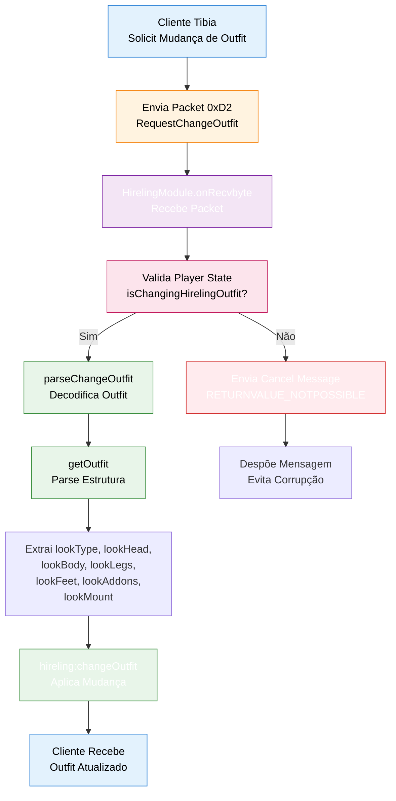

import { Aside, Card } from '@astrojs/starlight/components';

## 🛠️ Informações do Arquivo

Arquivo que implementa o **módulo de protocol de hirelings** para o sistema GameServer. Responsável por processar packets de rede relacionados à mudança de outfit (aparência) de hirelings, validar mudanças de outfit entre cliente e servidor, e decodificar estruturas binárias de outfit.

<Card title="Caminho Original" icon="document">
  `data/modules/scripts/hirelings/hireling_module.lua`
</Card>

<Aside type="tip">
  Módulo de rede para hirelings. Implementa decodificação de packets (RequestChangeOutfit 0xD2, ConfirmOutfitChange 0xD3), parsing de estruturas de outfit (lookType, lookHead, lookBody, lookLegs, lookFeet, lookAddons, lookMount), validações de segurança (verifica se hireling existe e player tem permissão). Versão 1.0 desenvolvido por Leonardo "Leu" Pereira. Dependências: player:getHirelingChangingOutfit(), hireling:changeOutfit(), player:isChangingHirelingOutfit().
</Aside>

---

## 📄 Visão Geral do Código

### Resumo Executivo

`hireling_module.lua` é um **módulo network protocol** que operacionaliza o sistema de customização de hirelings no GameServer. Implementa:

1. **Registry de Módulo**: Table `HirelingModule` com metadata de versão e créditos
2. **Protocol Packets**: Definição de opcodes de servidor e cliente para outfit management
3. **Message Parsing**: Funções locais que decodificam estruturas binárias de outfit
4. **Callback Network**: Handler global `onRecvbyte` que intercepta e processa packets do cliente
5. **Validações de Segurança**: Verifica state machine do player antes de aplicar mudanças

**Objetivo Principal**: Permitir que clientes solicitem mudança de outfit de hirelings (mountaria, cores, addons) através de packets de rede, com validação e persistência servidor-side.

### Fluxo de Operação



---

## 🔌 Estrutura do Módulo

### 1️⃣ Tabela Global HirelingModule

Table raiz que agrega todas as funcionalidades do módulo:

```lua
HirelingModule = {}
```

**Propósito**: Namespace global para evitar colisões com outros módulos.

#### Subtabela: Credits

Metadados de créditos e versão do módulo:

| Campo | Tipo | Valor | Descrição |
|-------|------|-------|-----------|
| **`Developer`** | `string` | `"Leonardo 'Leu' Pereira (jlcvp)"` | Desenvolvedor original |
| **`Version`** | `string` | `"1.0"` | Versão do módulo |
| **`Date`** | `string` | `"30/04/2020"` | Data de criação/última atualização |

**Uso**:
```lua
print(HirelingModule.Credits.Developer)  -- Leonardo "Leu" Pereira (jlcvp)
print(HirelingModule.Credits.Version)    -- 1.0
```

#### Subtabela: S_Packets (Server Packets)

Defines opcodes de **packets enviados pelo servidor** para cliente:

| Opcode | Hex | Descrição |
|--------|-----|-----------|
| **`SendOutfitWindow`** | `0xC8` (200 decimal) | Abre janela de customização de outfit no cliente |

**Propósito**: Quando servidor quer que cliente abra a janela de mudança de outfit para um hireling, envia packet 0xC8.

#### Subtabela: C_Packets (Client Packets)

Define opcodes de **packets enviados pelo cliente** para servidor:

| Opcode | Hex | Descrição |
|--------|-----|-----------|
| **`RequestChangeOutfit`** | `0xD2` (210 decimal) | Cliente solicita mudança de outfit |
| **`ConfirmOutfitChange`** | `0xD3` (211 decimal) | Cliente confirma a mudança de outfit |

**Propósito**: Cliente envia estes packets quando interagindo com hireling para mudança de aparência.

---

## 🔧 Funções do Módulo

### Funções Locais (Local Functions)

#### `getOutfit(msg: NetworkMessage): table`

**Assinatura**:
```lua
local function getOutfit(msg)
```

**Propósito**: Decodifica uma estrutura de outfit de um objeto `NetworkMessage` binário.

**Parâmetros**:
- `msg` (`NetworkMessage`): Objeto de mensagem de rede contendo bytes codificados

**Retorno**:
- `outfit` (`table`): Table com campos decodificados de outfit

**Processo de Decodificação**:

```lua
local outfitType = 0
outfitType = msg:getByte()  -- 1 byte: tipo de outfit (0=normal, outro=hireling)

local outfit = {}
outfit.lookType = msg:getU16()      -- 2 bytes: ID do outfit/forma visual
outfit.lookHead = msg:getByte()     -- 1 byte: cor da cabeça
outfit.lookBody = msg:getByte()     -- 1 byte: cor do corpo
outfit.lookLegs = msg:getByte()     -- 1 byte: cor das pernas
outfit.lookFeet = msg:getByte()     -- 1 byte: cor dos pés
outfit.lookAddons = msg:getByte()   -- 1 byte: adiciona do outfit (bitmask)

if outfitType == 0 then
    outfit.lookMount = msg:getU16() -- 2 bytes: ID do mount
else
    outfit.lookMount = 0x00         -- Se hireling: sem mount
    msg:getU32()                    -- Descarta 4 bytes (ID do hireling?)
end

return outfit
```

**Estrutura de Outfit Retornada**:

| Campo | Tipo | Bytes | Descrição |
|-------|------|-------|-----------|
| **`lookType`** | `number` | 2 | ID do outfit visual (ex: 128 = knight, 129 = mage) |
| **`lookHead`** | `number` | 1 | Cor da cabeça (0-255) |
| **`lookBody`** | `number` | 1 | Cor do corpo (0-255) |
| **`lookLegs`** | `number` | 1 | Cor das pernas (0-255) |
| **`lookFeet`** | `number` | 1 | Cor dos pés (0-255) |
| **`lookAddons`** | `number` | 1 | Bitmask com addons selecionados (bit 0=addon1, bit 1=addon2, etc) |
| **`lookMount`** | `number` | 2 | ID do mount montado (0 se hireling sem mount) |

**Exemplo de Uso**:
```lua
-- Em um contexto de processamento de packet:
local outfit = getOutfit(msg)
-- outfit.lookType = 128
-- outfit.lookHead = 95
-- outfit.lookBody = 76
-- outfit.lookLegs = 58
-- outfit.lookFeet = 40
-- outfit.lookAddons = 3  (bits 0 e 1 setados = addons 1 e 2)
-- outfit.lookMount = 0
```

---

#### `parseChangeOutfit(player: Player, msg: NetworkMessage): void`

**Assinatura**:
```lua
local function parseChangeOutfit(player, msg)
```

**Propósito**: Processa uma solicitação de mudança de outfit, validando state e aplicando mudança no hireling.

**Parâmetros**:
- `player` (`Player`): Objeto do player que solicita mudança
- `msg` (`NetworkMessage`): Mensagem de rede contendo dados de outfit

**Lógica**:

```lua
local hireling = player:getHirelingChangingOutfit()  -- Obtém hireling em changes
local outfit

if not hireling then
    -- Hireling não existe ou mudança não autorizada
    player:sendCancelMessage(RETURNVALUE_NOTPOSSIBLE)
    player:getPosition():sendMagicEffect(CONST_ME_POFF)  -- Efeito visual de erro
    
    -- Deplete (consome) a mensagem para evitar corrupção de stream
    getOutfit(msg)
else
    -- Hireling válido, processa outfit
    outfit = getOutfit(msg)
    hireling:changeOutfit(outfit)
end
```

**Fluxo de Decisão**:

| Condição | Ação |
|----------|------|
| `hireling == nil` | Envia erro, consome msg, não aplica mudança |
| `hireling ~= nil` | Decodifica outfit, aplica `hireling:changeOutfit()` |

**Segurança**:
- **Validação de Existência**: Verifica se hireling existe antes de modificar
- **Consumo de Mensagem**: Se erro, ainda consome bytes para evitar desincronização de protocol
- **Feedback Visual**: Envia efeito visual (CONST_ME_POFF) indicando falha

---

### Funções Globais (Global Functions)

#### `onRecvbyte(player: Player, msg: NetworkMessage, byte: number): void`

**Assinatura**:
```lua
function onRecvbyte(player, msg, byte)
```

**Propósito**: Callback global chamado pelo server sempre que um packet é recebido do cliente. Funciona como **dispatcher** de packets.

**Parâmetros**:
- `player` (`Player`): Player que enviou o packet
- `msg` (`NetworkMessage`): Objeto contendo payload do packet
- `byte` (`number`): Opcode (primeiro byte) do packet

**Lógica**:

```lua
if byte == HirelingModule.C_Packets.ConfirmOutfitChange then
    -- Packet é uma confirmação de mudança de outfit
    
    if not player:isChangingHirelingOutfit() then
        -- Player não está em processo de mudança - ignore
        return
    end
    
    -- Player está habilitado para mudança, processa
    parseChangeOutfit(player, msg)
end
```

**Fluxo de Interceptação**:

| Condição | Ação |
|----------|------|
| `byte ~= ConfirmOutfitChange (0xD3)` | Ignora (dispatch para outro handler) |
| `byte == 0xD3 && not isChangingHirelingOutfit()` | Retorna sem ação (segurança) |
| `byte == 0xD3 && isChangingHirelingOutfit() == true` | Chama parseChangeOutfit() |

**Segurança**:
- **State Validation**: Verifica `player:isChangingHirelingOutfit()` antes de processar
- **Opcode Filtering**: Só processa opcode específico (0xD3), outros ignorados
- **Early Return**: Previne ações não-autorizadas

---

## 📊 Estrutura de Dados

### Outfit Structure

Tabela que representa visually aparência de um character ou hireling:

```lua
{
    lookType = 128,          -- U16: ID do outfit (1-1200+)
    lookHead = 95,           -- BYTE: cor de cabeça (0-255)
    lookBody = 76,           -- BYTE: cor de corpo (0-255)
    lookLegs = 58,           -- BYTE: cor de pernas (0-255)
    lookFeet = 40,           -- BYTE: cor de pés (0-255)
    lookAddons = 3,          -- BYTE: bitmask de addons (bits 0-2 = addons1-3)
    lookMount = 0            -- U16: ID do mount (0 = sem mount / hireling)
}
```

**Tamanhos Binários**:
- **Total com mount**: 10 bytes
- **Total sem mount (hireling)**: 8 bytes + 4 bytes descartados = 12 bytes

---

## 🔄 Fluxo de Operação Completo

### Sequência Cliente → Servidor → Resposta

```
1. [CLIENTE]
   - User clica em "Change Outfit" no hireling
   - Cliente abre dialog de customização
   - User seleciona cores, addons, mount
   - User clica em "Confirm"

2. [CLIENTE → SERVIDOR]
   - Envia Packet 0xD2 (RequestChangeOutfit)
   - Payload: outfitType + outfit data (10 bytes)

3. [SERVIDOR]
   - onRecvbyte intercepta packet
   - Verifica se é byte 0xD3 (ConfirmOutfitChange)
   - Se sim, checa player:isChangingHirelingOutfit()
   
4. [VALIDAÇÃO]
   - Se player NÃO está em "changing mode":
     * Envia RETURNVALUE_NOTPOSSIBLE
     * Efeito visual de erro
     * Consome mensagem (segurança)
     * FIM
   
   - Se player ESTÁ em "changing mode":
     * getOutfit decodifica estrutura
     * parseChangeOutfit valida hireling
     * hireling:changeOutfit aplica visualmente
     * Persistência no banco de dados (presumido)
     * FIM

5. [CLIENTE]
   - Recebe atualização
   - Hireling aparece com novo outfit
```

---

## 🎯 Casos de Uso

### Use Case 1: Mudança Normal de Outfit

**Cenário**: Player muda cor e addons de hireling

```lua
-- Cliente envia packet com:
-- outfitType = 0 (character, não mount)
-- lookType = 145 (warrior outfit)
-- lookHead = 88, lookBody = 79, lookLegs = 77, lookFeet = 74
-- lookAddons = 1 (addon 1 selecionado)
-- lookMount = 0 (sem mount)

-- Sistema processa:
-- getOutfit() decodifica os 10 bytes
-- hireling:changeOutfit() aplica mudança
-- Banco de dados é atualizado
-- Cliente vê hireling com novo look
```

### Use Case 2: Erro de Validação

**Cenário**: Packet vem de player NÃO em "changing mode"

```lua
-- Player envia packet 0xD3 (ConfirmOutfitChange)
-- Mas player:isChangingHirelingOutfit() == false

-- Sistema:
-- Retorna sem processar
-- Previne mudança não-autorizada
-- Protege contra cheats/spoofing
```

### Use Case 3: Hireling Não Existe

**Cenário**: Player em "changing mode" mas hireling foi deletado/despawned

```lua
-- player:getHirelingChangingOutfit() retorna nil

-- Sistema:
-- Envia RETURNVALUE_NOTPOSSIBLE
-- Efeito visual de "poff" (desaparece)
-- Consome bytes da mensagem
-- Evita desincronização de protocol
```

---

## 🔐 Considerações de Segurança

### 1. State Validation

```lua
if not player:isChangingHirelingOutfit() then
    return  -- Rejeita se não está em estado autorizado
end
```

**Previne**: Mudanças não-autorizadas, hijacking de outfit de outro player

### 2. Message Consumption

```lua
-- Se erro, ainda consome a mensagem:
getOutfit(msg)  -- Consome bytes mesmo sem aplicar
```

**Previne**: Desincronização de protocol stream (importante em rede binária)

### 3. Existência de Hireling

```lua
local hireling = player:getHirelingChangingOutfit()
if not hireling then
    -- Handle erro
end
```

**Previne**: Crashes, null pointer dereferences

### 4. Opcode Filtering

```lua
if byte == HirelingModule.C_Packets.ConfirmOutfitChange then
    -- Processa apenas para 0xD3
    -- Outros opcodes ignorados
end
```

**Previne**: Processamento de packets indevidos

---

## ✅ Checkpoint de Aprendizagem

### Conceitos Principais

1. **Network Callbacks**: `onRecvbyte` é função de callback de dispatcher de packets
2. **Binary Protocol**: Network packets são binários (getU16, getByte) com tamanho fixo
3. **State Machines**: Player tem estado "isChangingHirelingOutfit" controlando acesso
4. **Message Depletion**: Importante consumir bytes mesmo em erro para sincronização
5. **Outfit Structure**: 10 bytes para character (com mount), 12 bytes para hireling

### Design Patterns

- **Namespace Module**: HirelingModule table agrupa tudo
- **Local Functions**: getOutfit, parseChangeOutfit são privadas (local)
- **Global Dispatcher**: onRecvbyte é global, chamada pelo engine
- **Early Return**: Retorna cedo em caso de erro (prevent nesting)
- **Message Validation**: Valida state antes de processar estrutura

### Responsabilidades

| Função | Responsabilidade |
|--------|------------------|
| **Credits** | Metadados de versão |
| **S_Packets** | Define opcodes servidor→cliente |
| **C_Packets** | Define opcodes cliente→servidor |
| **getOutfit()** | Decodifica estrutura binária de outfit |
| **parseChangeOutfit()** | Valida e aplica mudança no hireling |
| **onRecvbyte()** | Callback de dispatcher de packets |

---

## 📚 Conclusão

`hireling_module.lua` é um **módulo network protocol leve mas essencial** para o sistema de customização de hirelings. Implementa:

1. **Protocol Definition**: Opcodes para mudança de outfit
2. **Binary Parsing**: Decodificação de estruturas outfit de network stream
3. **Validation & Security**: Verifica state machine antes de aplicar mudanças
4. **Error Handling**: Rejeita mudanças não-autorizadas com feedback apropriado
5. **Synchronization**: Consome mensagens mesmo em erro para manter integridade de protocol

Com apenas ~60 linhas, fornece todas as funcionalidades necessárias para **sincronizar customizações de hireling entre cliente e servidor**, mantendo segurança e consistência de dados.

---

## 🤖 Informações da Documentação

<Card title="Metadata da Documentação" icon="star">
  - **Arquivo Original**: hireling_module.lua
  - **Caminho**: data/modules/scripts/hirelings/
  - **Tipo**: Módulo Network Protocol
  - **Última Atualização**: 2026-02-19
  - **Status**: ✅ Completo
  - **Linhas de Código**: ~59 linhas
  - **Versão do Módulo**: 1.0
  - **Desenvolvedor Original**: Leonardo "Leu" Pereira (jlcvp)
  - **Data Original**: 30/04/2020
  - **Funções Globais**: 1 (onRecvbyte)
  - **Funções Locais**: 2 (getOutfit, parseChangeOutfit)
  - **Opcodes Processados**: 2 (RequestChangeOutfit 0xD2, ConfirmOutfitChange 0xD3)
</Card>

<Aside type="note">
  **Nota de Manutenção**: Este módulo implementa protocol crítico para hirelings. Modificações devem preservar: (1) Opcodes 0xD2 e 0xD3 conforme Tibia client, (2) Estrutura de outfit 10 bytes (com mount) vs 12 bytes (hireling), (3) State validation player:isChangingHirelingOutfit() antes de aplicar, (4) Message consumption para sincronização de protocol, (5) Error handling com RETURNVALUE_NOTPOSSIBLE, (6) Compatibilidade com hireling:changeOutfit(outfit). Se alterar tamanho/ordem de campos em outfit, DEVE atualizar getOutfit() e tibia client simultaneously para evitar desincronização.
</Aside>

```