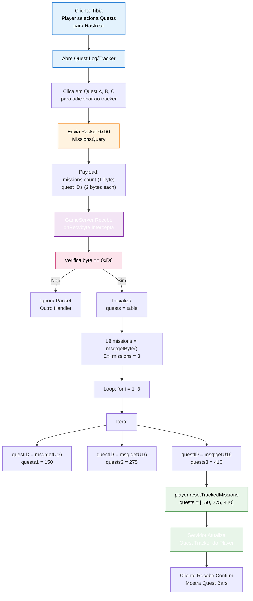

import { Aside, Card } from '@astrojs/starlight/components';

## 🛠️ Informações do Arquivo

Arquivo que implementa o **módulo de protocol para rastreamento de quests** do GameServer. Responsável por processar packets de rede do cliente relacionados a mudanças em quests rastreadas (quest tracking), receber lista de quests selecionadas pelo player e sincronizar o estado de rastreamento servidor-side.

<Card title="Caminho Original" icon="document">
  `data/modules/scripts/questtrack/questtrack.lua`
</Card>

<Aside type="tip">
  Módulo network protocol para quest tracking. Implementa decodificação de packet 0xD0 (MissionsQuery/SetTrackedQuests), parsing de lista de quest IDs, validação de missions count, sincronização de estado via player:resetTrackedMissions(). Arquivo minimalista (~11 linhas) focado em uma responsabilidade: interceptar e processar seleção de quests rastreadas pelo cliente. Depende de: msg:getByte(), msg:getU16(), player:resetTrackedMissions(quests).
</Aside>

---

## 📄 Visão Geral do Código

### Resumo Executivo

`questtrack.lua` é um **módulo network protocol minimalista** que coordena o rastreamento de quests entre cliente e servidor. Implementa:

1. **Network Callback**: Única função global `onRecvbyte` que intercepta packets
2. **Protocol Handler**: Processa opcode 0xD0 (MissionsQuery) do cliente
3. **Message Parsing**: Decodifica estrutura binária contendo lista de quest IDs
4. **State Synchronization**: Valida e aplica mudanças de quests rastreadas no player
5. **Validação Dinâmica**: Lê count de quests do packet antes de iterar

**Objetivo Principal**: Permitir que players selecionem quais quests rastrear (mostrar barra de progresso), sincronizando seleção entre cliente e servidor em tempo real.

### Fluxo de Operação



---

## 🔌 Estrutura do Módulo

### Módulo Minimalista

O arquivo `questtrack.lua` segue um padrão **ultra-simples** de dispatch network:

```lua
function onRecvbyte(player, msg, byte)
    -- Única função, sem tabela wrapper ou módulo
    -- Callback global chamado pelo server engine
end
```

**Design Racional**:
- Sem namespace module (diferente de hireling_module.lua)
- Responsabilidade única: processar um opcode específico (0xD0)
- Máxima simplicidade mantendo funcionalidade completa
- Integra-se diretamente com sistema global de callbacks

---

## 🔧 Funções do Módulo

### Funções Globais (Global Functions)

#### `onRecvbyte(player: Player, msg: NetworkMessage, byte: number): void`

**Assinatura**:
```lua
function onRecvbyte(player, msg, byte)
```

**Propósito**: Callback global executado pelo GameServer para **CADA packet recebido** do cliente. Funciona como dispatcher de opcodes.

**Parâmetros**:
- `player` (`Player`): Objeto do player que enviou o packet
- `msg` (`NetworkMessage`): Objeto binário contendo payload (mensagem)
- `byte` (`number`): Opcode (primeiro byte do packet)

**Responsabilidade**: Interceptar packet 0xD0 (MissionsQuery), decodificar lista de quest IDs, aplicar via `player:resetTrackedMissions()`.

---

### Lógica de Processamento

#### Opcode Filtering

```lua
if byte == 0xD0 then
    -- Processa apenas packets com opcode 0xD0
    -- Todos outros opcodes são ignorados
end
```

**Propósito**: Garantir que apenas MissionsQuery (0xD0) seja processado. Outros opcodes (0xC0, 0xC1, etc) passam para outros handlers.

**Opcode Reference**:
| Opcode | Hex | Nome | Descrição |
|--------|-----|------|-----------|
| **0xD0** | 208 | MissionsQuery | cliente solicita update de quests rastreadas |

---

#### Inicialização de Variáveis Locais

```lua
local quests = {}           -- Array vazio para armazenar quest IDs
local missions = msg:getByte()  -- Primeiro byte: quantidade de quests
```

**Estrutura de Variáveis**:

| Variável | Tipo | Descrição | Exemplo |
|----------|------|-----------|---------|
| **`quests`** | `table` | Array que acumula quest IDs decodificados | `{150, 275, 410}` |
| **`missions`** | `number` | Quantidade de quests que serão lidas | `3` |

**Por que `missions` é dinâmico?**
- Cliente pode enviar 1 quest, 5 quests, ou 0 quests (desrastrear tudo)
- Leitoria de primeiro byte permite flexibilidade
- Server adapta a quantos quests o cliente enviou

---

#### Loop de Decodificação

```lua
for i = 1, missions do
    quests[#quests + 1] = msg:getU16()
end
```

**Processo Iterativo**:

| Iteração | Operação | Resultado |
|----------|----------|-----------|
| **i=1** | `quests[1] = msg:getU16()` → 150 | `quests = {150}` |
| **i=2** | `quests[2] = msg:getU16()` → 275 | `quests = {150, 275}` |
| **i=3** | `quests[3] = msg:getU16()` → 410 | `quests = {150, 275, 410}` |

**Análise de Código**:
- `#quests + 1` = comprimento atual da tabela + 1 (próximo índice)
- `msg:getU16()` = lê 2 bytes da mensagem, converte para número (0-65535)
- Quest IDs são U16 (unsigned 16-bit): suporta até 65.535 quests diferentes

---

#### Aplicação de Estado

```lua
player:resetTrackedMissions(quests)
```

**Propósito**: Atualiza servidor-side qual é a **lista de quests rastreadas** do player.

**Contrato**:
- **Input**: `quests` = array de quest IDs (ex: `{150, 275, 410}`)
- **Output**: Nenhum (modificação in-place do player state)
- **Side Effects**: 
  - Atualiza database (presumido)
  - Sincronia com cliente (client saberá quais quests estão rastreadas)
  - Habilita novas quest bars na UI do cliente

**Semântica**:
- **`resetTrackedMissions`** = substitui a lista antiga (se houver) pela nova
- Se `quests = {}` (vazio), **todos** rastreamentos são removidos
- Se `quests = {100, 200}`, apenas quests 100 e 200 são rastreadas

---

## 📊 Estrutura de Dados

### Binary Protocol Format

O packet 0xD0 segue estrutura rigorosa no network stream:

```
[Opcode: 0xD0]
[Missions Count: 1 byte]
[Quest ID 1: 2 bytes (U16)]
[Quest ID 2: 2 bytes (U16)]
[Quest ID N: 2 bytes (U16)]
```

**Exemplo Real**:
```
Byte 0:   0xD0              -- Opcode
Byte 1:   0x03              -- 3 quests
Bytes 2-3: 0x0096           -- Quest 150 (in hex: 0x96 = 150 decimal)
Bytes 4-5: 0x0113           -- Quest 275 (in hex: 0x113 = 275 decimal)
Bytes 6-7: 0x019A           -- Quest 410 (in hex: 0x19A = 410 decimal)
```

**Tamanho Total**:
```
1 byte (opcode) + 1 byte (count) + (count * 2 bytes) = 1 + 1 + (n * 2)
- Mínimo: 1 + 1 + 0 = 2 bytes (0 quests)
- Exemplo: 1 + 1 + (3 * 2) = 8 bytes (3 quests)
- Máximo: 1 + 1 + (N * 2) = ilimitado (bounded por buffer de network)
```

### Quests Array

Após decodificação, `quests` é array Lua com quest IDs:

```lua
local quests = {150, 275, 410}  -- Array ordenado de quest IDs

-- Características:
-- - Tipo: table (Lua array)
-- - Índices: 1, 2, 3, ... N
-- - Valores: números U16 (0-65535)
-- - Sem duplicatas (presumido pelo cliente)
-- - Ordem: mantém ordem de envio do cliente
```

---

## 🔄 Fluxo de Operação Completo

### Sequência Temporal

```
T0: [CLIENTE]
    └─ Player abre Quest Log
       Vê 100+ quests disponíveis
       Seleciona/deseleciona quests para rastrear

T1: [CLIENTE → SERVIDOR]
    └─ Envia Packet 0xD0 "MissionsQuery"
       Payload: [0xD0] [count] [quest_ids...]
       Exemplo: [0xD0] [3] [150] [275] [410]

T2: [SERVIDOR - Network Layer]
    └─ Packet entra no buffer de recebimento
       Engine parseObj primeiro byte: 0xD0
       Chama onRecvbyte(player, msg, 0xD0)

T3: [SERVIDOR - questtrack.lua]
    └─ Verifica: byte == 0xD0? Sim!
       Inicializa: quests = {}
       Lê: missions = msg:getByte() → 3
       Loop:
         - quests[1] = msg:getU16() → 150
         - quests[2] = msg:getU16() → 275
         - quests[3] = msg:getU16() → 410

T4: [SERVIDOR - Player Object]
    └─ Chama: player:resetTrackedMissions({150, 275, 410})
       Atualiza player.trackedQuests internamente
       Persistência no database (presumido)

T5: [SERVIDOR → CLIENTE]
    └─ Server envia confirmação (presumido)
       Client atualiza UI: mostra 3 quest bars
       Player vê progresso de 3 quests selecionadas

T6: [CLIENTE]
    └─ Quest tracker mostra
       Quest 150: [████░░░░░░] 40% completo
       Quest 275: [██░░░░░░░░] 20% completo
       Quest 410: [███████░░░] 70% completo
```

---

## 🎯 Casos de Uso

### Use Case 1: Rastreamento Simples

**Cenário**: Player seleciona 3 quests para rastrear

```lua
-- Cliente envia:
-- Opcode: 0xD0
-- Missions: 3
-- Quest IDs: [150, 275, 410]

-- questtrack.lua processa:
local quests = {}
local missions = msg:getByte()  -- 3
for i = 1, 3 do
    quests[#quests + 1] = msg:getU16()  -- {150, 275, 410}
end
player:resetTrackedMissions({150, 275, 410})

-- Resultado:
-- Player tracker atualizado
-- Database salvo
-- Cliente mostra 3 quest bars
```

### Use Case 2: Desrastreamento Total

**Cenário**: Player remove todos os rastreamentos (clica "Clear All")

```lua
-- Cliente envia:
-- Opcode: 0xD0
-- Missions: 0
-- Quest IDs: (nenhum)

-- questtrack.lua processa:
local quests = {}
local missions = msg:getByte()  -- 0
for i = 1, 0 do  -- Loop não executa
    -- Nenhuma iteração
end
player:resetTrackedMissions({})  -- Array vazio

-- Resultado:
-- Todos rastreamentos removidos
-- Quest tracker limpo na tela
```

### Use Case 3: Mudança de Seleção

**Cenário**: Player estava rastreando `[100, 200]` e muda para `[150, 300]`

```lua
-- Primeiro packet (T1):
player:resetTrackedMissions({100, 200})

-- Segundo packet (T2):
player:resetTrackedMissions({150, 300})  -- Substitui completamente

-- Resultado:
-- Old quests (100, 200) não rastreadas
-- New quests (150, 300) rastreadas
-- "reset" = replace, não append
```

---

## 🔐 Considerações de Segurança

### 1. Opcode Filtering

```lua
if byte == 0xD0 then
    -- Processa apenas 0xD0
    -- Outros opcodes ignorados
end
```

**Segurança**: Garante que packets malformados com outro opcode não triggerem lógica de quest.

### 2. Dynamic Mission Count

```lua
local missions = msg:getByte()  -- Lê count do packet
for i = 1, missions do
    -- Itera conforme count enviado
end
```

**Segurança**: 
- Evita hardcode de quantidade (x quests sempre)
- Adapta a payloads reais
- Se cliente envia 0, nenhuma iteração ocorre

### 3. No Validation of Quest IDs

⚠️ **Potencial Issue**:
```lua
quests[#quests + 1] = msg:getU16()  -- Aceita ANY U16
```

**O código NÃO valida**:
- Existência da quest (ID válido no servidor)
- Permissões (player pode rastrear essa quest?)
- Duplicatas (Lua array permite [100, 100])

**Implicação**: 
- Se cliente malicioso envia ID falso, server aceita
- `player:resetTrackedMissions` pode rejeitar em sua lógica interna
- Neste módulo especifico, **validação é responsibility do método chamado**

### 4. Message Stream Synchronization

```lua
for i = 1, missions do
    quests[#quests + 1] = msg:getU16()  -- Consome exatamente missions*2 bytes
end
```

**Segurança**: Se `missions` está correto, consome bytes exatos. Se cliente envia `missions=3` mas só 1 quest, `msg:getU16()` na segunda iteração pode causar problema. Mas isso é **responsabilidade do client** enviar corretamente.

---

## ✅ Checkpoint de Aprendizagem

### Conceitos Principais

1. **Network Callbacks**: `onRecvbyte` é função de callback global chamada para CADA packet
2. **Binary Protocol**: Packets são binários (bytes) com estrutura fixa
3. **Opcode Dispatch**: Primeiro byte define tipo de operação (0xD0 para quests)
4. **Dynamic Loops**: Lê count do packet, after loops conforme necessário
5. **State Mutation**: `player:resetTrackedMissions()` modifica estado do player

### Design Patterns

- **Single Callback Pattern**: Uma função global handle múltiplos opcodes via if-checks
- **Message Unpacking**: Sequência de msg:getByte() + msg:getU16() para desmontar packet
- **Array Accumulation**: `quests[#quests + 1]` pattern para append a table
- **Lazy Validation**: Este módulo decodifica; validação ocorre em `resetTrackedMissions`
- **Stateless Processing**: Função nenhum side-effect além de player update

### Responsabilidades

| Operação | Owner |
|----------|-------|
| **Opcode filtering** | `questtrack.lua` |
| **Message unpacking** | `questtrack.lua` |
| **Quest validation** | `player:resetTrackedMissions` |
| **Database persistence** | `player:resetTrackedMissions` |
| **Client synchronization** | Network layer / client |

---

## 📚 Conclusão

`questtrack.lua` é um **módulo network protocol ultra-minimalista mas completo** para rastreamento de quests. Em apenas ~11 linhas, implementa:

1. **Network Interception**: Callback global para packets
2. **Binary Deserialization**: Decodifica payload 0xD0 com count dinâmico
3. **State Synchronization**: Aplica mudanças via `resetTrackedMissions`
4. **Robustez Simples**: Sem validação complexa, delega para chamado

Com design simples e focado, fornece tudo necessário para **sincronizar quest tracking entre cliente e servidor**, permitindo players rastrearem múltiplas quests com progresso visual.

---

## 🤖 Informações da Documentação

<Card title="Metadata da Documentação" icon="star">
  - **Arquivo Original**: questtrack.lua
  - **Caminho**: data/modules/scripts/questtrack/
  - **Tipo**: Módulo Network Protocol
  - **Última Atualização**: 2026-02-19
  - **Status**: ✅ Completo
  - **Linhas de Código**: ~11 linhas
  - **Funções Globais**: 1 (onRecvbyte)
  - **Funções Locais**: 0
  - **Variáveis Locais**: 2 (quests, missions)
  - **Opcodes Processados**: 1 (0xD0 = MissionsQuery)
  - **Bytes Consumidos**: 1 (opcode) + 1 (count) + (count × 2 bytes quest IDs)
  - **Complexidade**: O(n) onde n = número de quests
</Card>

<Aside type="note">
  **Nota de Manutenção**: Este módulo implementa protocol crítico para quest tracking. Modificações devem preservar: (1) Opcode 0xD0 conforme Tibia client standard, (2) Message format: [count] [questID1] [questID2]..., (3) Dynamic loop baseado em count (não hardcoded), (4) Compatibilidade com player:resetTrackedMissions(quests) signature, (5) Return type void (sem resposta). Se alterar protocol, DEVE coordenar com client build contemporaneamente. Considerar adicionar validation de quest IDs se vulnerabilidades de quest injection forem descobertas.
</Aside>

```