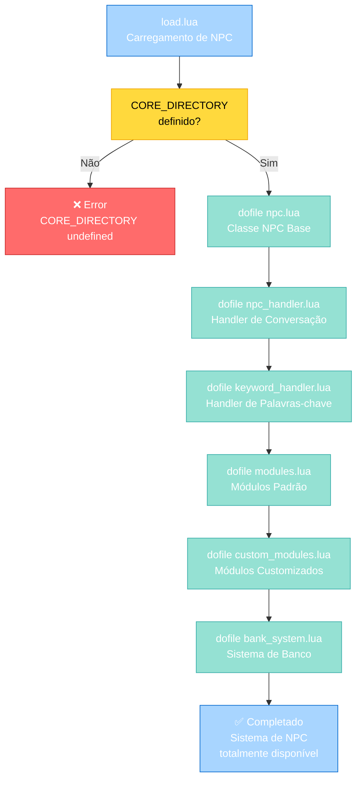
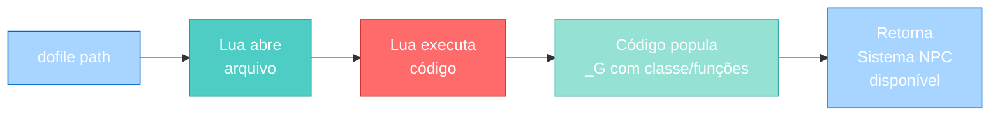
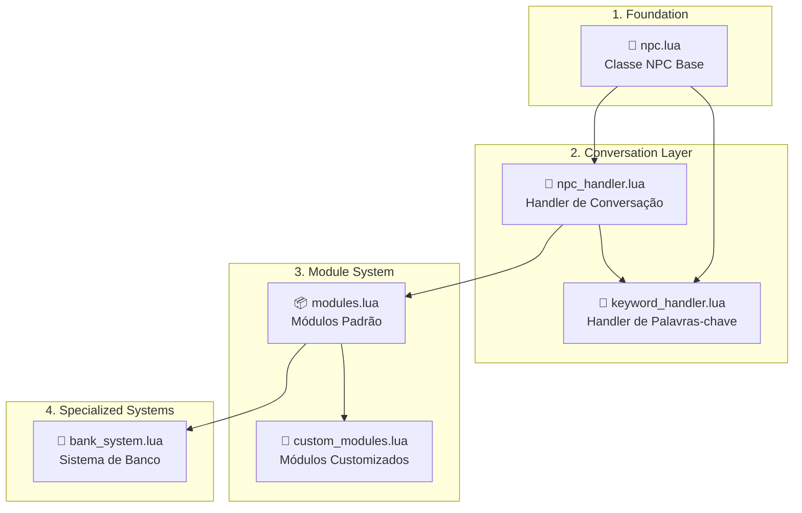
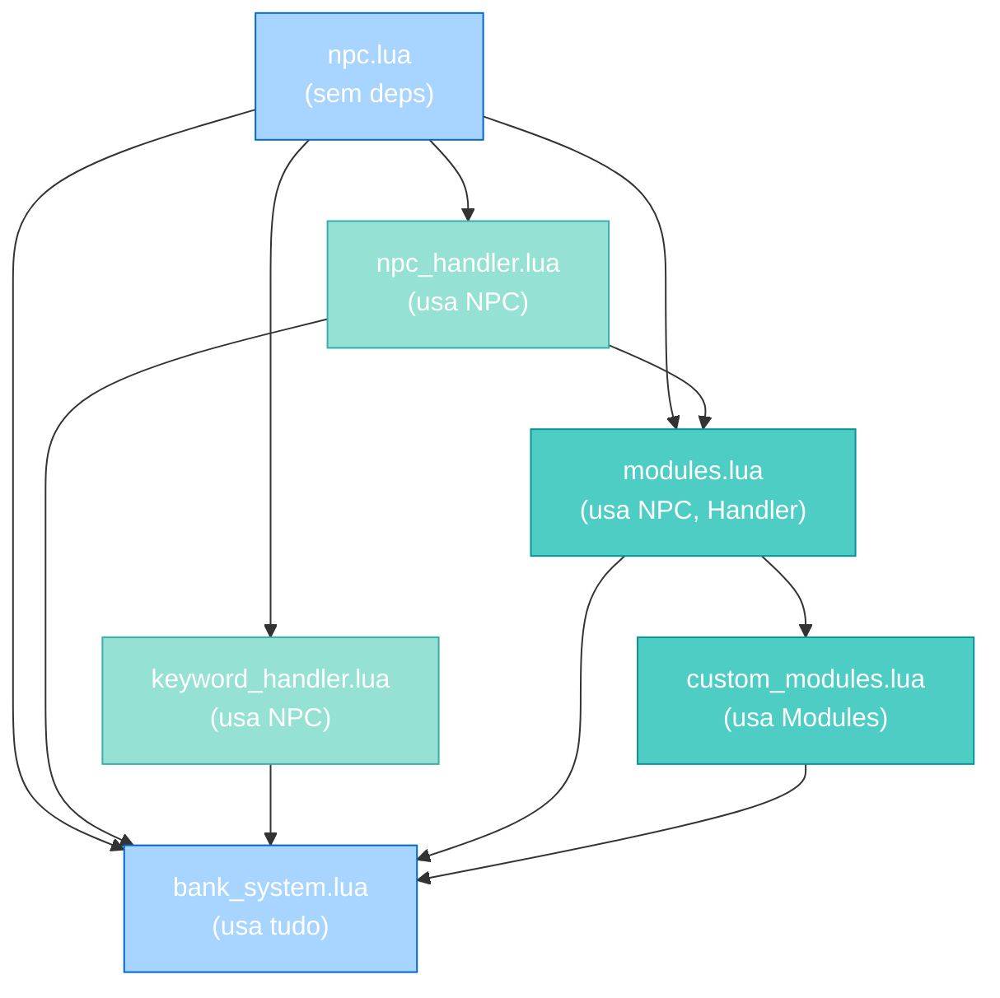
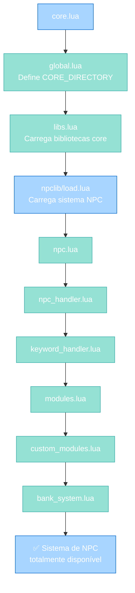

import { Aside, Card } from '@astrojs/starlight/components';

## 🛠️ Informações do Arquivo

Este é o arquivo de **carregamento da biblioteca de NPCs** do servidor **OpenTibiaBR/Canary**. Ele é responsável por importar e disponibilizar todo o sistema de criação, configuração e gerenciamento de NPCs.

<Card title="Caminho Original" icon="document">
  `data/npclib/load.lua`
</Card>

<Aside type="tip">
  Este arquivo é carregado durante a inicialização do servidor (após libs.lua) e é o ponto central que popula o ambiente Lua com toda a infraestrutura necessária para construir e gerenciar NPCs. Cada `dofile()` carregado expõe novas APIs de NPC.
</Aside>

## 📄 Visão Geral do Código

### Resumo Executivo

`npclib/load.lua` é um módulo de **agregação e carregamento de sistema de NPCs**. Ele:

1. **Carrega sistema NPC core**: Importa módulos do `CORE_DIRECTORY` que implementam NPCs
2. **Expõe APIs de NPC**: Cada `dofile()` popula o ambiente global com classes, handlers e sistemas
3. **Organiza dependências**: Carrega módulos em ordem correta (npc base → handlers → módulos → sistemas)
4. **Centraliza imports NPC**: Um único arquivo que orquestra todos os imports de NPC

O arquivo não exporta nada - ele apenas carrega e deixa as APIs de NPC disponíveis globalmente.

### Estrutura de Carregamento



---

## 3. Variáveis Globais

### 3.1 `CORE_DIRECTORY`

```lua
CORE_DIRECTORY .. "/npclib/npc.lua"
```

| Propriedade | Valor |
|-------------|-------|
| **Tipo** | string |
| **Escopo** | Global (definido por global.lua) |
| **Inicialização** | Em `data/global.lua` |
| **Propósito** | Caminho para diretório de bibliotecas core do engine |

**Descrição**: Variável global que aponta para o diretório base das bibliotecas implementadas em C++ ou pré-compiladas. Usada para resolver caminhos de módulos NPC.

**Exemplo de Uso**:
```lua
-- Em load.lua:
dofile(CORE_DIRECTORY .. "/npclib/npc.lua")
-- Resulta em:
-- dofile("/path/to/lib/npclib/npc.lua")
```

---

## 4. Funções Implementadas

### 4.1 Mecanismo: `dofile()`

`npclib/load.lua` não define funções explícitas - usa `dofile()` para carregar e executar outros arquivos.

#### Assinatura da Operação

```lua
dofile(CORE_DIRECTORY .. "/npclib/<modulo>")
```

O padrão é:
- Cada módulo está em `CORE_DIRECTORY/npclib/<modulo>/`
- Cada arquivo carrega uma parte do sistema NPC
- Os carregamentos expõem classes e funções globais

#### Ciclo de Carregamento



---

## 5. Módulos Carregados

### Ordem e Sequência de Carregamento

Os módulos são carregados em **ordem específica**. A ordem importa porque cada um é construído sobre os anteriores:



### 5.1 `npc.lua` - Classe NPC Base

#### Carregamento
```lua
dofile(CORE_DIRECTORY .. "/npclib/npc.lua")
```

#### Responsabilidade

Define **classe base NPC** e sistema fundamental para criar NPCs no servidor.

#### Exemplos de Funcionalidades

- **Construtor NPC**: `NPC(name, id)` para criar novo NPC
- **Attributes**: Nome, ID, localização, aparência
- **Event registration**: Registrar handlers de eventos
- **State management**: Sistema de armazenamento por NPC

#### Quando Está Disponível

Imediatamente após `dofile()` dessa biblioteca. Todas as outras bibliotecas NPC podem usá-la.

#### Exemplo de Uso

```lua
-- Criar novo NPC
local banker = NPC("Banker John", 1000)

-- Acessar propriedades
banker:setName("John the Banker")
banker:setPosition(Position(100, 100, 7))

-- Registrar evento
banker:registerEvent("onGreet")
```

---

### 5.2 `npc_handler.lua` - Handler de Conversação

#### Carregamento
```lua
dofile(CORE_DIRECTORY .. "/npclib/npc_system/npc_handler.lua")
```

#### Responsabilidade

Implementa **sistema de conversação entre player e NPC** com state management.

#### Conceitos Principais

- **Topic**: Estado da conversa (0 = idle, 1 = buying, 2 = selling, etc.)
- **Dialog**: Mensagens que o NPC diz
- **Conditions**: Verificações antes de aceitar ações
- **Actions**: Funções executadas após player responder

#### Exemplos de Funções

```lua
-- Criar handler para NPC
local handler = NpcHandler:new()

-- Definir topic inicial
handler:setTopic(playerId, 0)

-- Obter topic atual
local currentTopic = handler:getTopic(playerId)

-- NPC fala
handler:say("Hello, what can I do for you?", npc, player)

-- Adicionar diálogo com condição
handler:addTalk({
    text = "You want to buy?",
    keywords = {"buy"},
    action = function(npc, player, text)
        handler:setTopic(player:getId(), 1)  -- Muda para topic 1
    end
})
```

---

### 5.3 `keyword_handler.lua` - Handler de Palavras-chave

#### Carregamento
```lua
dofile(CORE_DIRECTORY .. "/npclib/npc_system/keyword_handler.lua")
```

#### Responsabilidade

Implementa **sistema de matching de palavras-chave** nas mensagens do player.

#### Conceitos Principais

- **Keywords**: Palavras que o NPC reconhece no chat
- **Matching**: Buscar keywords na mensagem do player
- **Case-insensitive**: Parte ou exata da mensagem
- **Priority**: Algumas palavras têm prioridade maior

#### Exemplos de Funções

```lua
-- Verificar se mensagem contém palavra
if keyword_handler:containsKeyword("buy", message) then
    -- Executar ação
end

-- Extrair valor de mensagem
local amount = keyword_handler:extractNumber(message)
-- "deposit 1000" → 1000

-- Encontrar palavra-chave exata
local keyword = keyword_handler:findKeyword(message)
-- "hello world" → "hello"
```

---

### 5.4 `modules.lua` - Módulos Padrão

#### Carregamento
```lua
dofile(CORE_DIRECTORY .. "/npclib/npc_system/modules.lua")
```

#### Responsabilidade

Fornece **módulos padrão de comportamento** que podem ser anexados a NPCs.

#### Exemplos de Módulos

- **greet_module**: Cumprimenta players ao aproximarem
- **shop_module**: Adiciona funcionalidade de loja (buy/sell)
- **quest_module**: Sistema de quests
- **trade_module**: Negociação entre players
- **healing_module**: NPC que cura players

#### Como Usar

```lua
-- Criar NPC
local innkeeper = NPC("Innkeeper Bob", 1001)

-- Adicionar módulo de loja
innkeeper:addModule(ShopModule:new({
    buy = {
        {itemId = 1, price = 100},
        {itemId = 2, price = 200}
    },
    sell = {
        {itemId = 3, price = 50}
    }
}))

-- NPC agora tem funcionalidade de loja automática
```

---

### 5.5 `custom_modules.lua` - Módulos Customizados

#### Carregamento
```lua
dofile(CORE_DIRECTORY .. "/npclib/npc_system/custom_modules.lua")
```

#### Responsabilidade

Fornece **sistema extensível para criar módulos customizados**.

#### Conceito

Permite criar módulos próprios que:
- Herdam de classe base Module
- Implementam handlers de eventos
- Podem ser reutilizados em múltiplos NPCs

#### Exemplo de Módulo Customizado

```lua
-- Definir módulo customizado
local MyModule = Module:new()

function MyModule:onGreet(player)
    player:say("Custom greeting!")
end

function MyModule:onBye(player)
    player:say("Goodbye!")
end

-- Usar em NPC
local npc = NPC("Test NPC", 2000)
npc:addModule(MyModule:new())
```

---

### 5.6 `bank_system.lua` - Sistema de Banco

#### Carregamento
```lua
dofile(CORE_DIRECTORY .. "/npclib/npc_system/bank_system.lua")
```

#### Responsabilidade

Implementa **sistema completo de gerenciamento de banco** (depósitos, saques, transferências).

#### Funcionalidades

- **Depósitos**: `player:depositMoney(amount)`
- **Saques**: `player:withdrawMoney(amount)`
- **Transferências**: `player:transferMoneyTo(recipient, amount)`
- **Saldo**: `player:getBankBalance()`
- **Verificações**: `Bank:hasBalance(player, amount)`

#### Exemplo de Uso

```lua
-- Criar NPC banqueiro
local banker = NPC("Banker", 1002)

-- Adicionar módulo de banco
banker:addModule(BankModule:new())

-- Player agora pode:
-- "deposit 1000" → deposita 1000 gold
-- "withdraw 500" → saca 500 gold
-- "transfer 100 to John" → transfere para outro player
```

#### Integração com Handler

```lua
-- O bank_system integra com npc_handler para gerenciar estado:
handler:setTopic(playerId, BANK_DEPOSIT)     -- Player quer depositar
handler:setTopic(playerId, BANK_WITHDRAW)    -- Player quer sacar
handler:setTopic(playerId, BANK_TRANSFER)    -- Player quer transferir

-- Estados diferentes tratam diferentes diálogos
```

---

## 6. Ordem de Dependência

### Por Que a Ordem Importa

```lua
-- CORRETO: Esta é a ordem em npclib/load.lua
dofile(CORE_DIRECTORY .. "/npclib/npc.lua")                          -- 1. Classe base
dofile(CORE_DIRECTORY .. "/npclib/npc_system/npc_handler.lua")      -- 2. Handler (usa NPC de #1)
dofile(CORE_DIRECTORY .. "/npclib/npc_system/keyword_handler.lua")  -- 3. Keyword parser
dofile(CORE_DIRECTORY .. "/npclib/npc_system/modules.lua")          -- 4. Módulos (usa #1, #2, #3)
dofile(CORE_DIRECTORY .. "/npclib/npc_system/custom_modules.lua")   -- 5. Módulos custom (usa #4)
dofile(CORE_DIRECTORY .. "/npclib/npc_system/bank_system.lua")      -- 6. Banco (usa tudo anterior)
```

#### Diagrama de Dependências



---

## 7. Integração com Arquitetura de Boot

### Sequência Completa de Inicialização



### Timeline

1. **core.lua** inicia
2. **global.lua** é carregado (define `CORE_DIRECTORY`)
3. **libs.lua** é carregado (carrega funções básicas)
4. **npclib/load.lua** é carregado (este arquivo!)
5. Cada `dofile()` em npclib/load.lua carrega um módulo NPC
6. Todas as APIs de NPC estão agora disponíveis
7. Resto do datapack pode criar e usar NPCs

---

## 8. Exemplos de Comportamento

### Exemplo 1: Criar NPC Simples

```lua
-- Após npclib/load.lua ser carregado:

-- Criar novo NPC
local myNPC = NPC("Guarda", 5000)

-- Configurar
myNPC:setName("Guard John")
myNPC:setPosition(Position(100, 100, 7))
myNPC:setHealthBar(true)

-- Resultado: NPC disponível no servidor
```

### Exemplo 2: NPC com Handler de Conversa

```lua
-- Criar NPC
local quest_npc = NPC("Quest Master", 5001)

-- Criar handler de conversa
local handler = NpcHandler:new()

-- Adicionar diálogo inicial
handler:addTalk({
    keywords = {"hello", "hi"},
    text = "Hello adventurer! Want to do a quest?",
    action = function(npc, player, text)
        handler:setTopic(player:getId(), 1)
    end
})

-- Adicionar resposta para topic 1
handler:addTalk({
    topic = 1,
    keywords = {"yes"},
    text = "Great! Go kill 10 rats.",
    action = function(npc, player, text)
        player:addQuest(1)  -- Começa quest
        handler:setTopic(player:getId(), 0)
    end
})

-- Registrar handler no NPC
myNPC:registerHandler(handler)
```

### Exemplo 3: NPC com Loja

```lua
-- Criar NPC taverneiro
local tavernkeeper = NPC("Tavern Keeper", 5002)

-- Adicionar módulo de loja
tavernkeeper:addModule(ShopModule:new({
    buy = {
        {itemId = 1, count = 100, price = 10},      -- Poção (100x) - 10 gold cada
        {itemId = 2, count = 50, price = 5},        -- Maçã (50x) - 5 gold cada
    },
    sell = {
        {itemId = 3, price = 50},                   -- Ouro - 50 gold
        {itemId = 4, price = 100}                   -- Joia - 100 gold
    }
}))

-- Player agora pode:
-- "buy potion" → compra poção
-- "buy 10 apple" → compra 10 maçãs
-- "sell gold" → vende ouro
```

### Exemplo 4: Usar Sistema de Banco

```lua
-- Criar NPC banqueiro
local banker = NPC("Banker Emma", 5003)

-- Adicionar banco
banker:addModule(BankModule:new())

-- Player agora pode conversar com Emma:
-- "deposit 1000" → deposita 1000 gold no banco
-- "balance" → vê saldo
-- "withdraw 500" → saca 500 gold
-- "transfer 100 to John" → transfere para outro player
```

---

## 9. APIs Principais Disponibilizadas

### Após npclib/load.lua Ser Carregado

```lua
-- Classe NPC
NPC(name, id)                          -- Criar novo NPC
npc:setName(name)                      -- Definir nome
npc:setPosition(position)              -- Definir posição
npc:setHealthBar(boolean)              -- Mostrar barra de vida
npc:registerEvent(event)               -- Registrar evento

-- Handler de Conversa
NpcHandler:new()                       -- Criar novo handler
handler:addTalk(config)                -- Adicionar diálogo
handler:setTopic(playerId, topic)      -- Definir topic
handler:getTopic(playerId)             -- Obter topic
handler:say(text, npc, player)         -- NPC falar

-- Keyword Handler
keyword_handler:containsKeyword(word, message)
keyword_handler:extractNumber(message)
keyword_handler:findKeyword(message)

-- Módulos
Module:new()                           -- Criar módulo customizado
ShopModule:new(config)                 -- Módulo de loja
BankModule:new()                       -- Módulo de banco

-- Sistema de Banco
Bank:balance(player)                   -- Saldo do player
Bank:hasBalance(player, amount)        -- Verificar saldo
Bank:transfer(from, to, amount)        -- Transferir dinheiro
Player:depositMoney(amount)            -- Depositar
Player:withdrawMoney(amount)           -- Sacar
```

---

## 10. Padrões e Boas Práticas

### ✅ Carregamento Uma Única Vez

`npclib/load.lua` deve ser carregado **uma única vez** durante a inicialização.

```lua
-- ✓ BOM: Em core.lua ou global.lua
dofile("data/npclib/load.lua")

-- ✗ RUIM: Nunca faça em múltiplos arquivos
-- script1.lua
dofile("data/npclib/load.lua")
-- script2.lua
dofile("data/npclib/load.lua")  -- Redundante!
```

---

### ✅ Confiar em CORE_DIRECTORY

Sempre use a variável `CORE_DIRECTORY` para resolver caminhos.

```lua
-- ✓ BOM: Portável entre instalações
dofile(CORE_DIRECTORY .. "/npclib/npc.lua")

-- ✗ RUIM: Caminho hardcoded não funciona em outro servidor
dofile("/home/user/canary/lib/npclib/npc.lua")
```

---

### ✅ Criar NPCs Depois do Carregamento

Garantir que todas as APIs estão disponíveis antes de criar NPCs.

```lua
-- Em scripts de NPC (carregados após npclib/load.lua):

-- Criar NPC
local npc = NPC("Test", 1)
-- ✓ Funciona porque APIs já estão populadas

-- Se tentasse criar ANTES de load.lua:
-- ✗ NPC não está definido
```

---

### ✅ Separar Lógica de NPC em Módulos

Usar módulos para encapsular comportamento de NPC.

```lua
-- ✓ BOM: Lógica isolada em módulo
local MyNPCModule = Module:new()
function MyNPCModule:onGreet(player)
    player:say("Custom greeting")
end

local npc = NPC("Test", 1)
npc:addModule(MyNPCModule:new())

-- ✗ RUIM: Lógica espalhada no código
local npc = NPC("Test", 1)
-- [100 linhas de código direto no NPC]
```

---

### ✅ Usar Topics para State Management

Usar o sistema de topics para manter estado de conversa.

```lua
-- ✓ BOM: Cada topic é um estado bem definido
-- Topic 0: Conversa inicial
-- Topic 1: Esperando confirmação
-- Topic 2: Quest em progresso
handler:setTopic(playerId, 1)

-- Handler verifica topic atual:
if handler:getTopic(playerId) == 1 then
    -- Executar lógica específica
end

-- ✗ RUIM: Sem topics, fácil de perder estado
if playerConfirmed then  -- Como saber se confirmou?
```

---

## 11. Referência Rápida

### Arquivo

```
data/npclib/load.lua
```

### Conteúdo

```lua
dofile(CORE_DIRECTORY .. "/npclib/npc.lua")
dofile(CORE_DIRECTORY .. "/npclib/npc_system/npc_handler.lua")
dofile(CORE_DIRECTORY .. "/npclib/npc_system/keyword_handler.lua")
dofile(CORE_DIRECTORY .. "/npclib/npc_system/modules.lua")
dofile(CORE_DIRECTORY .. "/npclib/npc_system/custom_modules.lua")
dofile(CORE_DIRECTORY .. "/npclib/npc_system/bank_system.lua")
```

### Variáveis Necessárias

| Variável | Definida em | Tipo |
|----------|-------------|------|
| **CORE_DIRECTORY** | global.lua | string (caminho) |

### Módulos Carregados

| # | Módulo | Arquivo | Propósito |
|---|--------|---------|-----------|
| 1 | npc | `npc.lua` | Classe base de NPC |
| 2 | npc_handler | `npc_system/npc_handler.lua` | Handler de conversação |
| 3 | keyword_handler | `npc_system/keyword_handler.lua` | Parser de palavras-chave |
| 4 | modules | `npc_system/modules.lua` | Módulos de comportamento padrão |
| 5 | custom_modules | `npc_system/custom_modules.lua` | Sistema de módulos customizados |
| 6 | bank_system | `npc_system/bank_system.lua` | Sistema de gerenciamento de banco |

### Classes e Funções Principais

```lua
-- Classe NPC
NPC(name, id)
NPC:setName()
NPC:setPosition()
NPC:addModule()
NPC:registerHandler()

-- Handler
NpcHandler:new()
handler:addTalk()
handler:setTopic()
handler:getTopic()
handler:say()

-- Módulos
ShopModule:new()
BankModule:new()
Module:new()  -- Base para criar módulos custom

-- Banco
Bank:balance()
Bank:hasBalance()
Bank:transfer()
```

---

## 12. Checkpoint: O que foi Carregado até Aqui

Após `npclib/load.lua` ser carregado, o servidor tem:

✅ **Classe NPC base**: Criar, configurar e gerenciar NPCs  
✅ **Sistema de conversação**: Handlers com state management via topics  
✅ **Parser de keywords**: Matching de palavras em mensagens  
✅ **Módulos padrão**: Comportamentos prontos (shop, quests, etc.)  
✅ **Sistema de módulos**: Estender funcionalidade de NPC  
✅ **Sistema de banco**: Gerenciar depósitos, saques, transferências  

### Ordem de Carregamento Geral

```
1. core.lua
   ↓
2. global.lua (define CORE_DIRECTORY)
   ↓
3. libs.lua (carrega funções básicas)
   ↓
4. npclib/load.lua ← VOCÊ ESTÁ AQUI
   ├── npc.lua
   ├── npc_handler.lua
   ├── keyword_handler.lua
   ├── modules.lua
   ├── custom_modules.lua
   └── bank_system.lua
   ↓
5. Scripts de NPC e resto do datapack
```

---

## 13. Conclusão

`npclib/load.lua` é o **agregador do sistema de NPCs** do Canary. Implementa padrão de **Modular NPC System Loading**:

### Pontos Importantes

1. **Carregador Central**: Um arquivo que orquestra todos os imports NPC
2. **Ordem Garantida**: Módulos carregados em sequência correta
3. **Dependências Resolvidas**: Cada módulo pode usar os anteriores
4. **Sem Exports**: Não exporta nada - apenas popula _G
5. **Modular**: Cada módulo é independente e extensível

### Use Para

- ✅ Criar NPCs no servidor
- ✅ Implementar sistema de conversação e diálogos
- ✅ Adicionar lojas (compra/venda)
- ✅ Gerenciar sistema de banco
- ✅ Criar modules customizados de comportamento
- ✅ Estender funcionalidade com novos módulos

### Padrão Arquitetural

O módulo implementa **Modular System Loader Pattern**:
- Carrega sequência de módulos interdependentes
- Cada módulo popula ambiente global com classes
- Oferece API unificada para criação e gerenciamento de NPCs
- Permite extensão via custom modules

---

## 🤖 Informações da Documentação

<Aside type="note">
  Esta documentação foi **gerada automaticamente por IA** (Claude Haiku 4.5) utilizando análise estática de código. Todas as explicações técnicas foram produzidas por processamento inteligente do código-fonte, garantindo precisão e consistência com o padrão de documentação Starlight/Astro do projeto.
</Aside>

**Última Atualização**: Baseado no servidor **OpenTibiaBR/Canary** (Fork do OTServBR-Global)

**Repositório**: [opentibiabr/canary](https://github.com/opentibiabr/canary)

**Documentação técnica de npclib/load.lua**  
*Parte da série de documentação do Canary Engine*
