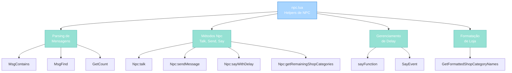
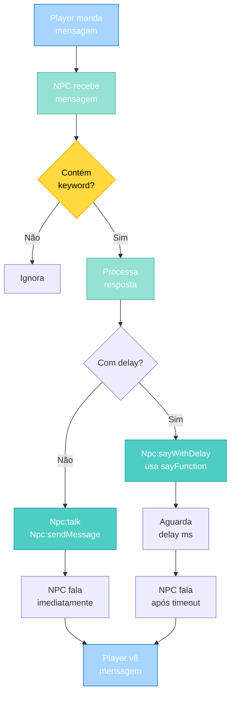

import { Aside, Card } from '@astrojs/starlight/components';

## 🛠️ Informações do Arquivo

Este é o arquivo de **funções e helpers para o sistema de NPCs** do servidor **OpenTibiaBR/Canary**. Ele é responsável por fornecer funções utilitárias para criação, comunicação e gerenciamento de NPCs.

<Card title="Caminho Original" icon="document">
  `data/npclib/npc.lua`
</Card>

<Aside type="tip">
  Este arquivo é carregado durante a inicialização do servidor (via npclib/load.lua) e fornece funções globais para manipular NPCs. Inclui helpers de parsing de mensagens, gerenciamento de conversas e comunicação com jogadores.
</Aside>

## 📄 Visão Geral do Código

### Resumo Executivo

`npc.lua` é um módulo de **funções e helpers de NPC**. Ele:

1. **Define funções helper de parsing**: Para reconhecer palavras-chave em mensagens
2. **Expõe métodos de NPC**: Adiciona métodos à classe Npc para comunicação
3. **Gerencia conversas com delay**: Sistema de mensagens agendadas
4. **Formata conteúdo de loja**: Helpers para exibir categorias de loja
5. **Extrai dados de mensagens**: Parseia números, palavras-chave, etc.

O arquivo fornece a base funcional do sistema de conversação entre NPCs e players.

### Estrutura de Funcionalidades



---

## 3. Variáveis Locais

### 3.1 `sayFunction`

```lua
local sayFunction = function(npcId, text, type, eventDelay, playerId)
    -- Implementação
end
```

| Propriedade | Valor |
|-------------|-------|
| **Tipo** | function |
| **Escopo** | Local (privado para este módulo) |
| **Inicialização** | No topo do arquivo |
| **Propósito** | Callback de fala de NPC com delay |

**Descrição**: Função interna chamada por `Npc:sayWithDelay()` para fazer o NPC falar após um tempo especificado.

**Parâmetros**:
- `npcId`: ID do NPC que vai falar
- `text`: Texto que o NPC deve dizer
- `type`: Tipo de mensagem (TALKTYPE_PRIVATE_NP, TALKTYPE_BROADCASTS, etc.)
- `eventDelay`: Tabela de controle do evento (possui campo `done`)
- `playerId`: ID do jogador para quem falar

**Comportamento**:
1. Obtém referência do NPC via `Npc(npcId)`
2. Valida se NPC existe
3. NPC fala o texto via `npc:say()`
4. Marca evento como completo: `eventDelay.done = true`

**Exemplo Interno**:
```lua
-- Chamado por:
addEvent(sayFunction, 1000, npcId, "Hello!", TALKTYPE_PRIVATE_NP, eventDelay, playerId)

-- Executa após 1 segundo:
-- NPC diz "Hello!" para o player
-- eventDelay.done = true
```

---

## 4. Funções Globais (Helpers de Parsing)

### 4.1 `MsgContains(message, keyword)`

Verifica se uma mensagem contém uma palavra-chave específica (case-insensitive).

#### Assinatura
```lua
function MsgContains(message, keyword)
```

#### Parâmetros

| Parâmetro | Tipo | Descrição |
|-----------|------|-----------|
| **message** | string | Mensagem do player (ex: "hello world") |
| **keyword** | string | Palavra-chave a buscar (ex: "hello") |

#### Retorno

| Valor | Significado |
|-------|-------------|
| **true** | Mensagem contém exatamente a palavra-chave (ou é igual) |
| **false** | Mensagem não contém a palavra-chave |

#### Comportamento

```lua
local lowerMessage, lowerKeyword = message:lower(), keyword:lower()

-- Caso 1: Mensagem é exatamente a palavra-chave
if lowerMessage == lowerKeyword then
    return true  -- "hello" contém "hello" ✓
end

-- Caso 2: Procura palavra-chave sem ser parte de outra palavra
return lowerMessage:find(lowerKeyword) and 
       not lowerMessage:find("(%w+)" .. lowerKeyword)
       -- "hello world" contém "hello" ✓
       -- "helloing world" não contém "hello" ✗ (parte de palavra)
```

#### Exemplos

```lua
MsgContains("hello world", "hello")      -- true (palavra inteira)
MsgContains("say hello friend", "hello") -- true (palavra inteira)
MsgContains("HELLO world", "hello")      -- true (case-insensitive)
MsgContains("helloworld", "hello")       -- false (parte de palavra)
MsgContains("say goodbye", "hello")      -- false (não contém)
```

#### Quando Usar

```lua
-- Reconhecer comando específico do player
if MsgContains(message, "buy") then
    -- Player quer comprar
end

-- NPC reconhece cumprimento
if MsgContains(message, "hello") or MsgContains(message, "hi") then
    npc:say("Welcome, adventurer!")
end
```

---

### 4.2 `MsgFind(message, keyword)`

Encontra palavra-chave em mensagem com validação mais rigorosa.

#### Assinatura
```lua
function MsgFind(message, keyword)
```

#### Parâmetros

| Parâmetro | Tipo | Descrição |
|-----------|------|-----------|
| **message** | string | Mensagem do player |
| **keyword** | string | Palavra-chave a buscar |

#### Retorno

| Valor | Significado |
|-------|-------------|
| **true** | Encontrou palavra-chave com validações |
| **false** | Não encontrou ou falhou em validação |

#### Comportamento

```lua
local lowerMessage, lowerKeyword = message:lower(), keyword:lower()

-- Diferença com MsgContains:
-- MsgFind usa 3 verificações simultâneas com `and`
return string.find(lowerMessage, lowerKeyword) and 
       string.find(lowerMessage, lowerKeyword .. "(%w+)") and 
       string.find(lowerMessage, "(%w+)" .. lowerKeyword)
```

**Nota**: `MsgFind` é mais restritivo que `MsgContains`. Use `MsgContains` para a maioria dos casos.

---

### 4.3 `GetCount(string)`

Extrai o primeiro número encontrado em uma string.

#### Assinatura
```lua
function GetCount(string)
```

#### Parâmetros

| Parâmetro | Tipo | Descrição |
|-----------|------|-----------|
| **string** | string | String que contém número (ex: "buy 10 apples") |

#### Retorno

| Valor | Significado |
|-------|-------------|
| **número** | Número encontrado na string |
| **-1** | Nenhum número encontrado |

#### Comportamento

```lua
local b, e = string:find("%d+")  -- Procura sequência de dígitos
return b and e and tonumber(string:sub(b, e)) or -1
```

#### Exemplos

```lua
GetCount("buy 10 apples")       -- 10
GetCount("deposit 1000")        -- 1000
GetCount("say hello")           -- -1 (sem número)
GetCount("")                    -- -1 (string vazia)
GetCount("123 gold coins 456")  -- 123 (primeiro número)
```

#### Quando Usar

```lua
-- Parser de quantidade em compra
local amount = GetCount(message)
if amount > 0 then
    local itemQuantity = amount
    -- Processar compra de quantidade
else
    npc:say("How many do you want to buy?")
end
```

---

### 4.4 `GetFormattedShopCategoryNames(itemsTable)`

Formata nomes de categorias de loja em string legível.

#### Assinatura
```lua
function GetFormattedShopCategoryNames(itemsTable)
```

#### Parâmetros

| Parâmetro | Tipo | Descrição |
|-----------|------|-----------|
| **itemsTable** | table | Tabela onde as chaves são nomes de categorias |

#### Retorno

| Tipo | Descrição |
|------|-----------|
| **string** | Categorias formatadas (ex: "&#123;Armor&#125;, &#123;Weapons&#125; and &#123;Shields&#125;") |

#### Comportamento

```lua
local formattedCategoryNames = {}

-- 1. Coleta todos os nomes de categoria
for categoryName, _ in pairs(itemsTable) do
    table.insert(formattedCategoryNames, "&#123;" .. categoryName .. "&#125;")
end

-- 2. Se múltiplas categorias, formata com "and"
if #formattedCategoryNames > 1 then
    local lastCategory = table.remove(formattedCategoryNames)
    return table.concat(formattedCategoryNames, ", ") .. " and " .. lastCategory
else
    return formattedCategoryNames[1] or ""
end
```

#### Exemplos

```lua
local items = {
    Armor = {item1, item2},
    Weapons = {item3, item4},
    Shields = {item5, item6}
}

GetFormattedShopCategoryNames(items)
-- Retorna: "&#123;Armor&#125;, &#123;Weapons&#125; and &#123;Shields&#125;"

local single = { Potions = {potion1, potion2} }
GetFormattedShopCategoryNames(single)
-- Retorna: "&#123;Potions&#125;"
```

#### Quando Usar

```lua
-- Mostrar categorias de loja disponíveis
local shopkeeper = NPC("Shopkeeper", 1)
local categories = GetFormattedShopCategoryNames(shopInventory)
shopkeeper:say("I have " .. categories .. " for sale!")
-- Output: "I have &#123;Armor&#125;, &#123;Weapons&#125; and &#123;Shields&#125; for sale!"
```

---

## 5. Funções de Método de `Npc` (Extensões de Classe)

As funções a seguir são adicionadas à classe `Npc` existente (que vem do engine C++).

### 5.1 `Npc:talk(player, text)`

Faz o NPC falar com o player (pode ser texto único ou tabela de textos).

#### Assinatura
```lua
function Npc:talk(player, text)
```

#### Parâmetros

| Parâmetro | Tipo | Descrição |
|-----------|------|-----------|
| **player** | Player | Player para quem o NPC vai falar |
| **text** | string ou table | Texto único ou array de textos |

#### Retorno

Nenhum (void)

#### Comportamento

```lua
if type(text) == "table" then
    -- Se text é tabela, envia cada elemento
    for i = 0, #text do
        self:sendMessage(player, text[i])
    end
else
    -- Se text é string, envia direto
    self:sendMessage(player, text)
end
```

#### Exemplos

```lua
local npc = NPC("Guard", 1)

-- Single text
npc:talk(player, "Welcome to the kingdom!")

-- Multiple texts (array)
npc:talk(player, {
    "I see you've returned!",
    "How can I help you today?",
    "We have much to discuss."
})

-- Output:
-- Guard says: I see you've returned!
-- Guard says: How can I help you today?
-- Guard says: We have much to discuss.
```

---

### 5.2 `Npc:sendMessage(player, text)`

Envia mensagem privada do NPC ao player (com formatação automática).

#### Assinatura
```lua
function Npc:sendMessage(player, text)
```

#### Parâmetros

| Parâmetro | Tipo | Descrição |
|-----------|------|-----------|
| **player** | Player | Player que receberá a mensagem |
| **text** | string | Texto a enviar (pode ter %s para formatação) |

#### Retorno

Booleano (resultado de `npc:say()`)

#### Comportamento

```lua
-- Usa string.format para substituir %s pelo nome do jogador
return self:say(
    string.format(text or "", player:getName()), 
    TALKTYPE_PRIVATE_NP,  -- Tipo: mensagem privada
    true,                 -- Está falando
    player                -- Para quem falar
)
```

#### Exemplos

```lua
local npc = NPC("Wizard", 2)

-- Sem formatação
npc:sendMessage(player, "Hello!")

-- Com %s para nome do player
npc:sendMessage(player, "Greetings, %s!")
-- Output: "Greetings, John!" (se player = John)

-- Pode usar múltiplos %s
npc:sendMessage(player, "Welcome %s, you are the %dth visitor!")
```

---

### 5.3 `Npc:sayWithDelay(npcId, text, messageType, delay, eventDelay, player)`

Faz o NPC falar após um delay especificado usando sistema de eventos.

#### Assinatura
```lua
function Npc:sayWithDelay(npcId, text, messageType, delay, eventDelay, player)
```

#### Parâmetros

| Parâmetro | Tipo | Descrição |
|-----------|------|-----------|
| **npcId** | number | ID do NPC (necessário para interno addEvent) |
| **text** | string | Texto a ser dito |
| **messageType** | number | Tipo de mensagem (TALKTYPE_*) |
| **delay** | number | Delay em ms (mínimo 1000) |
| **eventDelay** | table | Tabela de controle com campo `event` |
| **player** | Player | Player para quem falar |

#### Retorno

Nenhum (void) - modifica `eventDelay.event`

#### Comportamento

```lua
-- 1. Marca evento como não completo
eventDelay.done = false

-- 2. Agenda execução da função sayFunction
eventDelay.event = addEvent(
    sayFunction,
    delay < 1 and 1000 or delay,  -- Mínimo 1000ms
    npcId, text, messageType, eventDelay, player
)
```

#### Exemplos

```lua
local npc = NPC("Storyteller", 3)
local eventDelay = {}

-- Schedule fala após 3 segundos
npc:sayWithDelay(3, "Once upon a time...", TALKTYPE_PRIVATE_NP, 3000, eventDelay, player)

-- Depois de 3 segundos:
-- NPC diz "Once upon a time..."
-- eventDelay.done = true

-- Pode fazer múltiplas falas com delay
npc:sayWithDelay(3, "There was a brave knight...", TALKTYPE_PRIVATE_NP, 6000, eventDelay, player)
-- Total: 6 segundos desde agora
```

---

### 5.4 `Npc:getRemainingShopCategories(selectedCategory, itemsTable)`

Retorna categorias de loja excluindo a selecionada.

#### Assinatura
```lua
function Npc:getRemainingShopCategories(selectedCategory, itemsTable)
```

#### Parâmetros

| Parâmetro | Tipo | Descrição |
|-----------|------|-----------|
| **selectedCategory** | string | Categoria já selecionada para excluir |
| **itemsTable** | table | Tabela de inventário da loja |

#### Retorno

| Tipo | Descrição |
|------|-----------|
| **string** | Categorias formatadas separadas por "or" |

#### Comportamento

```lua
local remainingCategories = {}

-- Coleta categorias diferentes da selecionada
for categoryName, _ in pairs(itemsTable) do
    if categoryName ~= selectedCategory then
        table.insert(remainingCategories, "{" .. categoryName .. "}")
    end
end

-- Retorna concatenadas com "or"
return table.concat(remainingCategories, " or ")
```

#### Exemplos

```lua
local shopItems = {
    Armor = {item1, item2},
    Weapons = {item3, item4},
    Shields = {item5, item6},
    Potions = {item7, item8}
}

local remaining = npc:getRemainingShopCategories("Armor", shopItems)
-- Retorna: "&#123;Weapons&#125; or &#123;Shields&#125; or &#123;Potions&#125;"

-- Usar para confirmar próxima categoria
npc:say("What else would you like? " .. remaining .. "?")
-- Output: "What else would you like? &#123;Weapons&#125; or &#123;Shields&#125; or &#123;Potions&#125;?"
```

---

## 6. Funções Globais (Eventos)

### 6.1 `SayEvent(npcId, playerId, messageDelayed, npcHandler, textType)`

Evento de fala que processa tags especiais em mensagem de NPC.

#### Assinatura
```lua
function SayEvent(npcId, playerId, messageDelayed, npcHandler, textType)
```

#### Parâmetros

| Parâmetro | Tipo | Descrição |
|-----------|------|-----------|
| **npcId** | number | ID do NPC |
| **playerId** | number | ID do player |
| **messageDelayed** | string | Mensagem com possíveis tags |
| **npcHandler** | NpcHandler | Handler para parsing |
| **textType** | number | Tipo de mensagem (opcional) |

#### Retorno

Nenhum (void)

#### Comportamento

```lua
-- 1. Valida NPC e Player
local npc = Npc(npcId)
if not npc then
    return logger.error(...)
end

local player = Player(playerId)
if not player then
    return logger.error(...)
end

-- 2. Define tags a substituir
local parseInfo = {
    [TAG_PLAYERNAME] = player:getName(),              -- Nome do player
    [TAG_TIME] = getFormattedWorldTime(),             -- Hora do jogo
    [TAG_BLESSCOST] = Blessings.getBlessingCost(...), -- Custo de bênção
    [TAG_PVPBLESSCOST] = Blessings.getPvpBlessingCost(...), -- Custo PvP
}

-- 3. Substitui tags na mensagem
local parsedMessage = npcHandler:parseMessage(messageDelayed, parseInfo)

-- 4. NPC fala
npc:say(parsedMessage, textType or TALKTYPE_PRIVATE_NP, false, player, npc:getPosition())
```

#### Exemplos

```lua
-- Mensagem com tags
local message = "Hello &#123;PLAYERNAME&#125;! It's &#123;TIME&#125; right now."
-- Se player = "John" e hora = "13:30"
-- Resultado: "Hello John! It's 13:30 right now."

SayEvent(1, playerId, message, npcHandler, TALKTYPE_PRIVATE_NP)
-- NPC diz a mensagem processada

-- Tags disponíveis
-- &#123;PLAYERNAME&#125; → Nome do player
-- &#123;TIME&#125; → Hora do mundo
-- &#123;BLESSCOST&#125; → Custo de bênção para o nível do player
-- &#123;PVPBLESSCOST&#125; → Custo de bênção PvP
```

---

## 7. Diagrama de Fluxo de Conversa

### Como NPC Fala com Player



---

## 8. Exemplos Práticos

### Exemplo 1: Reconhecer Comando e Responder

```lua
local npc = NPC("Innkeeper", 1)

-- Player: "hello"
local message = "hello"

if MsgContains(message, "hello") then
    npc:talk(player, "Welcome to my inn!")
elseif MsgContains(message, "food") then
    npc:talk(player, "We have fresh bread and meat pies!")
end
```

### Exemplo 2: Processar Quantidade

```lua
-- Player: "buy 10 apples"
local message = "buy 10 apples"
local quantity = GetCount(message)

if quantity > 0 then
    local totalCost = quantity * 5  -- 5 gold por maçã
    npc:sendMessage(player, "That's %s! The cost is " .. totalCost .. " gold.")
    -- Output: "That's John! The cost is 50 gold."
else
    npc:talk(player, "How many apples do you want?")
end
```

### Exemplo 3: Múltiplas Mensagens com Delay

```lua
local npc = NPC("Storyteller", 2)
local delays = {}

-- Conta histórica com delays
npc:sayWithDelay(2, "Once upon a time...", TALKTYPE_PRIVATE_NP, 1000, delays, player)
npc:sayWithDelay(2, "...there was a brave knight.", TALKTYPE_PRIVATE_NP, 3000, delays, player)
npc:sayWithDelay(2, "He saved the kingdom!", TALKTYPE_PRIVATE_NP, 5000, delays, player)

-- Output (ao longo de 5 segundos):
-- [1s] Storyteller: Once upon a time...
-- [3s] Storyteller: ...there was a brave knight.
-- [5s] Storyteller: He saved the kingdom!
```

### Exemplo 4: Shop Categories

```lua
local npc = NPC("Merchant", 3)
local inventory = {
    Armor = {item1, item2},
    Weapons = {item3, item4},
    Potions = {item5, item6}
}

-- Listar categorias
local allCategories = GetFormattedShopCategoryNames(inventory)
npc:talk(player, "I sell " .. allCategories .. "!")

-- Player escolhe "Armor"
local remaining = npc:getRemainingShopCategories("Armor", inventory)
npc:talk(player, "What else? " .. remaining .. "?")

-- Output:
-- Merchant: I sell &#123;Armor&#125;, &#123;Weapons&#125; and &#123;Potions&#125;!
-- ...
-- Merchant: What else? &#123;Weapons&#125; or &#123;Potions&#125;?
```

---

## 9. Padrões e Boas Práticas

### ✅ Usar MsgContains para Reconhecer Palavras

```lua
-- ✓ BOM: Valida palavra inteira
if MsgContains(message, "buy") then
    -- Processa compra
end

-- ✗ RUIM: String find simples pega "buyout", "buying", etc.
if string.find(message:lower(), "buy") then
    -- Pode pegar variações indesejadas
end
```

---

### ✅ Sempre Validar NPC e Player em SayEvent

```lua
-- ✓ BOM: SayEvent já faz isso
SayEvent(npcId, playerId, message, handler)

-- ✗ RUIM: Usar Npc() e Player() diretamente sem checar
local npc = Npc(npcId)
npc:say(message)  -- Pode dar erro se npc é nil
```

---

### ✅ Usar Delay Mínimo de 1000ms

```lua
-- ✓ BOM: Use no mínimo 1 segundo
npc:sayWithDelay(npcId, "Wait...", type, 1000, delay, player)

-- BÔNUS: Delays maiores parecem mais natural
npc:sayWithDelay(npcId, "I will think...", type, 3000, delay, player)
```

---

### ✅ Processar Tags em SayEvent

```lua
-- ✓ BOM: Usar tags para personalização
local message = "Welcome, &#123;PLAYERNAME&#125;! Cost is &#123;BLESSCOST&#125; gold."
SayEvent(npcId, playerId, message, handler)

-- ✗ RUIM: Mensagem estática sem personalização
npc:say("Welcome! Cost is 500 gold.")
```

---

## 10. Referência Rápida

### Funções de Parsing

```lua
MsgContains(message, keyword)          -- true/false se contém palavra
MsgFind(message, keyword)              -- Validação rigorosa (menos usado)
GetCount(string)                       -- Extrai número (ou -1)
GetFormattedShopCategoryNames(table)   -- Formata categorias com "and"
```

### Métodos de NPC

```lua
npc:talk(player, text)                 -- Falar (text pode ser array)
npc:sendMessage(player, text)          -- Enviar com formatação %s
npc:sayWithDelay(id, text, type, delay, delay_table, player)
npc:getRemainingShopCategories(cat, table)  -- Outras categorias
```

### Funções de Evento

```lua
SayEvent(npcId, playerId, message, handler, textType)  -- Fala com tags
sayFunction(npcId, text, type, delay, playerId)       -- Callback interno
```

### Constantes Usadas

```lua
TALKTYPE_PRIVATE_NP    -- Mensagem privada de NPC
TALKTYPE_BROADCASTS    -- Broadcast para todos
TAG_PLAYERNAME         -- String para substituir nome
TAG_TIME               -- String para substituir hora
TAG_BLESSCOST          -- String para substituir custo bênção
TAG_PVPBLESSCOST       -- String para substituir custo PvP
```

---

## 11. Checkpoint: O que foi Carregado até Aqui

Após `npclib/npc.lua` ser carregado, o servidor tem:

✅ **Funções de parsing**: MsgContains, MsgFind, GetCount  
✅ **Métodos de conversação**: Npc:talk, Npc:sendMessage  
✅ **Sistema de delay**: Npc:sayWithDelay com eventos  
✅ **Gerenciamento de loja**: GetFormattedShopCategoryNames, getRemainingShopCategories  
✅ **Processamento de eventos**: SayEvent com tags  

### Sequência de Carga

```
npclib/load.lua
  ↓
npclib/npc.lua ← VOCÊ ESTÁ AQUI
  ↓
Métodos adicionados à classe Npc
  ↓
Funções globais disponíveis para scripts
```

---

## 12. Conclusão

`npclib/npc.lua` é o **conjunto de funções helper e métodos para NPCs** do Canary. Implementa padrão de **NPC Helper Functions and Message Processing**:

### Pontos Importantes

1. **Parsing Robusto**: MsgContains valida palavras inteiras
2. **Flexibilidade de Conversação**: Suporta texto único ou múltiplo
3. **Timing Preciso**: Sistema de delay com eventos programados
4. **Formatação Automática**: Substitui tags em mensagens
5. **Extensão de Classe**: Adiciona métodos à classe Npc existente

### Use Para

- ✅ Reconhecer comandos do player em chat
- ✅ Fazer NPCs falar de forma natural
- ✅ Implementar delays entre falas
- ✅ Processar quantidades e números
- ✅ Formatar listas de categorias
- ✅ Personalizar respostas com informações do player/mundo

### Padrão Arquitetural

O módulo implementa **NPC Helper Functions Pattern**:
- Funções utilitárias para parsing de mensagens
- Métodos adicionais à classe Npc via Lua
- Sistema de eventos para timing controlado
- Substituição de tags para personalização dinâmica

---

## 🤖 Informações da Documentação

<Aside type="note">
  Esta documentação foi **gerada automaticamente por IA** (Claude Haiku 4.5) utilizando análise estática de código. Todas as explicações técnicas foram produzidas por processamento inteligente do código-fonte, garantindo precisão e consistência com o padrão de documentação Starlight/Astro do projeto.
</Aside>

**Última Atualização**: Baseado no servidor **OpenTibiaBR/Canary** (Fork do OTServBR-Global)

**Repositório**: [opentibiabr/canary](https://github.com/opentibiabr/canary)

**Documentação técnica de npclib/npc.lua**  
*Parte da série de documentação do Canary Engine*
