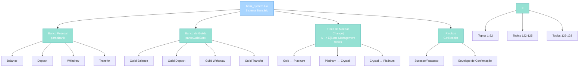
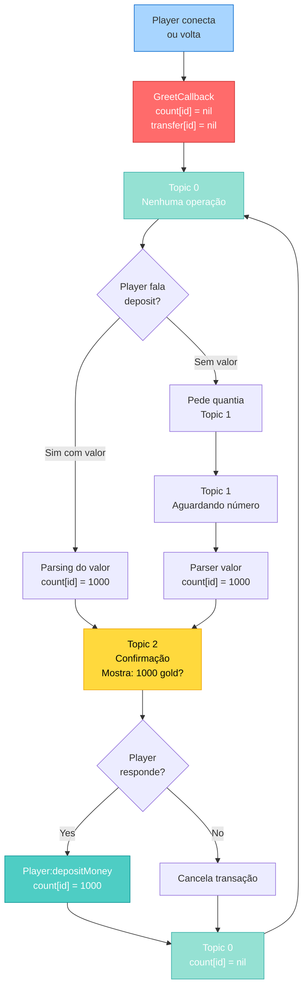

import { Aside, Card } from '@astrojs/starlight/components';

## 🛠️ Informações do Arquivo

Este é o arquivo de **sistema bancário completo** do servidor **OpenTibiaBR/Canary**. Ele fornece funcionalidades de banco pessoal e banco de guilda para NPCs.

<Card title="Caminho Original" icon="document">
  `data/npclib/npc_system/bank_system.lua`
</Card>

<Aside type="tip">
  Este arquivo implementa um **NPC Handler completo** com state management via topics. É um exemplo de padrão avançado para criar NPCs com múltiplas conversas de longa duração. Usado por NPCs bancários em todo o mundo do servidor.
</Aside>

## 📄 Visão Geral do Código

### Resumo Executivo

`bank_system.lua` é um módulo avançado de **sistema bancário para NPCs** que implementa:

1. **Banco Pessoal**: Depósitos, saques, transferências entre jogadores
2. **Banco de Guilda**: Depósitos, saques e transferências entre guildas
3. **Troca de Moedas**: Conversão entre ouro, platina e cristal
4. **Sistema de Recibos**: Confirmação de transações via itens
5. **State Management**: Máquina de estados via tópicos (topics)

O arquivo é um **exemplo de implementação profissional** de NPC com múltiplas ramificações de conversa complexas.

### Estrutura de Responsabilidades



---

## 3. Variáveis Locais

### 3.1 `count`

```lua
local count = {}
```

| Propriedade | Valor |
|-------------|-------|
| **Tipo** | table |
| **Escopo** | Local (privado para este módulo) |
| **Chaves** | `playerId` (number) |
| **Valor** | Quantia de ouro armazenada |
| **Propósito** | Persistir valor de transação por jogador |

**Descrição**: Tabela que armazena a quantia de ouro que o jogador quer depositar, sacar ou transferir durante uma conversa.

**Exemplos de Uso**:
```lua
count[playerId] = 1000  -- Jogador quer transferir 1000 gold
-- Depois: count[playerId] = nil  -- Limpar após transação
```

**Ciclo de Vida**:
1. Jogador diz a quantia
2. `count[playerId]` = quantidade
3. NPC confirma "Você quer depositar X gold?"
4. Após confirmação (sim/não), `count[playerId]` é limpado

---

### 3.2 `transfer`

```lua
local transfer = {}
```

| Propriedade | Valor |
|-------------|-------|
| **Tipo** | table |
| **Escopo** | Local (privado para este módulo) |
| **Chaves** | `playerId` (number) |
| **Valor** | Nome do destinatário (string) |
| **Propósito** | Armazenar nome de quem recebe a transferência |

**Descrição**: Tabela que armazena o nome do jogador ou guilda destinatária da transferência.

**Exemplos de Uso**:
```lua
transfer[playerId] = "John"        -- Transferir para jogador John
transfer[playerId] = "Dragons"     -- Transferir para guilda Dragons
-- Depois: transfer[playerId] = nil  -- Limpar após transação
```

**Ciclo de Vida**:
1. Pode ser definido junto com `count` (ex: "transfer 1000 gold to John")
2. Ou pode ser pedido em mensagem separada
3. Após confirmação, `transfer[playerId] = nil`

---

### 3.3 `receiptFormat`

```lua
local receiptFormat = "Date: %s\nType: %s\nGold Amount: %d\nReceipt Owner: %s\nRecipient: %s\n\n%s"
```

| Propriedade | Valor |
|-------------|-------|
| **Tipo** | string |
| **Padrão** | Lua string.format template |
| **Parâmetros** | Data, Tipo, Quantia, Proprietário, Destinatário, Mensagem |
| **Propósito** | Formatar texto de recibos de transação |

**Descrição**: Template para formatação de recibos de transação que serão enviados por carta.

**Exemplo de Saída**:
```
Date: 19. Feb 2026 - 14:30:45
Type: Deposit
Gold Amount: 1000
Receipt Owner: John
Recipient: John

We are happy to inform you that your transfer request was successfully carried out.
```

---

## 4. Funções Locais

### 4.1 `GetReceipt(info)`

Cria um item de recibo (carta) com informações de transação.

#### Assinatura
```lua
local function GetReceipt(info)
```

#### Parâmetros

| Parâmetro | Tipo | Descrição |
|-----------|------|-----------|
| **info** | table | Tabela com campos de transação |

**Campos de `info`**:

| Campo | Tipo | Descrição |
|-------|------|-----------|
| **success** | boolean | Transação foi bem-sucedida? |
| **type** | string | Tipo de transação (ex: "Deposit", "Transfer") |
| **amount** | number | Quantia de ouro da transação |
| **owner** | string | Nome de quem fez a transação |
| **recipient** | string | Quem recebe ou se aplica |
| **message** | string | Mensagem de confirmação/erro |

#### Retorno

| Tipo | Descrição |
|------|-----------|
| **Item** | Objeto de item (carta de recibo) com ID 19598 (sucesso) ou 19599 (fracasso) |

#### Comportamento

```lua
-- 1. Seleciona ID do item baseado em sucesso
local receipt = Game.createItem(info.success and 19598 or 19599)
--    19598 = carta verde (sucesso)
--    19599 = carta vermelha (fracasso)

-- 2. Formata e insere texto no recibo
receipt:setAttribute(ITEM_ATTRIBUTE_TEXT, receiptFormat:format(
    os.date("%d. %b %Y - %H:%M:%S"),  -- Data/hora curial
    info.type,                         -- "Deposit", "Transfer", etc.
    info.amount,                       -- Quantia de ouro
    info.owner,                        -- Dono
    info.recipient,                    -- Destinatário
    info.message                       -- Msg de status
))

-- 3. Retorna item formatado
return receipt
```

#### Exemplos

```lua
-- Sucesso de depósito
local successReceipt = GetReceipt({
    success = true,
    type = "Deposit",
    amount = 1000,
    owner = "John",
    recipient = "John",
    message = "We are happy to inform you that your transfer request was successfully carried out."
})
-- Resultado: Item ID 19598 (verde) com texto formatado

-- Fracasso de saque
local failureReceipt = GetReceipt({
    success = false,
    type = "Withdraw",
    amount = 5000,
    owner = "Jane",
    recipient = "Jane",
    message = "We are sorry to inform you that we could not fulfill your request, due to a lack of the required sum on your bank account."
})
-- Resultado: Item ID 19599 (vermelho) com texto formatado
```

---

## 5. Funções de Método de `Npc` (Extensões de Classe)

### 5.1 `Npc:parseBankMessages(message, npc, creature, npcHandler)`

Fornece informações sobre o banco através de palavras-chave geradas dinamicamente.

#### Assinatura
```lua
function Npc:parseBankMessages(message, npc, creature, npcHandler)
```

#### Parâmetros

| Parâmetro | Tipo | Descrição |
|-----------|------|-----------|
| **message** | string | Mensagem do jogador |
| **npc** | NPC | Referência do NPC |
| **creature** | Creature | Player/creature que envia mensagem |
| **npcHandler** | NpcHandler | Handler para enviar respostas |

#### Retorno

Nenhum (void)

#### Comportamento

```lua
-- 1. Define tabela de mensagens informativas
local messagesTable = {
    ["money"] = "We can {change} money for you...",
    ["bank"] = "We can {change} money for you...",
    ["balance"] = "Informação sobre saldo...",
    ["transfer"] = "Informação sobre transferência...",
    -- ... mais mensagens
}

-- 2. Usa npcHandler para processar e enviar
-- Tags {change}, {bank}, etc. são processadas
-- Mensagens com array são enviadas como múltiplas
npcHandler:sendMessages(
    message,          -- mensagem do player
    messagesTable,    -- tabela de respostas
    npc,              -- NPC que fala
    creature,         -- para quem falar
    true,             -- separador automático?
    3000              -- delay entre mensagens (ms)
)
```

#### Informações Fornecidas

| Palavra-chave | Resposta |
|---------------|----------|
| **money** | Explicação sobre troca de moedas |
| **change** | Detalhes de conversão (100 ouro = 1 platina) |
| **bank** | Informação sobre conta bancária |
| **balance** | Como checar saldo |
| **deposit** | Como depositar |
| **withdraw** | Como sacar |
| **transfer** | Como transferir para outros |
| **advanced** | Usos avançados (aluguel, mercado) |
| **help** | Menu de ajuda |
| **job** | Informação sobre o NPC |

#### Exemplos

```lua
-- Player: "help"
npc:parseBankMessages("help", npc, creature, npcHandler)
-- Output: Lista de funções do banco

-- Player: "bank account"
npc:parseBankMessages("bank account", npc, creature, npcHandler)
-- Output: Múltiplas mensagens explicando conta bancária
```

---

### 5.2 `Npc:parseBank(message, npc, creature, npcHandler)`

Handler principal de operações de banco pessoal (saldo, depósito, saque, transferência, troca de moedas).

#### Assinatura
```lua
function Npc:parseBank(message, npc, creature, npcHandler)
```

#### Parâmetros

| Parâmetro | Tipo | Descrição |
|-----------|------|-----------|
| **message** | string | Mensagem do jogador |
| **npc** | NPC | Referência do NPC |
| **creature** | Creature | Player que interage |
| **npcHandler** | NpcHandler | Handler para respostas |

#### Retorno

| Valor | Significado |
|-------|-------------|
| **true** | Mensagem foi processada |
| **false** ou nil | Mensagem não foi reconhecida |

#### Operações Implementadas

| Operação | Comando | Topics | Descrição |
|----------|---------|--------|-----------|
| **Balance** | "balance" | - | Mostra saldo com mensagem especial por valor |
| **Deposit** | "deposit [N]" | 1, 2 | Depositar N ouro no banco |
| **Withdraw** | "withdraw [N]" | 6, 7 | Sacar N ouro com verificação de espaço |
| **Transfer** | "transfer [N] to [Name]" | 11, 12, 13 | Transferir para outro jogador |
| **Change Gold** | "change gold" | 14, 15 | Converter ouro em platina |
| **Change Platinum** | "change platinum" | 16, 17, 18, 19, 20 | Converter platina em ouro ou cristal |
| **Change Crystal** | "change crystal" | 21, 22 | Converter cristal em platina |

#### States (Topics) por Operação

**Depósito**:
- Topic 0 → 1: Aguardando quantia
- Topic 1 → 2: Pedindo confirmação
- Topic 2 → 0: Processando SIM/NÃO

**Saque**:
- Topic 0 → 6: Aguardando quantia
- Topic 6 → 7: Pedindo confirmação
- Topic 7 → 0: Processando e entregando moedas

**Transferência**:
- Topic 0 → 11: Aguardando quantia
- Topic 11 → 12: Aguardando nome
- Topic 12 → 13: Pedindo confirmação
- Topic 13 → 0: Processando transferência

**Troca de Moedas**:
- Gold → Platinum: Topics 14, 15
- Platinum selection: Topic 16
- Platinum → Gold: Topics 17, 18
- Platinum → Crystal: Topics 19, 20
- Crystal → Platinum: Topics 21, 22

#### Exemplos de Fluxos

**Exemplo 1: Depósito Simples**
```lua
-- Player: "deposit"
npcHandler:setTopic(playerId, 1)
npcHandler:say("Please tell me how much gold...")
-- Player: "1000"
count[playerId] = 1000
npcHandler:setTopic(playerId, 2)
npcHandler:say("Would you really like to deposit 1000 gold?")
-- Player: "yes"
Player.depositMoney(player, 1000)
npcHandler:setTopic(playerId, 0)
```

**Exemplo 2: Transferência com Nome**
```lua
-- Player: "transfer 1000 gold to John"
count[playerId] = 1000
transfer[playerId] = "John"
npcHandler:setTopic(playerId, 13)
npcHandler:say("So you would like to transfer 1000 gold to John?")
-- Player: "yes"
player:transferMoneyTo("John", 1000)
npcHandler:setTopic(playerId, 0)
```

**Exemplo 3: Saque com Verificação de Espaço**
```lua
-- Player: "withdraw 10000"
count[playerId] = 10000  -- 100 crystal, 0 platinum, 0 gold
-- Calcula: 1 crystal stack + espaço necessário
if player:getFreeBackpackSlots() >= totalPiles then
    player:withdrawMoney(10000)
else
    npcHandler:say("You don't have enough room in your backpack...")
end
```

---

### 5.3 `Npc:parseGuildBank(message, npc, creature, playerId, npcHandler)`

Handler de operações de banco de guilda (saldo, depósito, saque, transferência entre guildas).

#### Assinatura
```lua
function Npc:parseGuildBank(message, npc, creature, playerId, npcHandler)
```

#### Parâmetros

| Parâmetro | Tipo | Descrição |
|-----------|------|-----------|
| **message** | string | Mensagem do jogador |
| **npc** | NPC | Referência do NPC |
| **creature** | Creature | Player que interage |
| **playerId** | number | ID do player (redundante com creature:getId()) |
| **npcHandler** | NpcHandler | Handler para respostas |

#### Retorno

| Valor | Significado |
|-------|-------------|
| **true** | Mensagem foi processada |
| **false** ou nil | Mensagem não foi reconhecida ou validação falhou |

#### Validações Implementadas

| Validação | Erro | Métodos Afetados |
|-----------|------|------------------|
| **Guild Member** | "You are not a member of a guild" | Todos |
| **Guild Level** | "Only leaders can withdraw/transfer" | Withdraw, Transfer |
| **Insufficient Balance** | "There is not enough gold on your guild account" | Withdraw, Transfer |

#### Operações Implementadas

| Operação | Comando | Topics | Requisitos |
|----------|---------|--------|-----------|
| **Guild Balance** | "guild balance" | - | Membro de guilda |
| **Guild Deposit** | "guild deposit [N]" | 122, 123 | Membro com ouro |
| **Guild Withdraw** | "guild withdraw [N]" | 124, 125 | Líder/Vice-líder |
| **Guild Transfer** | "guild transfer [N] to [Guild]" | 126, 127, 128 | Líder/Vice-líder |

#### Níveis de Guilda

```lua
player:getGuildLevel()

-- Valores:
-- 1 = Membro comum
-- 2 = Vice-líder
-- 3 = Líder
```

#### Fluxo de Transferência Entre Guildas

```lua
-- Player (Líder da guilda Dragons): "guild transfer 1000 gold to Tigers"

-- 1. Validações
if not player:getGuild() then
    -- Erro: Não está em guilda
end
if player:getGuildLevel() < 2 then
    -- Erro: Não é líder/vice-líder
end

-- 2. Parse e confirmação
count[playerId] = 1000
transfer[playerId] = "Tigers"
npcHandler:setTopic(playerId, 128)
npcHandler:say("So you would like to transfer 1000 gold from Dragons to Tigers?")

-- 3. Execute
if MsgContains(message, "yes") then
    Bank.transferToGuild(guild, "Tigers", 1000)
    -- Cria recibo de sucesso/fracasso
    local receipt = GetReceipt(info)
    inbox:addItemEx(receipt)
end
npcHandler:setTopic(playerId, 0)
```

#### Exemplo: Depósito em Guilda

```lua
-- Player: "guild deposit 5000"
-- Checks:
--   ✓ Membro de guilda
--   ✓ Tem 5000 gold no banco pessoal

count[playerId] = 5000
npcHandler:setTopic(playerId, 123)
npcHandler:say("Would you really like to deposit 5000 gold to your guild account?")

-- Player: "yes"
Bank.transfer(player, guild, 5000)  -- Move de conta pessoal para guilda
-- Recibo adicionado ao inbox
npcHandler:setTopic(playerId, 0)
```

---

## 6. Funções Globais (Callbacks)

### 6.1 `NpcBankGreetCallback(npc, creature)`

Callback de saudação que limpa o estado do jogador quando interage com o NPC.

#### Assinatura
```lua
function NpcBankGreetCallback(npc, creature)
```

#### Parâmetros

| Parâmetro | Tipo | Descrição |
|-----------|------|-----------|
| **npc** | NPC | Referência do NPC |
| **creature** | Creature | Player que interage |

#### Retorno

| Valor | Significado |
|-------|-------------|
| **true** | Saudação aceita, conversa pode começar |
| **false** | Saudação rejeitada |

#### Comportamento

```lua
local playerId = creature:getId()

-- 1. Limpa tabelas de estado
count[playerId] = nil        -- Remove quantia armazenada
transfer[playerId] = nil      -- Remove destinatário armazenado

-- 2. Retorna true para aceitar saudação
return true
```

#### Propósito

Garante que toda vez que um jogador fala com o NPC bancário, ele começa com estado limpo. Previne problemas como:
- Jogador deixa conversa a meio e volta depois
- Quantias antigas permanecem em `count`
- Transfer incompleto persiste em `transfer`

#### Exemplo de Cenário

```lua
-- Cenário 1: Jogador abandona conversa
Player "John" fala: "deposit"
Topic: 1, count[john:getId()] = nil
[Player desconecta ou se afasta]

-- Cenário 2: Player volta depois
Player "John" fala com NPC novamente
NpcBankGreetCallback é chamado
count[john:getId()] = nil  -- Limpado!
transfer[john:getId()] = nil  -- Limpado!
Topic reset
-- Conversa começa fresca
```

---

## 7. Diagrama de Fluxo: Máquina de Estados (Deposit)

### Topic-Driven State Machine



---

## 8. Exemplos Práticos

### Exemplo 1: Fluxo Completo de Depósito

```lua
-- === CONVERSA COM NPC BANCÁRIO ===

-- [1] Player se aproxima
npc:greet(player)                  -- Chama NpcBankGreetCallback
count[playerId] = nil              -- Limpado!
transfer[playerId] = nil           -- Limpado!

-- [2] Player: "deposit 5000"
npc:parseBank("deposit 5000", ...)
-- count[playerId] = 5000
-- Topic → 2
-- NPC says: "Would you really like to deposit 5000 gold?"

-- [3] Player: "yes"
npc:parseBank("yes", ...)
-- if Topic == 2 and MsgContains("yes")
--   Player.depositMoney(player, 5000)
--   Topic → 0
-- NPC says: "Alright, we have added 5000 gold to your balance..."
-- count[playerId] = nil (limpado)

-- [4] Transação completa!
```

---

### Exemplo 2: Transferência Entre Jogadores

```lua
-- === TRANSFER FLOW ===

-- [1] Player: "transfer 1000 to John"
npc:parseBank("transfer 1000 to John", ...)
-- count[playerId] = 1000
-- transfer[playerId] = "John"
-- Topic → 13
-- NPC says: "So you would like to transfer 1000 gold to John?"

-- [2] Player: "yes"
npc:parseBank("yes", ...)
-- if player:transferMoneyTo("John", 1000)
--   NPC says: "Very well. You have transferred 1000 gold to John."
--   transfer[playerId] = nil
-- else
--   NPC says: "You cannot transfer money to this account."
-- Topic → 0

-- [3] John recebe 1000 gold no banco!
```

---

### Exemplo 3: Saque com Cálculo de Moedas

```lua
-- === WITHDRAW CALCULATION ===

-- [1] Player: "withdraw 10000"  (10k = 100 plat = 1 crystal)
count[playerId] = 10000

-- [2] Cálculo de moedas
local totalValue = 10000
local crystalCoins = math.floor(10000 / 10000)      -- 1 crystal
local platinumCoins = 0
local goldCoins = 0
local totalPiles = 1  -- 1 crystal stack

-- [3] Verificações
if player:getFreeCapacity() >= getMoneyWeight(10000) then
  if player:getFreeBackpackSlots() >= 1 then
    player:withdrawMoney(10000)
    -- Recebe 1 crystal coin
  else
    npc:say("You don't have 1 free slot for the crystal coin!")
  end
end
```

---

### Exemplo 4: Depósito em Guilda

```lua
-- === GUILD DEPOSIT ===

-- [1] Player (Membro de Dragons): "guild deposit 5000"
local player = Player(creature)
local guild = player:getGuild()

-- Validações
if guild then  -- ✓ Membro
  count[playerId] = 5000
  Topic → 123
  npc:say("Would you really like to deposit 5000 gold to Dragons?")
else
  npc:say("You are not a member of a guild.")
end

-- [2] Player: "yes"
if Bank.hasBalance(player, 5000) then
  Bank.transfer(player, guild, 5000)
  
  -- Cria recibo
  local info = {
    type = "Guild Deposit",
    amount = 5000,
    owner = "John of Dragons",
    recipient = "Dragons",
    message = "We are happy to inform...",
    success = true
  }
  
  local receipt = GetReceipt(info)
  player:getInbox():addItemEx(receipt)
  
  npc:say("Alright, we placed an order to deposit 5000 gold...")
else
  npc:say("You do not have enough gold.")
end

Topic → 0
```

---

## 9. Padrões e Boas Práticas

### ✅ State Management com Topics

```lua
-- ✓ BOM: Topics isolam fluxos diferentes
if npcHandler:getTopic(playerId) == 2 then
    -- Fluxo de confirmação de depósito
    if MsgContains(message, "yes") then
        Player.depositMoney(player, count[playerId])
    end
end

-- ✗ RUIM: Sem topics, impossível saber contexto
if MsgContains(message, "yes") then
    -- Jogador disse "yes" em qual contexto?
end
```

---

### ✅ Limpeza de Estado em Callbacks

```lua
-- ✓ BOM: Greeting limpa tudo que sobrou
function NpcBankGreetCallback(npc, creature)
    local playerId = creature:getId()
    count[playerId] = nil       -- Garante que count está limpo
    transfer[playerId] = nil    -- Garante que transfer está limpo
    return true
end

-- ✗ RUIM: Deixar estado sujo leva a bugs
function BadCallback(npc, creature)
    -- Não limpa count/transfer → bugs se jogador volta depois
    return true
end
```

---

### ✅ Validações Antes de Transação

```lua
-- ✓ BOM: Validar antes de tudo
if player:getFreeCapacity() >= getMoneyWeight(amount) then
    if player:getFreeBackpackSlots() >= totalPiles then
        player:withdrawMoney(amount)
    else
        npc:say("Not enough backpack slots!")
    end
else
    npc:say("Not enough capacity!")
end

-- ✗ RUIM: Tentar transação sem validar
player:withdrawMoney(amount)  -- Pode falhar silenciosamente
```

---

### ✅ Mensagens Personalizadas por Saldo

```lua
-- ✓ BOM: Feedback especial por milestone
if balance >= 100000000 then
    npc:say("You must be one of the richest! Your balance is " .. balance)
elseif balance >= 1000000 then
    npc:say("Wow, a million gold! Your balance is " .. balance)
else
    npc:say("Your balance is " .. balance)
end

-- ✗ RUIM: Mensagem genérica
npc:say("Your balance is " .. balance)
```

---

### ✅ Recibos para Auditoria

```lua
-- ✓ BOM: Sempre criar recibo (sucesso ou fracasso)
local receipt = GetReceipt({
    success = success,
    type = "Deposit",
    amount = amount,
    owner = owner,
    recipient = recipient,
    message = message  -- Explicar se falhou
})
player:getInbox():addItemEx(receipt)

-- Permite auditoria e prova de transação
```

---

## 10. Referência Rápida

### Operações de Banco Pessoal

```lua
-- Balance
npc:parseBank("balance", ...)                    -- Mostra saldo
npc:parseBank("money", ...)                      -- Info sobre moeda

-- Deposit
npc:parseBank("deposit", ...)                    -- Pede quantia
npc:parseBank("deposit 500", ...)                -- Direto com valor
npc:parseBank("yes", ...)  -- Topic 2             -- Confirma

-- Withdraw
npc:parseBank("withdraw 500", ...)               -- Saque direto
npc:parseBank("withdraw", ...)                   -- Pede quantia
npc:parseBank("yes", ...)  -- Topic 7             -- Confirma

-- Transfer
npc:parseBank("transfer 100 to John", ...)       -- Direto
npc:parseBank("transfer 100", ...)               -- Pede destinatário
npc:parseBank("John", ...)  -- Topic 12           -- Após pedir
npc:parseBank("yes", ...)  -- Topic 13            -- Confirma

-- Change
npc:parseBank("change gold", ...)                -- Ouro → Platina
npc:parseBank("change platinum", ...)            -- Platina → ?
npc:parseBank("change crystal", ...)             -- Cristal → Platina
```

### Operações de Banco de Guilda

```lua
-- Balance
npc:parseGuildBank("guild balance", ...)         -- Saldo da guilda

-- Deposit
npc:parseGuildBank("guild deposit 1000", ...)    -- Depositar
npc:parseGuildBank("yes", ...)  -- Topic 123      -- Confirma

-- Withdraw (Líder/Vice)
npc:parseGuildBank("guild withdraw 500", ...)    -- Sacar
npc:parseGuildBank("yes", ...)  -- Topic 125      -- Confirma

-- Transfer (Líder/Vice)
npc:parseGuildBank("guild transfer 1000 to Dragons", ...)
npc:parseGuildBank("yes", ...)  -- Topic 128      -- Confirma
```

### Constantes de Itens

```lua
ITEM_GOLD_COIN = 3031
ITEM_PLATINUM_COIN = 3035
ITEM_CRYSTAL_COIN = 3038

-- Recibos
RECEIPT_SUCCESS = 19598    -- Carta verde
RECEIPT_FAILURE = 19599    -- Carta vermelha
```

### Helper Functions (Externas)

```lua
Bank.balance(player)                     -- Saldo pessoal
Bank.balance(guild)                      -- Saldo de guilda
Bank.hasBalance(player, amount)          -- Tem saldo suficiente?
Bank.transfer(from, to, amount)          -- Transferir money
Bank.transferToGuild(guild, guildName, amount)  -- Guild to guild

Player(creature)                         -- Cast para Player
Player.depositMoney(player, amount)      -- Depositar
Player.withdrawMoney(player, amount)     -- Sacar
Player:transferMoneyTo(name, amount)     -- Transferir

Game.getNormalizedPlayerName(name)       -- Normalizar nome
Game.getNormalizedGuildName(name)        -- Normalizar guilda
Game.createItem(itemId)                  -- Criar item

getMoneyCount(message)                   -- Extrair número de msg
isValidMoney(amount)                     -- Valid amount?
getMoneyWeight(amount)                   -- Peso para slots

string.titleCase(str)                    -- Título capitalizado
table.contains(t, value)                 -- Contains check

os.date("%d. %b %Y - %H:%M:%S")         -- Timestamp formatado
```

---

## 11. Checkpoint: O que foi Carregado até Aqui

Após `npclib/npc_system/bank_system.lua` ser carregado:

✅ **Métodos Npc adicionados**:
- `Npc:parseBankMessages()` - Info messages
- `Npc:parseBank()` - Personal banking
- `Npc:parseGuildBank()` - Guild banking

✅ **Funções globais**:
- `NpcBankGreetCallback()` - Greeting handler

✅ **Capacidades de NPC**:
- Banco pessoal completo (depositar, sacar, transferir)
- Troca de moedas (3 tipos)
- Banco de guilda (com validação de líder)
- Sistema de recibos
- State management via topics

### Sequência de Carga

```
npclib/load.lua
  ↓
npclib/npc.lua ← NPCs básicos
  ↓
npclib/npc_system/npc_handler.lua ← Handlers
  ↓
npclib/npc_system/bank_system.lua ← VOCÊ ESTÁ AQUI
  ↓
NPCs bancários disponíveis em todo o mundo
```

---

## 12. Conclusão

`bank_system.lua` é uma **implementação profissional de um sistema NPC complexo** que demonstrate:

### Padrões Implementados

1. **State Machine**: Topics para controlar fluxos complexos
2. **State Persistence**: Tables locais (`count`, `transfer`) isoladas por jogador
3. **Callback System**: `NpcBankGreetCallback` para cleanup
4. **Error Handling**: Validações em cascata
5. **Audit Trail**: Recibos para todas as transações
6. **Scope Isolation**: Namespace limpo, sem poluição global

### Recursos Principais

- ✅ Banco pessoal completo (depositar, sacar, transferir)
- ✅ Banco de guilda com roles (membro, vice, líder)
- ✅ Troca de moedas inteligente (3 tipos com conversão)
- ✅ Cálculo automático de stacks e peso
- ✅ Validação de espaço em mochila
- ✅ Sistema de recibos (sucesso/fracasso)
- ✅ Normalização de nomes e guildas
- ✅ Listas de denied accounts

### Use Para

- ✅ Criar NPCs bancários customizados
- ✅ Entender state machines em Lua
- ✅ Aprender padrão de handler complexo
- ✅ Implementar sistemas com múltiplas etapas
- ✅ Gerenciar estado de conversas longas

### Padrão Arquitetural

O módulo implementa **Complex NPC Handler Pattern** com:
- Máquina de estados controlada por topics
- Persistência de estado por jogador em tables locais
- Validações em cascata
- Callbacks para eventos de ciclo de vida
- Audit trail através de itens

---

## 🤖 Informações da Documentação

<Aside type="note">
  Esta documentação foi **gerada automaticamente por IA** (Claude Haiku 4.5) utilizando análise estática de código. Todas as explicações técnicas foram produzidas por processamento inteligente do código-fonte, garantindo precisão e consistência com o padrão de documentação Starlight/Astro do projeto.
</Aside>

**Última Atualização**: Baseado no servidor **OpenTibiaBR/Canary** (Fork do OTServBR-Global)

**Repositório**: [opentibiabr/canary](https://github.com/opentibiabr/canary)

**Documentação técnica de npclib/npc_system/bank_system.lua**  
*Parte da série de documentação do Canary Engine - Sistemas de NPC*
