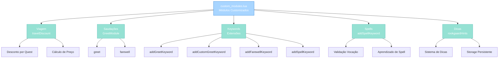
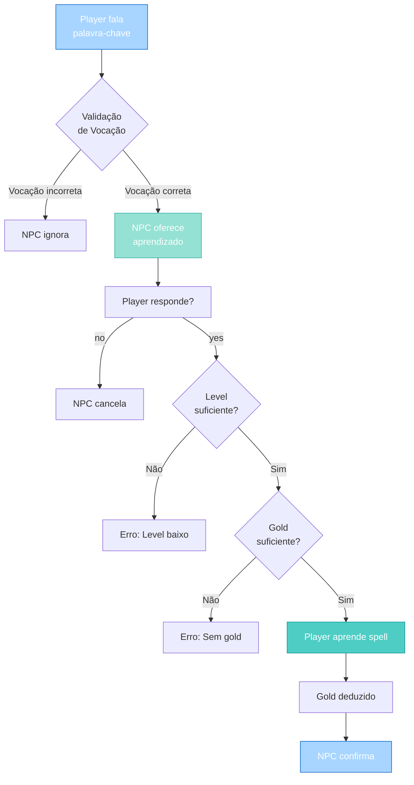

import { Aside, Card } from '@astrojs/starlight/components';

## 🛠️ Informações do Arquivo

Este é o arquivo de **módulos customizados para sistema de keywords de NPCs** do servidor **OpenTibiaBR/Canary**. Fornece funcionalidades avançadas para greetings, farewells, spells e eventos customizados.

<Card title="Caminho Original" icon="document">
  `data/npclib/npc_system/custom_modules.lua`
</Card>

<Aside type="tip">
  Este arquivo estende o sistema de keywords com módulos locais especializados. É carregado após `keyword_handler.lua` e permite criar interações NPCs complexas com saudações, despedidas, compra de spells e dicas contextuais.
</Aside>

## 📄 Visão Geral do Código

### Resumo Executivo

`custom_modules.lua` é um módulo de **extensões para sistema de keywords** que implementa:

1. **Gerenciamento de Descontos**: Sistema de viagem com desconto baseado em quests
2. **Saudações Personalizadas**: Greetings e farewells com suporte a tags
3. **Sistema de Spells**: Compra de magia com validação de vocação
4. **Dicas do Jogo**: Sistema de hints contextuais (principalmente Rookgaard)
5. **Ações Especiais**: Kick (expulsão) com teleporte

O arquivo estende `KeywordHandler` e `StdModule` com funcionalidades domain-specific para datapacks.

### Estrutura de Funcionalidades



---

## 3. Variáveis Locais

### 3.1 `travelDiscounts`

```lua
local travelDiscounts = {
    ["postman"] = { price = 10, storage = Storage.Quest.ExampleQuest, value = 1 },
}
```

| Propriedade | Valor |
|-------------|-------|
| **Tipo** | table |
| **Escopo** | Local (privado para este módulo) |
| **Chaves** | Nome do desconto (string) |
| **Propósito** | Armazenar configurações de desconto de viagem |

**Descrição**: Tabela que define descontos aplicáveis a preços de viagem baseados em quests completadas.

**Estrutura de Cada Desconto**:

| Campo | Tipo | Descrição |
|-------|------|-----------|
| **price** | number | Valor do desconto em ouro |
| **storage** | number | Storage ID para verificação de quest |
| **value** | number | Valor mínimo do storage para aplicar desconto |

**Exemplos de Uso**:
```lua
-- Configuração existente
travelDiscounts["postman"] = {
    price = 10,                         -- Desconto de 10 gold
    storage = Storage.Quest.ExampleQuest, -- Armazenamento da quest
    value = 1                           -- Se storage >= 1, desconto aplicável
}

-- Adicionar novo desconto
travelDiscounts["mage"] = {
    price = 50,
    storage = Storage.Quest.SomeOtherQuest,
    value = 1
}
```

**Ciclo de Vida**:
1. NPCs consultam `travelDiscounts` via `StdModule.travelDiscount()`
2. Valida se player tem storage >= value
3. Retorna `price` como desconto aplicável
4. Múltiplos descontos podem ser combinados

---

### 3.2 `GreetModule`

```lua
local GreetModule = {}
```

| Propriedade | Valor |
|-------------|-------|
| **Tipo** | table |
| **Escopo** | Local (privado para este módulo) |
| **Conteúdo** | Funções de saudação e despedida |
| **Propósito** | Encapsular lógica de greetings |

**Descrição**: Namespace local que encapsula funções especializadas em saudações e despedidas de NPCs.

**Funções Contidas**:
- `GreetModule.greet()` - Handler de saudação inicial
- `GreetModule.farewell()` - Handler de despedida

**Exemplo de Uso**:
```lua
-- Usado internamente por addGreetKeyword
function KeywordHandler:addGreetKeyword(keys, parameters)
    return self:addKeyword(localKeys, GreetModule.greet, parameters)
end
```

---

### 3.3 `hints`

```lua
local hints = {
    [-1] = "If you don't know the meaning...",
    [0] = "Send private messages...",
    [1] = "Use the shortcuts...",
    -- ... até [28]
}
```

| Propriedade | Valor |
|-------------|-------|
| **Tipo** | table |
| **Escopo** | Local (privado para este módulo) |
| **Chaves** | ID da dica (number, -1 a 28) |
| **Valor** | string ou table de strings |
| **Propósito** | Armazenar dicas contextuais do jogo |

**Descrição**: Tabela com 29 dicas diferentes sobre o jogo, indexadas por ID. Algumas dicas têm múltiplas linhas (array).

**Dicas Disponíveis** (resumo):

| ID | Tema |
|----|------|
| **-1** | Ícones da interface |
| **0** | Mensagens privadas |
| **1** | Atalhos (SHIFT, CTRL, ALT) |
| **2** | Mapa automático |
| **3** | Abrir/fechar skills/battle |
| **4-5** | Capacidade e saúde |
| **6-9** | Comida e combate |
| **10** | Receita de pão (multiline) |
| **11-15** | Morte, fighting, follow |
| **16-20** | Perspectiva, trade, stairs |
| **21-28** | Party, hotkeys, experiência |

**Exemplo de Acesso**:
```lua
local hintId = player:getStorageValue(Storage.RookgaardHints)
npcHandler:say(hints[hintId], npc, player)  -- Mostra dica correspondente
```

---

## 4. Funções Locais

### 4.1 `GreetModule.greet(npc, player, message, keywords, parameters)`

Handler de saudação que inicia conversa com NPC.

#### Assinatura
```lua
function GreetModule.greet(npc, player, message, keywords, parameters)
```

#### Parâmetros

| Parâmetro | Tipo | Descrição |
|-----------|------|-----------|
| **npc** | NPC | Referência do NPC |
| **player** | Player | Player que interage |
| **message** | string | Mensagem do player |
| **keywords** | table | Keywords que dispararam este handler |
| **parameters** | table | Parâmetros customizados (npcHandler, text) |

#### Retorno

| Valor | Significado |
|-------|-------------|
| **true** | Conversa iniciada com sucesso |
| **false** | Falha na inicialização |

#### Comportamento

```lua
-- 1. Valida se NPC está próximo
if not parameters.npcHandler:isInRange(npc, player) then
    return true  -- Ignora se fora de alcance
end

-- 2. Verifica se já há interação ativa
if parameters.npcHandler:checkInteraction(npc, player) then
    return true  -- Já está em conversa
end

-- 3. Prepara informações para parsing de tags
local parseInfo = { [TAG_PLAYERNAME] = Player(player):getName() }

-- 4. Faz NPC cumprimentar com tag personalização
parameters.npcHandler:say(
    parameters.npcHandler:parseMessage(parameters.text, parseInfo),
    npc,
    player
)

-- 5. Marca como em conversa
parameters.npcHandler:setInteraction(npc, player)
return true
```

#### Exemplos

```lua
-- Configuração típica
npcKeywords:addGreetKeyword({
    "hello",
    "hi",
    "greetings"
}, {
    npcHandler = npcHandler,
    text = "Hello {PLAYERNAME}! Welcome to my shop."
})

-- Output ao player "John" falar "hello":
-- NPC says: "Hello John! Welcome to my shop."
```

---

### 4.2 `GreetModule.farewell(npc, player, message, keywords, parameters)`

Handler de despedida que encerra conversa com NPC.

#### Assinatura
```lua
function GreetModule.farewell(npc, player, message, keywords, parameters)
```

#### Parâmetros

| Parâmetro | Tipo | Descrição |
|-----------|------|-----------|
| **npc** | NPC | Referência do NPC |
| **player** | Player | Player que se retira |
| **message** | string | Mensagem do player |
| **keywords** | table | Keywords que dispararam handler |
| **parameters** | table | Parâmetros (npcHandler, text) |

#### Retorno

| Valor | Significado |
|-------|-------------|
| **true** | Despedida processada |
| **false** | Player não estava em conversa |

#### Comportamento

```lua
-- 1. Valida se há interação ativa
if not parameters.npcHandler:checkInteraction(npc, player) then
    return false  -- Não estava conversando
end

-- 2. Prepara parsing de tags
local parseInfo = { [TAG_PLAYERNAME] = Player(player):getName() }

-- 3. NPC faz despedida
parameters.npcHandler:say(
    parameters.npcHandler:parseMessage(parameters.text, parseInfo),
    npc,
    player
)

-- 4. Reseta estado do NPC (para este player)
parameters.npcHandler:resetNpc(player)

-- 5. Remove registro de interação
parameters.npcHandler:removeInteraction(npc, player)
return true
```

#### Exemplos

```lua
-- Configuração típica
npcKeywords:addFarewellKeyword({
    "bye",
    "goodbye",
    "farewell"
}, {
    npcHandler = npcHandler,
    text = "Goodbye {PLAYERNAME}! Come back soon."
})

-- Output ao player "Jane" falar "bye":
-- NPC says: "Goodbye Jane! Come back soon."
-- [Conversa encerra, estado resetado]
```

---

## 5. Funções Globais (StdModule Extensions)

### 5.1 `StdModule.travelDiscount(npc, player, discounts)`

Calcula desconto de viagem baseado em quests completadas.

#### Assinatura
```lua
function StdModule.travelDiscount(npc, player, discounts)
```

#### Parâmetros

| Parâmetro | Tipo | Descrição |
|-----------|------|-----------|
| **npc** | NPC | Referência do NPC (não usado) |
| **player** | Player | Player para checar storages |
| **discounts** | string ou table | Nome(s) de desconto(s) a verificar |

#### Retorno

| Tipo | Descrição |
|------|-----------|
| **number** | Quantidade total de desconto em gold |

#### Comportamento

```lua
local discountPrice = 0
local discount = 0

-- Caso 1: String simples (um desconto)
if type(discounts) == "string" then
    discount = travelDiscounts[discounts]
    -- Verifica se existe e se player completou a quest
    if discount and player:getStorageValue(discount.storage) >= discount.value then
        return discount.price
    end
else
    -- Caso 2: Array (múltiplos descontos)
    for i = 1, #discounts do
        discount = travelDiscounts[discounts[i]]
        -- Acumula descontos válidos
        if discount and player:getStorageValue(discount.storage) >= discount.value then
            discountPrice = discountPrice + discount.price
        end
    end
end

return discountPrice
```

#### Exemplos

```lua
-- Caso 1: Um desconto
local discount1 = StdModule.travelDiscount(npc, player, "postman")
-- Se player completou ExampleQuest: retorna 10
-- Se não completou: retorna 0

-- Caso 2: Múltiplos descontos
local totalDiscount = StdModule.travelDiscount(
    npc,
    player,
    {"postman", "mage"}  -- Array de descontos
)
-- Se completou ambos: retorna 60 (10 + 50)
-- Se completou apenas "postman": retorna 10
-- Se completou nenhum: retorna 0

-- Uso em NPC
local basePrice = 100
local discount = StdModule.travelDiscount(npc, player, "postman")
local finalPrice = math.max(0, basePrice - discount)
npcHandler:say("Passage costs " .. finalPrice .. " gold")
```

---

### 5.2 `StdModule.kick(npc, player, message, keywords, parameters, node)`

Expulsa um player do NPC e o teleporta para destinação aleatória ou fixa.

#### Assinatura
```lua
function StdModule.kick(npc, player, message, keywords, parameters, node)
```

#### Parâmetros

| Parâmetro | Tipo | Descrição |
|-----------|------|-----------|
| **npc** | NPC | Referência do NPC |
| **player** | Player | Player a expulsar |
| **message** | string | Mensagem do player (não usado) |
| **keywords** | table | Keywords (não usado) |
| **parameters** | table | Contém npcHandler, text, destination |
| **node** | KeywordNode | Nó de keyword (não usado) |

#### Parâmetros de `parameters`

| Campo | Tipo | Descrição |
|-------|------|-----------|
| **npcHandler** | NpcHandler | Handler para interação |
| **text** | string | Mensagem de despedida |
| **destination** | Position ou table | Local de teleporte (ou array de posições) |

#### Retorno

| Valor | Significado |
|-------|-------------|
| **true** | Kick executado |
| **false** | Falha (sem npcHandler) |

#### Comportamento

```lua
-- 1. Valida npcHandler
local npcHandler = parameters.npcHandler
if npcHandler == nil then
    logger.error("StdModule.kick called without npcHandler")
end

-- 2. Verifica interação
if not npcHandler:checkInteraction(npc, player) then
    return false
end

-- 3. Remove da conversa
npcHandler:removeInteraction(npc, player)

-- 4. Fala mensagem de despedida
npcHandler:say(parameters.text or "Off with you!", npc, player)

-- 5. Define destinação (aleatória se array)
local destination = parameters.destination
if type(destination) == "table" then
    destination = destination[math.random(#destination)]
end

-- 6. Teleporta player
Player(player):teleportTo(destination, true)

-- 7. Reseta NPC
npcHandler:resetNpc(player)
return true
```

#### Exemplos

```lua
-- Destino único
npcKeywords:addKeyword(
    { "kick", "go away" },
    StdModule.kick,
    {
        npcHandler = npcHandler,
        text = "You have been kicked out!",
        destination = Position(100, 100, 7)
    }
)

-- Destinos aleatórios (múltiplos possíveis)
npcKeywords:addKeyword(
    { "kick" },
    StdModule.kick,
    {
        npcHandler = npcHandler,
        text = "Off with you!",
        destination = {
            Position(100, 100, 7),
            Position(200, 200, 7),
            Position(150, 150, 7)
        }
    }
)

-- Output: Player é teleportado aleatoriamente para uma das 3 posições
```

---

### 5.3 `StdModule.rookgaardHints(npc, player, message, keywords, parameters, node)`

Sistema de dicas contextuais do jogo (principalmente Rookgaard).

#### Assinatura
```lua
function StdModule.rookgaardHints(npc, player, message, keywords, parameters, node)
```

#### Parâmetros

| Parâmetro | Tipo | Descrição |
|-----------|------|-----------|
| **npc** | NPC | Referência do NPC (hint provider) |
| **player** | Player | Player recebendo dica |
| **message** | string | Mensagem do player |
| **keywords** | table | Keywords ("hints", "hint") |
| **parameters** | table | Contém npcHandler |
| **node** | KeywordNode | Nó de keyword |

#### Retorno

| Valor | Significado |
|-------|-------------|
| **true** | Dica fornecida |
| **false** | Falha (sem interação ou não é datapack global) |

#### Comportamento

```lua
-- 1. Valida npcHandler
local npcHandler = parameters.npcHandler
if npcHandler == nil then
    error("StdModule.rookgaardHints called without npcHandler")
end

-- 2. Verifica se há interação E se é datapack global
if not npcHandler:checkInteraction(npc, player) or not IsRunningGlobalDatapack() then
    return false
end

-- 3. Obtém ID da dica atual do player
local hintId = player:getStorageValue(Storage.RookgaardHints)
-- hintId pode ser -1 (start), 0-28 (dicas), ou 29+ (fim)

-- 4. Fornece dica correspondente
npcHandler:say(hints[hintId], npc, player)

-- 5. Incrementa para próxima dica
if hintId >= #hints then
    player:setStorageValue(Storage.RookgaardHints, -1)  -- Reset ao fim
else
    player:setStorageValue(Storage.RookgaardHints, hintId + 1)
end

return true
```

#### Exemplos

```lua
-- Configuração típica em NPC Rookgaard
npcKeywords:addKeyword(
    { "hints", "hint" },
    StdModule.rookgaardHints,
    {
        npcHandler = npcHandler
    }
)

-- Fluxo de Player:
-- 1ª vez: storage = -1 → "If you don't know the meaning..."
--         storage → 0
-- 2ª vez: storage = 0  → "Send private messages..."
--         storage → 1
-- 3ª vez: storage = 1  → "Use the shortcuts..."
--         storage → 2
-- ... (continua até dica 28)
-- Última: storage = 28 → "There is nothing more..."
--         storage → -1 (reset)
-- Próxima: storage = -1 → volta ao início
```

---

## 6. Métodos de `KeywordHandler` (Extensões de Classe)

### 6.1 `KeywordHandler:addGreetKeyword(keys, parameters, condition, action)`

Adiciona palavra-chave de saudação usando module padrão.

#### Assinatura
```lua
function KeywordHandler:addGreetKeyword(keys, parameters, condition, action)
```

#### Parâmetros

| Parâmetro | Tipo | Descrição |
|-----------|------|-----------|
| **keys** | table ou string | Palavras-chave da saudação |
| **parameters** | table | Config (npcHandler, text) |
| **condition** | function | Validação (opcional) |
| **action** | function | Ação após handler (opcional) |

#### Retorno

| Tipo | Descrição |
|------|-----------|
| **KeywordNode** | Nó de keyword criado para possível extensão |

#### Comportamento

```lua
-- 1. Cria cópia local das keys
local localKeys = keys
-- 2. Adiciona callback padrão para matching
localKeys.callback = FocusModule.messageMatcherDefault
-- 3. Registra como keyword com GreetModule.greet
return self:addKeyword(localKeys, GreetModule.greet, parameters, condition, action)
```

#### Exemplos

```lua
-- Saudação simples
npcKeywords:addGreetKeyword({
    "hello",
    "hi",
    "greetings"
}, {
    npcHandler = npcHandler,
    text = "Greetings {PLAYERNAME}!"
})

-- Com condição (vocação específica)
npcKeywords:addGreetKeyword({
    "hello"
}, {
    npcHandler = npcHandler,
    text = "Hello brave {PLAYERNAME}!"
}, function(player)
    return player:getVocation():getId() ~= 0  -- Não recruta
end)
```

---

### 6.2 `KeywordHandler:addCustomGreetKeyword(keys, callbackFunction, parameters, condition, action)`

Adiciona saudação com callback customizado (não usa GreetModule padrão).

#### Assinatura
```lua
function KeywordHandler:addCustomGreetKeyword(keys, callbackFunction, parameters, condition, action)
```

#### Parâmetros

| Parâmetro | Tipo | Descrição |
|-----------|------|-----------|
| **keys** | table ou string | Palavras-chave da saudação |
| **callbackFunction** | function | Função de callback customizada |
| **parameters** | table | Parâmetros a passar para callback |
| **condition** | function | Validação (opcional) |
| **action** | function | Ação pós-handler (opcional) |

#### Retorno

| Tipo | Descrição |
|------|-----------|
| **KeywordNode** | Nó de keyword criado |

#### Comportamento

```lua
-- 1. Cria cópia local das keys
local localKeys = keys
-- 2. Adiciona callback padrão
localKeys.callback = FocusModule.messageMatcherDefault
-- 3. Registra como keyword com função customizada
return self:addKeyword(localKeys, callbackFunction, parameters, condition, action)
```

#### Exemplos

```lua
-- Callback customizado
local function myCustomGreeting(npc, player, message, keywords, parameters)
    if math.random() > 0.5 then
        parameters.npcHandler:say("Hello there!", npc, player)
    else
        parameters.npcHandler:say("Hi friend!", npc, player)
    end
    parameters.npcHandler:setInteraction(npc, player)
    return true
end

npcKeywords:addCustomGreetKeyword(
    {"hello", "hi"},
    myCustomGreeting,
    { npcHandler = npcHandler }
)
```

---

### 6.3 `KeywordHandler:addFarewellKeyword(keys, parameters, condition, action)`

Adiciona palavra-chave de despedida.

#### Assinatura
```lua
function KeywordHandler:addFarewellKeyword(keys, parameters, condition, action)
```

#### Parâmetros

| Parâmetro | Tipo | Descrição |
|-----------|------|-----------|
| **keys** | table ou string | Palavras-chave de despedida |
| **parameters** | table | Config (npcHandler, text) |
| **condition** | function | Validação (opcional) |
| **action** | function | Ação (opcional) |

#### Retorno

| Tipo | Descrição |
|------|-----------|
| **KeywordNode** | Nó de keyword |

#### Comportamento

```lua
-- Similar a addGreetKeyword mas usa GreetModule.farewell
local localKeys = keys
localKeys.callback = FocusModule.messageMatcherDefault
return self:addKeyword(localKeys, GreetModule.farewell, parameters, condition, action)
```

#### Exemplos

```lua
npcKeywords:addFarewellKeyword({
    "bye",
    "goodbye",
    "farewell"
}, {
    npcHandler = npcHandler,
    text = "Farewell, {PLAYERNAME}! May fortune favor you!"
})
```

---

### 6.4 `KeywordHandler:addSpellKeyword(keys, parameters)`

Adiciona keyword para venda/aprendizado de spell com validação de vocação.

#### Assinatura
```lua
function KeywordHandler:addSpellKeyword(keys, parameters)
```

#### Parâmetros de `parameters`

| Campo | Tipo | Descrição |
|-------|------|-----------|
| **npcHandler** | NpcHandler | Handler para conversa |
| **spellName** | string | Nome da magia |
| **price** | number | Custo em gold (0 = gratuito) |
| **vocation** | number ou table | ID(s) de vocação que podem aprender |
| **level** | number | Level mínimo para aprender |

#### Retorno

Nenhum (void)

#### Comportamento

```lua
-- 1. Cria cópia de keys
local localKeys = keys
localKeys.callback = FocusModule.messageMatcherDefault

-- 2. Prepara variáveis
local npcHandler, spellName, price, vocationId = 
    parameters.npcHandler, parameters.spellName, parameters.price, parameters.vocation

-- 3. Cria keyword principal (com condição de vocação)
local spellKeyword = self:addKeyword(
    localKeys,
    StdModule.say,
    {
        npcHandler = npcHandler,
        text = "Do you want to learn the spell '" .. spellName .. "' for " ..
               (price > 0 and price .. " gold" or "free") .. "?"
    },
    function(player)
        -- Obtém vocação base do player (sem transformações)
        local vocationClientId = player:getVocation():getBaseId()
        -- Valida contra vocação(ões) permitida(s)
        if type(vocationId) == "table" then
            return table.contains(vocationId, vocationClientId)
        else
            return vocationId == vocationClientId
        end
    end
)

-- 4. Adiciona respostas possíveis ("yes" e "no")
spellKeyword:addChildKeyword({"yes"}, StdModule.learnSpell, {
    npcHandler = npcHandler,
    spellName = spellName,
    level = parameters.level,
    price = price,
})
spellKeyword:addChildKeyword({"no"}, StdModule.say, {
    npcHandler = npcHandler,
    text = "Maybe next time.",
    reset = true,
})
```

#### Exemplos

```lua
-- Spell para uma vocação
npcKeywords:addSpellKeyword({
    "fireball",
    "spell fireball"
}, {
    npcHandler = npcHandler,
    spellName = "Fireball",
    price = 500,
    vocation = VOCATION_SORCERER,  -- Apenas sorcerer
    level = 11
})

-- Spell para múltiplas vocações
npcKeywords:addSpellKeyword({
    "heal",
    "spell heal"
}, {
    npcHandler = npcHandler,
    spellName = "Heal",
    price = 300,
    vocation = {VOCATION_DRUID, VOCATION_PRIEST},  -- Druida ou sacerdote
    level = 8
})

-- Spell gratuito (price = 0)
npcKeywords:addSpellKeyword({
    "magic missile"
}, {
    npcHandler = npcHandler,
    spellName = "Magic Missile",
    price = 0,  -- Gratuito
    vocation = {1, 2, 3, 4},  -- Todas as vocações
    level = 4
})

-- Fluxo ao player falar "fireball" (se sorcerer):
-- NPC: "Do you want to learn the spell 'Fireball' for 500 gold?"
-- Player: "yes"
-- → Aprende spell (se tem level)
-- Player: "no"
-- → Cancela
```

---

## 7. Diagrama de Fluxo: Spell Learning



---

## 8. Exemplos Práticos

### Exemplo 1: NPC Greeting Simples

```lua
local npcKeywords = KeywordHandler:new()
local npcHandler = NpcHandler:new()

-- Saudação
npcKeywords:addGreetKeyword({
    "hello",
    "hi"
}, {
    npcHandler = npcHandler,
    text = "Hello {PLAYERNAME}! Welcome to my inn!"
})

-- Despedida
npcKeywords:addFarewellKeyword({
    "bye",
    "goodbye"
}, {
    npcHandler = npcHandler,
    text = "Farewell {PLAYERNAME}!"
})

-- Fluxo:
-- Player: "hello"
-- NPC: "Hello John! Welcome to my inn!" (marca como em conversa)
-- ...conversa continua...
-- Player: "bye"
-- NPC: "Farewell John!" (reseta conversa)
```

---

### Exemplo 2: Desconto de Viagem

```lua
-- Configurar desconto
travelDiscounts["questcompleter"] = {
    price = 20,
    storage = Storage.Quest.SomeQuest,
    value = 1
}

-- Usar em NPC
function handleTravel(npc, player)
    local basePrice = 100
    local discount = StdModule.travelDiscount(npc, player, "questcompleter")
    local finalPrice = basePrice - discount
    
    npcHandler:say("Passage costs " .. finalPrice .. " gold", npc, player)
end

-- Resultado:
-- Jogador sem quest: 100 gold
-- Jogador com quest: 80 gold
```

---

### Exemplo 3: Sistema de Dicas

```lua
-- Em um NPC hint provider (tipo Rookgaard)
npcKeywords:addKeyword(
    {"hints", "hint"},
    StdModule.rookgaardHints,
    { npcHandler = npcHandler }
)

-- Player interage:
-- 1ª interação: Recebe dica 0, storage incrementa
-- 2ª interação: Recebe dica 1, storage incrementa
-- ...continua até dica 28...
-- Volta ao início de forma cíclica
```

---

### Exemplo 4: Spell Shop Completo

```lua
local npcKeywords = KeywordHandler:new()

-- Spells de mago
npcKeywords:addSpellKeyword({
    "fireball"
}, {
    npcHandler = npcHandler,
    spellName = "Fireball",
    price = 500,
    vocation = VOCATION_SORCERER,
    level = 11
})

npcKeywords:addSpellKeyword({
    "lightning"
}, {
    npcHandler = npcHandler,
    spellName = "Lightning",
    price = 800,
    vocation = VOCATION_SORCERER,
    level = 20
})

-- Fluxo ao player (sorcerer nível 15) falar "fireball":
-- NPC: "Do you want to learn the spell 'Fireball' for 500 gold?"
-- Player: "yes"
-- → Player aprende Fireball, perde 500 gold
-- → NPC confirma

-- Se player fosse knight (vocação errada):
-- → NPC ignora completamente
```

---

## 9. Padrões e Boas Práticas

### ✅ Usar addGreetKeyword para Saudações Padrão

```lua
-- ✓ BOM: Padrão simples
npcKeywords:addGreetKeyword({
    "hello", "hi"
}, {
    npcHandler = npcHandler,
    text = "Hello {PLAYERNAME}!"
})

-- ✗ RUIM: Implementar greet manualmente
npcKeywords:addKeyword(
    {"hello"},
    function(npc, player, message, keywords, parameters)
        -- ... copiar toda lógica de greet
    end
)
```

---

### ✅ Validar Vocação em addSpellKeyword

```lua
-- ✓ BOM: Sistema valida vocação automaticamente
npcKeywords:addSpellKeyword({
    "spell"
}, {
    vocation = VOCATION_SORCERER,  -- Validação automática
    ...
})

-- ✗ RUIM: Sem validação
npcKeywords:addKeyword({"spell"}, handler)
-- Player de outras vocações pode tentar aprender
```

---

### ✅ Usar Múltiplos Descontos com Array

```lua
-- ✓ BOM: Combinar descontos
local totalDiscount = StdModule.travelDiscount(
    npc,
    player,
    {"postman", "merchant", "soldier"}
)

-- ✗ RUIM: Chamar uma vez por desconto
local d1 = StdModule.travelDiscount(npc, player, "postman")
local d2 = StdModule.travelDiscount(npc, player, "merchant")
local total = d1 + d2  -- Menos eficiente
```

---

### ✅ Usar addFarewellKeyword para Limpeza

```lua
-- ✓ BOM: Despedida com cleanup automático
npcKeywords:addFarewellKeyword({
    "bye", "goodbye"
}, {
    npcHandler = npcHandler,
    text = "Farewell!"
})

-- ✗ RUIM: Sem despedida
-- Player fica com interação ativa depois
```

---

## 10. Referência Rápida

### Funções StdModule

```lua
StdModule.travelDiscount(npc, player, discounts)  -- Calcula desconto
StdModule.kick(npc, player, msg, kw, params)     -- Expulsa player
StdModule.rookgaardHints(npc, player, msg, kw, params)  -- Fornece dica
```

### Métodos KeywordHandler

```lua
KeywordHandler:addGreetKeyword(keys, parameters)         -- Saudação padrão
KeywordHandler:addCustomGreetKeyword(keys, callback, parameters)  -- Customizada
KeywordHandler:addFarewellKeyword(keys, parameters)      -- Despedida
KeywordHandler:addSpellKeyword(keys, parameters)         -- Vender spell
```

### Módulos Locais

```lua
GreetModule.greet()      -- Handler de saudação
GreetModule.farewell()   -- Handler de despedida
```

### Tabelas Configuráveis

```lua
travelDiscounts     -- Configuração de descontos de viagem
hints               -- Array de dicas (29 dicas)
```

### Tags Suportadas

```lua
TAG_PLAYERNAME      -- {PLAYERNAME} → nome do jogador
```

### Storage Keys

```lua
Storage.RookgaardHints          -- ID atual de dica
Storage.Quest.ExampleQuest      -- Quest status
```

---

## 11. Checkpoint: O que foi Carregado até Aqui

Após `npclib/npc_system/custom_modules.lua` ser carregado:

✅ **Sistemas Adicionados**:
- Desconto de viagem baseado em quests
- Saudações e despedidas com tags
- Sistema de dicas contextuais
- Venda de spells com validação de vocação
- Ação de kick com teleporte

✅ **Extensões de Classes**:
- `KeywordHandler` ganha 4 novos métodos
- `StdModule` ganha 3 novas funções

✅ **Capacidades de NPC Agora Disponíveis**:
- Greeting/farewell automáticos
- Venda de spells customizados
- Sistema de dicas do jogo
- Descontos dinâmicos
- Expulsão de players

### Sequência de Carga

```
npclib/load.lua
  ↓
npclib/npc.lua
  ↓
npclib/npc_system/npc_handler.lua
  ↓
npclib/npc_system/keyword_handler.lua
  ↓
npclib/npc_system/custom_modules.lua ← VOCÊ ESTÁ AQUI
  ↓
NPCs podem usar todas as extensões
```

---

## 12. Conclusão

`custom_modules.lua` é uma **coleção de extensões especializadas para sistema de keywords** que demonstra:

### Padrões Implementados

1. **Namespace Local**: `GreetModule` encapsula lógica relacionada
2. **Configurable Data**: `travelDiscounts`, `hints` são tabelas de config
3. **Callback Pattern**: StdModule estende com novas operações
4. **Conditional Execution**: Validação de vocação, storage, range
5. **Module Extension**: Novos métodos em `KeywordHandler`

### Recursos Principais

- ✅ Sistema de disconto de viagem por quest
- ✅ Greetings/farewells com suporte a tags
- ✅ Venda de spells com validação automática
- ✅ Sistema de dicas contextuais (29 dicas)
- ✅ Ação de kick com teleporte aleatório/fixo
- ✅ Customização via parameters

### Use Para

- ✅ Criar NPCs com greeting/farewell automáticos
- ✅ Implementar vendedor de spells
- ✅ Adicionar sistema de dicas do jogo
- ✅ Criar descontos dinâmicos
- ✅ Expulsar players problemáticos
- ✅ Estender sistema de keywords

### Padrão Arquitetural

O módulo implementa **Custom Module Extension Pattern** com:
- Módulos locais para lógica coesa
- Tabelas de configuração separadas
- Extensão de classes existentes
- Callbacks customizáveis
- Suporte a tags de parsing

---

## 🤖 Informações da Documentação

<Aside type="note">
  Esta documentação foi **gerada automaticamente por IA** (Claude Haiku 4.5) utilizando análise estática de código. Todas as explicações técnicas foram produzidas por processamento inteligente do código-fonte, garantindo precisão e consistência com o padrão de documentação Starlight/Astro do projeto.
</Aside>

**Última Atualização**: Baseado no servidor **OpenTibiaBR/Canary** (Fork do OTServBR-Global)

**Repositório**: [opentibiabr/canary](https://github.com/opentibiabr/canary)

**Documentação técnica de npclib/npc_system/custom_modules.lua**  
*Parte da série de documentação do Canary Engine - Sistemas de NPC*
