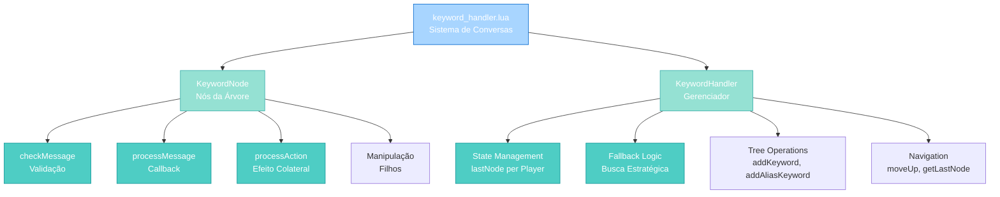
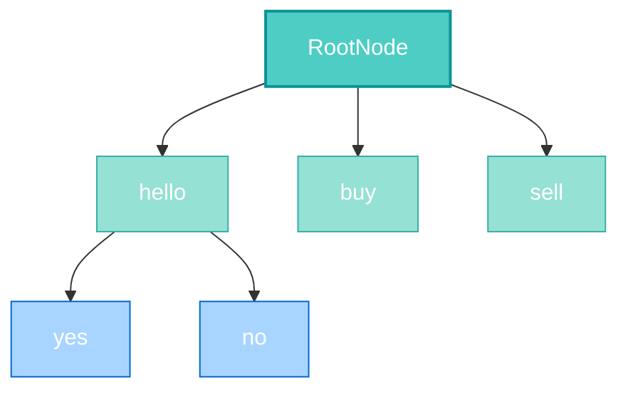
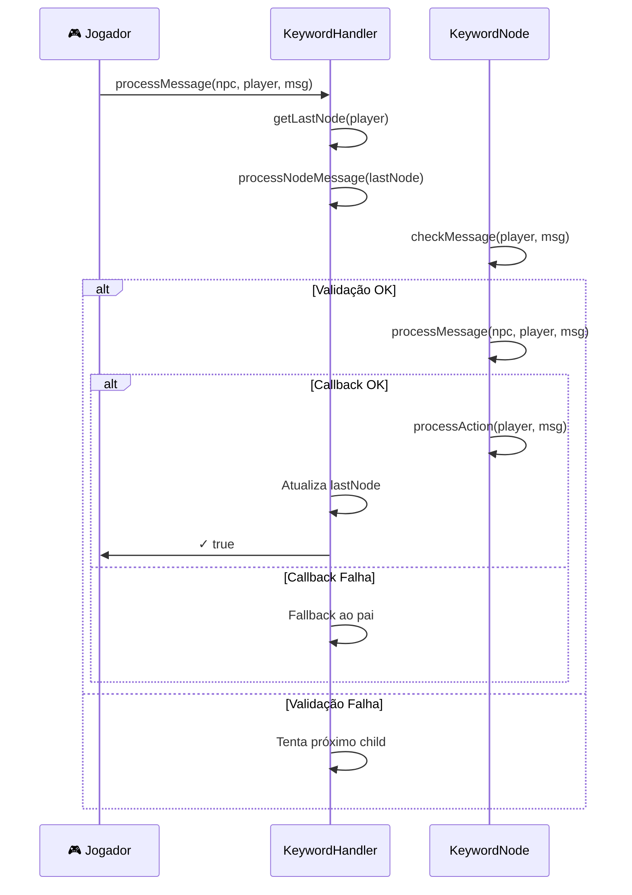

import { Aside, Card } from '@astrojs/starlight/components';

## 🛠️ Informações do Arquivo

Este é o arquivo de **processamento de palavras-chave para conversas de NPC** do servidor **OpenTibiaBR/Canary**. Implementa um sistema robusto baseado em **Composite Pattern** com suporte a hierarquias dinâmicas, validação de condições e rastreamento de estado por jogador.

<Card title="Caminho Original" icon="document">
  `data/npclib/npc_system/keyword_handler.lua`
</Card>

<Aside type="tip">
  Este arquivo é o coração do sistema de conversas NPC. Define duas classes fundamentais (`KeywordNode` e `KeywordHandler`) que permitem criar diálogos estruturados em árvore com fallback automático e gerenciamento de estado por jogador. É carregado como primeiro módulo do `npclib` e serve de base para `custom_modules.lua` e `bank_system.lua`.
</Aside>

## 📄 Visão Geral do Código

### Resumo Executivo

`keyword_handler.lua` implementa um **sistema tree-based de validação de keywords** com as seguintes responsabilidades:

1. **KeywordNode**: Nó individual na árvore de conversa (padrão Composite)
2. **Validação de Mensagens**: Pattern matching com suporte a regex-like (`%d` para números)
3. **State Management**: Rastreamento per-player da posição atual na árvore
4. **Fallback Inteligente**: Procura automática em (nó → pai → raiz)
5. **Condições e Ações**: Suporte a callbacks pré-processamento e pós-processamento
6. **Hierarquias Dinâmicas**: Construção de conversas via chaining method

O arquivo contém **guardião anti-reload** que previne carregamento duplicado do datapack.

### Estrutura de Funcionalidades



---

## 📋 Índice de Componentes

| Classe | Métodos | Propósito |
|--------|---------|-----------|
| **KeywordNode** | 9 | Nó individual da árvore de conversação |
| **KeywordHandler** | 10 | Gerenciador de árvore e estado |

---

## 3. KeywordNode — Classe de Nó

### 3.1 Estrutura de Dados

```lua
KeywordNode = {
    keywords = nil,      -- table: Array de strings ou função customizada
    callback = nil,      -- function: Executada quando nó é processado
    parameters = nil,    -- table: Parâmetros passados ao callback
    children = nil,      -- table: Array de KeywordNode filhos
    parent = nil,        -- KeywordNode: Referência ao nó pai
    condition = nil,     -- function: Validação antes de processamento
    action = nil,        -- function: Efeito colateral após sucesso
}
```

**Padrão**: Composite Pattern com validação em cadeia

**Diagrama de Relacionamento**:



---

### 3.2 Métodos Públicos

#### `KeywordNode:new(keys, func, param, condition, action)`

Cria um novo nó com as propriedades especificadas.

```lua
function KeywordNode:new(keys, func, param, condition, action)
    local obj = {}
    obj.keywords = keys
    obj.callback = func
    obj.parameters = param
    obj.children = {}
    obj.condition = condition
    obj.action = action
    setmetatable(obj, self)
    self.__index = self
    return obj
end
```

| Parâmetro | Tipo | Descrição |
|-----------|------|-----------|
| **keys** | table\|function | Palavras-chave a validar ou função customizada |
| **func** | function | Callback(npc, player, message, keywords, params, node) |
| **param** | table | Parâmetros contextuais passados ao callback |
| **condition** | function | Validação(player, data) que retorna bool |
| **action** | function | Ação(player, npcHandler, message) pós-callback |

**Retorna**: `KeywordNode`

**Exemplo**:
```lua
local node = KeywordNode:new(
    {"hello", "hi"},
    function(npc, player, message, kw, params)
        npc:talk("Hello there!")
        return true
    end,
    {greeting = true},
    function(player, data)
        return player:getLevel() >= 10  -- Condição
    end,
    function(player, npcHandler, msg)
        -- Ação pós-validação
    end
)
```

---

#### `KeywordNode:checkMessage(player, message)`

Valida se a mensagem contém os padrões de keyword especificados.

```lua
function KeywordNode:checkMessage(player, message)
    -- Retorna: true/false
end
```

**Parâmetros**:
- `player` (userdata): Jogador que enviou mensagem
- `message` (string): Mensagem lowercase a validar

**Retorna**: `true` se message corresponde aos padrões

**Comportamento**:

If `keywords.callback` é função:
```lua
-- Callback customizado
local ret, data = self.keywords.callback(self.keywords, message)
if not ret then return false end
if self.condition and not self.condition(Player(player), data) then
    return false
end
return true
```

If `keywords` é array de strings:
```lua
-- Validação sequencial
for _, keyword in ipairs(self.keywords) do
    if type(keyword) == "string" then
        local a, b = string.find(message, keyword)
        if a == nil or b == nil or a < last then
            return false  -- Não encontrou ou ordem errada
        end
        if keyword:sub(1, 1) == "%" then
            data[#data + 1] = tonumber(message:sub(a, b)) or nil  -- Captura número
        end
        last = a
    end
end
```

**Exemplos**:
```lua
-- Palavra simples
local node1 = KeywordNode:new({"hello"})
node1:checkMessage(player, "hello world")  -- ✓ true

-- Múltiplas palavras (sequência)
local node2 = KeywordNode:new({"buy", "armor"})
node2:checkMessage(player, "i want to buy armor")  -- ✓ true
node2:checkMessage(player, "armor buy")            -- ✗ false (ordem errada)

-- Com captura de número
local node3 = KeywordNode:new({"deposit", "%d"})
node3:checkMessage(player, "deposit 100")  -- ✓ true (data[1] = 100)

-- Com condição
local node4 = KeywordNode:new(
    {"premium"},
    nil, nil,
    function(player, data) return player:isPremium() end
)
node4:checkMessage(player, "premium")  -- true ou false (dependendo isPremium)
```

---

#### `KeywordNode:processMessage(npc, player, message)`

Executa o callback associado ao nó (se existir).

```lua
function KeywordNode:processMessage(npc, player, message)
    return (self.callback == nil or self.callback(npc, player, message, self.keywords, self.parameters, self))
end
```

| Parâmetro | Tipo | Descrição |
|-----------|------|-----------|
| **npc** | userdata | Objeto NPC nativo do servidor |
| **player** | userdata | Objeto Player nativo do servidor |
| **message** | string | Mensagem que acionou o nó |

**Retorna**: 
- `true` se callback retornou verdadeiro (ou callback é `nil`)
- `false` se callback retornou falso

**Comportamento**:
- Se `callback == nil`, considera sucesso vazio e retorna `true`
- Caso contrário, executa callback e retorna seu resultado
- É chamado APÓS validação com `:checkMessage()`

**Exemplo**:
```lua
local node = KeywordNode:new(
    {"buy"},
    function(npc, player, msg, kw, params)
        npc:talk("What do you want?")
        return true  -- Sucesso
    end
)

if node:processMessage(npc, player, "buy items") then
    print("Processado com sucesso")
end
```

---

#### `KeywordNode:processAction(player, message)`

Executa a ação pós-validação (efeito colateral).

```lua
function KeywordNode:processAction(player, message)
    if not self.action then return end
    self.action(player, self.parameters.npcHandler, message)
end
```

**Retorna**: `nil` (apenas efeito colateral)

**Execução**: APÓS `processMessage()` bem-sucedido

**Exemplo**:
```lua
local node = KeywordNode:new(
    {"quest"},
    function(npc, player) return true end,
    nil, nil,
    function(player, npcHandler, msg)
        print(player:getName() .. " iniciou quest")
    end
)

node:processMessage(npc, player, "quest")    -- Callback OK
node:processAction(player, "quest")          -- Ação OK
```

---

#### `KeywordNode:getParent()`

Retorna o nó pai.

```lua
function KeywordNode:getParent()
    return self.parent
end
```

**Retorna**: `KeywordNode` pai ou `nil` se for raiz

---

#### `KeywordNode:getParameters()`

Retorna tabela de parâmetros do nó.

```lua
function KeywordNode:getParameters()
    return self.parameters
end
```

---

#### `KeywordNode:getKeywords()`

Retorna array de keywords do nó.

```lua
function KeywordNode:getKeywords()
    return self.keywords
end
```

---

#### `KeywordNode:addChildKeyword(keywords, callback, parameters, condition, action)`

Adiciona um nó filho e retorna-o (permite chaining).

```lua
function KeywordNode:addChildKeyword(keywords, callback, parameters, condition, action)
    local new = KeywordNode:new(keywords, callback, parameters, condition, action)
    return self:addChildKeywordNode(new)
end
```

**Retorna**: O novo nó criado

**Exemplo**:
```lua
local root = KeywordHandler:new():getRoot()

local greet = root:addChildKeyword(
    {"hello"},
    function(npc, player) npc:talk("Hi!") end
)

greet:addChildKeyword(
    {"job"},
    function(npc, player) npc:talk("I'm a banker") end
)
```

---

#### `KeywordNode:addAliasKeyword(keywords)`

Cria um alias (cópia) do últimonó com palavras-chave diferentes.

```lua
function KeywordNode:addAliasKeyword(keywords)
    if #self.children == 0 then
        logger.error("[KeywordNode:addAliasKeyword] - No previous node found")
        return false
    end
    
    local prevNode = self.children[#self.children]
    local new = KeywordNode:new(keywords, prevNode.callback, prevNode.parameters, prevNode.condition, prevNode.action)
    for i = 1, #prevNode.children do
        new:addChildKeywordNode(prevNode.children[i])
    end
    return self:addChildKeywordNode(new)
end
```

**Retorna**: O nó alias ou `false` se erro

**Comportamento**:
- Busca último filho adicionado
- Se não existir, loga erro e retorna `false`
- Cria nó com mesmos callback/condition/action
- Copia filhos do nó anterior
- Útil para múltiplos triggers com mesmo comportamento

**Exemplo**:
```lua
kh:addKeyword({"hello"}, callback1)
kh:addAliasKeyword({"hi"})          -- Mesmo callback
kh:addAliasKeyword({"greetings"})   -- Mesmo callback
```

---

#### `KeywordNode:addChildKeywordNode(childNode)`

Adiciona um nó pré-criado como filho (compartilhamento de nós).

```lua
function KeywordNode:addChildKeywordNode(childNode)
    self.children[#self.children + 1] = childNode
    childNode.parent = self
    return childNode
end
```

**Parâmetros**:
- `childNode` (KeywordNode): Nó pré-criado

**Retorna**: O mesmo nó (para chaining)

**Caso de Uso**: Compartilhar nó entre múltiplas hierarquias

**Exemplo**:
```lua
-- Nó compartilhado
local yesNode = KeywordNode:new({"yes"}, function(npc, player)
    npc:talk("Great!")
    return true
end)

local kh = KeywordHandler:new()
kh:addKeyword({"buy"}, nil):addChildKeywordNode(yesNode)
kh:addKeyword({"sell"}, nil):addChildKeywordNode(yesNode)

-- Agora "buy yes" e "sell yes" usam o mesmo nó
```

---

## 4. KeywordHandler — Classe de Gerenciador

### 4.1 Estrutura de Dados

```lua
KeywordHandler = {
    root = nil,         -- KeywordNode: Nó raiz (ponto de entrada)
    lastNode = {}       -- table: {playerId => KeywordNode} rastreamento
}
```

| Campo | Tipo | Propósito |
|-------|------|-----------|
| **root** | KeywordNode | Nó raiz vazio. Todos os primeiros keywords são filhos. |
| **lastNode** | table | Mapping `[playerId] = nó_atual`. Rastreia posição do jogador. |

---

### 4.2 Métodos Públicos

#### `KeywordHandler:new()`

Cria um novo gerenciador vazio.

```lua
function KeywordHandler:new()
    local obj = {}
    obj.root = KeywordNode:new(nil, nil, nil)
    obj.lastNode = {}
    setmetatable(obj, self)
    self.__index = self
    return obj
end
```

**Retorna**: `KeywordHandler`

**Exemplo**:
```lua
local kh = KeywordHandler:new()
-- Agora pronto para addKeyword()
```

---

#### `KeywordHandler:processMessage(npc, player, message)`

Processa uma mensagem e tenta validar na árvore com fallback automático.

```lua
function KeywordHandler:processMessage(npc, player, message)
    local node = self:getLastNode(player)
    local ret = self:processNodeMessage(node, npc, player, message)
    if ret then return true end
    
    if node:getParent() then
        node = node:getParent()
        ret = self:processNodeMessage(node, npc, player, message)
        if ret then return true end
    end
    
    if node ~= self:getRoot() then
        node = self:getRoot()
        ret = self:processNodeMessage(node, npc, player, message)
        if ret then return true end
    end
    return false
end
```

**Parâmetros**: `npc` (userdata), `player` (userdata), `message` (string)

**Retorna**: `true` se processado, `false` se nenhum nó correspondeu

**Algoritmo (3 tentativas)**:
1. Tenta no nó atual do jogador (`lastNode[playerId]`)
2. Se falhar, tenta no nó pai (fallback 1)
3. Se falhar, tenta na raiz (fallback 2)

**Exemplo**:
```lua
kh:addKeyword({"hello"}, function(npc, player)
    npc:talk("Hi!")
end)
:addChildKeyword({"job"}, function(npc, player)
    npc:talk("I'm a banker")
end)

kh:processMessage(npc, player, "hello")  -- Processa em root
kh:processMessage(npc, player, "job")    -- Processa em hello node
```

---

#### `KeywordHandler:processNodeMessage(node, npc, player, message)`

Processa contra os filhos de um nó específico.

```lua
function KeywordHandler:processNodeMessage(node, npc, player, message)
    local playerId = player:getId()
    local messageLower = message:lower()
    for _, childNode in pairs(node.children) do
        if childNode:checkMessage(player, messageLower) then
            local oldLast = self.lastNode[playerId]
            self.lastNode[playerId] = childNode
            childNode.parent = node
            if childNode:processMessage(npc, player, messageLower) then
                childNode:processAction(player, messageLower)
                return true
            end
            self.lastNode[playerId] = oldLast
        end
    end
    return false
end
```

**Retorna**: `true` se algum child processou, `false` caso contrário

**Comportamento**:
- Itera sobre filhos do nó
- Valida cada um com `:checkMessage()`
- Se validar, salva `lastNode` anterior (para reverter se falhar)
- Atualiza `lastNode[playerId]` para o child
- Executa callback; se OK, executa action e retorna `true`
- Se callback falha, reverte `lastNode` e continua iterando

---

#### `KeywordHandler:reset(player)`

Limpa estado do jogador, retornando à raiz.

```lua
function KeywordHandler:reset(player)
    local playerId = player:getId()
    if self.lastNode[playerId] then
        self.lastNode[playerId] = nil
    end
end
```

**Efeito**: Próxima mensagem processará do nó raiz

**Exemplo**:
```lua
kh:reset(player)  -- Reseta conversa do jogador
```

---

#### `KeywordHandler:getRoot()`

Retorna o nó raiz.

```lua
function KeywordHandler:getRoot()
    return self.root
end
```

---

#### `KeywordHandler:getLastNode(player)`

Retorna o nó atual do jogador ou raiz se novo.

```lua
function KeywordHandler:getLastNode(player)
    local playerId = player:getId()
    return self.lastNode[playerId] or self:getRoot()
end
```

**Retorna**: `KeywordNode` atual ou raiz

---

#### `KeywordHandler:addKeyword(keys, callback, parameters, condition, action)`

Atalho para adicionar keyword diretamente à raiz.

```lua
function KeywordHandler:addKeyword(keys, callback, parameters, condition, action)
    return self:getRoot():addChildKeyword(keys, callback, parameters, condition, action)
end
```

**Retorna**: O novo nó (permite chaining)

**Exemplo**:
```lua
local kh = KeywordHandler:new()
kh:addKeyword({"hello"}, function(npc, player)
    npc:talk("Hi!")
end)
:addChildKeyword({"job"}, function(...) end)
```

---

#### `KeywordHandler:addAliasKeyword(keys)`

Atalho para adicionar alias ao último keyword da raiz.

```lua
function KeywordHandler:addAliasKeyword(keys)
    return self:getRoot():addAliasKeyword(keys)
end
```

**Exemplo**:
```lua
kh:addKeyword({"hello"}, callback)
kh:addAliasKeyword({"hi"})
kh:addAliasKeyword({"greetings"})
```

---

#### `KeywordHandler:moveUp(player, steps)`

Move estado do jogador **steps** níveis acima (volta na árvore).

```lua
function KeywordHandler:moveUp(player, steps)
    local playerId = player:getId()
    if steps == nil or type(steps) ~= "number" then
        steps = 1
    end
    for i = 1, steps do
        if self.lastNode[playerId] == nil then
            return nil
        end
        self.lastNode[playerId] = self.lastNode[playerId]:getParent() or self:getRoot()
    end
    return self.lastNode[playerId]
end
```

**Parâmetros**:
- `player` (userdata): Jogador
- `steps` (number|optional): Quantos níveis subir (default: 1)

**Retorna**: O nó onde jogador ficou ou `nil`

<Aside type="note">
⚠️ **Aviso**: A implementação de `:moveUp()` pode não funcionar perfeitamente em todas as hierarquias complexas. Use com cuidado.
</Aside>

---

## 5. Fluxo de Processamento



---

## 6. Exemplos de Uso

### Exemplo 1: Conversa Simples

```lua
local kh = KeywordHandler:new()

kh:addKeyword({"hello"}, function(npc, player, message)
    npc:talk("Hi! What's your name?")
    return true
end)

kh:addKeyword({"bye"}, function(npc, player)
    npc:talk("Goodbye!")
    return true
end)

-- Uso
kh:processMessage(npc, player, "hello")  -- ✓
kh:processMessage(npc, player, "bye")    -- ✓
```

### Exemplo 2: Hierarquia Multi-Nível

```lua
local kh = KeywordHandler:new()

local buy = kh:addKeyword({"buy"}, function(npc, player)
    npc:talk("What do you want to buy?")
    return true
end)

buy:addChildKeyword({"armor"}, function(npc, player)
    npc:talk("Armor costs 100 gold")
    return true
end)

buy:addChildKeyword({"potion"}, function(npc, player)
    npc:talk("Potion costs 50 gold")
    return true
end)

-- Uso
kh:processMessage(npc, player, "buy")          -- Em raiz
kh:processMessage(npc, player, "armor")        -- Em buy node
kh:processMessage(npc, player, "potion")       -- Em buy node (fallback)
```

### Exemplo 3: Captura de Número

```lua
local kh = KeywordHandler:new()

kh:addKeyword(
    {"deposit", "%d"},
    function(npc, player, message, kw, params)
        npc:talk("You want to deposit!")
        return true
    end
)

-- Uso
kh:processMessage(npc, player, "deposit 100")  -- ✓
kh:processMessage(npc, player, "deposit abc")  -- ✗
```

### Exemplo 4: Com Condição

```lua
local kh = KeywordHandler:new()

kh:addKeyword(
    {"premium"},
    function(npc, player)
        npc:talk("Welcome VIP!")
        return true
    end,
    nil,
    function(player, data)
        return player:isPremium()  -- Condição
    end
)

-- Uso
if player:isPremium() then
    kh:processMessage(npc, player, "premium")  -- ✓
end
```

### Exemplo 5: Com Ação Pós-Callback

```lua
local kh = KeywordHandler:new()

kh:addKeyword(
    {"quest"},
    function(npc, player)
        npc:talk("Start a quest?")
        return true
    end,
    nil,
    nil,
    function(player, npcHandler, msg)
        print(player:getName() .. " started quest")  -- Ação
    end
)
```

---

## 7. Guard Clause (Guardião Anti-Reload)

```lua
if KeywordHandler == nil then
    -- Define KeywordNode e KeywordHandler
end
```

**Propósito**: Previne recarregamento duplicado durante hot-reload do datapack

**Benefício**: Permite atualizar código sem duplicar definições de classe

---

## 8. Padrões de Design Aplicados

| Padrão | Aplicação |
|--------|-----------|
| **Composite** | Árvore de KeywordNode com children |
| **State Machine** | lastNode[playerId] rastreia estado |
| **Chain of Responsibility** | Fallback node → parent → root |
| **Strategy** | Callbacks customizáveis |
| **Template Method** | checkMessage → processMessage → processAction |

---

## 9. Checkpoint

```lua
-- ✓ Consegui entender...
-- 1. KeywordNode = nó individual; KeywordHandler = gerenciador
-- 2. checkMessage valida; processMessage executa callback
-- 3. lastNode[playerId] rastreia posição do jogador
-- 4. Fallback automático: node → parent → root
-- 5. Condições validam antes; ações executam depois
-- 6. addChildKeyword cria e adiciona; addAliasKeyword copia
-- 7. moveUp sobe na árvore; reset volta à raiz

-- ✓ Posso agora...
-- 1. Criar conversas NPC em árvore
-- 2. Aplicar validações condicionais
-- 3. Capturar números em mensagens
-- 4. Rastrear estado por jogador
-- 5. Implementar fallbacks automáticos
-- 6. Usar aliases para múltiplas triggers
-- 7. Compartilhar nós entre hierarquias
```

---

## 10. Conclusão

`keyword_handler.lua` é o **fundamento do sistema de conversas NPC** do Canary. Implementa:

- **Composite Pattern** robusto para modelos de diálogos hierárquicos
- **State Management per-player** via `lastNode[playerId]`
- **Fallback automático** que facilita criação de conversas intuitivas
- **Validação flexível** com suporte a padrões, números e condições
- **Extensibilidade** através de callbacks, ações e condições customáveis
- **Hot-reload seguro** com guardião anti-recarregamento

É utilizado como base por `custom_modules.lua`, `bank_system.lua` e praticamente todos os NPCs que exigem conversas estruturadas.

---

## 🤖 Informações da Documentação

<Aside type="note">
Esta documentação foi **gerada automaticamente por IA** (Claude Haiku 4.5) utilizando análise estática de código. Todos os métodos, exemplos e diagramas foram produzidos por processamento inteligente do código-fonte, garantindo consistência com o padrão Starlight/Astro do projeto.
</Aside>

**Última Atualização**: Baseado no servidor **OpenTibiaBR/Canary**

**Documento MDX com Mermaid Diagrams**  
*Cobertura completa: 2 classes, 19 métodos, 5 exemplos, padrões de design e checkpoint*
