import { Aside, Card } from '@astrojs/starlight/components';

## 🛠️ Informações do Arquivo

Este é o arquivo de **módulos wrapper padrão para sistema de NPCs** do servidor **OpenTibiaBR/Canary**. Fornece abstrações prontas para funcionalidades comuns: fala simples, management de greetings/farewells, promoção de vocação, aprendizado de spells, bênçãos e viagens.

<Card title="Caminho Original" icon="document">
  `data/npclib/npc_system/modules.lua`
</Card>

<Aside type="tip">
  Este arquivo é o coração das funcionalidades padrão de NPC. Define 4 classes principais (`StdModule`, `FocusModule`, `KeywordModule`, `TravelModule`) que encapsulam comportamentos complexos. É carregado após `keyword_handler.lua` e fornece callbacks prontos para serem usados em conversas de NPC.
</Aside>

## 📄 Visão Geral do Código

### Resumo Executivo

`modules.lua` implementa **quatro módulos wrapper** que abstrai comportamentos comuns de NPC:

1. **StdModule**: Funcionalidades comuns (fala, promoção, spells, bênçãos, viagens)
2. **FocusModule**: Gerenciamento automático de greetings e farewells
3. **KeywordModule**: Parser simples de keywords
4. **TravelModule**: Sistema completo de destinos e teleporte

Cada módulo fornece callbacks prontos para serem registrados no `KeywordHandler`, eliminando necessidade de implementar lógica repetitiva.

### Estrutura de Funcionalidades

```mermaid
graph TD
    A["modules.lua<br/>Módulos Wrapper"] --> B["StdModule<br/>Funcionalidades Base"]
    A --> C["FocusModule<br/>Gerenciamento Focus"]
    A --> D["KeywordModule<br/>Parser de Keywords"]
    A --> E["TravelModule<br/>Sistema de Viagens"]
    
    B --> B1["say<br/>Fala com tags"]
    B --> B2["promotePlayer<br/>Promoção"]
    B --> B3["learnSpell<br/>Aprender spell"]
    B --> B4["bless<br/>Bênção"]
    B --> B5["travel<br/>Viagem simples"]
    
    C --> C1["init<br/>Registro automático"]
    C --> C2["addGreetMessage<br/>Mensagens customizadas"]
    C --> C3["setCallbacks<br/>Callbacks customizados"]
    
    D --> D1["parseKeywords<br/>Parser"]
    D --> D2["addKeyword<br/>Adicionar keyword"]
    
    E --> E1["parseDestinations<br/>Parser"]
    E --> E2["addDestination<br/>Adicionar destino"]
    E --> E3["travel<br/>Viagem com confirma"]
    E --> E4["listDestinations<br/>Listar destinos"]
    
    style A fill:#a8d5ff,stroke:#0066cc,color:#fff
    style B fill:#95e1d3,stroke:#38ada9,color:#fff
    style C fill:#95e1d3,stroke:#38ada9,color:#fff
    style D fill:#95e1d3,stroke:#38ada9,color:#fff
    style E fill:#95e1d3,stroke:#38ada9,color:#fff
```



---

## 📋 Índice de Componentes

| Classe | Métodos | Propósito |
|--------|---------|-----------|
| **StdModule** | 5 | Funcionalidades comuns de NPC |
| **FocusModule** | 9 | Gerenciamento de greetings/farewells |
| **KeywordModule** | 3 | Parser e wrapper de keywords |
| **TravelModule** | 8 | Sistema completo de viagens |

---

## 3. Constantes Globais

Se `Modules == nil` (guardião anti-reload), as seguintes constantes são definidas:

### 3.1 `FOCUS_GREETWORDS`

```lua
FOCUS_GREETWORDS = { "hi", "hello" }
```

| Propriedade | Valor |
|-------------|-------|
| **Tipo** | table |
| **Escopo** | Global |
| **Propósito** | Palavras-chave padrão para saudar NPC |

**Descrição**: Array de strings que acionam eventos de greeting quando mencionadas em mensagens.

**Uso**: Consultado por `FocusModule:init()` para registrar keywords de greeting automaticamente.

---

### 3.2 `FOCUS_FAREWELLWORDS`

```lua
FOCUS_FAREWELLWORDS = { "bye", "farewell" }
```

| Propriedade | Valor |
|-------------|-------|
| **Tipo** | table |
| **Escopo** | Global |
| **Propósito** | Palavras-chave padrão para despedir de NPC |

**Descrição**: Array de strings que acionam eventos de farewell.

---

### 3.3 `FOCUS_TRADE_MESSAGE`

```lua
FOCUS_TRADE_MESSAGE = { "trade", "offers" }
```

| Propriedade | Valor |
|-------------|-------|
| **Tipo** | table |
| **Escopo** | Global |
| **Propósito** | Palavras-chave para solicitação de trade |

---

### 3.4 `SHOP_YESWORD` e `SHOP_NOWORD`

```lua
SHOP_YESWORD = { "yes" }
SHOP_NOWORD = { "no" }
```

| Propriedade | Valor |
|-------------|-------|
| **Tipo** | table |
| **Escopo** | Global |
| **Propósito** | Confirmação/rejeição de transações |

⚠️ **Restrição**: Apenas um campo permitido (única palavra por tabela).

---

## 4. StdModule — Classe de Funcionalidades Básicas

### 4.1 Descrição

`StdModule` fornece **callbacks prontos para operações comuns** de NPC. Cada função valida contexto, aplica regras de negócio (premium, level, dinheiro) e executa ação.

**Padrão**: Todos os callbacks esperam `parameters.npcHandler`.

```lua
keywordHandler:addKeyword(
    {"offer"},
    StdModule.say,
    {
        npcHandler = npcHandler,
        text = "I sell many powerful melee weapons."
    }
)
```

---

### 4.2 Métodos Públicos

#### `StdModule.say(npc, player, message, keywords, parameters, node)`

Fala NPC com suporte a **tags de substituição** e **condições de foco**.

```lua
function StdModule.say(npc, player, message, keywords, parameters, node)
    -- Substitui tags e fala
end
```

**Parâmetros** (em `parameters`):

| Parâmetro | Tipo | Descrição |
|-----------|------|-----------|
| **npcHandler** | object | Referência necessária do handler |
| **text** | string | Mensagem a falar (suporta tags) |
| **cost** | number | Custo (opcional, usado para substituição) |
| **discount** | table | Dados de desconto (opcional) |
| **replacements** | table | Substituições customizadas |
| **onlyFocus** | bool | Se true, só fala se em foco (default: true) |
| **onlyUnfocus** | bool | Se true, só fala se não em foco |
| **ungreet** | bool | Se true, remove interação após falar |
| **reset** | bool | Se true, reseta conversa após falar |
| **moveup** | number | Quantos níveis subir na árvore |

**Tags Suportadas**:

| Tag | Valor Substituído |
|-----|-------------------|
| `TAG_PLAYERNAME` | Nome do jogador |
| `TAG_TIME` | Hora formatada do mundo |
| `TAG_BLESSCOST` | Custo de bênção (normal) |
| `TAG_PVPBLESSCOST` | Custo de bênção (PvP) |
| `TAG_TRAVELCOST` | Custo de viagem |

**Exemplo**:

```lua
kh:addKeyword(
    {"offer"},
    StdModule.say,
    {
        npcHandler = npcHandler,
        text = "Hello |TAG_PLAYERNAME|! The time is |TAG_TIME|.",
        cost = 100,
        discount = { quest = Storage.Quest.SomeQuest }
    }
)
```

**Comportamento**:

1. Valida se jogador está em foco (se `onlyFocus == true`)
2. Calcula custo (com desconto se aplicável, verifica `IsTravelFree()`)
3. Substitui tags na mensagem
4. Fala mensagem ao jogador
5. Se `ungreet`, remove interação e reseta NPC
6. Se `reset`, reseta conversa
7. Se `moveup`, sobe na árvore de keywords

**Retorna**: `true` (sempre sucesso)

---

#### `StdModule.promotePlayer(npc, player, message, keywords, parameters, node)`

Promove jogador para vocação avançada com validações.

```lua
function StdModule.promotePlayer(npc, player, message, keywords, parameters, node)
    -- Promove e valida requisitos
end
```

**Parâmetros** (em `parameters`):

| Parâmetro | Tipo | Descrição |
|-----------|------|-----------|
| **npcHandler** | object | Referência necessária |
| **level** | number | Level mínimo requerido |
| **cost** | number | Custo da promoção |
| **premium** | bool | Se true, requer premium account |
| **monk** | bool | Se true, permite promoção de monks |
| **text** | string | Mensagem sucesso |

**Validações**:

- ✓ Jogador em foco
- ✓ Se monk, `parameters.monk` deve ser true
- ✓ Premium (se `parameters.premium == true`)
- ✓ Level >= `parameters.level`
- ✓ Dinheiro no banco >= `parameters.cost`
- ✓ Não já promovido (verificar storage "promoted")

**Exemplo**:

```lua
kh:addKeyword(
    {"promotion"},
    StdModule.promotePlayer,
    {
        npcHandler = npcHandler,
        level = 20,
        cost = 5000,
        premium = false,
        text = "Congratulations! You are now promoted!"
    }
)
```

**Retorna**: `true` (sucesso com efeito colateral ou falha silenciosa)

---

#### `StdModule.learnSpell(npc, player, message, keywords, parameters, node)`

Vende spell ao jogador com validações de vocação e dinheiro.

```lua
function StdModule.learnSpell(npc, player, message, keywords, parameters, node)
    -- Aprende spell com validações
end
```

**Parâmetros** (em `parameters`):

| Parâmetro | Tipo | Descrição |
|-----------|------|-----------|
| **npcHandler** | object | Referência necessária |
| **spellName** | string | Nome da spell a aprender |
| **price** | number | Preço da spell em gold |
| **premium** | bool | Se true, requer premium account |

**Validações**:

- ✓ Jogador em foco
- ✓ Premium (se `parameters.premium == true`)
- ✓ Não já conhece spell
- ✓ Pode aprender spell (validação nativa)
- ✓ Dinheiro no banco >= `parameters.price`

**Exemplo**:

```lua
kh:addKeyword(
    {"power bolt"},
    StdModule.learnSpell,
    {
        npcHandler = npcHandler,
        spellName = "Power Bolt",
        price = 2000,
        premium = false
    }
)
```

**Retorna**: `true`

---

#### `StdModule.bless(npc, player, message, keywords, parameters, node)`

Concede bênção ao jogador com validações complexas.

```lua
function StdModule.bless(npc, player, message, keywords, parameters, node)
    -- Aplica bênção com regras
end
```

**Parâmetros** (em `parameters`):

| Parâmetro | Tipo | Descrição |
|-----------|------|-----------|
| **npcHandler** | object | Referência necessária |
| **bless** | number | ID da bênção (1-7) |
| **cost** | number\|string | Custo (pode conter tags) |
| **text** | string | Mensagem sucesso (default: standart) |

**Validações Especiais**:

- ✗ Falha se mundo é PvP Enforced
- ✓ Não pode ter bênção 3 sem ter completado bênção de geomancer (storage check)
- ✓ Bênção 1 requer outra bênção OU amulet (ID 3057)
- ✓ Dinheiro => `parameters.cost` (suporta tags e parseMessage)

**Exemplo**:

```lua
kh:addKeyword(
    {"blessing"},
    StdModule.bless,
    {
        npcHandler = npcHandler,
        bless = 1,
        cost = "|TAG_BLESSCOST|",  -- Usa tag
        text = "You have been blessed!"
    }
)
```

**Efeitos**:

- Adiciona magic effect MAGIC_BLUE
- Define storage para bênção 3 (se aplicável)
- Reseta NPC após operação

**Retorna**: `true`

---

#### `StdModule.travel(npc, player, message, keywords, parameters, node)`

Teleporta jogador para destino com validações (premium, level, PvP lock).

```lua
function StdModule.travel(npc, player, message, keywords, parameters, node)
    -- Teleporta com validações
end
```

**Parâmetros** (em `parameters`):

| Parâmetro | Tipo | Descrição |
|-----------|------|-----------|
| **npcHandler** | object | Referência necessária |
| **cost** | number | Custo de viagem |
| **destination** | Position\|function | Destino (função dinâmica suportada) |
| **discount** | table | Desconto aplicável |
| **premium** | bool | Se true, requer premium |
| **level** | number | Level mínimo |
| **text** | string | Mensagem antes de teleporte |

**Validações**:

- ✓ Jogador em foco
- ✓ Premium (se `parameters.premium == true`)
- ✓ Level >= `parameters.level`
- ✗ Não em PvP lock ("blood stains")
- ✓ Dinheiro suficiente (com desconto se aplicável)

**Efeitos Especiais**:

- Coloca exhaustion por 3 segundos (storage "npc-exhaustion")
- Envia magic effect TELEPORT na origem e destino
- Adiciona progresso de achievement "Ship's Kobold"
- Reseta quest "What a Foolish Quest - Mission 3" se aplicável

**Exemplo**:

```lua
kh:addKeyword(
    {"travel"},
    StdModule.travel,
    {
        npcHandler = npcHandler,
        cost = 100,
        destination = Position(32000, 32000, 7),
        premium = false,
        text = "Let's go!"
    }
)
```

**Retorna**: `true`

---

## 5. FocusModule — Classe de Gerenciamento de Focus

### 5.1 Descrição

`FocusModule` **encapsula o ciclo de vida de interação NPC** (greeting → chat → farewell). Registra keywords de greeting/farewell automaticamente e gerencia callbacks customizados.

---

### 5.2 Métodos Públicos

#### `FocusModule:new()`

Cria nova instância vazia.

```lua
function FocusModule:new()
    local obj = {}
    setmetatable(obj, self)
    self.__index = self
    return obj
end
```

**Retorna**: `FocusModule`

**Exemplo**:

```lua
local focusModule = FocusModule:new()
```

---

#### `FocusModule:init(handler, greetCallback, farewellCallback, tradeCallback)`

Inicializa módulo e registra keywords automáticamente.

```lua
function FocusModule:init(handler, greetCallback, farewellCallback, tradeCallback)
    -- Registra greeting, farewell, trade keywords
    return true
end
```

**Parâmetros**:

| Parâmetro | Tipo | Descrição |
|-----------|------|-----------|
| **handler** | npcHandler | Handler do NPC |
| **greetCallback** | bool | Se false, desativa greeting (default: true) |
| **farewellCallback** | bool | Se false, desativa farewell (default: true) |
| **tradeCallback** | bool | Se false, desativa trade request (default: true) |

**Comportamento**:

1. Itera sobre `FOCUS_GREETWORDS` e registra cada uma (se `greetCallback != false`)
2. Itera sobre `FOCUS_FAREWELLWORDS` e registra cada uma (se `farewellCallback != false`)
3. Itera sobre `FOCUS_TRADE_MESSAGE` e registra cada uma (se `tradeCallback != false`)
4. Cada keyword usa `FocusModule.messageMatcher` como callback customizado (se definido)

**Exemplo**:

```lua
local focusModule = FocusModule:new()
focusModule:init(npcHandler, true, true, true)  -- Ativa todos
```

**Retorna**: `true` sempre (ou `false` se callbacks desativados)

---

#### `FocusModule:addGreetMessage(message)`

Adiciona mensagem de greeting customizada.

```lua
function FocusModule:addGreetMessage(message)
    if not self.greetWords then
        self.greetWords = {}
    end
    -- Adiciona message (string ou array)
end
```

**Parâmetros**:

| Parâmetro | Tipo | Descrição |
|-----------|------|-----------|
| **message** | string\|table | Mensagem única ou array de mensagens |

**Comportamento**:

- Se `message` é string, insere como único item
- Se `message` é array, insere cada item

**Exemplo**:

```lua
focusModule:addGreetMessage("Welcome back, friend!")
focusModule:addGreetMessage({"Howdy!", "Nice to see you!", "Greetings!"})
```

---

#### `FocusModule:addFarewellMessage(message)`

Adiciona mensagem de farewell customizada (mesma lógica que `:addGreetMessage()`).

---

#### `FocusModule:setGreetCallback(callback)`

Define callback customizado para greeting.

```lua
function FocusModule:setGreetCallback(callback)
    self.greetCallback = callback
end
```

**Callback Esperado**: `function(npc, player, greetMessage)`

**Exemplo**:

```lua
focusModule:setGreetCallback(function(npc, player, greetMsg)
    print(player:getName() .. " greeted " .. npc:getName())
end)
```

---

#### `FocusModule:setFarewellCallback(callback)`

Define callback customizado para farewell.

---

#### `FocusModule:setTradeCallback(callback)`

Define callback customizado para trade request.

---

#### `FocusModule.onGreet(npc, player, message, keywords, parameters)`

Callback chamado quando jogador cumprimenta NPC. Dispara `npcHandler:onGreet()`.

```lua
function FocusModule.onGreet(npc, player, message, keywords, parameters)
    parameters.module.npcHandler:onGreet(npc, player, message)
    return true
end
```

**Parâmetros** (em `parameters`):
- `module`: Referência ao FocusModule

**Retorna**: `true`

---

#### `FocusModule.onFarewell(npc, player, message, keywords, parameters)`

Callback chamado quando jogador se despede. Dispara `npcHandler:onFarewell()`.

```lua
function FocusModule.onFarewell(npc, player, message, keywords, parameters)
    parameters.module.npcHandler:onFarewell(npc, player)
    return true
end
```

**Retorna**: `true`

---

#### `FocusModule.onTradeRequest(npc, player, message, keywords, parameters)`

Callback chamado quando jogador solicita trade. Dispara `npcHandler:onTradeRequest()`.

```lua
function FocusModule.onTradeRequest(npc, player, message, keywords, parameters)
    parameters.module.npcHandler:onTradeRequest(npc, player, message)
    return true
end
```

**Retorna**: `true`

---

#### `FocusModule.messageMatcher(keywords, message)`

Validador customizado de matching de keywords com regex-like.

```lua
function FocusModule.messageMatcher(keywords, message)
    for i, word in pairs(keywords) do
        if type(word) == "string" then
            -- Busca palavra sem word boundaries (letras adjacentes)
            if string.find(message, word) and 
               not string.find(message, "[%w+]" .. word) and 
               not string.find(message, word .. "[%w+]") then
                return true
            end
        end
    end
    return false
end
```

**Comportamento**:

- Itera sobre keywords
- Para cada keyword string, busca na mensagem
- **Rejeita** se houver letra/número antes ou depois 
- **Aceita** se é palavra isolada

**Exemplos**:

```lua
messageMatcher({"hi"}, "hi there")          -- ✓ true
messageMatcher({"hi"}, "high there")        -- ✗ false (word boundary)
messageMatcher({"bye"}, "goodbye")          -- ✗ false (word boundary)
messageMatcher({"hello"}, "hello world")    -- ✓ true
```

**Retorna**: `true` se match, `false` se não match

---

## 6. KeywordModule — Classe de Parser de Keywords

### 6.1 Descrição

`KeywordModule` fornece **wrapper simples para adicionar keywords** via parser de string. Útil para carregar keywords de configuração.

---

### 6.2 Métodos Públicos

#### `KeywordModule:new()`

Cria nova instância vazia.

```lua
function KeywordModule:new()
    local obj = {}
    setmetatable(obj, self)
    self.__index = self
    return obj
end
```

**Retorna**: `KeywordModule`

---

#### `KeywordModule:init(handler)`

Inicializa módulo e associa handler.

```lua
function KeywordModule:init(handler)
    self.npcHandler = handler
    return true
end
```

**Parâmetros**:
- `handler` (npcHandler): Handler do NPC

**Retorna**: `true`

---

#### `KeywordModule:parseKeywords(data)`

Parser de keywords separadas por `;` e ``,`.

```lua
function KeywordModule:parseKeywords(data)
    -- Separa por ";" para cada grupo
    -- Separa por "," dentro de cada grupo para lista de keywords
end
```

**Formato**:

```
"keyword1,keyword2,keyword3;keyword4,keyword5"
```

**Comportamento**:

- Itera sobre grupos separados por `;`
- Para cada grupo, itera sobre keywords separadas por `,`
- Monta array de keywords

⚠️ **Nota**: Método não está completo no arquivo (não faz nada com keywords parseadas).

---

#### `KeywordModule:addKeyword(keywords, reply)`

Adiciona keyword com resposta fixa ao handler.

```lua
function KeywordModule:addKeyword(keywords, reply)
    self.npcHandler.keywordHandler:addKeyword(keywords, StdModule.say, {
        npcHandler = self.npcHandler,
        onlyFocus = true,
        text = reply,
        reset = true,
    })
end
```

**Parâmetros**:

| Parâmetro | Tipo | Descrição |
|-----------|------|-----------|
| **keywords** | table | Array de keywords |
| **reply** | string | Resposta fixa a falar |

**Comportamento**:

- Usa `StdModule.say` como callback
- Restringe a apenas quando jogador em foco (`onlyFocus = true`)
- Reseta conversa após falar (`reset = true`)

**Exemplo**:

```lua
local km = KeywordModule:new()
km:init(npcHandler)
km:addKeyword({"job"}, "I'm a banker and I can help you with money.")
```

**Retorna**: O nó criado no keyword handler

---

## 7. TravelModule — Classe de Sistema de Viagens

### 7.1 Descrição

`TravelModule` implementa **sistema completo de gerenciamento de destinos** com suporte a parsing de configuração, confirmação/recusa, desconto de premium, listagem de destinos.

---

### 7.2 Estrutura de Dados

```lua
TravelModule = {
    npcHandler = nil,
    destinations = nil,  -- Array de nomes de destino
    yesNode = nil,       -- KeywordNode para "yes"
    noNode = nil,        -- KeywordNode para "no"
}
```

---

### 7.3 Métodos Públicos

#### `TravelModule:new()`

Cria nova instância vazia.

```lua
function TravelModule:new()
    local obj = {}
    setmetatable(obj, self)
    self.__index = self
    return obj
end
```

**Retorna**: `TravelModule`

---

#### `TravelModule:init(handler)`

Inicializa módulo e cria nós de confirmação/recusa.

```lua
function TravelModule:init(handler)
    self.npcHandler = handler
    self.yesNode = KeywordNode:new(SHOP_YESWORD, TravelModule.onConfirm, { module = self })
    self.noNode = KeywordNode:new(SHOP_NOWORD, TravelModule.onDecline, { module = self })
    self.destinations = {}
    return true
end
```

**Efeitos**:

- Cria `yesNode` (para confirmação)
- Cria `noNode` (para recusa)
- Inicializa array de destinos vazio

**Exemplo**:

```lua
local travelModule = TravelModule:new()
travelModule:init(npcHandler)
```

**Retorna**: `true`

---

#### `TravelModule:parseDestinations(npc, data)`

Parser de destinos em formato string.

```lua
function TravelModule:parseDestinations(npc, data)
    -- Separa por ";" para cada destino
    -- Separa por "," para cada campo
    -- Adiciona destino via :addDestination()
end
```

**Formato**:

```
"CityName,1000,1000,7,100,false;
 TownName,2000,2000,7,50,true"
```

**Campos** (por posição):

| # | Campo | Tipo | Exemplo |
|---|-------|------|---------|
| 1 | **name** | string | "Thais" |
| 2 | **x** | number | 1000 |
| 3 | **y** | number | 1000 |
| 4 | **z** | number | 7 |
| 5 | **cost** | number | 100 |
| 6 | **premium** | bool | true/false |

**Validações**:

- ✓ Se todos campos existem, adiciona destino
- ✗ Se faltam campos, loga warning

**Exemplo**:

```lua
travelModule:parseDestinations(npc, 
    "Thais,1000,1000,7,100,false;Carlin,1000,1200,7,50,false"
)
```

---

#### `TravelModule:addDestination(name, position, price, premium)`

Adiciona destino manualmente ao módulo.

```lua
function TravelModule:addDestination(name, position, price, premium)
    self.destinations[#self.destinations + 1] = name
    -- Registra 2 keywords: "name" e "bring me to name"
end
```

**Parâmetros**:

| Parâmetro | Tipo | Descrição |
|-----------|------|-----------|
| **name** | string | Nome do destino |
| **position** | Position | Posição de destino |
| **price** | number | Custo em gold |
| **premium** | bool | Se true, apenas premium pode ir |

**Comportamento**:

1. Adiciona nome ao array de destinos
2. Registra keyword com nome do destino (ativa função `travel`)
3. Adiciona filhos `yesNode` e `noNode` (para confirmação)
4. Registra keyword alternativa "bring me to &#123;name&#125;" (ativa função dirета `bringMeTo`)
5. Registra "yes" e "no" globalmente

**Exemplo**:

```lua
travelModule:addDestination(
    "Thais",
    Position(32369, 32241, 7),
    100,
    false
)
-- Agora registrado: "Thais", "bring me to Thais", "yes", "no"
```

---

#### `TravelModule.travel(npc, player, message, keywords, parameters, node)`

Callback que pede confirmação antes de viajar.

```lua
function TravelModule.travel(npc, player, message, keywords, parameters, node)
    -- Pede confirmação de viagem
    return true
end
```

**Parâmetros** (em `parameters`):
- `module`: Referência ao TravelModule
- `cost`: Preço da viagem
- `destination`: Posição de destino
- `premium`: Se requer premium

**Comportamento**:

1. Valida se jogador em foco
2. Calcula custo (com `IsTravelFree()`)
3. Fala mensagem de confirmação: "Do you want to travel to '&#123;destination&#125;' for '&#123;cost&#125;' gold coins?"
4. Aguarda "yes" ou "no"

**Retorna**: `true`

---

#### `TravelModule.onConfirm(npc, player, message, keywords, parameters, node)`

Callback de confirmação de viagem. Executa teleporte.

```lua
function TravelModule.onConfirm(npc, player, message, keywords, parameters, node)
    -- Teleporta e cobra custo
end
```

**Validações**:

- ✓ Jogador em foco
- ✓ Premium (se `parameters.premium == true`)
- ✓ Dinheiro no banco >= custo
- ✗ Não em PvP lock

**Efeitos**:

- Remove dinheiro do banco
- Teleporta jogador
- Envia magic effect TELEPORT na origem e destino
- Fala mensagem de sucesso
- Remove interação e reseta NPC

**Retorna**: `true`

---

#### `TravelModule.onDecline(npc, player, message, keywords, parameters, node)`

Callback de recusa de viagem.

```lua
function TravelModule.onDecline(npc, player, message, keywords, parameters, node)
    -- Fala mensagem de recusa
end
```

**Comportamento**:

1. Valida se jogador em foco
2. Obtém mensagem de recusa via `MESSAGE_DECLINE`
3. Fala a mensagem
4. Reseta NPC

**Retorna**: `true`

---

#### `TravelModule.bringMeTo(npc, player, message, keywords, parameters, node)`

Callback alternativo de viagem (direto, sem confirmação interativa).

```lua
function TravelModule.bringMeTo(npc, player, message, keywords, parameters, node)
    -- Teleporta direto se tiver dinheiro
end
```

**Comportamento**:

1. Valida se jogador em foco
2. Testa premium (se `parameters.premium == true`)
3. Se tem dinheiro, teleporta direto (sem diálogo)
4. Envia magic effects

⚠️ **Nota**: Não reseta NPC (pode permitir múltiplas viagens).

**Retorna**: `true`

---

#### `TravelModule.listDestinations(npc, player, message, keywords, parameters, node)`

Callback para listar todos os destinos disponíveis.

```lua
function TravelModule.listDestinations(npc, player, message, keywords, parameters, node)
    -- Monta mensagem: "I can bring you to Thais, Carlin, Edron and Liberty Bay."
end
```

**Comportamento**:

1. Valida se jogador em foco
2. Itera sobre `self.destinations`
3. Monta mensagem formatada com vírgulas e "and"
4. Fala a mensagem
5. Reseta NPC

**Exemplo de Saída**:

```
"I can bring you to Thais, Carlin, Edron and Liberty Bay."
```

**Retorna**: `true`

---

## 8. Padrões de Design Aplicados

| Padrão | Aplicação |
|--------|-----------|
| **Wrapper** | `StdModule` encapsula funcionalidades comuns |
| **Strategy** | Callbacks customizáveis em cada módulo |
| **Builder** | `FocusModule:init()` constrói keywords automaticamente |
| **Parser** | `TravelModule:parseDestinations()` carrega config |
| **State Machine** | Viagem com confirmação (yes/no) |

---

## 9. Exemplo Integrado: NPC Completo com Viagem

```lua
local npcHandler = NPCHandler:new()
local focusModule = FocusModule:new()
local travelModule = TravelModule:new()

-- Inicializa módulos
focusModule:init(npcHandler)
travelModule:init(npcHandler)

-- Adiciona destinos de viagem
travelModule:addDestination("Thais", Position(32369, 32241, 7), 100, false)
travelModule:addDestination("Carlin", Position(32360, 31782, 7), 80, false)

-- Adiciona keywords de fala
npcHandler.keywordHandler:addKeyword(
    {"job"},
    StdModule.say,
    {
        npcHandler = npcHandler,
        text = "I'm a ship captain. I can bring you to |TAG_PLAYERNAME|!",
    }
)

-- Adiciona opção de viagem
npcHandler.keywordHandler:addKeyword(
    {"destinations"},
    TravelModule.listDestinations,
    { module = travelModule }
)
```

---

## 10. Checkpoint

```lua
-- ✓ Consegui entender...
-- 1. StdModule fornece callbacks prontos para operações comuns
-- 2. Tags como |TAG_PLAYERNAME| são substituídas automaticamente
-- 3. FocusModule registra keywords de greeting/farewell automaticamente
-- 4. KeywordModule é wrapper simples para fala fixada
-- 5. TravelModule gerencia todos os destinos com confirmação
-- 6. Cada módulo requer parameters.npcHandler para funcionar
-- 7. Callbacks podem usar condições (premium, level, dinheiro)
-- 8. messageMatcher valida palavra isolada (sem word boundaries)

-- ✓ Posso agora...
-- 1. Criar NPCs com funcionalidades comuns rapidamente
-- 2. Registrar viagens com parsing ou manualmente
-- 3. Implementar greetings/farewells customizados
-- 4. Adicionar promoção, spells e bênçãos com validações
-- 5. Usar tags para dinâmicas de custo e configuração
-- 6. Gerenciar estado de confirmação (yes/no)
-- 7. Combinar múltiplos módulos em um NPC
```

---

## 11. Conclusão

`modules.lua` é o **acelerador de desenvolvimento de NPCs** do Canary. Fornece:

- **StdModule**: 5 callbacks prontos (fala, promoção, spells, bênçãos, viagens)
- **FocusModule**: Gerenciamento automático de ciclo de vida (greeting → chat → farewell)
- **KeywordModule**: Wrapper simples para keywords com resposta fixa
- **TravelModule**: Sistema completo de viagens com parsing, confirmação e listagem

Cada módulo elimina necessidade de reescrever lógica repetitiva, permitindo criar NPCs complexos em poucas linhas de código.

---

## 🤖 Informações da Documentação

<Aside type="note">
Esta documentação foi **gerada automaticamente por IA** (Claude Haiku 4.5) utilizando análise estática de código. Todos os métodos, exemplos e padrões foram produzidos por processamento inteligente do código-fonte, garantindo consistência com o padrão Starlight/Astro do projeto.
</Aside>

**Última Atualização**: Baseado no servidor **OpenTibiaBR/Canary**

**Documento MDX com Mermaid Diagrams**  
*Cobertura completa: 4 classes, 27 métodos, 5 constantes, 5 exemplos integrados, padrões de design e checkpoint*
