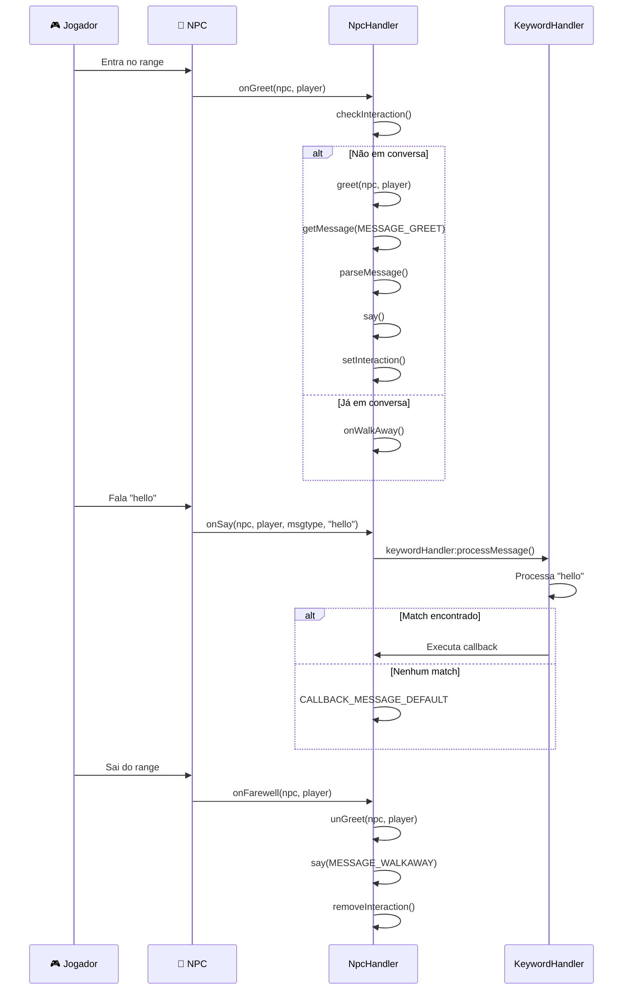

import { Aside, Card } from '@astrojs/starlight/components';

## 🛠️ Informações do Arquivo

Este é o arquivo de **gerenciamento centralizado de NPCs** do servidor **OpenTibiaBR/Canary**. Implementa a classe principal `NpcHandler` que orquestra interações entre jogadores e NPCs, gerencia callbacks, módulos, keywords e ciclos de vida.

<Card title="Caminho Original" icon="document">
  `data/npclib/npc_system/npc_handler.lua`
</Card>

<Aside type="tip">
  Este arquivo é o **núcleo do sistema NPC**. Define a classe `NpcHandler` que funciona como orquestrador central, coordenando `KeywordHandler` (processamento de keywords), módulos (FocusModule, TravelModule, etc) e callbacks customizados. Cada NPC instancia seu próprio `NpcHandler` para gerenciar todas as interações com jogadores.
</Aside>

## 📄 Visão Geral do Código

### Resumo Executivo

`npc_handler.lua` implementa **o orquestrador central de NPCs** com as seguintes responsabilidades:

1. **Gerenciamento de Estado**: Por jogador (topic, talk_start, eventos)
2. **Callbacks**: Sistema de hooks para customização (greet, farewell, say, etc)
3. **Módulos**: Registração e processamento de módulos especializados
4. **Keywords**: Integração com `KeywordHandler` para processamento de mensagens
5. **Ciclos de Vida**: Eventos (onAppear, onDisappear, onSay, onThink, onMove)
6. **Mensagens Padrão**: 23 tipos de mensagens customizáveis com suporte a tags
7. **Interações**: Rastreamento de foco (quem está falando com quem)

### Estrutura de Funcionalidades

```mermaid
graph TD
    A["NpcHandler<br/>Orquestrador Central"] --> B["State Management<br/>Por Jogador"]
    A --> C["Callbacks<br/>Customização"]
    A --> D["Modules<br/>FocusModule, TravelModule, etc"]
    A --> E["Keywords<br/>KeywordHandler Integration"]
    A --> F["Lifecycle<br/>Events"]
    A --> G["Messages<br/>23 Tipos Padrão"]
    A --> H["Interactions<br/>Foco de Conversa"]
    
    B --> B1["topic"]
    B --> B2["talkStart"]
    B --> B3["eventSay"]
    B --> B4["eventDelayedSay"]
    
    C --> C1["CALLBACK_GREET"]
    C --> C2["CALLBACK_FAREWELL"]
    C --> C3["CALLBACK_ON_SAY"]
    C --> C4["CALLBACK_ON_THINK"]
    C --> C5["12+ outros callbacks"]
    
    F --> F1["onAppear"]
    F --> F2["onDisappear"]
    F --> F3["onSay"]
    F --> F4["onThink"]
    F --> F5["onMove"]
    
    G --> G1["MESSAGE_GREET"]
    G --> G2["MESSAGE_FAREWELL"]
    G --> G3["MESSAGE_BUY"]
    G --> G4["MESSAGE_MISSINGMONEY"]
    G --> G5["18+ outros tipos"]
    
    H --> H1["checkInteraction"]
    H --> H2["setInteraction"]
    H --> H3["removeInteraction"]
    
    style A fill:#a8d5ff,stroke:#0066cc,color:#fff
    style B fill:#95e1d3,stroke:#38ada9,color:#fff
    style C fill:#95e1d3,stroke:#38ada9,color:#fff
    style D fill:#95e1d3,stroke:#38ada9,color:#fff
    style E fill:#95e1d3,stroke:#38ada9,color:#fff
    style F fill:#95e1d3,stroke:#38ada9,color:#fff
    style G fill:#95e1d3,stroke:#38ada9,color:#fff
    style H fill:#95e1d3,stroke:#38ada9,color:#fff
```



---

## 📋 Índice de Componentes

| Categoria | Quantidad | Propósito |
|-----------|-----------|-----------|
| **Constantes de Talk Delay** | 3 | Tipos de delay para respostas |
| **Constantes de Mensagem** | 23 | Tipos de mensagens padrão |
| **Constantes de Callback** | 19 | Hooks customizáveis |
| **Constantes de Tags** | 8 | Substituições em mensagens |
| **Métodos de NpcHandler** | 40+ | Orquestração completa |

---

## 3. Constantes Globais

Se `NpcHandler == nil` (guardião anti-reload), as seguintes constantes são definidas:

### 3.1 `TALKDELAY_*` — Tipos de Delay de Fala

```lua
TALKDELAY_NONE = 0        -- Sem delay
TALKDELAY_ONTHINK = 1     -- Delay via onThink callback (default)
TALKDELAY_EVENT = 2       -- Não implementado
NPCHANDLER_TALKDELAY = TALKDELAY_ONTHINK  -- Default
```

| Constante | Valor | Descrição |
|-----------|-------|-----------|
| **TALKDELAY_NONE** | 0 | NPC responde imediatamente |
| **TALKDELAY_ONTHINK** | 1 | Delay implementado via callback onThink (padrão) |
| **TALKDELAY_EVENT** | 2 | Não implementado |

**Uso**: Define como o delay entre mensagens é tratado.

---

### 3.2 `MESSAGE_*` — Tipos de Mensagens

```lua
MESSAGE_GREET = 1                  -- Saudação inicial
MESSAGE_FAREWELL = 2               -- Despedida
MESSAGE_BUY = 3                    -- Pergunta de compra
MESSAGE_MISSINGMONEY = 9           -- Falta dinheiro
MESSAGE_NEEDMONEY = 10             -- (shop window)
MESSAGE_MISSINGITEM = 11           -- Não tem item
MESSAGE_NEEDITEM = 12              -- (shop window)
MESSAGE_NEEDSPACE = 13             -- Sem espaço no inventário
MESSAGE_NEEDMORESPACE = 14         -- Espaço insuficiente
MESSAGE_WALKAWAY = 16              -- Saída da talk range
MESSAGE_DECLINE = 17               -- Recusa genérica
MESSAGE_SENDTRADE = 18             -- Abre shop window
MESSAGE_NOSHOP = 19                -- NPC não tem loja
MESSAGE_ONCLOSESHOP = 20           -- Fecha shop window
MESSAGE_ALREADYFOCUSED = 21        -- Já em conversa
MESSAGE_WALKAWAY_MALE = 22         -- Saída (jogador male)
MESSAGE_WALKAWAY_FEMALE = 23       -- Saída (jogador female)
```

| ID | Constante | Mensagem Padrão |
|----|-----------|-----------------|
| **1** | MESSAGE_GREET | "Greetings, \|PLAYERNAME\|." |
| **2** | MESSAGE_FAREWELL | "Good bye, \|PLAYERNAME\|." |
| **3** | MESSAGE_BUY | "Do you want to buy \|ITEMCOUNT\| \|ITEMNAME\| for \|TOTALCOST\| gold coins?" |
| **9** | MESSAGE_MISSINGMONEY | "You don't have enough money." |
| **10** | MESSAGE_NEEDMONEY | "You don't have enough money." |
| **11** | MESSAGE_MISSINGITEM | "You don't have so many." |
| **12** | MESSAGE_NEEDITEM | "You do not have this object." |
| **13** | MESSAGE_NEEDSPACE | "There is not enought room." |
| **14** | MESSAGE_NEEDMORESPACE | "You do not have enough capacity for all items." |
| **16** | MESSAGE_WALKAWAY | "Good bye." |
| **17** | MESSAGE_DECLINE | "Then not." |
| **18** | MESSAGE_SENDTRADE | "Of course, just browse through my wares." |
| **19** | MESSAGE_NOSHOP | "Sorry, I'm not offering anything." |
| **20** | MESSAGE_ONCLOSESHOP | "Thank you, come back whenever you're in need of something else." |
| **21** | MESSAGE_ALREADYFOCUSED | "\|PLAYERNAME\|, I am already talking to you." |
| **22** | MESSAGE_WALKAWAY_MALE | "" |
| **23** | MESSAGE_WALKAWAY_FEMALE | "" |

---

### 3.3 `CALLBACK_*` — IDs de Callbacks

```lua
CALLBACK_ON_APPEAR = 1             -- NPC aparece para jogador
CALLBACK_ON_DISAPPEAR = 2          -- NPC desaparece para jogador
CALLBACK_ON_SAY = 3                -- Jogador fala algo
CALLBACK_ON_THINK = 4              -- NPC pensa (timer)
CALLBACK_GREET = 5                 -- Greeting inicial
CALLBACK_FAREWELL = 6              -- Farewell
CALLBACK_MESSAGE_DEFAULT = 7       -- Mensagem não reconhecida
CALLBACK_PLAYER_END_TRADE = 8      -- Jogador fecha trade
CALLBACK_CLOSE_CHANNEL = 9         -- Chat channel fecha
CALLBACK_ON_MOVE = 10              -- NPC ou jogador move
CALLBACK_SET_INTERACTION = 18      -- Inicia conversa
CALLBACK_REMOVE_INTERACTION = 19   -- Termina conversa
CALLBACK_ON_TRADE_REQUEST = 20     -- Solicita trade/shop

CALLBACK_MODULE_INIT = 12          -- Módulo inicializa
CALLBACK_MODULE_RESET = 13         -- Módulo reseta
```

**Uso**: Cada callback pode ser customizado via `:setCallback(id, function)`.

---

### 3.4 `TAG_*` — Tags de Substituição em Mensagens

```lua
TAG_PLAYERNAME = "|PLAYERNAME|"   -- Nome do jogador
TAG_ITEMCOUNT = "|ITEMCOUNT|"      -- Quantidade de itens
TAG_TOTALCOST = "|TOTALCOST|"      -- Custo total
TAG_ITEMNAME = "|ITEMNAME|"        -- Nome do item
TAG_TIME = "|TIME|"                -- Hora do mundo
TAG_BLESSCOST = "|BLESSCOST|"      -- Custo de bênção
TAG_PVPBLESSCOST = "|PVPBLESSCOST|"-- Custo PvP
TAG_TRAVELCOST = "|TRAVELCOST|"    -- Custo de viagem
```

**Uso**: `:parseMessage(msg, {[TAG_PLAYERNAME] = "John"})` substitui "|PLAYERNAME|" por "John".

---

## 4. Classe NpcHandler

### 4.1 Estrutura de Dados

```lua
NpcHandler = {
    keywordHandler = nil,          -- KeywordHandler para processamento de keywords
    talkStart = nil,               -- table{playerId => timestamp}
    talkDelay = 300,               -- Delay entre mensagens (ms)
    talkDelayTimeForOutgoingMessages = 1,  -- Delay para envio (segundos)
    callbackFunctions = nil,       -- table{callbackId => function}
    modules = nil,                 -- array de módulos
    npcName = nil,                 -- Nome do NPC
    eventSay = nil,                -- table{playerId => eventId}
    eventDelayedSay = nil,         -- table{playerId => array de eventos}
    topic = nil,                   -- table{playerId => topicId}
    talkRange = 4,                 -- Raio de conversa (tiles)
    messages = {                   -- 23 tipos de mensagens padrão
        [MESSAGE_GREET] = "Greetings, |PLAYERNAME|."
        -- ... etc
    }
}
```

---

### 4.2 Métodos Públicos

#### `NpcHandler:new(keywordHandler)`

Cria nova instância de NpcHandler.

```lua
function NpcHandler:new(keywordHandler)
    local obj = {}
    obj.callbackFunctions = {}
    obj.modules = {}
    obj.npcName = ""
    obj.eventSay = {}
    obj.eventDelayedSay = {}
    obj.topic = {}
    obj.talkStart = {}
    obj.keywordHandler = keywordHandler
    obj.messages = {}
    
    setmetatable(obj.messages, self.messages)
    self.messages.__index = self.messages
    setmetatable(obj, self)
    self.__index = self
    return obj
end
```

**Parâmetros**:
- `keywordHandler` (KeywordHandler): Handler de keywords

**Retorna**: Nova instância de `NpcHandler`

**Exemplo**:

```lua
local kh = KeywordHandler:new()
local npcHandler = NpcHandler:new(kh)
```

---

#### `NpcHandler:getTalkRange()` e `NpcHandler:setTalkRange(newRange)`

Get/set raio de conversa.

```lua
function NpcHandler:getTalkRange()
    return self.talkRange
end

function NpcHandler:setTalkRange(newRange)
    self.talkRange = newRange
end
```

**Default**: 4 tiles

---

#### `NpcHandler:getTopic(playerId)` e `NpcHandler:setTopic(playerId, newTopic)`

Get/set topic (posição na árvore de keywords) do jogador.

```lua
npcHandler:setTopic(player:getId(), 0)  -- Reset para raiz
local currentTopic = npcHandler:getTopic(player:getId())
```

**Propósito**: Rastrear em qual "nó" de conversa o jogador está.

---

#### `NpcHandler:getTalkStart(playerId)` e `NpcHandler:setTalkStart(playerId, newTalkStart)`

Get/set timestamp de início de conversa.

---

#### `NpcHandler:getEventSay(playerId)` e `NpcHandler:setEventSay(playerId, newEventSay)`

Get/set evento de fala atual (para cancelar se necessário).

---

#### `NpcHandler:getEventDelayedSay(playerId)` e `NpcHandler:setEventDelayedSay(playerId, newEventDelayedSay)`

Get/set array de eventos de fala atrasada.

**Uso**: Para múltiplas mensagens sequenciais com delay.

---

#### `NpcHandler:checkInteraction(npc, player)`

Verifica se NPC está interagindo com jogador.

```lua
function NpcHandler:checkInteraction(npc, player)
    return npc:isInteractingWithPlayer(player)
end
```

**Retorna**: `true` se interagindo, `false` se não

---

#### `NpcHandler:updateInteraction(npc, player)`

Atualiza interação (vira para jogador, cancela eventos pendentes).

```lua
function NpcHandler:updateInteraction(npc, player)
    local playerId = player:getId()
    if not self:checkInteraction(npc, player) then
        npc:setPlayerInteraction(player, 0)
        return true
    end
    if self:getEventDelayedSay(playerId) then
        self:cancelNPCTalk(self:getEventDelayedSay(playerId))
    end
    return npc:turnToCreature(player, true)
end
```

---

#### `NpcHandler:setInteraction(npc, player)`

Inicia interação NPC ↔ Player. Define topic=0 e dispara callbacks.

```lua
function NpcHandler:setInteraction(npc, player)
    local playerId = player:getId()
    if self:checkInteraction(npc, player) then
        return false
    end
    
    self:setTopic(playerId, 0)
    local callback = self:getCallback(CALLBACK_SET_INTERACTION)
    if callback == nil or callback(npc, player) then
        self:processModuleCallback(CALLBACK_SET_INTERACTION, npc, player)
    end
    self:updateInteraction(npc, player)
    return true
end
```

**Efeitos**:
- Define topic para 0 (raiz)
- Dispara CALLBACK_SET_INTERACTION
- Processa callbacks dos módulos
- Vira NPC para jogador

**Retorna**: `true` se sucesso, `false` se já interagindo

---

#### `NpcHandler:removeInteraction(npc, player)`

Remove interação. Limpa estado, fecha shop, cancela eventos.

```lua
function NpcHandler:removeInteraction(npc, player)
    local playerId = player:getId()
    
    -- Cancela eventos pendentes
    if self:getEventDelayedSay(playerId) then
        self:cancelNPCTalk(self:getEventDelayedSay(playerId))
    end
    
    -- Limpa estado
    self:setEventDelayedSay(playerId, nil)
    self:setEventSay(playerId, nil)
    self:setTalkStart(playerId, nil)
    self:setTopic(playerId, nil)
    
    -- Dispara callbacks
    local callback = self:getCallback(CALLBACK_REMOVE_INTERACTION)
    if callback == nil or callback(npc, player) then
        self:processModuleCallback(CALLBACK_REMOVE_INTERACTION, npc, player)
    end
    
    -- Fecha shop se aberta
    if npc:isMerchant() then
        npc:closeShopWindow(player)
    end
    npc:removePlayerInteraction(player)
end
```

---

#### `NpcHandler:getCallback(id)` e `NpcHandler:setCallback(id, callback)`

Get/set callback customizado.

```lua
npcHandler:setCallback(CALLBACK_GREET, function(npc, player, message)
    print(player:getName() .. " greeted " .. npc:getName())
    return true  -- Permitir greet default
end)
```

**Retorna** (getCallback): Função ou `nil`

---

#### `NpcHandler:addModule(module, initNpcName, greetCallback, farewellCallback, tradeCallback)`

Registra módulo ao NPC e inicializa.

```lua
local focusModule = FocusModule:new()
npcHandler:addModule(focusModule, "John", true, true, true)
```

**Comportamento**:
- Adiciona módulo ao array `modules`
- Define `npcName`
- Chama `:init()` no módulo com callbacks

---

#### `NpcHandler:processModuleCallback(id, ...)`

Processa callback em todos os módulos registrados.

```lua
function NpcHandler:processModuleCallback(id, ...)
    -- Itera sobre módulos
    -- Chama callback apropriado (callbackOnGreet, callbackOnFarewell, etc)
    -- Retorna false se algum módulo retorna false
end
```

**Callbacks Suportados por Módulo**:
- `callbackOnAppear`
- `callbackOnCreatureDisappear`
- `callbackOnCreatureSay`
- `callbackOnPlayerEndTrade`
- `callbackOnCloseChannel`
- `callbackOnTradeRequest`
- `callbackOnAddFocus`
- `callbackOnReleaseFocus`
- `callbackOnThink`
- `callbackOnMove`
- `callbackOnGreet`
- `callbackOnFarewell`
- `callbackOnMessageDefault`
- `callbackOnModuleReset`

---

#### `NpcHandler:getMessage(id)` e `NpcHandler:setMessage(id, newMessage, delay)`

Get/set mensagens padrão.

```lua
npcHandler:setMessage(MESSAGE_GREET, "Hello, |PLAYERNAME|!", 300)
```

---

#### `NpcHandler:parseMessage(msg, parseInfo, player, message)`

Substitui tags em mensagens.

```lua
local parseInfo = {
    [TAG_PLAYERNAME] = "John",
    [TAG_TOTALCOST] = "100",
    [TAG_ITEMCOUNT] = "5"
}
local parsed = npcHandler:parseMessage(
    "Buy |ITEMCOUNT| items for |TOTALCOST| gold, |PLAYERNAME|?",
    parseInfo
)
-- Resultado: "Buy 5 items for 100 gold, John?"
```

**Suporta**:
- String simples com tags
- Array de strings
- Funções como valores (chamadas com `player, message`)

---

#### `NpcHandler:greet(npc, player, message)`

Saudação inicial (greeting). Dispara callbacks e processa módulos.

```lua
function NpcHandler:greet(npc, player, message)
    if self:checkInteraction(npc, player) then
        return  -- Já está em conversa
    end
    
    local callback = self:getCallback(CALLBACK_GREET)
    if callback == nil or callback(npc, player, message) then
        if self:processModuleCallback(CALLBACK_GREET, npc, player) then
            local msg = self:getMessage(MESSAGE_GREET)
            local parseInfo = { [TAG_PLAYERNAME] = player:getName() }
            msg = self:parseMessage(msg, parseInfo)
            self:say(msg, npc, player)
        end
    end
    self:setInteraction(npc, player)
end
```

---

#### `NpcHandler:unGreet(npc, player)` (Farewell)

Despedida.  Dispara callbacks, fala mensagem e remove interação.

---

#### `NpcHandler:onSay(npc, player, msgtype, msg)`

Handler para evento de fala do jogador. Processa keywords.

```lua
function NpcHandler:onSay(npc, player, msgtype, msg)
    local playerId = player:getId()
    local callback = self:getCallback(CALLBACK_ON_SAY)
    if callback == nil or callback(npc, player, msgtype, msg) then
        if self:processModuleCallback(CALLBACK_ON_SAY, npc, player, msgtype, msg) then
            if not self:isInRange(npc, player) then
                return false
            end
            
            if self.keywordHandler ~= nil then
                if self:checkInteraction(npc, player) then
                    local ret = self.keywordHandler:processMessage(npc, player, msg)
                    if not ret then
                        -- Mensagem não reconhecida
                        local callback = self:getCallback(CALLBACK_MESSAGE_DEFAULT)
                        if callback ~= nil then
                            callback(npc, player, msgtype, msg)
                        end
                    end
                    self:setTalkStart(playerId, os.time())
                end
            end
        end
    end
end
```

---

#### `NpcHandler:onGreet(npc, player, message)`

Handler para evento automático de greeting (quando jogador entra no range).

```lua
function NpcHandler:onGreet(npc, player, message)
    if npc:isInTalkRange(Player(player):getPosition(), self:getTalkRange()) then
        if not self:checkInteraction(npc, player) then
            self:greet(npc, player, message)
            return true
        end
    end
end
```

---

#### `NpcHandler:onFarewell(npc, player)`

Handler para evento automático de farewell (quando jogador sai do range).

---

#### `NpcHandler:onWalkAway(npc, player)`

Handler quando jogador sai da talk range. Fala mensagem de despedida.

```lua
function NpcHandler:onWalkAway(npc, player)
    if not self:checkInteraction(npc, player) then
        return false
    end
    
    local msg = self:getMessage(MESSAGE_WALKAWAY)
    local playerSex = player:getSex()
    
    -- Suporta mensagens diferentes por gender
    if playerSex == PLAYERSEX_FEMALE then
        msg = self:getMessage(MESSAGE_WALKAWAY_FEMALE)
    else
        msg = self:getMessage(MESSAGE_WALKAWAY_MALE)
    end
    
    if msg ~= "" then
        npc:sayWithDelay(...)
    end
    self:resetNpc(player)
    self:removeInteraction(npc, player)
end
```

---

#### `NpcHandler:onThink(npc, interval)`

Handler para evento de "pensamento" do NPC (timer).

```lua
function NpcHandler:onThink(npc, interval)
    local callback = self:getCallback(CALLBACK_ON_THINK)
    if callback == nil or callback(npc, interval) then
        if self:processModuleCallback(CALLBACK_ON_THINK, npc, interval) then
            return true
        end
    end
end
```

---

#### `NpcHandler:onMove(npc, player, fromPosition, toPosition)`

Handler para movimento de NPC ou jogador.

---

#### `NpcHandler:resetNpc(player)`

Reseta NPC para estado inicial (reseta KeywordHandler e módulos).

```lua
function NpcHandler:resetNpc(player)
    if self:processModuleCallback(CALLBACK_MODULE_RESET) then
        self.keywordHandler:reset(player)
    end
end
```

---

#### `NpcHandler:say(message, npc, player, delay, textType)`

Faz NPC falar com delay.

```lua
function NpcHandler:say(message, npc, player, delay, textType)
    if not player then return end
    
    local playerId = player:getId()
    
    -- Se message é array, usa doNPCTalkALot
    if type(message) == "table" then
        return self:doNPCTalkALot(message, delay, npc, player)
    end
    
    -- Cancela fala anterior
    if self:getEventDelayedSay(playerId) then
        self:cancelNPCTalk(self:getEventDelayedSay(playerId))
    end
    
    stopEvent(self.eventSay[playerId])
    -- Agenda fala com delay
    self.eventSay[playerId] = addEvent(
        SayEvent,
        self.talkDelayTimeForOutgoingMessages * 1000,
        npc:getId(),
        player:getId(),
        message,
        self,
        textType
    )
end
```

**Parâmetros**:
- `message` (string|table): Mensagem(ns) a falar
- `npc` (userdata): NPC
- `player` (userdata): Jogador
- `delay` (number|optional): Delay customizado
- `textType` (const|optional): Tipo de fala

**Suporta**:
- String simples
- Array de strings (múltiplas mensagens com delay)

---

#### `NpcHandler:doNPCTalkALot(msgs, delay, npc, player)`

Agenda múltiplas mensagens sequenciais com delay.

```lua
npcHandler:doNPCTalkALot({
    "First message",
    "Second message",
    "Third message"
}, 1000, npc, player)
```

---

#### `NpcHandler:sendMessages(message, messageTable, npc, player, useDelay, delay)`

Envia mensagens baseado em matching de string.

```lua
npcHandler:sendMessages(msg, {
    ["hello"] = "Hi there!",
    ["job"] = "I'm a banker.",
    ["bye"] = "Goodbye!"
}, npc, player, true, 300)
```

---

#### `NpcHandler:isInRange(npc, player)`

Verifica se jogador está no talk range.

```lua
if npcHandler:isInRange(npc, player) then
    -- Falar
end
```

---

#### `NpcHandler:cancelNPCTalk(events)`

Cancela eventos de fala atrasada.

```lua
if npcHandler:getEventDelayedSay(playerId) then
    npcHandler:cancelNPCTalk(npcHandler:getEventDelayedSay(playerId))
end
```

---

## 5. Fluxo de Interação Completo



---

## 6. Exemplo Integrado: NPC Completo

```lua
-- Cria handlers
local keywordHandler = KeywordHandler:new()
local npcHandler = NpcHandler:new(keywordHandler)

-- Configura talk range
npcHandler:setTalkRange(5)

-- Customiza mensagens
npcHandler:setMessage(MESSAGE_GREET, "Welcome, |PLAYERNAME|!")
npcHandler:setMessage(MESSAGE_FAREWELL, "Bye |PLAYERNAME|!")

-- Adiciona callbacks
npcHandler:setCallback(CALLBACK_GREET, function(npc, player, msg)
    print(player:getName() .. " greeted " .. npc:getName())
    return true  -- Permitir greet default
end)

-- Adiciona módulos
local focusModule = FocusModule:new()
npcHandler:addModule(focusModule, "John", true, true, true)

local travelModule = TravelModule:new()
npcHandler:addModule(travelModule, "John")

-- Registra keywords
npcHandler.keywordHandler:addKeyword(
    {"hello"},
    StdModule.say,
    {npcHandler = npcHandler, text = "Hello! I can help you travel."}
)

-- NPC pronto para uso
```

---

## 7. Checkpoint

```lua
-- ✓ Consegui entender...
-- 1. NpcHandler é o orquestrador central de cada NPC
-- 2. checkInteraction verifica quem está falando com quem
-- 3. setInteraction inicia conversa (topic=0, callbacks)
-- 4. removeInteraction finaliza (limpa estado, fecha shop)
-- 5. parseMessage substitui tags em mensagens
-- 6. topic rastreia posição na árvore de keywords
-- 7. Callbacks customizam comportamento (CALLBACK_*)
-- 8. Módulos processam eventos especializados
-- 9. say() fala com delay automático (ou array para múltiplas)
-- 10. 23 tipos de mensagens padrão customizáveis

-- ✓ Posso agora...
-- 1. Criar NPCs com handlers customizados
-- 2. Implementar greetings/farewells com callbacks
-- 3. Processar keywords e mensagens
-- 4. Registrar módulos para comportamentos especiais
-- 5. Customizar todas as 23 mensagens padrão
-- 6. Usar tags para dinâmica nas mensagens
-- 7. Implementar estado per-player (topic)
-- 8. Cancelar eventos pendentes de fala
-- 9. Suportar múltiplos gêneros em mensagens
-- 10. Integrar seamlessly com KeywordHandler
```

---

## 8. Conclusão

`npc_handler.lua` é o **orquestrador maestro do sistema NPC** do Canary. Fornece:

- **Gerenciamento de Estado**: Por jogador (topic, talkStart, eventos)
- **Callbacks**: 19 hooks customizáveis
- **Módulos**: Registração e processamento de módulos especializados
- **Keywords**: Integração perfeita com KeywordHandler
- **Ciclos de Vida**: 5 eventos principais (appear, disappear, say, think, move)
- **Mensagens**: 23 tipos padrão com tags e gender-specific
- **Interações**: Rastreamento automático de foco (quem fala com quem)

É a fundação sobre a qual `FocusModule`, `TravelModule`, `StdModule`, `KeywordModule` e todos os NPCs do jogo são construídos.

---

## 🤖 Informações da Documentação

<Aside type="note">
Esta documentação foi **gerada automaticamente por IA** (Claude Haiku 4.5) utilizando análise estática de código. Todos os métodos, callbacks, constantes e exemplos foram produzidos por processamento inteligente do código-fonte, garantindo consistência com o padrão Starlight/Astro do projeto.
</Aside>

**Última Atualização**: Baseado no servidor **OpenTibiaBR/Canary**

**Documento MDX com Mermaid Diagrams**  
*Cobertura completa: 53 constantes, 1 classe, 40+ métodos, 8 tags, fluxo de interação, exemplo integrado e checkpoint*
